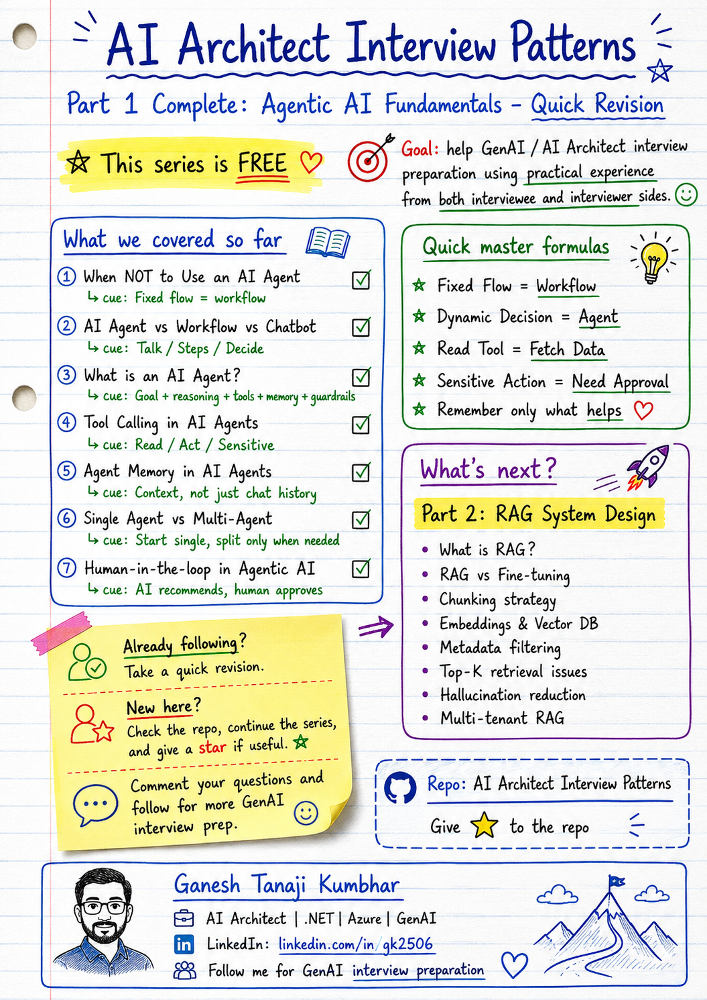

# Part 1: Agentic AI Fundamentals

# Quick Revision Notes

This file is a quick revision guide for **Part 1: Agentic AI Fundamentals** from the **AI Architect Interview Patterns** series.

Use this page before moving to:

# Part 2: RAG System Design

---

## Purpose of this revision file

This file is for quick revision only.

It summarizes the key ideas, interview answers, memory formulas, and common mistakes from all Agentic AI fundamentals topics covered so far.

For detailed explanation, refer to the individual topic files.

---

## Topics covered in Part 1

| Pattern | Topic                              | Key Idea                                                   |
| ------- | ---------------------------------- | ---------------------------------------------------------- |
| 01      | When NOT to Use an AI Agent        | Not every problem needs an AI Agent                        |
| 02      | AI Agent vs Workflow vs Chatbot    | Chatbot talks, workflow follows, agent decides             |
| 03      | What is an AI Agent?               | Goal + reasoning + tools + memory + guardrails             |
| 04      | Tool Calling in AI Agents          | Agents use approved tools to fetch data or take action     |
| 05      | Agent Memory in AI Agents          | Memory is controlled useful context, not just chat history |
| 06      | Single Agent vs Multi-Agent System | Start single, split only when needed                       |
| 07      | Human-in-the-loop in Agentic AI    | AI recommends, humans approve high-risk decisions          |

---

## 01. When Should You NOT Use an AI Agent?

### Quick idea

Do not use an AI Agent when the problem is simple, fixed, deterministic, and can be solved with normal rules or workflow.

### Interview answer

> I would not use an AI Agent by default. If the task has fixed steps, predictable rules, and deterministic output, I would use a normal workflow, automation, or rules engine. I would consider an AI Agent only when the system needs reasoning, dynamic decision-making, tool selection, memory, or handling ambiguous user intent.

### Use normal workflow when

* Steps are fixed
* Rules are clear
* Output should be deterministic
* No reasoning is required
* No dynamic tool selection is needed
* Cost and latency should be low

### Use AI Agent when

* User intent is ambiguous
* The system needs reasoning
* Tool selection is dynamic
* Context changes during the task
* Memory is useful
* The agent needs to decide next action

### Memory formula

```text
Fixed Flow = Workflow
Dynamic Decision = Agent
Rules First, Agent Later
```

### Common mistake

Saying:

> We should use AI Agent for everything.

Better answer:

> Use AI Agent only when reasoning and dynamic decision-making add real value.

---

## 02. AI Agent vs Workflow vs Chatbot

### Quick idea

A chatbot talks, a workflow follows fixed steps, and an AI Agent decides and acts.

### Interview answer

> A chatbot mainly interacts with the user through conversation. A workflow executes predefined steps. An AI Agent understands a goal, reasons over context, selects tools, takes actions, and adapts based on results. The key difference is decision-making and action.

### Simple comparison

| Type     | What it does        | Example                                              |
| -------- | ------------------- | ---------------------------------------------------- |
| Chatbot  | Answers or chats    | “What is the policy?”                                |
| Workflow | Follows fixed steps | Submit → Approve → Notify                            |
| AI Agent | Decides next action | Check expense, retrieve policy, suggest resubmission |

### Memory formula

```text
Chatbot = Talks
Workflow = Follows fixed steps
Agent = Decides and acts
```

Another version:

```text
Talk = Chatbot
Steps = Workflow
Decision + Tools = Agent
```

### Common mistake

Saying:

> If it uses LLM, it is an AI Agent.

Better answer:

> LLM usage alone does not make a system agentic. The system becomes agentic when it can reason, choose actions, use tools, and adapt.

---

## 03. What is an AI Agent?

### Quick idea

An AI Agent is not just an LLM with tools.

It is a goal-driven system that can reason, use tools, remember context, follow guardrails, and act toward a task.

### Interview answer

> An AI Agent is a goal-driven software system that uses an LLM for reasoning, understands user intent, plans steps, selects tools, uses memory or knowledge when needed, and takes actions within defined guardrails.

### Core components

* Goal
* Reasoning
* Planning
* Tool calling
* Memory
* Context
* Guardrails
* Feedback
* Action execution
* Observability

### Simple example

User asks:

```text
Why was my hotel expense rejected, and can I resubmit it?
```

An AI Agent may:

1. Understand the user intent
2. Fetch expense details
3. Retrieve policy
4. Check rejection reason
5. Decide whether resubmission is possible
6. Suggest next action

### Memory formula

```text
Goal + Reasoning + Tools + Memory + Guardrails = AI Agent
```

Another version:

```text
Think + Decide + Act = Agent
```

### Common mistake

Saying:

> AI Agent means LLM plus tools.

Better answer:

> LLM plus tools may be part of an agent, but a real AI Agent also needs goal understanding, reasoning, planning, guardrails, and controlled execution.

---

## 04. Tool Calling in AI Agents

### Quick idea

Tool calling allows an AI Agent to use approved external systems, APIs, databases, or services.

### Interview answer

> Tool calling in AI Agents means the agent can invoke approved functions, APIs, or services to fetch data or perform actions. In production, tool calling must be permission-aware, validated, logged, monitored, and protected with guardrails.

### Examples of tools

* GetExpenseDetails
* SearchPolicy
* CheckApprovalHistory
* CreateSupportTicket
* EscalateToManager
* SendNotification
* SearchKnowledgeBase

### Tool categories

| Tool Type      | Purpose          | Example               |
| -------------- | ---------------- | --------------------- |
| Read tool      | Fetch data       | Get expense status    |
| Action tool    | Change state     | Create support ticket |
| Sensitive tool | High-risk action | Approve payment       |

### Important production concerns

* Tool permissions
* Input validation
* Output validation
* Audit logging
* Retry handling
* Error handling
* Human approval
* Prompt injection protection
* Tenant isolation
* Monitoring

### Memory formula

```text
Read Tool = Fetch Data
Action Tool = Change State
Sensitive Tool = Need Approval
```

Another version:

```text
Think + Choose Tool + Validate + Act = Safe Agent
```

### Common mistake

Saying:

> Tool calling automatically means AI Agent.

Better answer:

> Tool calling alone does not always mean agentic. If the flow is fixed, it may still be a workflow. It becomes agentic when the system dynamically decides which tool to use and why.

---

## 05. Agent Memory in AI Agents

### Quick idea

Agent memory is not just chat history.

It is controlled storage and retrieval of useful context across conversation, session, task, user, or domain level.

### Interview answer

> Agent memory is the controlled storage and retrieval of useful context across conversation, session, task, user, or domain level so the AI Agent can reason and act more effectively. In enterprise systems, memory must be selective, permission-aware, tenant-isolated, secure, and controlled with retention policies.

### Types of memory

| Memory Type            | Purpose                          |
| ---------------------- | -------------------------------- |
| Conversation Memory    | Recent messages and turn context |
| Session Memory         | Current session facts            |
| Task Memory            | Task progress and next step      |
| User Preference Memory | Preferences and personalization  |
| Long-term Memory       | Useful facts across sessions     |
| RAG / Domain Knowledge | External documents and policies  |

### Memory vs RAG

```text
Memory = useful user/task/session context
RAG = external knowledge retrieval
```

### Example

User says:

```text
My hotel expense was rejected.
```

Later user asks:

```text
Can I resubmit it?
```

The agent should understand that **“it”** refers to the same rejected hotel expense.

### Enterprise concerns

* Selective memory
* PII handling
* User consent
* Tenant isolation
* Access control
* Retention policy
* Auditability
* Stale memory handling

### Memory formula

```text
Short-term = Current task
Long-term = Future personalization
RAG = External knowledge
```

Golden rule:

```text
Remember only what helps.
Forget what creates risk.
```

### Common mistake

Saying:

> Memory means storing all chat history.

Better answer:

> Memory should be selective, useful, secure, and scoped to the right context.

---

## 06. Single Agent vs Multi-Agent System

### Quick idea

Use a single agent when one reasoning flow is enough.

Use a multi-agent system only when specialized agents with clear responsibilities add real value.

### Interview answer

> I would not use a multi-agent system by default. I first check whether a single agent can handle the task reliably. A single agent is better when the task has one reasoning flow and limited tools. I consider multi-agent architecture when the problem has clearly separable responsibilities, such as policy retrieval, expense analysis, risk scoring, and notification. Multi-agent systems can improve specialization, but they also increase cost, latency, coordination, and debugging complexity.

### Single agent is useful when

* Task is simple or medium complexity
* One reasoning flow is enough
* Tool list is limited
* Low latency matters
* Cost should be controlled
* Debugging should be simple

### Multi-agent is useful when

* Responsibilities are clearly separated
* Subtasks need specialization
* Different agents need different tools
* Parallel work helps
* Independent review is needed
* A coordinator can manage the flow

### Example agents

* Coordinator Agent
* Expense Agent
* Policy Agent
* Risk Agent
* Notification Agent

### Memory formula

```text
Simple Task = Single Agent
Specialized Subtasks = Multi-Agent
No Clear Roles = Do Not Split
```

Another version:

```text
Start Single
Split Only When Needed
Orchestrate Everything
```

### Common mistake

Saying:

> Multi-agent is always better.

Better answer:

> Multi-agent is useful only when separation of responsibility adds value greater than the extra cost, latency, and complexity.

---

## 07. Human-in-the-loop in Agentic AI

### Quick idea

For high-risk decisions, the AI system should recommend, but humans should approve.

### Interview answer

> Human-in-the-loop in Agentic AI means the AI Agent can assist, analyze, and recommend, but humans approve high-risk or irreversible actions. I would classify actions by risk: low-risk actions can be automated, medium-risk actions may need user confirmation, and high-risk actions should require human approval with complete audit logging.

### Risk-based approach

| Risk Level  | Action         |
| ----------- | -------------- |
| Low Risk    | Automate       |
| Medium Risk | Confirm        |
| High Risk   | Human Approval |

### Examples

#### Low-risk actions

* Fetch expense status
* Summarize policy
* Draft support ticket
* Show approval history

#### Medium-risk actions

* Create support ticket
* Send notification
* Resubmit corrected expense
* Update non-critical information

#### High-risk actions

* Approve expense
* Reject expense
* Process reimbursement
* Override policy
* Delete records
* Grant access

### Simple flow

```text
User Request
   ↓
AI Analysis
   ↓
Recommendation
   ↓
Human Approval if needed
   ↓
Final Action
   ↓
Audit Log
```

### Memory formula

```text
AI Suggests
Human Approves
System Executes
Audit Logs
```

Another version:

```text
Low Risk = Automate
Medium Risk = Confirm
High Risk = Human Approval
```

Golden rule:

```text
Recommend, do not decide.
Assist, do not override.
```

### Common mistake

Saying:

> If AI confidence is high, no human approval is needed.

Better answer:

> Confidence alone is not enough. Risk, permission, business impact, reversibility, and compliance matter.

---

# Part 1 Master Cheat Sheet

## Most important formulas

```text
Fixed Flow = Workflow
Dynamic Decision = Agent
```

```text
Chatbot = Talks
Workflow = Follows fixed steps
Agent = Decides and acts
```

```text
Goal + Reasoning + Tools + Memory + Guardrails = AI Agent
```

```text
Read Tool = Fetch Data
Action Tool = Change State
Sensitive Tool = Need Approval
```

```text
Memory = Useful Context + Scope + Retention + Security
```

```text
Simple Task = Single Agent
Specialized Subtasks = Multi-Agent
No Clear Roles = Do Not Split
```

```text
Low Risk = Automate
Medium Risk = Confirm
High Risk = Human Approval
```

---

## How to answer Agentic AI questions in interviews

Use this structure:

```text
1. Start with simple definition
2. Explain when to use it
3. Explain when NOT to use it
4. Mention tools, memory, guardrails, and human approval
5. Give real-world example
6. Mention production concerns
7. Close with tradeoff
```

---

## Common enterprise example used in this series

Many examples in this series use the **Expense Management AI Agent** scenario.

Simple example:

```text
Employee asks why an expense was rejected.
AI assistant checks expense details, policy, and approval reason.
AI assistant explains the issue and suggests the next action.
```

Reference file:

```text
00-common-examples/expense-management-ai-agent-scenario.md
```

---

## Common production concerns for Agentic AI

Always mention these in architect-level answers:

* Cost
* Latency
* Token usage
* Tool permissions
* Guardrails
* Human approval
* Audit logging
* Observability
* Retry and failure handling
* Tenant isolation
* PII protection
* Prompt injection protection
* Evaluation
* Monitoring
* Fallback strategy

---

## Quick interview closing line

Use this closing line for Agentic AI fundamentals:

> In enterprise systems, I would not design AI Agents as uncontrolled autonomous systems. I would start with the simplest reliable design, use agents only where reasoning and dynamic action add value, control tool access, keep memory selective, add guardrails, require human approval for high-risk actions, and make everything observable and auditable.

---

# Transition to Part 2: RAG System Design

Part 1 focused on **Agentic AI fundamentals**:

* When to use AI Agents
* When not to use AI Agents
* Agent vs workflow vs chatbot
* Tool calling
* Memory
* Single-agent vs multi-agent
* Human approval

Part 2 will focus on **RAG System Design**.

Before moving to RAG, remember this:

> RAG gives the system external knowledge.
> Agentic AI uses reasoning, tools, memory, and actions to complete a task.

Simple difference:

```text
RAG = Retrieve knowledge
Agent = Decide and act
```

---

## Part 2 upcoming topics

Suggested topics for **RAG System Design**:

* What is RAG?
* RAG vs Fine-tuning
* Chunking strategy
* Embeddings and Vector DB
* Metadata filtering
* Top-K retrieval issues
* Lost-in-the-middle problem
* Multi-tenant RAG
* RAG evaluation
* Hallucination reduction
* RAG security and access control
* Production RAG architecture

---

## One-line summary

> Agentic AI is not just about making LLMs autonomous. It is about designing controlled, useful, observable, and safe systems where AI can reason, use tools, remember context, and involve humans when risk is high.

---

## About the Author

These notes are created and maintained by **Ganesh Tanaji Kumbhar**, an **AI Architect** with experience in **.NET, Azure, cloud architecture, infrastructure, enterprise application modernization, and GenAI solution design**.

I bring practical experience across:

* **.NET / C# / ASP.NET / Web API**
* **Azure App Services, Azure Functions, WebJobs, Azure SQL, Storage, Redis**
* **Cloud architecture and infrastructure modernization**
* **Application architecture and enterprise system design**
* **CI/CD, DevOps, monitoring, and production support**
* **GenAI, RAG, Agentic AI, and AI architecture patterns**

These notes are based on my real experience as both:

* An **interviewee**, facing AI, architecture, cloud, .NET, Azure, and system design rounds
* An **interviewer**, evaluating how candidates explain concepts, tradeoffs, project experience, and real-world design decisions

I write about:

* GenAI Architecture
* RAG System Design
* Agentic AI
* AI Architect Interview Preparation
* .NET and Azure Architecture
* Cloud and Enterprise AI Patterns

If you are preparing for **GenAI / AI Architect / Staff Engineer / Solution Architect / .NET Architect / Azure Architect** interviews, feel free to connect with me on LinkedIn.

🔗 **LinkedIn:** [Connect with me on LinkedIn](https://www.linkedin.com/in/gk2506/)

💬 You can also DM me on LinkedIn if you want to discuss AI architecture, interview preparation, .NET/Azure architecture, or practical GenAI learning.
