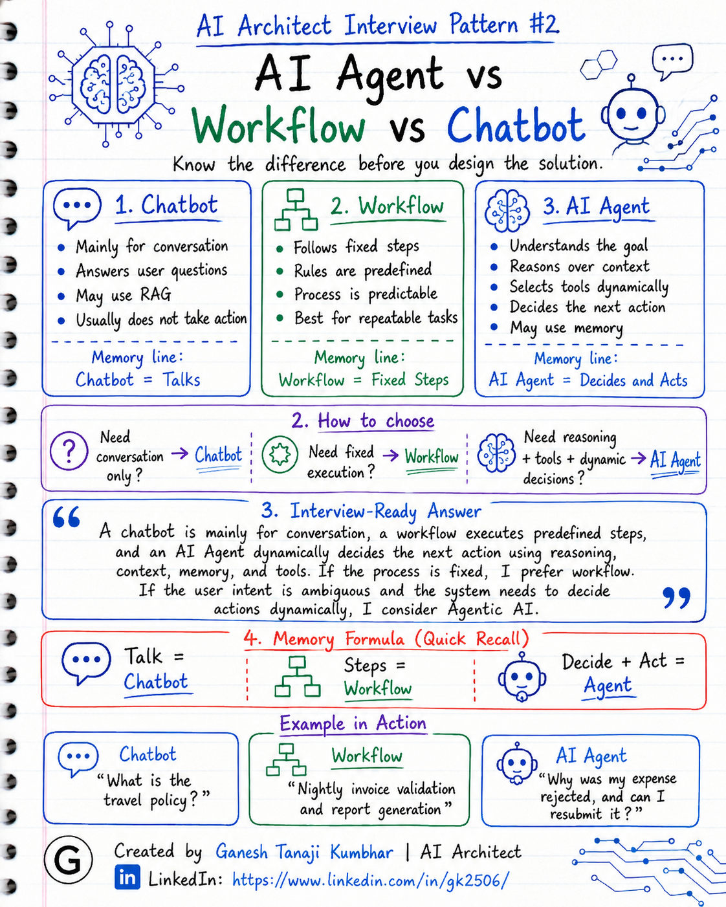

# AI Architect Interview Pattern #2

# AI Agent vs Workflow vs Chatbot

---

## Question

In an interview, you may be asked:

> What is the difference between an AI Agent, a workflow, and a chatbot?

Or:

> Is every chatbot an AI Agent?

Or:

> When will you use a workflow instead of an AI Agent?

Or:

> How do you decide whether a use case needs a chatbot, workflow, or Agentic AI system?

---

## Why interviewer asks this

The interviewer is not only checking whether you know the definition of an AI Agent.

They are checking whether you can separate three commonly confused concepts:

* Chatbot
* Workflow
* AI Agent

Many candidates use these terms interchangeably.

A basic answer may be:

> An AI Agent is a chatbot that can answer questions.

But that is not enough.

A senior or architect-level answer should explain:

> A chatbot is mainly for conversation, a workflow executes predefined steps, and an AI Agent dynamically decides the next action using reasoning, context, memory, and tools.

This question tests your understanding of:

* GenAI system design clarity
* Deterministic vs dynamic systems
* Tool calling
* Reasoning
* Orchestration
* When to use AI and when not to use AI
* How to avoid overengineering

---

## Basic answer

A chatbot is mainly used for conversation.

A workflow follows fixed predefined steps.

An AI Agent can reason, decide the next action, and use tools dynamically.

Simple difference:

* **Chatbot = Talks**
* **Workflow = Follows fixed steps**
* **AI Agent = Decides and acts**

---

## Architect-level answer

I would not call every AI-enabled system an AI Agent.

A chatbot, workflow, and AI Agent may look similar from the user interface, but architecturally they are different.

A **chatbot** is mainly a conversational interface. It takes user input and gives a response. It may use an LLM or RAG, but it may not take any real action.

A **workflow** is a predefined sequence of steps. The system already knows what to do next. It is deterministic, easier to test, easier to monitor, and more reliable for fixed business processes.

An **AI Agent** is useful when the system needs to understand the goal, reason over context, decide what to do next, select tools, use memory, and take actions dynamically.

So my decision is based on the nature of the problem:

> If the user only needs answers, a chatbot may be enough.
> If the process is fixed, a workflow is better.
> If the system needs reasoning, tool selection, memory, and dynamic decision-making, then I consider an AI Agent.

---

## Must mention in interview

When answering this question, try to mention these points:

### 1. Do not call everything an AI Agent

Many systems are just chatbots or workflows with an LLM added.

That does not automatically make them AI Agents.

An AI Agent should have some level of:

* Reasoning
* Planning
* Tool usage
* Dynamic decision-making
* Context awareness
* Goal-oriented behavior

---

### 2. Chatbot is mainly conversation

A chatbot focuses on interacting with the user.

Example:

> User asks: “What is the travel policy?”
> Chatbot replies with the policy answer.

It may retrieve information using RAG, but it may not perform actions.

A chatbot is useful when:

* User needs Q&A
* User needs explanation
* User needs guidance
* No business action is required
* The system only responds with information

---

### 3. Workflow is fixed execution

A workflow follows predefined steps.

Example:

> Upload invoice → Extract data → Validate fields → Apply rules → Send for approval

The system already knows what to do next.

A workflow is useful when:

* Steps are fixed
* Rules are predefined
* Process is repeatable
* Accuracy and reliability are important
* Low cost and low latency are required
* Testing and monitoring should be simple

---

### 4. AI Agent is dynamic decision-making

An AI Agent is useful when the next action is not always fixed.

It may need to:

* Understand user intent
* Decide what tool to call
* Ask follow-up questions
* Use memory
* Check multiple systems
* Decide whether to answer, escalate, create a ticket, or request more information

This is where Agentic AI adds value.

---

### 5. Mention tool calling

Tool calling is one important part of AI Agents.

Tools can be:

* APIs
* Databases
* Search systems
* Ticketing systems
* Email systems
* Business services
* Policy engines
* Notification services

But tool calling alone does not always mean the system is a full AI Agent.

If the tool call is always fixed, it may still be just a workflow.

---

### 6. Mention determinism vs flexibility

Workflow gives more determinism.

AI Agent gives more flexibility.

But flexibility comes with tradeoffs:

* Higher cost
* Higher latency
* More testing complexity
* More monitoring complexity
* More security risk
* More unpredictable behavior

An architect must balance these tradeoffs.

---

### 7. Mention human-in-the-loop where needed

If the AI Agent can perform business actions, then for sensitive actions we may need human approval.

Examples:

* Approving expense
* Refunding money
* Updating customer record
* Sending official communication
* Changing access permissions

In such cases, AI should recommend, but a human may approve.

---

## Real-world example

### Example 1: Chatbot

Requirement:

> Employee asks: “What is the hotel reimbursement limit?”

The system answers from the company policy.

This can be a chatbot, possibly with RAG.

It only answers the user.

No action is required.

Better solution:

* Chat UI
* RAG over policy documents
* LLM-generated answer
* Citation from policy document

This is mainly:

> Chatbot + RAG

---

### Example 2: Workflow

Requirement:

> Every night, fetch approved expenses, generate a report, and email it to finance.

The steps are fixed.

The system does not need reasoning.

Better solution:

* Scheduled job
* Azure Function timer trigger
* SQL query
* Report generation
* Email service

This is a workflow.

No AI Agent needed.

---

### Example 3: AI Agent

Requirement:

> Employee asks: “Why was my hotel expense rejected, and can I resubmit it?”

Here, the system may need to:

* Understand the user question
* Fetch expense details
* Retrieve policy
* Compare expense amount with allowed limit
* Check whether receipt is missing
* Decide if resubmission is possible
* Suggest correction
* Ask for missing receipt
* Create a support ticket if needed
* Escalate to manager if exception is valid

This may be a good AI Agent use case because the flow depends on user intent, data, policy, and next-step decision-making.

---

## Common mistake

Many candidates say:

> Chatbot and AI Agent are the same.

Or:

> If an LLM is calling an API, it is automatically an AI Agent.

This is not always correct.

A chatbot may only answer questions.

A workflow may call APIs in a fixed sequence.

An AI Agent should decide what to do based on context and goal.

Another common mistake is overengineering.

For example:

> Using a multi-agent system for a simple fixed approval process.

This increases cost and complexity without real benefit.

---

## Better interview answer

A strong answer can be:

> A chatbot is mainly a conversational interface. It answers user questions, sometimes using RAG. A workflow is a predefined sequence of steps where the system already knows what to do next. An AI Agent is different because it can reason over context, decide the next action, select tools, use memory, and work toward a goal dynamically. If the requirement is fixed and rule-based, I prefer workflow. If the user only needs information, a chatbot may be enough. If the system needs reasoning, tool selection, and dynamic decision-making, then I consider an AI Agent.

---

## One-line answer

> A chatbot talks, a workflow follows fixed steps, and an AI Agent decides and acts using reasoning, context, memory, and tools.

---

## Memory formula

Use this formula:

# Chatbot = Conversation

# Workflow = Fixed Steps

# AI Agent = Reasoning + Tools + Decisions

Or:

# Talk = Chatbot

# Steps = Workflow

# Decide + Act = Agent

---

## Interview closing line

You can close your answer like this:

> As an architect, I do not call every LLM-based system an AI Agent. I first check whether the system only needs conversation, fixed process execution, or dynamic decision-making. Based on that, I choose chatbot, workflow, or AI Agent architecture. This avoids unnecessary cost, latency, and complexity.

---

## Related upcoming topics

* What is an AI Agent? Basic vs Senior Answer
* Tool Calling in AI Agents
* Agent Memory
* Single Agent vs Multi-Agent System
* Human-in-the-loop in Agentic AI
* RAG vs Agent vs Fine-tuning
* How to design an Agentic AI system

---

## About the Author

These notes are created and maintained by **Ganesh Tanaji Kumbhar**, an **AI Architect** with experience in **.NET, Azure, cloud architecture, infrastructure, enterprise application modernization, and GenAI solution design**.

I bring practical experience across:

* **.NET / C# / ASP.NET / Web API**
* **Azure App Services, Azure Functions, WebJobs, Azure SQL, Storage, Redis**
* **Cloud architecture and infrastructure modernization**
* **Application architecture and enterprise system design**
* **CI/CD, DevOps, monitoring, and production support**
* **GenAI, RAG, Agentic AI, and AI architecture patterns**

These notes are based on my real experience as both:

* An **interviewee**, facing AI, architecture, cloud, .NET, Azure, and system design rounds
* An **interviewer**, evaluating how candidates explain concepts, tradeoffs, project experience, and real-world design decisions

I write about:

* GenAI Architecture
* RAG System Design
* Agentic AI
* AI Architect Interview Preparation
* .NET and Azure Architecture
* Cloud and Enterprise AI Patterns

If you are preparing for **GenAI / AI Architect / Staff Engineer / Solution Architect / .NET Architect / Azure Architect** interviews, feel free to connect with me on LinkedIn.

🔗 **LinkedIn:** [Connect with me on LinkedIn](https://www.linkedin.com/in/gk2506/)

💬 You can also DM me on LinkedIn if you want to discuss AI architecture, interview preparation, .NET/Azure architecture, or practical GenAI learning.
