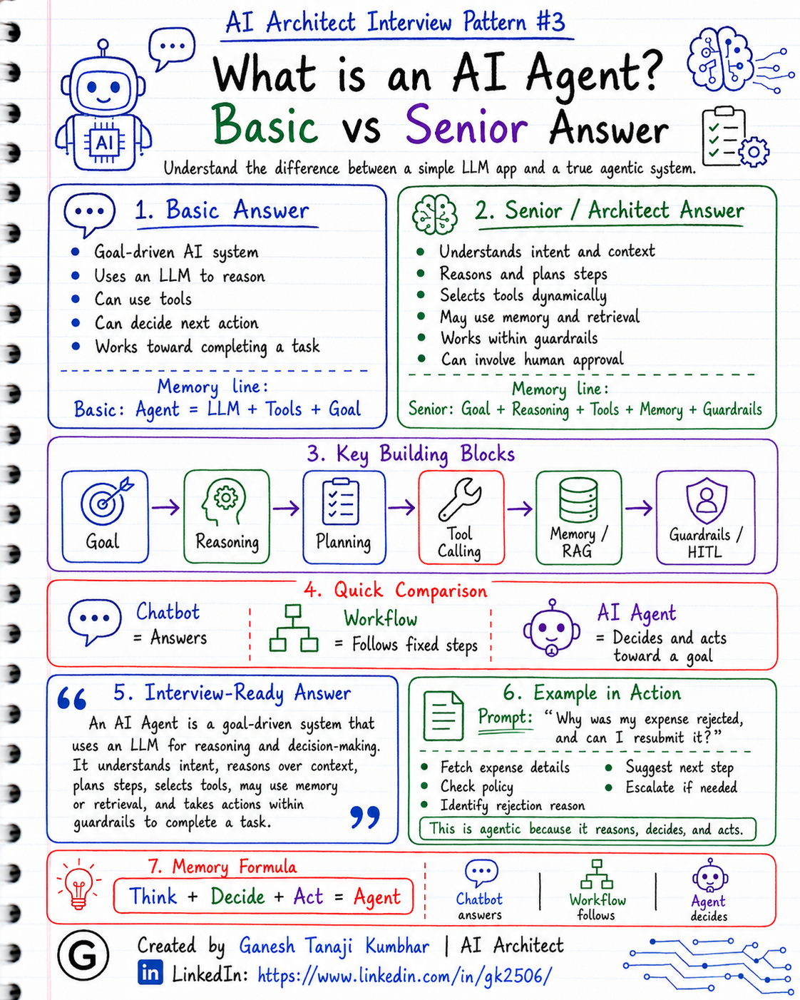
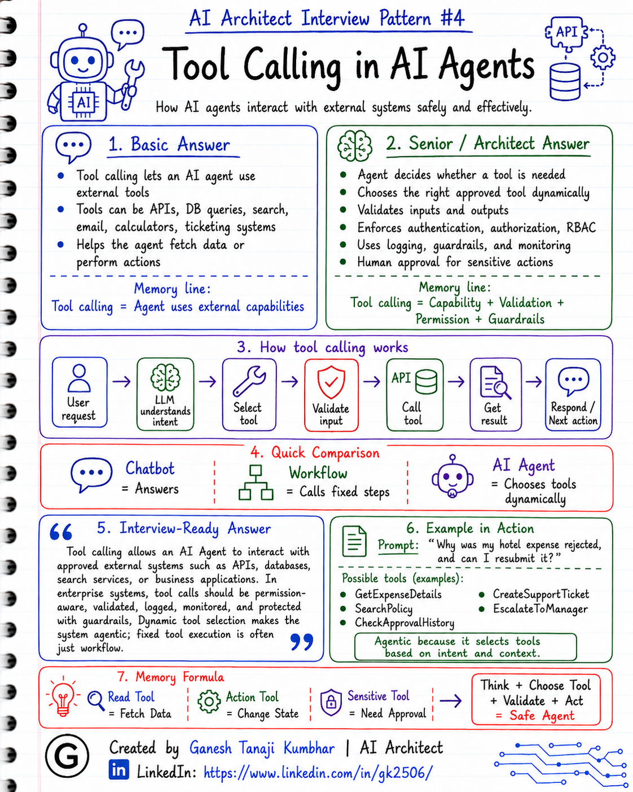

# AI Architect Interview Pattern #3

# What is an AI Agent? Basic vs Senior Answer

---

## Question

In an interview, you may be asked:

> What is an AI Agent?

Or:

> How is an AI Agent different from a normal LLM application?

Or:

> What makes an application agentic?

Or:

> Can you explain AI Agent architecture from a senior engineer or architect perspective?

---

## Why interviewer asks this

The interviewer is not only checking whether you know the definition of an AI Agent.

They are checking whether you understand the difference between:

* A simple LLM call
* A chatbot
* A workflow
* A tool-calling application
* A true agentic system

Many candidates give a very basic answer like:

> An AI Agent is an LLM that can use tools.

This is partially correct, but not complete.

A senior or architect-level answer should explain:

> An AI Agent is a goal-driven system that can understand context, reason, plan, select tools, take actions, use memory, follow guardrails, and work toward a task with some level of autonomy.

This question tests your understanding of:

* Reasoning
* Planning
* Tool calling
* Memory
* Context awareness
* Autonomy
* Guardrails
* Human-in-the-loop
* Observability
* Production readiness

---

## Basic answer

An AI Agent is an AI system that can understand a goal, reason about what needs to be done, use tools, and take actions to complete a task.

Simple answer:

> An AI Agent is an LLM-based system that can decide what to do next and use tools to complete a goal.

For example:

If a user asks:

> Why was my expense rejected, and can I resubmit it?

An AI Agent may:

* Understand the user’s question
* Fetch expense details
* Check policy
* Compare the claim with allowed limits
* Decide the next step
* Suggest correction
* Create a support ticket if needed
* Escalate to manager if required

---

## Architect-level answer

An AI Agent is not just a chatbot and not just an LLM API call.

An AI Agent is a goal-oriented system that can reason over context, decide the next action, use tools, and progress toward a task dynamically.

From an architecture perspective, an AI Agent usually has these parts:

* **Goal or task**

  * What the user wants to achieve

* **LLM reasoning**

  * Understanding intent and deciding possible next steps

* **Planning**

  * Breaking the goal into smaller steps

* **Tool calling**

  * Calling APIs, databases, search systems, business services, or external systems

* **Memory**

  * Remembering conversation context, user preferences, or previous actions

* **Knowledge retrieval**

  * Using RAG or search when external/domain knowledge is needed

* **Guardrails**

  * Controlling unsafe, incorrect, or unauthorized actions

* **Human-in-the-loop**

  * Asking for approval when the action is sensitive or high-risk

* **Observability**

  * Tracking prompts, tool calls, latency, token usage, failures, and decisions

So I would define an AI Agent as:

> A system that uses an LLM as a reasoning engine to understand a goal, decide the next action, call tools, use memory or retrieved knowledge, and complete a task within defined guardrails.

---

## Must mention in interview

When answering this question, try to mention these points:

### 1. AI Agent is goal-driven

A normal chatbot may only answer questions.

An AI Agent works toward a goal.

Example:

> “Help me resolve this rejected expense.”

This is a goal, not just a question.

The agent may need to inspect data, check policy, decide next action, and guide the user.

---

### 2. AI Agent reasons over context

The agent should understand:

* User question
* Current conversation
* Business context
* Available tools
* Retrieved knowledge
* User permissions
* Previous actions

Without context, the system may give generic or incorrect answers.

---

### 3. AI Agent can plan steps

For complex tasks, the agent may break the work into smaller steps.

Example:

> Check expense → Retrieve policy → Compare limits → Identify issue → Suggest fix → Escalate if needed

Planning helps the agent decide the sequence of actions.

---

### 4. AI Agent uses tools

Tools allow the agent to interact with real systems.

Examples of tools:

* Database lookup
* Policy search
* Ticket creation
* Email notification
* Calendar check
* Order status API
* CRM API
* Expense system API

But tool calling alone does not automatically make something a full AI Agent.

If the same tool is always called in the same fixed sequence, it may still be a workflow.

---

### 5. AI Agent may use memory

Memory helps the agent maintain continuity.

Types of memory:

* Conversation memory
* User preference memory
* Session memory
* Long-term memory
* Task memory
* Domain memory through retrieval

But memory should be used carefully because it can create privacy and security concerns.

---

### 6. AI Agent needs guardrails

An AI Agent should not be allowed to do anything it wants.

It needs guardrails such as:

* Input validation
* Output validation
* Tool permission checks
* RBAC
* PII masking
* Prompt injection protection
* Policy checks
* Human approval for sensitive actions

This is especially important in enterprise systems.

---

### 7. AI Agent needs observability

In production, we should be able to track:

* What prompt was sent
* What context was used
* Which tool was called
* What the tool returned
* What decision was made
* How many tokens were used
* How much latency occurred
* Whether the answer was helpful or not

Without observability, debugging AI Agent behavior becomes very difficult.

---

### 8. AI Agent should not be used everywhere

This connects with Pattern #1.

If the process is fixed, rule-based, and predictable, a deterministic workflow may be better.

AI Agent should be used when we need:

* Reasoning
* Dynamic decision-making
* Tool selection
* Memory
* Handling ambiguity
* Multi-step goal completion

---

## Real-world example

### Example: Expense rejection assistant

User asks:

> Why was my hotel expense rejected, and can I resubmit it?

A simple chatbot may answer:

> Please check your company expense policy.

A better RAG chatbot may retrieve the hotel policy and explain the allowed limit.

But an AI Agent may go further.

It can:

1. Understand the user’s intent
2. Fetch the submitted expense details
3. Retrieve the latest hotel policy
4. Compare claimed amount with allowed limit
5. Check if receipt is missing
6. Identify the exact rejection reason
7. Suggest what the user can change
8. Ask for missing details if needed
9. Create a support ticket
10. Escalate to manager if exception approval is possible

This becomes agentic because the system is not only answering.

It is reasoning, deciding, using tools, and guiding the task toward resolution.

---

## Common mistake

Many candidates say:

> AI Agent means LLM plus tools.

This is incomplete.

A better answer should include:

* Goal
* Reasoning
* Planning
* Tool selection
* Memory
* Guardrails
* Human-in-the-loop
* Observability

Another common mistake is saying:

> Every chatbot is an AI Agent.

This is also not correct.

A chatbot may only respond to user questions.

An AI Agent should be able to decide and act toward a goal.

---

## Better interview answer

A strong answer can be:

> An AI Agent is a goal-driven AI system that uses an LLM for reasoning and decision-making. It understands user intent, reasons over context, plans steps, selects tools, uses memory or retrieved knowledge when needed, and takes actions within defined guardrails. For example, in an expense system, instead of only answering policy questions, an agent can inspect the submitted expense, check policy, identify the rejection reason, suggest next steps, and escalate if required. But I would not use an agent for every use case. If the process is fixed and rule-based, I prefer deterministic workflow because it is cheaper, faster, and easier to test.

---

## One-line answer

> An AI Agent is a goal-driven system that can reason, plan, use tools, remember context, and take actions within guardrails to complete a task.

---

## Memory formula

Use this formula:

# Goal + Reasoning + Tools + Memory + Guardrails = AI Agent

Or:

# Think + Decide + Act = Agent

Another simple version:

# Chatbot answers

# Workflow follows steps

# Agent decides and acts toward a goal

---

## Interview closing line

You can close your answer like this:

> As an architect, I see an AI Agent as a goal-driven system, not just an LLM call. I use agents when the system needs reasoning, tool selection, memory, and dynamic decision-making. But if the flow is fixed and predictable, I prefer a deterministic workflow to reduce cost, latency, and complexity.

---

## Related upcoming topics

* Tool Calling in AI Agents
* Agent Memory
* Single Agent vs Multi-Agent System
* Human-in-the-loop in Agentic AI
* RAG vs Agent vs Fine-tuning
* How to design an Agentic AI system
* Observability for AI Agents

---

## About the Author

These notes are created and maintained by **Ganesh Tanaji Kumbhar**, an **AI Architect** with experience in **.NET, Azure, cloud architecture, infrastructure, enterprise application modernization, and GenAI solution design**.

I bring practical experience across:

* **.NET / C# / ASP.NET / Web API**
* **Azure App Services, Azure Functions, WebJobs, Azure SQL, Storage, Redis**
* **Cloud architecture and infrastructure modernization**
* **Application architecture and enterprise system design**
* **CI/CD, DevOps, monitoring, and production support**
* **GenAI, RAG, Agentic AI, and AI architecture patterns**

These notes are based on my real experience as both:

* An **interviewee**, facing AI, architecture, cloud, .NET, Azure, and system design rounds
* An **interviewer**, evaluating how candidates explain concepts, tradeoffs, project experience, and real-world design decisions

I write about:

* GenAI Architecture
* RAG System Design
* Agentic AI
* AI Architect Interview Preparation
* .NET and Azure Architecture
* Cloud and Enterprise AI Patterns

If you are preparing for **GenAI / AI Architect / Staff Engineer / Solution Architect / .NET Architect / Azure Architect** interviews, feel free to connect with me on LinkedIn.

🔗 **LinkedIn:** [Connect with me on LinkedIn](https://www.linkedin.com/in/gk2506/)

💬 You can also DM me on LinkedIn if you want to discuss AI architecture, interview preparation, .NET/Azure architecture, or practical GenAI learning.
