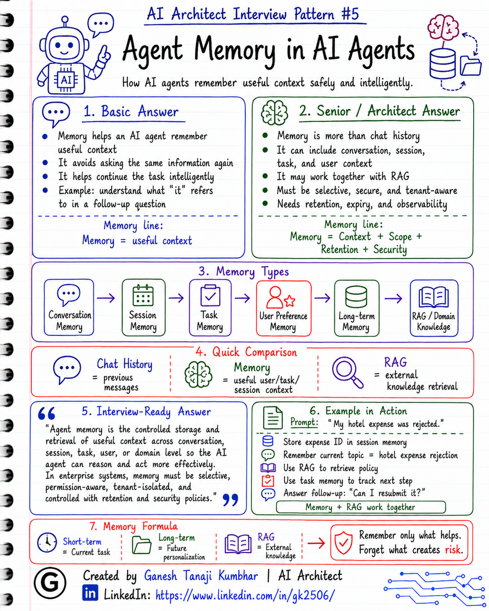

# AI Architect Interview Pattern #5

# Agent Memory in AI Agents

---

## Question

In an interview, you may be asked:

> What is memory in AI Agents?

Or:

> How does an AI Agent remember context?

Or:

> What is the difference between chat history, memory, and RAG?

Or:

> How will you design memory safely in an enterprise AI Agent?

---

## Why interviewer asks this

The interviewer is checking whether you understand one of the most misunderstood parts of Agentic AI.

Many candidates say:

> Memory means storing chat history.

That is only partially correct.

A senior or architect-level answer should explain:

> Memory allows an AI Agent to maintain useful context across a conversation, task, user session, or longer-term interaction. But memory must be designed carefully because it has privacy, security, correctness, cost, and compliance implications.

This question tests your understanding of:

* Conversation context
* Short-term memory
* Long-term memory
* User preference memory
* Task memory
* RAG vs memory
* Privacy and PII
* Security
* Data retention
* Tenant isolation
* Observability
* Production readiness

---

## Basic answer

Memory in an AI Agent means the ability to remember useful information from previous interactions or previous steps in a task.

Simple answer:

> Agent memory helps the AI Agent maintain context so it can continue the task without asking the same information again.

Example:

If a user says:

> I am asking about my rejected hotel expense.

And later asks:

> Can I resubmit it?

The agent should understand that “it” refers to the same hotel expense.

This is basic conversation memory.

---

## Architect-level answer

Agent memory is not just chat history.

From an architecture perspective, memory can exist at multiple levels:

### 1. Conversation memory

This stores the current conversation context.

Example:

> User first asks about a rejected expense. Later they ask, “Can I resubmit it?”

The agent uses conversation memory to understand what “it” means.

---

### 2. Session memory

This stores useful context during the current user session.

Example:

* Current user ID
* Selected expense ID
* Current workflow step
* Last tool result
* Pending action
* Current approval status

Session memory usually does not need to live forever.

---

### 3. Task memory

This remembers progress within a multi-step task.

Example:

> Check expense → Retrieve policy → Compare limit → Ask for missing receipt → Create ticket

The agent should know which steps are completed and which are pending.

---

### 4. User preference memory

This remembers user-specific preferences.

Example:

* Preferred language
* Preferred report format
* Frequently used project
* Communication preference

This should be stored only with clear purpose and proper privacy controls.

---

### 5. Long-term memory

This stores information across sessions.

Example:

> The user usually submits expenses for a specific region or project.

Long-term memory can be useful, but it creates privacy, compliance, and data retention concerns.

Use it carefully.

---

### 6. Domain memory through RAG

Sometimes what people call memory is actually retrieval.

Example:

* Expense policy documents
* HR policy documents
* Product manuals
* Knowledge base articles
* Previous support tickets

This is not personal memory. This is domain knowledge retrieval.

So my definition would be:

> Agent memory is the controlled storage and retrieval of useful context across conversation, session, task, user, or domain level so that the AI Agent can reason and act more effectively. But memory must be designed with privacy, security, retention, tenant isolation, and correctness in mind.

---

## Must mention in interview

When answering this question, try to mention these points:

### 1. Memory is not only chat history

Chat history is just one type of memory.

Agent memory can include:

* Conversation context
* Session state
* Task progress
* Tool outputs
* User preferences
* Long-term user context
* Retrieved domain knowledge

A strong answer should explain memory in layers.

---

### 2. Short-term memory vs long-term memory

Short-term memory is temporary.

It is useful during the current conversation or current task.

Examples:

* Current question
* Previous response
* Current expense ID
* Last tool output
* Current workflow step

Long-term memory persists across sessions.

Examples:

* User preference
* Repeated patterns
* Saved profile context
* Historical choices

Long-term memory needs stronger controls because it may store sensitive or personal information.

---

### 3. Memory vs RAG

This is a very important distinction.

Memory usually refers to context related to:

* User
* Session
* Conversation
* Task progress
* Previous interaction

RAG usually refers to retrieving external knowledge from documents or data sources.

Example:

* Remembering that the user is asking about expense ID 123 = memory
* Retrieving hotel expense policy from a document = RAG

Both can work together, but they are not the same.

---

### 4. Memory should be selective

Do not store everything.

A good memory system should decide:

* What should be stored?
* Why should it be stored?
* How long should it be stored?
* Who can access it?
* Can the user delete it?
* Is it sensitive?
* Is it still valid?

Storing everything increases cost, risk, and noise.

---

### 5. Mention privacy and PII

Memory can accidentally store sensitive information.

Examples:

* Salary details
* Health information
* Personal identifiers
* Financial data
* Customer data
* Authentication tokens
* Confidential business data

Memory design should include:

* PII detection
* PII masking
* Encryption
* Access control
* Retention policy
* User consent
* Deletion option

---

### 6. Mention tenant isolation

In enterprise systems, memory must be tenant-aware.

One tenant’s memory should never be available to another tenant.

Every memory record should include metadata such as:

* Tenant ID
* User ID
* Session ID
* Role
* Access scope
* Created date
* Expiry date

This is critical for SaaS and enterprise GenAI systems.

---

### 7. Mention freshness and correctness

Memory can become outdated.

Example:

A user’s role, policy, manager, or project may change.

So memory should not be blindly trusted forever.

We need:

* Expiry
* Refresh logic
* Confidence
* Source tracking
* Last updated timestamp
* Ability to override stale memory

---

### 8. Mention observability

We should be able to trace:

* What memory was used
* Why it was retrieved
* Whether it affected the answer
* When it was created
* Who created it
* Whether it was user-provided or system-generated
* Whether it contains sensitive data

This helps with debugging, auditing, and compliance.

---

## Real-world example

### Example: Expense assistant with memory

User starts a conversation:

> My hotel expense was rejected.

The agent asks:

> Can you share the expense ID?

User replies:

> EXP-1024.

The agent stores this in session memory:

* Current topic: hotel expense rejection
* Expense ID: EXP-1024
* User intent: understand rejection and resubmission option

Then the user asks:

> Can I resubmit it?

The agent understands that “it” means:

> EXP-1024 hotel expense

The agent may then:

1. Use memory to identify the current expense ID
2. Call `GetExpenseDetails`
3. Use RAG to retrieve hotel policy
4. Compare claimed amount with allowed limit
5. Check rejection reason
6. Suggest resubmission steps
7. Create a support ticket if needed

Here:

* Current expense ID = session memory
* Previous conversation = conversation memory
* Policy document = RAG
* Resubmission progress = task memory

This is how memory and RAG work together.

---

## Common mistake

Many candidates say:

> Memory means storing all previous chats.

This is not a good answer.

Storing all chats can create problems:

* High cost
* Irrelevant context
* Privacy risk
* PII exposure
* Stale information
* Prompt pollution
* Security concerns
* Compliance issues

Another common mistake is confusing RAG with memory.

For example:

> Policy document retrieval is memory.

Actually, policy document retrieval is usually RAG or knowledge retrieval.

Memory is more about user/session/task context.

---

## Better interview answer

A strong answer can be:

> Agent memory allows an AI Agent to maintain useful context across conversation, session, task, or longer-term interactions. I do not treat memory as simply storing all chat history. I usually design memory in layers: conversation memory for current dialogue, session memory for active task context, task memory for workflow progress, user preference memory for personalization, and RAG for domain knowledge retrieval. In enterprise systems, memory must be selective, permission-aware, tenant-isolated, encrypted, auditable, and controlled with retention policies because it may contain sensitive or stale information.

---

## One-line answer

> Agent memory is the controlled storage and retrieval of useful context that helps an AI Agent continue a task intelligently without losing important information.

---

## Memory formula

Use this formula:

# Memory = Useful Context + Scope + Retention + Security

Another simple version:

# Short-term = Current task

# Long-term = Future personalization

# RAG = External knowledge

Or:

# Remember only what helps

# Forget what creates risk

---

## Interview closing line

You can close your answer like this:

> As an architect, I design agent memory very carefully. Memory improves continuity and personalization, but it also introduces privacy, security, stale data, and compliance risks. So I store only useful context, define its scope and lifetime, enforce tenant and user permissions, and keep it auditable.

---

## Related upcoming topics

* Single Agent vs Multi-Agent System
* Human-in-the-loop in Agentic AI
* RAG vs Agent vs Fine-tuning
* How to design an Agentic AI system
* Observability for AI Agents
* Guardrails in AI Agents
* Tenant Isolation in AI Systems

---

## About the Author

These notes are created and maintained by **Ganesh Tanaji Kumbhar**, an **AI Architect** with experience in **.NET, Azure, cloud architecture, infrastructure, enterprise application modernization, and GenAI solution design**.

I bring practical experience across:

* **.NET / C# / ASP.NET / Web API**
* **Azure App Services, Azure Functions, WebJobs, Azure SQL, Storage, Redis**
* **Cloud architecture and infrastructure modernization**
* **Application architecture and enterprise system design**
* **CI/CD, DevOps, monitoring, and production support**
* **GenAI, RAG, Agentic AI, and AI architecture patterns**

These notes are based on my real experience as both:

* An **interviewee**, facing AI, architecture, cloud, .NET, Azure, and system design rounds
* An **interviewer**, evaluating how candidates explain concepts, tradeoffs, project experience, and real-world design decisions

I write about:

* GenAI Architecture
* RAG System Design
* Agentic AI
* AI Architect Interview Preparation
* .NET and Azure Architecture
* Cloud and Enterprise AI Patterns

If you are preparing for **GenAI / AI Architect / Staff Engineer / Solution Architect / .NET Architect / Azure Architect** interviews, feel free to connect with me on LinkedIn.

🔗 **LinkedIn:** [Connect with me on LinkedIn](https://www.linkedin.com/in/gk2506/)

💬 You can also DM me on LinkedIn if you want to discuss AI architecture, interview preparation, .NET/Azure architecture, or practical GenAI learning.
