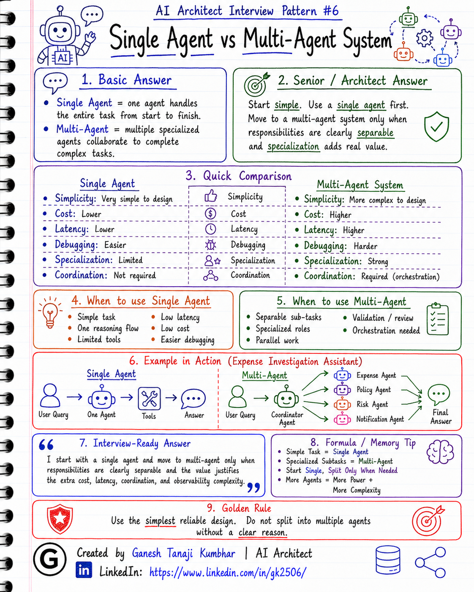

# AI Architect Interview Pattern #6

# Single Agent vs Multi-Agent System

---

## Question

In an interview, you may be asked:

> What is the difference between a single-agent and multi-agent system?

Or:

> When would you use multiple AI Agents instead of one AI Agent?

Or:

> Is multi-agent architecture always better?

Or:

> How will you design a multi-agent system safely in production?

---

## Why interviewer asks this

The interviewer is checking whether you understand one of the most overused and misunderstood topics in Agentic AI.

Many candidates think:

> Multi-agent system sounds advanced, so it must be better.

But that is not always true.

A senior or architect-level answer should explain:

> A single agent is usually better when the task is simple or can be handled by one reasoning flow. A multi-agent system is useful when the problem has clearly separable responsibilities, multiple specialized skills, or independent sub-tasks that need coordination.

This question tests your understanding of:

* Agent responsibility design
* Task decomposition
* Orchestration
* Collaboration between agents
* Cost and latency
* Failure handling
* Debugging complexity
* Observability
* Human-in-the-loop
* Production readiness

---

## Basic answer

A **single-agent system** uses one AI Agent to understand the task, reason, call tools, and respond.

A **multi-agent system** uses multiple specialized agents that collaborate or coordinate to complete a larger task.

Simple answer:

> Single Agent = one agent handles the task
> Multi-Agent = multiple specialized agents share the task

Example:

For a simple policy question:

> What is the hotel reimbursement limit?

A single RAG-based agent may be enough.

But for a complex expense investigation:

> Analyze rejection reason, check policy, inspect receipt, detect duplicate claim, create ticket, and prepare manager summary.

A multi-agent system may help if each part needs a specialized role.

---

## Architect-level answer

I would not start with a multi-agent system by default.

My first preference is to keep the architecture simple.

A **single-agent system** is useful when:

* The task is small or medium complexity
* One reasoning flow is enough
* Tool selection is limited
* Latency should be low
* Cost should be controlled
* Debugging should remain simple
* The process does not need many specialized roles

A **multi-agent system** is useful when:

* The problem can be broken into clear sub-tasks
* Different agents need different responsibilities
* Some agents need different tools or knowledge sources
* Parallel work can improve speed
* Independent review or validation is needed
* A coordinator/orchestrator can manage the flow

From an architecture point of view, a multi-agent system should not mean random agents talking to each other.

It should have:

* Clear agent roles
* Defined responsibilities
* Controlled communication
* Shared state or task context
* Orchestration logic
* Failure handling
* Guardrails
* Observability
* Human approval for sensitive actions

So my definition would be:

> A single-agent system uses one agent to reason and act for a task, while a multi-agent system divides a larger task across specialized agents with clear responsibilities and orchestration. Multi-agent design is useful only when specialization or coordination adds real value over a simpler single-agent approach.

---

## Must mention in interview

When answering this question, try to mention these points:

### 1. Do not use multi-agent just because it sounds advanced

Multi-agent systems look impressive in demos, but they add complexity.

They can increase:

* Cost
* Latency
* Failure points
* Debugging difficulty
* Token usage
* Coordination problems
* Monitoring complexity

A good architect starts simple and adds agents only when needed.

---

### 2. Single agent is usually the first choice

A single agent is often enough when one agent can:

* Understand the user request
* Retrieve required data
* Call required tools
* Reason over the result
* Give the final answer

Example:

> Employee asks: “Why was my expense rejected?”

A single agent can fetch expense details, retrieve policy, check status, and answer.

No need for multiple agents if the task is straightforward.

---

### 3. Multi-agent works when responsibilities are clearly separated

Multi-agent design makes sense when different parts of the task require different expertise.

Example agents:

* **Policy Agent**

  * Retrieves and interprets policy

* **Expense Agent**

  * Fetches expense details and approval history

* **Duplicate Check Agent**

  * Checks if similar claims exist

* **Risk Agent**

  * Scores risk or fraud possibility

* **Notification Agent**

  * Prepares manager/user communication

* **Coordinator Agent**

  * Orchestrates the overall flow

Each agent should have a clear purpose.

---

### 4. Mention orchestrator or coordinator

In production, agents should not communicate randomly.

Usually, we need an orchestrator or coordinator.

The orchestrator decides:

* Which agent should run
* In what sequence
* What context should be passed
* What output should be accepted
* Whether retry is needed
* Whether human approval is required

Without orchestration, a multi-agent system can become unpredictable.

---

### 5. Mention shared state and context

Multi-agent systems need a controlled way to share information.

This may include:

* Task ID
* User ID
* Tenant ID
* Conversation context
* Tool results
* Intermediate decisions
* Confidence scores
* Final summary
* Audit trail

Agents should not depend on hidden or uncontrolled memory.

Shared state should be explicit and traceable.

---

### 6. Mention cost and latency

Multi-agent systems often require multiple LLM calls.

More agents usually means:

* More prompts
* More tokens
* More latency
* More chances of failure
* Higher cost

So we should use multi-agent only when the benefit is greater than the added cost and complexity.

---

### 7. Mention validation and conflict resolution

Different agents may produce different or conflicting outputs.

Example:

* Policy Agent says the claim is allowed
* Risk Agent says the claim looks suspicious
* Expense Agent says receipt is missing

The system needs a way to handle conflicts.

Options:

* Coordinator decides
* Rule-based validation
* Confidence scoring
* Human review
* Final verifier agent
* Deterministic business rules

---

### 8. Mention observability

Multi-agent systems are harder to debug.

We should track:

* Which agent ran
* What input each agent received
* What output each agent produced
* Which tools were called
* What decision was made
* Token usage per agent
* Latency per agent
* Failure reason
* Human approval status

Without observability, multi-agent systems become difficult to trust in production.

---

## Real-world example

### Example: Expense investigation assistant

User asks:

> Why was my hotel expense rejected, and can I resubmit it?

### Single-agent approach

One agent handles everything:

1. Understand user intent
2. Fetch expense details
3. Retrieve policy
4. Check rejection reason
5. Suggest next step
6. Escalate if needed

This is simpler and may be enough for many use cases.

### Multi-agent approach

If the process becomes complex, we can split responsibilities:

### 1. Coordinator Agent

Purpose:

> Understand the user request and manage the full flow.

Responsibilities:

* Identify task
* Select required agents
* Pass context
* Combine results
* Decide final response

---

### 2. Expense Agent

Purpose:

> Fetch and analyze expense details.

Responsibilities:

* Get submitted amount
* Check category
* Check receipt status
* Check approval history
* Identify rejection reason

---

### 3. Policy Agent

Purpose:

> Retrieve and interpret relevant policy.

Responsibilities:

* Search hotel policy
* Check allowed limits
* Check exception rules
* Provide policy-based explanation

---

### 4. Risk Agent

Purpose:

> Evaluate risk or exception possibility.

Responsibilities:

* Check duplicate claims
* Check unusual amount
* Check missing receipt
* Identify high-risk cases

---

### 5. Notification Agent

Purpose:

> Prepare communication.

Responsibilities:

* Draft response to employee
* Draft manager escalation summary
* Create support ticket message

---

The multi-agent approach is useful only if this separation gives better quality, maintainability, or scalability.

Otherwise, a single agent is simpler and better.

---

## Common mistake

Many candidates say:

> Multi-agent is better because multiple agents can solve the problem together.

This is too generic.

A better answer should explain:

* Why multiple agents are needed
* What each agent does
* How agents communicate
* Who coordinates them
* How conflicts are resolved
* How outputs are validated
* How cost and latency are controlled
* How the system is monitored

Another common mistake is creating too many agents.

For example:

> One agent for every small function.

This creates unnecessary complexity.

Sometimes a simple workflow or single agent is enough.

---

## Better interview answer

A strong answer can be:

> I would not use a multi-agent system by default. I first check whether a single agent can handle the task reliably. A single agent is better when the task has one reasoning flow and limited tools. I consider multi-agent architecture when the problem has clearly separable responsibilities, such as policy retrieval, expense analysis, risk scoring, and notification. In that case, I design agents with clear roles and use a coordinator to manage the flow, shared context, validation, conflict resolution, guardrails, and observability. Multi-agent systems can improve specialization, but they also increase cost, latency, and debugging complexity.

---

## One-line answer

> Use a single agent when one reasoning flow is enough; use multi-agent only when specialized agents with clear responsibilities add real value.

---

## Memory formula

Use this formula:

# Simple Task = Single Agent

# Specialized Subtasks = Multi-Agent

# No Clear Roles = Do Not Split

Another simple version:

# Start Single

# Split Only When Needed

# Orchestrate Everything

Or:

# More Agents = More Power + More Complexity

---

## Interview closing line

You can close your answer like this:

> As an architect, I prefer the simplest reliable design. I start with a single agent and move to multi-agent only when responsibilities are clearly separable and the value justifies the extra cost, latency, coordination, and observability complexity.

---

## Related upcoming topics

* Human-in-the-loop in Agentic AI
* RAG vs Agent vs Fine-tuning
* How to design an Agentic AI system
* Observability for AI Agents
* Guardrails in AI Agents
* Agent Evaluation
* Multi-Agent Failure Handling

---

## About the Author

These notes are created and maintained by **Ganesh Tanaji Kumbhar**, an **AI Architect** with experience in **.NET, Azure, cloud architecture, infrastructure, enterprise application modernization, and GenAI solution design**.

I bring practical experience across:

* **.NET / C# / ASP.NET / Web API**
* **Azure App Services, Azure Functions, WebJobs, Azure SQL, Storage, Redis**
* **Cloud architecture and infrastructure modernization**
* **Application architecture and enterprise system design**
* **CI/CD, DevOps, monitoring, and production support**
* **GenAI, RAG, Agentic AI, and AI architecture patterns**

These notes are based on my real experience as both:

* An **interviewee**, facing AI, architecture, cloud, .NET, Azure, and system design rounds
* An **interviewer**, evaluating how candidates explain concepts, tradeoffs, project experience, and real-world design decisions

I write about:

* GenAI Architecture
* RAG System Design
* Agentic AI
* AI Architect Interview Preparation
* .NET and Azure Architecture
* Cloud and Enterprise AI Patterns

If you are preparing for **GenAI / AI Architect / Staff Engineer / Solution Architect / .NET Architect / Azure Architect** interviews, feel free to connect with me on LinkedIn.

🔗 **LinkedIn:** [Connect with me on LinkedIn](https://www.linkedin.com/in/gk2506/)

💬 You can also DM me on LinkedIn if you want to discuss AI architecture, interview preparation, .NET/Azure architecture, or practical GenAI learning.
