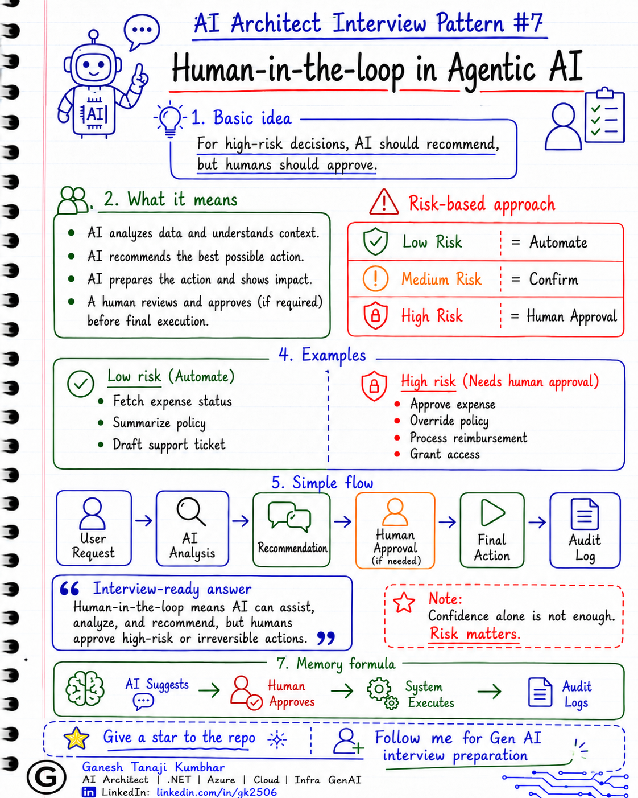

# AI Architect Interview Pattern #7

# Human-in-the-loop in Agentic AI


---

## Question

In an interview, you may be asked:

> What is human-in-the-loop in Agentic AI?

Or:

> When should an AI Agent ask for human approval?

Or:

> Should AI Agents be allowed to take actions automatically?

Or:

> How do you design human approval in an enterprise AI Agent system?

---

## Why interviewer asks this

The interviewer is checking whether you understand that AI Agents should not be allowed to take every action automatically.

Many candidates explain AI Agents as:

> AI can reason, call tools, and complete tasks.

That answer is incomplete.

In real enterprise systems, some actions are low-risk and can be automated, but some actions are sensitive and need human approval.

This question tests whether you understand:

* Risk-based automation
* Approval workflows
* Guardrails
* Tool permissions
* Human review
* Auditability
* Compliance
* Accountability
* Production safety
* Enterprise readiness

A senior-level answer should clearly say:

> For high-risk decisions, the AI system should recommend, but humans should approve.

---

## Basic answer

**Human-in-the-loop** means a human is involved before the AI system performs a sensitive or high-risk action.

Simple answer:

> Human-in-the-loop means the AI Agent can analyze, recommend, and prepare the action, but a human reviews and approves before the final action is executed.

Example:

An AI Agent can say:

> This rejected hotel expense may be eligible for manager exception approval.

But it should not directly approve the reimbursement without proper human approval.

---

## Architect-level answer

In Agentic AI, human-in-the-loop is a safety and governance pattern where the AI Agent does not fully automate sensitive decisions.

The agent can:

* Understand the request
* Collect required information
* Call read-only tools
* Analyze data
* Prepare recommendation
* Draft summary
* Suggest next action

But for high-risk or business-critical actions, the agent should ask for human approval before execution.

Examples of actions that may need human approval:

* Approving or rejecting financial claims
* Refunding money
* Changing reimbursement amount
* Sending official customer communication
* Updating employee records
* Deleting data
* Granting access
* Escalating legal or compliance cases

So my architect-level answer would be:

> Human-in-the-loop in Agentic AI means designing the system so that AI can assist, analyze, and recommend, but humans remain responsible for approving high-risk or irreversible actions. The system should classify actions by risk, enforce approval workflows, log decisions, and allow automation only within safe boundaries.

---

## Must mention in interview

When answering this question, try to mention these points:

### 1. AI should not have unlimited execution power

An AI Agent may be able to call tools, but that does not mean it should be allowed to execute every tool freely.

There should be clear permission boundaries.

Example:

The agent may be allowed to read expense details.

But it should not be allowed to approve payment automatically unless the business explicitly allows it.

---

### 2. Classify actions by risk level

A good design separates actions into risk levels.

### Low-risk actions

These can often be automated.

Examples:

* Search policy
* Fetch expense status
* Show approval history
* Summarize rejection reason
* Draft a support ticket
* Prepare manager summary

### Medium-risk actions

These may need confirmation from the user.

Examples:

* Create support ticket
* Send notification
* Resubmit corrected expense
* Update non-critical information

### High-risk actions

These should require human approval.

Examples:

* Approve expense
* Reject expense
* Process reimbursement
* Override policy
* Change amount
* Delete records
* Grant access
* Send official legal or compliance response

Simple formula:

```text
Read = Automate
Write = Confirm
High-risk = Human Approval
```

---

### 3. AI recommends, human approves

This is the most important point.

For high-risk decisions, the AI Agent should not be the final decision maker.

The agent can provide:

* Summary
* Reason
* Evidence
* Policy reference
* Confidence score
* Recommended action
* Risk flags
* Next-step options

But the human should approve, reject, or modify the action.

Example:

> AI recommendation: This hotel expense exceeds the allowed limit by ₹2,500, but exception approval is allowed with manager approval. Recommended action: send to manager for review.

The manager then decides.

---

### 4. Mention approval workflow

Human-in-the-loop should not be a manual afterthought.

It should be part of the system workflow.

Example flow:

```text
User request
   ↓
AI Agent analyzes request
   ↓
AI Agent prepares recommendation
   ↓
System checks risk level
   ↓
If low risk → execute automatically
   ↓
If high risk → send for human approval
   ↓
Human approves / rejects / modifies
   ↓
System executes final action
   ↓
Audit log is stored
```

---

### 5. Mention audit trail

Every human-in-the-loop decision should be logged.

Track:

* User request
* Agent recommendation
* Data used
* Tools called
* Risk level
* Human approver
* Approval decision
* Reason for approval or rejection
* Final action
* Timestamp

This is important for debugging, compliance, and accountability.

---

### 6. Mention confidence score is not enough

Some candidates say:

> If AI confidence is high, we can automate.

That is risky.

Confidence score alone should not decide automation.

Automation should depend on:

* Business risk
* User permission
* Action type
* Regulatory impact
* Financial impact
* Reversibility
* Confidence score
* Company policy

Even if confidence is high, some actions still need human approval.

---

### 7. Mention reversible vs irreversible actions

This is a good architect-level point.

If an action is reversible and low impact, automation may be acceptable.

Example:

* Drafting a response
* Creating a support ticket
* Showing policy explanation

If an action is irreversible or high impact, human approval is needed.

Example:

* Approving payment
* Deleting user data
* Sending legal response
* Changing employee access

---

### 8. Mention user confirmation vs human approval

These are different.

### User confirmation

The same user confirms the action.

Example:

> Do you want me to create a support ticket?

### Human approval

An authorized person approves the action.

Example:

> Manager approval is required before this expense can be processed.

In interviews, clearly separate these two.

---

## Real-world example

### Example: Expense Management AI Agent

User asks:

> My hotel expense was rejected. Can you resubmit it?

The AI Agent checks:

* Expense details
* Receipt status
* Rejection reason
* Employee grade
* Hotel reimbursement policy
* Exception approval rule

The agent finds:

```text
Submitted amount: ₹8,500
Allowed limit: ₹6,000
Receipt status: Missing
Exception approval: Allowed with manager approval
```

### What the agent can do automatically

The agent can:

* Explain why the expense was rejected
* Tell the user that receipt is missing
* Explain the allowed policy limit
* Suggest uploading the receipt
* Prepare a resubmission summary
* Draft manager escalation note

### What the agent should not do automatically

The agent should not directly:

* Approve the expense
* Override the policy
* Process reimbursement
* Change the submitted amount
* Mark the expense as approved

### Better flow

```text
Employee asks for resubmission
        ↓
AI Agent checks expense and policy
        ↓
AI Agent prepares recommendation
        ↓
User uploads missing receipt
        ↓
AI Agent prepares manager approval request
        ↓
Manager reviews recommendation
        ↓
Manager approves or rejects
        ↓
System updates expense status
```

This keeps the AI Agent useful, but the final business decision remains with the authorized human.

---

## Common mistake

Many candidates say:

> Human-in-the-loop means a human checks the AI output.

This is partially correct, but too basic.

A better answer should explain:

* Which actions need human review
* Why human approval is needed
* How risk level is decided
* Where approval fits in the workflow
* What information is shown to the approver
* How final action is executed
* How audit logs are maintained

Another common mistake:

> If confidence score is high, no human approval is needed.

This is not always true.

Some actions need human approval even when AI confidence is high.

Example:

> AI may be 95% confident that an expense should be approved, but company policy may still require manager approval for reimbursement above a certain amount.

---

## Better interview answer

A strong answer can be:

> Human-in-the-loop in Agentic AI means the AI Agent can assist, analyze, and recommend, but humans approve high-risk or sensitive actions. I would classify tools and actions by risk. Read-only actions like fetching status or summarizing policy can be automated. Medium-risk actions like creating a ticket may need user confirmation. High-risk actions like approving payment, overriding policy, deleting data, or granting access should go through human approval. The system should show the human approver the AI recommendation, evidence, confidence, risk flags, and policy context, and store a complete audit trail.

---

## One-line answer

> Human-in-the-loop means AI recommends and prepares the action, but humans approve high-risk decisions before execution.

---

## Memory formula

Use this formula:

```text
AI Suggests
Human Approves
System Executes
Audit Logs
```

Another simple version:

```text
Low Risk = Automate
Medium Risk = Confirm
High Risk = Human Approval
```

Or:

```text
Recommend, Do Not Decide
Assist, Do Not Override
Human Owns High-Risk Decision
```

---

## Interview closing line

You can close your answer like this:

> In enterprise Agentic AI, I would not give the AI Agent unlimited execution rights. I would let it automate low-risk tasks, ask confirmation for medium-risk actions, and require human approval for high-risk or irreversible decisions, with complete auditability.

---

## Related upcoming topics

* Guardrails in AI Agents
* Tool permissions in Agentic AI
* AI Agent evaluation
* Observability for AI Agents
* RAG vs Agent vs Fine-tuning
* How to design an Agentic AI system
* Multi-agent failure handling
* Enterprise AI governance

---

## Reference Scenario

This topic uses the common **Expense Management AI Agent** scenario used across this series.

You can refer to the scenario here:

```text
00-common-examples/expense-management-ai-agent-scenario.md
```

---

## About the Author

These notes are created and maintained by **Ganesh Tanaji Kumbhar**, an **AI Architect** with experience in **.NET, Azure, cloud architecture, infrastructure, enterprise application modernization, and GenAI solution design**.

I bring practical experience across:

* **.NET / C# / ASP.NET / Web API**
* **Azure App Services, Azure Functions, WebJobs, Azure SQL, Storage, Redis**
* **Cloud architecture and infrastructure modernization**
* **Application architecture and enterprise system design**
* **CI/CD, DevOps, monitoring, and production support**
* **GenAI, RAG, Agentic AI, and AI architecture patterns**

These notes are based on my real experience as both:

* An **interviewee**, facing AI, architecture, cloud, .NET, Azure, and system design rounds
* An **interviewer**, evaluating how candidates explain concepts, tradeoffs, project experience, and real-world design decisions

I write about:

* GenAI Architecture
* RAG System Design
* Agentic AI
* AI Architect Interview Preparation
* .NET and Azure Architecture
* Cloud and Enterprise AI Patterns

If you are preparing for **GenAI / AI Architect / Staff Engineer / Solution Architect / .NET Architect / Azure Architect** interviews, feel free to connect with me on LinkedIn.

🔗 **LinkedIn:** [Connect with me on LinkedIn](https://www.linkedin.com/in/gk2506/)

💬 You can also DM me on LinkedIn if you want to discuss AI architecture, interview preparation, .NET/Azure architecture, or practical GenAI learning.
