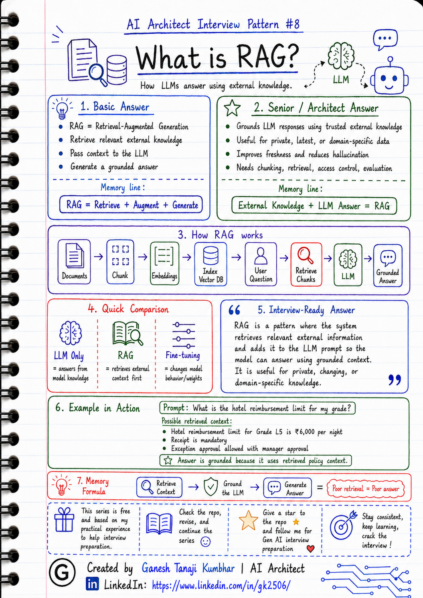

# AI Architect Interview Pattern #8

# What is RAG?


---

## Question

In an interview, you may be asked:

> What is RAG?

Or:

> Why do we need RAG in GenAI applications?

Or:

> How does RAG reduce hallucination?

Or:

> How would you explain RAG in simple terms?

---

## Why interviewer asks this

The interviewer is checking whether you understand one of the most important building blocks of enterprise GenAI systems.

Many candidates say:

> RAG means Retrieval-Augmented Generation.

That is correct, but too basic.

A senior or architect-level answer should explain:

> RAG helps the LLM answer using relevant external knowledge instead of relying only on the model’s pre-trained knowledge.

This question tests your understanding of:

* External knowledge grounding
* Retrieval
* Embeddings
* Vector search
* Context injection
* Prompt augmentation
* Hallucination reduction
* Data freshness
* Enterprise document search
* Access-controlled knowledge retrieval

---

## Basic answer

**RAG** stands for **Retrieval-Augmented Generation**.

Simple answer:

> RAG is a technique where we retrieve relevant information from external data sources and provide it to the LLM as context so it can generate a more accurate and grounded answer.

In simple words:

```text
RAG = Retrieve relevant knowledge + Give it to LLM + Generate answer
```

Example:

User asks:

> What is the hotel reimbursement limit for my grade?

Instead of asking the LLM to guess, the system retrieves the latest hotel reimbursement policy and gives that policy text to the LLM.

Then the LLM answers based on that retrieved policy.

---

## Architect-level answer

RAG is an architecture pattern used to ground LLM responses using trusted external knowledge.

An LLM may not know:

* Latest company policies
* Internal documents
* Tenant-specific data
* Product documentation
* Customer-specific rules
* Frequently changing business information

So instead of depending only on the LLM’s trained knowledge, we build a retrieval layer.

At a high level, RAG works like this:

```text
User Question
   ↓
Convert question into search query / embedding
   ↓
Retrieve relevant chunks from knowledge source
   ↓
Pass retrieved context to LLM
   ↓
LLM generates grounded answer
   ↓
Return answer with source/reference if needed
```

A strong architect-level answer:

> RAG is a design pattern where relevant external knowledge is retrieved at runtime and added to the LLM prompt so the model can generate a grounded answer. It is useful when the answer depends on private, latest, domain-specific, or frequently changing information. In production, RAG should include good chunking, metadata filtering, access control, source citation, evaluation, and monitoring.

---

## Must mention in interview

When answering this question, try to mention these points:

---

### 1. RAG is not just vector search

Many candidates think:

> RAG = Vector DB

That is incomplete.

Vector DB is only one part of RAG.

A RAG system may include:

* Document ingestion
* Text extraction
* Chunking
* Embedding generation
* Indexing
* Retrieval
* Ranking
* Metadata filtering
* Context building
* Prompting
* Answer generation
* Source citation
* Evaluation
* Monitoring

Vector search helps retrieve relevant content, but the complete RAG pipeline is bigger.

---

### 2. RAG gives external knowledge to the LLM

The LLM does not automatically know your private company data.

RAG helps provide that data at runtime.

Example:

The LLM may not know your company’s latest hotel reimbursement policy.

But RAG can retrieve it from your policy repository and pass it to the LLM.

---

### 3. RAG helps reduce hallucination

LLMs may generate confident but incorrect answers if they do not have the right context.

RAG reduces hallucination by giving the model relevant supporting information.

But remember:

> RAG reduces hallucination, but does not completely eliminate it.

The system still needs:

* Good retrieval
* Good prompts
* Source grounding
* Answer validation
* Guardrails
* Evaluation

---

### 4. RAG is useful for changing or private data

RAG is useful when data is:

* Private
* Internal
* Frequently updated
* Domain-specific
* Tenant-specific
* Too large to fit in prompt
* Not present in the model’s training data

Examples:

* HR policy documents
* Expense policies
* Product manuals
* Legal documents
* Customer support knowledge base
* Engineering documentation
* SOP documents
* Compliance documents

---

### 5. Mention data freshness

One important reason to use RAG is freshness.

If policies change every month, we do not want to retrain or fine-tune the model every time.

Instead, we update the knowledge base or index.

Example:

```text
Policy updated today
   ↓
Document is re-indexed
   ↓
RAG retrieves latest policy
   ↓
LLM answers using latest context
```

---

### 6. Mention access control

In enterprise RAG, retrieval must be permission-aware.

The system should not retrieve documents that the user is not allowed to see.

Example:

If an employee asks:

> Show me reimbursement details for all employees.

The system should not retrieve or expose data unless the user has proper permission.

A strong answer should mention:

* RBAC
* Tenant isolation
* User permission
* Metadata filtering
* Document-level access control
* Audit logging

---

### 7. Mention quality depends on retrieval

RAG quality depends heavily on retrieval quality.

If the wrong chunks are retrieved, the LLM may produce a wrong answer.

Common retrieval issues:

* Poor chunking
* Missing metadata
* Wrong top-k value
* Weak embeddings
* Bad query rewriting
* Missing document filters
* Similar but irrelevant chunks
* Lost-in-the-middle problem

---

## Real-world example

### Example: Expense Management AI Agent

User asks:

> What is the hotel reimbursement limit for my grade?

The system should not depend on the LLM’s general knowledge.

Instead, RAG can help.

### Step-by-step flow

```text
User asks policy question
        ↓
System identifies topic: hotel reimbursement policy
        ↓
System checks user context: employee grade, location, tenant
        ↓
System retrieves relevant policy document
        ↓
System extracts relevant policy chunk
        ↓
LLM receives user question + retrieved policy context
        ↓
LLM generates answer
```

### Example retrieved policy

```text
Hotel reimbursement limit for Grade L5 employees is ₹6,000 per night.
Receipt is mandatory.
Exception approval is allowed with manager approval.
```

### Example answer

```text
For your grade, the hotel reimbursement limit is ₹6,000 per night.

A receipt is mandatory. If the expense exceeds the limit, it may require manager exception approval depending on your organization policy.
```

Here, the LLM is not guessing.

It is answering using retrieved policy context.

---

## RAG flow in simple terms

```text
Documents
   ↓
Split into chunks
   ↓
Create embeddings
   ↓
Store in index / vector DB
   ↓
User asks question
   ↓
Retrieve relevant chunks
   ↓
Send chunks + question to LLM
   ↓
Generate grounded answer
```

---

## RAG building blocks

### 1. Knowledge source

This is where the original content comes from.

Examples:

* PDF documents
* Word documents
* Web pages
* Database records
* SharePoint files
* Confluence pages
* Policy documents
* Product manuals

---

### 2. Chunking

Large documents are split into smaller meaningful parts.

Why?

Because LLMs cannot always process entire large documents efficiently.

Good chunking helps retrieve the right context.

---

### 3. Embeddings

Embeddings convert text into numerical vectors.

These vectors help the system find semantically similar content.

Example:

User asks:

> What is hotel claim limit?

The system may retrieve a chunk containing:

> Hotel reimbursement limit for Grade L5 employees is ₹6,000 per night.

Even if the words are not exactly the same, embeddings help find related meaning.

---

### 4. Vector database or search index

The system stores embeddings and retrieves similar chunks.

Examples:

* Azure AI Search
* Pinecone
* Weaviate
* Milvus
* FAISS
* PostgreSQL with pgvector

---

### 5. Retriever

The retriever finds the most relevant chunks for the user question.

It may use:

* Vector search
* Keyword search
* Hybrid search
* Metadata filtering
* Re-ranking

---

### 6. Prompt augmentation

The retrieved chunks are added to the LLM prompt.

Example:

```text
User Question:
What is the hotel reimbursement limit?

Retrieved Context:
Hotel reimbursement limit for Grade L5 is ₹6,000 per night.

Instruction:
Answer using only the provided context.
```

---

### 7. Answer generation

The LLM generates the final answer using the retrieved context.

The answer may also include:

* Source document name
* Page number
* Policy reference
* Confidence explanation
* Next step

---

## Common mistake

Many candidates say:

> RAG is used to train the model on our documents.

This is wrong.

RAG does not usually train the model.

RAG retrieves relevant content at runtime and provides it to the LLM as context.

Better answer:

> RAG does not change the model weights. It retrieves external knowledge at runtime and injects it into the prompt so the LLM can answer using that context.

Another common mistake:

> RAG completely removes hallucination.

Better answer:

> RAG reduces hallucination by grounding answers in retrieved context, but hallucination can still happen if retrieval is poor, context is missing, or the prompt allows unsupported answers.

---

## Better interview answer

A strong answer can be:

> RAG stands for Retrieval-Augmented Generation. It is a pattern where we retrieve relevant information from external knowledge sources and provide it to the LLM as context before generating an answer. It is useful for private, frequently changing, or domain-specific data that the model may not know. In production, RAG is more than vector search. It includes ingestion, chunking, embeddings, indexing, retrieval, metadata filtering, access control, context construction, answer generation, citation, evaluation, and monitoring.

---

## One-line answer

> RAG helps the LLM answer using retrieved external knowledge instead of relying only on its pre-trained knowledge.

---

## Memory formula

Use this formula:

```text
Retrieve
Augment
Generate
```

Another version:

```text
Question
↓
Retrieve Context
↓
Ground the LLM
↓
Generate Answer
```

Or:

```text
RAG = External Knowledge + LLM Answer
```

---

## Interview closing line

You can close your answer like this:

> I would use RAG when the answer depends on private, latest, or domain-specific knowledge. But I would also make sure retrieval is permission-aware, chunks are well designed, sources are traceable, and the system is evaluated because poor retrieval leads to poor answers.

---

## Related upcoming topics

* RAG vs Fine-tuning
* Chunking strategy
* Embeddings and Vector DB
* Metadata filtering
* Top-K retrieval issues
* Lost-in-the-middle problem
* Multi-tenant RAG
* RAG evaluation
* Hallucination reduction
* RAG security and access control
* Production RAG architecture

---

## Reference Scenario

This topic can be understood using the common **Expense Management AI Agent** scenario used across this series.

You can refer to the scenario here:

```text
00-common-examples/expense-management-ai-agent-scenario.md
```

---

## About the Author

These notes are created and maintained by **Ganesh Tanaji Kumbhar**, an **AI Architect** with experience in **.NET, Azure, cloud architecture, infrastructure, enterprise application modernization, and GenAI solution design**.

I bring practical experience across:

* **.NET / C# / ASP.NET / Web API**
* **Azure App Services, Azure Functions, WebJobs, Azure SQL, Storage, Redis**
* **Cloud architecture and infrastructure modernization**
* **Application architecture and enterprise system design**
* **CI/CD, DevOps, monitoring, and production support**
* **GenAI, RAG, Agentic AI, and AI architecture patterns**

These notes are based on my real experience as both:

* An **interviewee**, facing AI, architecture, cloud, .NET, Azure, and system design rounds
* An **interviewer**, evaluating how candidates explain concepts, tradeoffs, project experience, and real-world design decisions

I write about:

* GenAI Architecture
* RAG System Design
* Agentic AI
* AI Architect Interview Preparation
* .NET and Azure Architecture
* Cloud and Enterprise AI Patterns

If you are preparing for **GenAI / AI Architect / Staff Engineer / Solution Architect / .NET Architect / Azure Architect** interviews, feel free to connect with me on LinkedIn.

🔗 **LinkedIn:** [Connect with me on LinkedIn](https://www.linkedin.com/in/gk2506/)

💬 You can also DM me on LinkedIn if you want to discuss AI architecture, interview preparation, .NET/Azure architecture, or practical GenAI learning.
