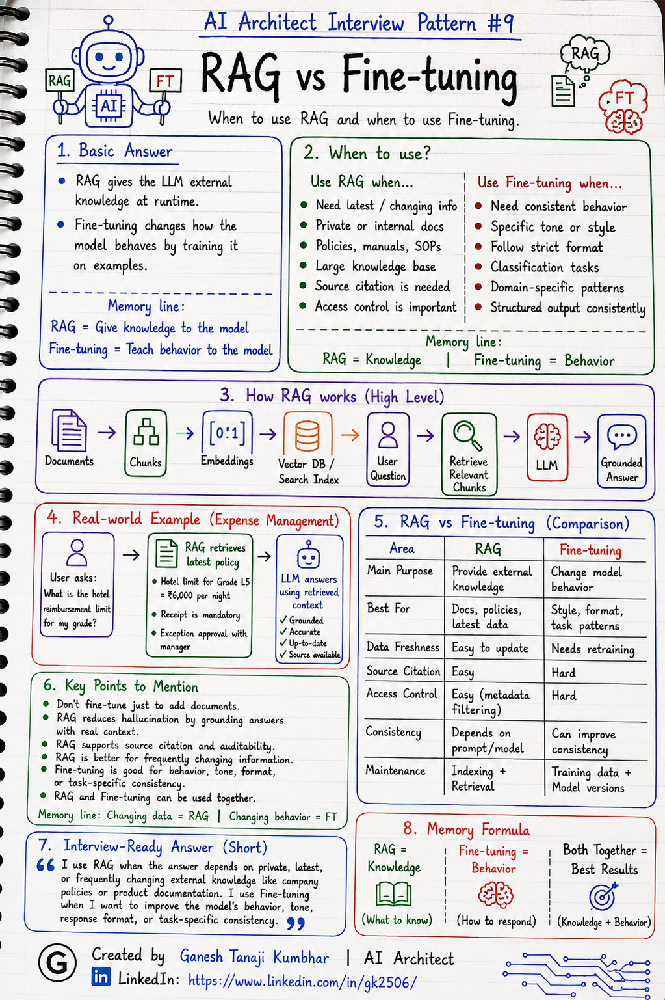

# AI Architect Interview Pattern #9

# RAG vs Fine-tuning



---

## Question

In an interview, you may be asked:

> What is the difference between RAG and fine-tuning?

Or:

> When would you use RAG and when would you use fine-tuning?

Or:

> If I have company documents, should I use RAG or fine-tuning?

Or:

> Does fine-tuning replace RAG?

---

## Why interviewer asks this

The interviewer is checking whether you understand a very common GenAI architecture decision.

Many candidates think:

> If we have private company data, we should fine-tune the model.

That is usually not the best first answer.

A senior or architect-level answer should explain:

> Use RAG when the answer depends on external, private, latest, or frequently changing knowledge. Use fine-tuning when you want to change the model’s behavior, style, format, task pattern, or domain response behavior.

This question tests your understanding of:

* RAG
* Fine-tuning
* Model behavior
* External knowledge
* Data freshness
* Cost
* Latency
* Maintenance
* Hallucination reduction
* Enterprise document Q&A
* Production GenAI architecture

---

## Basic answer

**RAG** and **fine-tuning** solve different problems.

Simple answer:

> RAG gives the LLM external knowledge at runtime. Fine-tuning changes how the model behaves by training it on examples.

In simple words:

```text
RAG = Give knowledge to the model
Fine-tuning = Teach behavior to the model
```

Example:

If the user asks:

> What is the hotel reimbursement limit for Grade L5?

Use **RAG** because the answer depends on the latest company policy.

If the requirement is:

> Always respond in our company’s support tone and follow our standard response format.

Fine-tuning may help because the requirement is about response behavior and style.

---

## Architect-level answer

RAG and fine-tuning are not replacements for each other.

They are used for different purposes.

I would use **RAG** when the system needs to answer using:

* Private company documents
* Latest policies
* Frequently changing information
* Tenant-specific data
* Large knowledge bases
* Source-grounded answers

I would consider **fine-tuning** when the goal is to improve:

* Response style
* Output format
* Domain-specific language
* Classification behavior
* Task-specific patterns
* Consistency of responses
* Repeated structured outputs

A strong architect-level answer would be:

> RAG is used when the model needs access to external knowledge at runtime, especially private, latest, or frequently changing data. Fine-tuning is used when we want to change or improve the model’s behavior, style, format, or task-specific response pattern. For enterprise document Q&A, I would usually start with RAG, not fine-tuning, because policies and documents change and need source-grounded answers.

---

## Must mention in interview

When answering this question, try to mention these points:

---

### 1. RAG is for knowledge

RAG is useful when the model needs information that is not already available in its trained knowledge.

Examples:

* Company policies
* Product manuals
* HR documents
* Legal documents
* Expense policies
* Customer-specific documentation
* Tenant-specific knowledge
* Latest internal updates

Example:

```text
User asks: What is the hotel reimbursement limit for my grade?
```

The answer should come from the latest policy document.

So RAG is the better choice.

---

### 2. Fine-tuning is for behavior

Fine-tuning is useful when the base model already has general knowledge, but we want it to behave differently.

Examples:

* Follow a specific response format
* Use company-specific tone
* Improve classification accuracy
* Generate responses in a standard template
* Follow repeated domain-specific patterns
* Understand task-specific labels
* Produce structured JSON more consistently

Example:

```text
Always generate customer support replies in our approved tone and format.
```

Fine-tuning may help here.

---

### 3. Do not fine-tune just to add documents

This is a very important interview point.

If your requirement is:

> I want the model to answer from my company documents.

Then fine-tuning is usually not the first choice.

Use RAG.

Why?

Because documents may change.

If you fine-tune on documents:

* Updates are difficult
* Source citation is harder
* Access control is harder
* Tenant isolation is harder
* The model may still hallucinate
* You may need to retrain again and again

RAG is better for document-grounded answers.

---

### 4. RAG supports freshness better

RAG can retrieve the latest indexed document.

Example:

```text
Policy updated today
        ↓
Document is re-indexed
        ↓
RAG retrieves latest policy
        ↓
LLM answers using updated context
```

Fine-tuning does not automatically know new information unless the model is trained again.

So for frequently changing knowledge, RAG is usually better.

---

### 5. RAG supports source citation better

In enterprise systems, users may ask:

> Where did this answer come from?

RAG can show:

* Document name
* Section
* Page number
* Policy reference
* Source link

Fine-tuning does not naturally provide source citation because knowledge is baked into model weights.

So for auditable answers, RAG is usually better.

---

### 6. Fine-tuning can improve consistency

Fine-tuning may be useful when the model repeatedly needs to follow a specific pattern.

Examples:

* Classify tickets into fixed categories
* Generate standard email responses
* Produce domain-specific summaries
* Follow a strict JSON output format
* Use a specific tone or language style

Fine-tuning can make outputs more consistent for repeated tasks.

---

### 7. They can be used together

RAG and fine-tuning are not always either/or.

Sometimes both are useful.

Example:

* Use RAG to retrieve latest company policy
* Use fine-tuned model behavior to answer in approved company format

Combined approach:

```text
RAG = latest knowledge
Fine-tuning = better behavior
```

But start simple.

Do not use fine-tuning unless there is a clear reason.

---

### 8. Mention cost and maintenance

RAG has its own cost:

* Embedding cost
* Indexing cost
* Vector database cost
* Retrieval latency
* Evaluation complexity

Fine-tuning also has cost:

* Training data preparation
* Training cost
* Model hosting cost
* Version management
* Evaluation cost
* Retraining when behavior changes

A good architect compares tradeoffs instead of choosing blindly.

---

## Real-world example

### Example: Expense Management AI Agent

User asks:

> What is the hotel reimbursement limit for my grade?

This should use **RAG**.

Why?

Because the answer depends on:

* Latest company policy
* Employee grade
* Location
* Tenant-specific rules
* Current policy version

Example retrieved context:

```text
Hotel reimbursement limit for Grade L5 employees is ₹6,000 per night.
Receipt is mandatory.
Exception approval is allowed with manager approval.
```

The LLM can then answer using the retrieved policy.

---

### When fine-tuning may help in the same system

Fine-tuning may help if the business wants all assistant responses to follow a standard format.

Example format:

```text
Reason:
Next Step:
Policy Reference:
Action Required:
```

Or:

```text
Always explain expense rejection in a polite, short, employee-friendly tone.
```

Here, fine-tuning is not used to store the policy.

It is used to improve the response behavior.

---

## RAG vs Fine-tuning comparison

| Area                 | RAG                              | Fine-tuning                      |
| -------------------- | -------------------------------- | -------------------------------- |
| Main purpose         | Provide external knowledge       | Change model behavior            |
| Best for             | Documents, policies, latest data | Style, format, task pattern      |
| Data freshness       | Easier to update                 | Requires retraining              |
| Source citation      | Easier                           | Harder                           |
| Access control       | Easier with metadata filtering   | Harder                           |
| Private knowledge    | Good fit                         | Not usually first choice         |
| Response consistency | Depends on prompt/model          | Can improve consistency          |
| Maintenance          | Indexing and retrieval pipeline  | Training data and model versions |
| Example              | Answer from policy document      | Follow company response format   |

---

## Common mistake

Many candidates say:

> We will fine-tune the model on company documents.

This is usually not the best first answer.

Better answer:

> If the requirement is to answer from company documents, I would start with RAG because it supports freshness, source citation, access control, and document updates better.

Another common mistake:

> RAG and fine-tuning are alternatives for the same problem.

Better answer:

> RAG and fine-tuning solve different problems. RAG provides knowledge. Fine-tuning improves behavior.

---

## Better interview answer

A strong answer can be:

> I would use RAG when the answer depends on private, latest, or frequently changing external knowledge such as company policies or product documentation. I would use fine-tuning when I want to improve the model’s behavior, response format, tone, or task-specific consistency. For enterprise document Q&A, I would usually start with RAG because it supports freshness, access control, and source-grounded answers. Fine-tuning may be added later if we need more consistent response style or task behavior.

---

## One-line answer

> RAG gives the model external knowledge at runtime, while fine-tuning changes how the model behaves.

---

## Memory formula

Use this formula:

```text
RAG = Knowledge
Fine-tuning = Behavior
```

Another version:

```text
RAG = What to know
Fine-tuning = How to respond
```

Or:

```text
Changing data = RAG
Changing behavior = Fine-tuning
```

---

## Interview closing line

You can close your answer like this:

> For enterprise GenAI systems, I would not fine-tune just to add company documents. I would start with RAG for knowledge grounding and consider fine-tuning only when there is a clear need to improve behavior, tone, structure, or task-specific consistency.

---

## Related upcoming topics

* Chunking strategy
* Embeddings and Vector DB
* Metadata filtering
* Top-K retrieval issues
* Lost-in-the-middle problem
* Multi-tenant RAG
* RAG evaluation
* Hallucination reduction
* RAG security and access control
* Production RAG architecture

---

## Reference Scenario

This topic can be understood using the common **Expense Management AI Agent** scenario used across this series.

You can refer to the scenario here:

```text
00-common-examples/expense-management-ai-agent-scenario.md
```

---

## About the Author

These notes are created and maintained by **Ganesh Tanaji Kumbhar**, an **AI Architect** with experience in **.NET, Azure, cloud architecture, infrastructure, enterprise application modernization, and GenAI solution design**.

I bring practical experience across:

* **.NET / C# / ASP.NET / Web API**
* **Azure App Services, Azure Functions, WebJobs, Azure SQL, Storage, Redis**
* **Cloud architecture and infrastructure modernization**
* **Application architecture and enterprise system design**
* **CI/CD, DevOps, monitoring, and production support**
* **GenAI, RAG, Agentic AI, and AI architecture patterns**

These notes are based on my real experience as both:

* An **interviewee**, facing AI, architecture, cloud, .NET, Azure, and system design rounds
* An **interviewer**, evaluating how candidates explain concepts, tradeoffs, project experience, and real-world design decisions

I write about:

* GenAI Architecture
* RAG System Design
* Agentic AI
* AI Architect Interview Preparation
* .NET and Azure Architecture
* Cloud and Enterprise AI Patterns

If you are preparing for **GenAI / AI Architect / Staff Engineer / Solution Architect / .NET Architect / Azure Architect** interviews, feel free to connect with me on LinkedIn.

🔗 **LinkedIn:** [Connect with me on LinkedIn](https://www.linkedin.com/in/gk2506/)

💬 You can also DM me on LinkedIn if you want to discuss AI architecture, interview preparation, .NET/Azure architecture, or practical GenAI learning.
