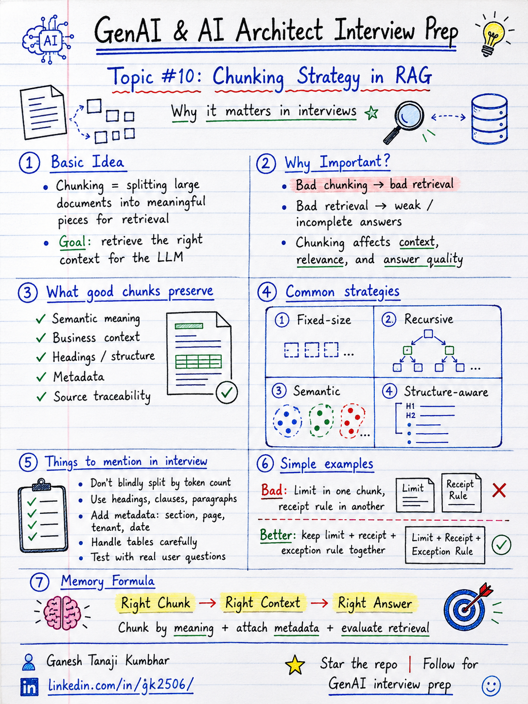

# GenAI & AI Architect Interview Prep

# Topic #10: Chunking Strategy in RAG



---

## Question

In an interview, you may be asked:

> What is chunking in RAG?

Or:

> Why is chunking important in RAG?

Or:

> How would you decide chunk size for a RAG system?

Or:

> What happens if chunking is done incorrectly?

---

## Why interviewer asks this

The interviewer is checking whether you understand that RAG quality does not start at the LLM.

It starts much earlier.

Many candidates say:

> We split documents into chunks, create embeddings, and store them in a vector database.

That is technically correct, but not enough.

A senior or architect-level answer should explain:

> Chunking is not just splitting text by size. Good chunks should preserve meaning, business context, document structure, metadata, and retrieval quality.

This question tests your understanding of:

* Document preprocessing
* Semantic boundaries
* Chunk size
* Chunk overlap
* Retrieval quality
* Context preservation
* Metadata
* Source traceability
* Token limits
* Hallucination risk
* Production RAG design

---

## Basic answer

Chunking is the process of splitting large documents into smaller meaningful parts before storing them for retrieval.

Simple answer:

> Chunking means breaking large documents into smaller pieces so the retriever can find the most relevant content for a user question.

In simple words:

```text
Large document
   ↓
Smaller meaningful chunks
   ↓
Embeddings
   ↓
Search index / vector database
   ↓
Relevant chunks retrieved for user query
```

Example:

A 30-page expense policy document may be split into smaller sections such as:

* Hotel reimbursement rules
* Travel reimbursement rules
* Food allowance rules
* Receipt requirements
* Exception approval rules

This helps the system retrieve only the relevant section instead of sending the full document to the LLM.

---

## Architect-level answer

Chunking is one of the most important design decisions in a RAG system.

If chunks are too small, they may lose meaning.

If chunks are too large, they may include too much irrelevant information.

If chunks are split at the wrong boundary, the retriever may miss the correct answer or return incomplete context.

A strong architect-level answer would be:

> Chunking in RAG is the process of splitting documents into meaningful, retrievable units while preserving semantic context, business meaning, document structure, and metadata. I would not blindly split by fixed token size. I would consider section boundaries, headings, paragraphs, tables, policy clauses, overlap, metadata, and retrieval evaluation. Poor chunking leads to poor retrieval, and poor retrieval leads to weak or hallucinated answers.

---

## Must mention in interview

When answering this question, try to mention these points:

---

### 1. Chunking is not just text splitting

Many candidates think chunking means:

```text
Split every 500 tokens
```

But real chunking is more thoughtful.

Good chunking should consider:

* Document structure
* Headings and subheadings
* Paragraph boundaries
* Business meaning
* Tables
* Lists
* Policy clauses
* FAQ sections
* Page numbers
* Metadata
* Source traceability

A fixed-size split may be useful as a starting point, but it is not always enough.

---

### 2. Bad chunking leads to bad retrieval

This is the most important point.

RAG depends on retrieval.

Retrieval depends on chunks.

If chunks are bad, retrieval will be bad.

Simple formula:

```text
Bad Chunking = Bad Retrieval
Bad Retrieval = Bad Answer
```

Example:

If the policy says:

```text
Hotel reimbursement limit for Grade L5 employees is ₹6,000 per night.
Receipt is mandatory.
Exception approval is allowed with manager approval.
```

But the chunk is split like this:

```text
Chunk 1:
Hotel reimbursement limit for Grade L5 employees is ₹6,000 per night.

Chunk 2:
Receipt is mandatory. Exception approval is allowed with manager approval.
```

The system may retrieve only one chunk and miss the full context.

The answer may become incomplete.

---

### 3. Preserve semantic meaning

A good chunk should represent one meaningful unit of information.

Examples of meaningful chunks:

* One policy clause
* One FAQ answer
* One procedure step
* One product feature explanation
* One troubleshooting section
* One legal section
* One table with its explanation

Avoid splitting in the middle of important meaning.

Bad example:

```text
Employees can claim hotel reimbursement up to...
```

The limit may be in the next chunk, so the retrieved chunk becomes incomplete.

---

### 4. Use headings and document structure

Headings provide important context.

Example:

```text
Travel Policy
  → Hotel Reimbursement
  → Grade-wise Limits
```

If the chunk only contains:

```text
L5 employees are allowed ₹6,000 per night.
```

The LLM may not know whether this is hotel, food, cab, or travel allowance.

Better chunk:

```text
Travel Policy > Hotel Reimbursement > Grade-wise Limits

L5 employees are allowed hotel reimbursement up to ₹6,000 per night.
Receipt is mandatory.
```

This preserves context.

---

### 5. Add metadata to chunks

Chunks should carry metadata.

Useful metadata may include:

* Document name
* Document type
* Section title
* Page number
* Policy category
* Department
* Tenant ID
* Region
* Effective date
* Access level
* Version
* Source URL

Example metadata:

```json
{
  "documentName": "Expense Policy 2026",
  "section": "Hotel Reimbursement",
  "category": "Travel",
  "employeeGrade": "L5",
  "tenantId": "tenant-101",
  "effectiveDate": "2026-01-01",
  "pageNumber": 12
}
```

Metadata improves:

* Filtering
* Tenant isolation
* Access control
* Source citation
* Debugging
* Evaluation

---

### 6. Chunk size depends on use case

There is no universal perfect chunk size.

Chunk size depends on:

* Document type
* Domain
* Query type
* Model context window
* Retrieval strategy
* Need for citations
* Cost and latency
* Whether answers require short facts or long reasoning

Example:

For FAQ documents:

```text
One question-answer pair can be one chunk.
```

For policy documents:

```text
One policy clause or section can be one chunk.
```

For legal documents:

```text
Chunking should preserve clauses and cross-references.
```

For code documentation:

```text
One method, class, or conceptual section may be one chunk.
```

---

### 7. Use overlap carefully

Overlap means some text is repeated between neighboring chunks.

Example:

```text
Chunk 1: Lines 1 to 100
Chunk 2: Lines 80 to 180
```

Overlap can help preserve context when information spans boundaries.

But too much overlap can create problems:

* More storage
* More embedding cost
* Duplicate retrieval results
* More token usage
* More noise in context

So overlap should be used carefully, not blindly.

---

### 8. Handle tables separately

Tables are often difficult in RAG.

Example:

| Grade | Hotel Limit | Receipt Required |
| ----- | ----------: | ---------------- |
| L4    |      ₹5,000 | Yes              |
| L5    |      ₹6,000 | Yes              |
| L6    |      ₹8,000 | Yes              |

If the table is converted poorly into plain text, retrieval may fail.

Better approach:

* Preserve table structure
* Convert rows into meaningful text
* Add metadata
* Store table with context
* Consider structured search for tabular questions

Example chunk:

```text
Hotel reimbursement limits:
For Grade L5 employees, the hotel limit is ₹6,000 per night and receipt is required.
```

---

### 9. Evaluate chunking with real questions

Do not finalize chunking strategy without testing.

Use real or expected user questions.

Example questions:

* What is the hotel limit for L5?
* Is receipt required for hotel expenses?
* Can I claim hotel expense above the limit?
* Who approves hotel exception claims?
* What is the food allowance for Mumbai travel?

Then check:

* Did retrieval return the correct chunk?
* Was the answer complete?
* Was the source correct?
* Was irrelevant content retrieved?
* Did chunks include enough context?
* Was metadata filtering working?

This is how chunking quality should be validated.

---

## Real-world example

### Example: Expense Management AI Agent

User asks:

> What is the hotel reimbursement limit for my grade?

The answer may exist inside a large policy document.

### Bad chunking example

```text
Chunk 1:
Employees can claim hotel expenses based on their grade.

Chunk 2:
L5 employees are allowed ₹6,000 per night.

Chunk 3:
Receipt is mandatory for all hotel claims.
```

Problem:

The retriever may return only Chunk 2.

The answer may miss receipt requirement.

---

### Better chunking example

```text
Section: Travel Policy > Hotel Reimbursement > Grade-wise Limits

L5 employees are allowed hotel reimbursement up to ₹6,000 per night.
Receipt is mandatory for all hotel claims.
Expenses above the limit require manager exception approval.
```

This chunk is better because it contains:

* Section context
* Grade
* Limit
* Receipt requirement
* Exception rule

The LLM can now produce a more complete answer.

---

## Chunking flow in simple terms

```text
Document
   ↓
Extract text
   ↓
Identify structure
   ↓
Split into meaningful chunks
   ↓
Add metadata
   ↓
Create embeddings
   ↓
Store in search index
   ↓
Evaluate retrieval quality
```

---

## Common chunking strategies

### 1. Fixed-size chunking

Split text by fixed number of tokens or characters.

Example:

```text
Every 500 tokens
```

Pros:

* Simple
* Easy to implement
* Good starting point

Cons:

* May break meaning
* May split important context
* May ignore headings and structure

---

### 2. Recursive chunking

Split by larger boundaries first, then smaller ones.

Example order:

```text
Section
→ Paragraph
→ Sentence
→ Token limit
```

Pros:

* Better than fixed split
* Preserves more structure
* Common in RAG systems

Cons:

* Still needs tuning
* May not handle tables well

---

### 3. Semantic chunking

Split based on meaning.

The goal is to keep related ideas together.

Pros:

* Better context preservation
* Useful for policy, legal, and knowledge documents

Cons:

* More complex
* May require model-based or embedding-based processing
* Needs evaluation

---

### 4. Structure-aware chunking

Use document structure such as:

* Headings
* Sections
* Page numbers
* Tables
* Lists
* FAQ pairs
* Clauses

Pros:

* Very useful in enterprise documents
* Better traceability
* Better citations

Cons:

* Depends on document quality
* Extraction can be harder

---

## Common mistake

Many candidates say:

> We will split documents into 500-token chunks and store them in vector DB.

This is too basic.

Better answer:

> I would start with a chunk size based on document type, but I would not rely only on fixed-size splitting. I would preserve headings, semantic boundaries, tables, metadata, and test retrieval quality using real user questions.

Another common mistake:

> Bigger chunks are always better because they provide more context.

Not always.

Large chunks may include irrelevant information and increase token cost.

Small chunks may lose context.

Good chunking balances:

* Meaning
* Retrieval precision
* Context completeness
* Token cost
* Latency

---

## Better interview answer

A strong answer can be:

> Chunking is the process of splitting documents into meaningful retrievable units for RAG. I would avoid blindly splitting by fixed size. I would design chunks based on document structure, headings, semantic meaning, policy clauses, tables, and expected user questions. I would add metadata such as document name, section, page number, tenant, category, and effective date. Then I would evaluate retrieval using real questions because bad chunking leads to bad retrieval, and bad retrieval leads to poor answers.

---

## One-line answer

> Chunking means splitting documents into meaningful retrievable pieces so the RAG system can find the right context for the LLM.

---

## Memory formula

Use this formula:

```text
Bad Chunking = Bad Retrieval
Bad Retrieval = Bad Answer
```

Another version:

```text
Chunk by Meaning
Attach Metadata
Evaluate Retrieval
```

Or:

```text
Right Chunk
Right Context
Right Answer
```

---

## Interview closing line

You can close your answer like this:

> In production RAG, I would treat chunking as a retrieval quality decision, not just a preprocessing step. I would preserve business meaning, add metadata, handle tables carefully, and validate the strategy using real user questions.

---

## Related upcoming topics

* Metadata Filtering and Tenant Isolation
* Vector DB is Not Enough
* What if the Correct Answer is Not in Top-K?
* Reducing Hallucination in RAG
* RAG evaluation
* Hybrid search
* Re-ranking
* Production RAG architecture

---

## Reference Scenario

This topic can be understood using the common **Expense Management AI Agent** scenario used across this series.

You can refer to the scenario here:

```text
00-common-examples/expense-management-ai-agent-scenario.md
```

---

## About the Author

These notes are created and maintained by **Ganesh Tanaji Kumbhar**, an **AI Architect** with experience in **.NET, Azure, cloud architecture, infrastructure, enterprise application modernization, and GenAI solution design**.

I bring practical experience across:

* **.NET / C# / ASP.NET / Web API**
* **Azure App Services, Azure Functions, WebJobs, Azure SQL, Storage, Redis**
* **Cloud architecture and infrastructure modernization**
* **Application architecture and enterprise system design**
* **CI/CD, DevOps, monitoring, and production support**
* **GenAI, RAG, Agentic AI, and AI architecture patterns**

These notes are based on my real experience as both:

* An **interviewee**, facing AI, architecture, cloud, .NET, Azure, and system design rounds
* An **interviewer**, evaluating how candidates explain concepts, tradeoffs, project experience, and real-world design decisions

I write about:

* GenAI Architecture
* RAG System Design
* Agentic AI
* AI Architect Interview Preparation
* .NET and Azure Architecture
* Cloud and Enterprise AI Patterns

If you are preparing for **GenAI / AI Architect / Staff Engineer / Solution Architect / .NET Architect / Azure Architect** interviews, feel free to connect with me on LinkedIn.

🔗 **LinkedIn:** [Connect with me on LinkedIn](https://www.linkedin.com/in/gk2506/)

💬 You can also DM me on LinkedIn if you want to discuss AI architecture, interview preparation, .NET/Azure architecture, or practical GenAI learning.
