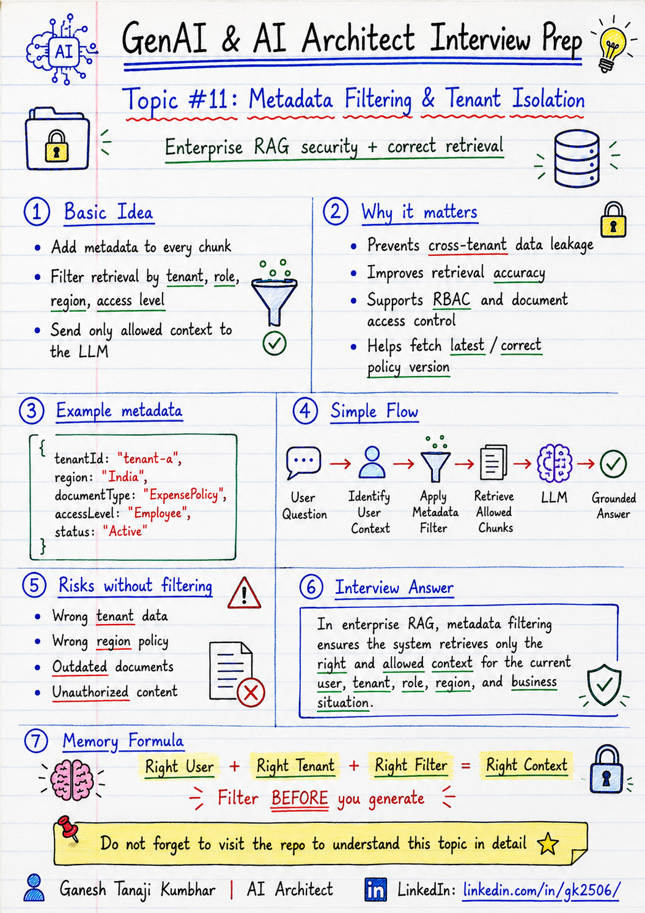

# GenAI & AI Architect Interview Prep

# Topic #11: Metadata Filtering and Tenant Isolation



---

## Question

In an interview, you may be asked:

> What is metadata filtering in RAG?

Or:

> Why is metadata filtering important in enterprise RAG?

Or:

> How do you ensure tenant isolation in a RAG system?

Or:

> How do you prevent one customer’s documents from being retrieved for another customer?

---

## Why interviewer asks this

The interviewer is checking whether you understand that enterprise RAG is not only about embeddings and vector search.

Many candidates explain RAG like this:

> We chunk documents, create embeddings, store them in a vector database, and retrieve top-k chunks.

That is a good starting point, but incomplete for enterprise systems.

In real enterprise RAG, retrieval must be:

* Secure
* Tenant-aware
* Permission-aware
* Metadata-driven
* Auditable
* Correct for the user context

A senior or architect-level answer should explain:

> Metadata filtering ensures that the RAG system retrieves only the documents that the current user, tenant, role, department, or region is allowed to access.

This question tests your understanding of:

* Metadata design
* Tenant isolation
* RBAC
* Document-level access control
* Search filters
* Retrieval safety
* Enterprise security
* Data leakage risk
* Prompt injection risk
* Audit logging
* Production RAG architecture

---

## Basic answer

Metadata filtering means adding extra information to each chunk and using that information to filter search results during retrieval.

Simple answer:

> Metadata filtering in RAG means filtering retrieved chunks based on fields like tenant ID, user role, department, region, document type, access level, or effective date so the LLM receives only the context the user is allowed to see.

Example metadata:

```json
{
  "tenantId": "tenant-101",
  "documentType": "ExpensePolicy",
  "department": "Finance",
  "region": "India",
  "accessLevel": "Employee",
  "effectiveDate": "2026-01-01"
}
```

Without metadata filtering, the vector search may retrieve semantically similar but unauthorized chunks.

That can cause wrong answers or data leakage.

---

## Architect-level answer

In enterprise RAG, metadata filtering is a core security and retrieval-quality mechanism.

Embeddings help find semantically similar content, but embeddings alone do not understand business boundaries such as:

* Which tenant owns the data
* Which user is allowed to see the document
* Which region policy applies
* Which document version is active
* Which department owns the content
* Whether the document is public, internal, confidential, or restricted

So each chunk should store metadata along with the text and embedding.

During retrieval, the system should apply filters based on the logged-in user context.

A strong architect-level answer would be:

> In enterprise RAG, I would not rely only on vector similarity. I would attach metadata such as tenant ID, document type, department, region, access level, effective date, version, and owner to every chunk. At query time, I would apply metadata filters based on the authenticated user’s tenant, role, permissions, and business context before sending retrieved chunks to the LLM. This protects tenant isolation, improves retrieval correctness, and reduces data leakage risk.

---

## Must mention in interview

When answering this question, try to mention these points:

---

### 1. Metadata filtering is not optional in enterprise RAG

In simple demos, we may upload a few documents and search across all chunks.

But in enterprise systems, this is risky.

Different users may belong to different:

* Tenants
* Departments
* Regions
* Roles
* Projects
* Business units
* Access groups

The RAG system should not retrieve everything just because it is semantically similar.

Example:

```text
User from Tenant A asks about expense policy.
System must not retrieve Tenant B's expense policy.
```

This is why metadata filtering is important.

---

### 2. Tenant isolation is the first mandatory filter

In multi-tenant systems, tenant ID is usually the most important metadata field.

Every document and chunk should carry tenant information.

Example:

```json
{
  "tenantId": "tenant-a",
  "chunkText": "Hotel reimbursement limit for Grade L5 is ₹6,000."
}
```

At query time:

```text
Only retrieve chunks where tenantId = currentUser.tenantId
```

This prevents cross-tenant data leakage.

A strong interview line:

> Tenant isolation should be enforced at retrieval level, not only at prompt level.

---

### 3. Do not rely only on prompt instructions

A weak design would say:

```text
Prompt: Only answer using documents from the current user's tenant.
```

This is not enough.

The LLM should never receive unauthorized context in the first place.

Better design:

```text
Apply tenant and permission filters before context is passed to the LLM.
```

Important rule:

```text
Do not send unauthorized data to the model and expect the prompt to protect it.
```

---

### 4. Metadata improves retrieval correctness

Metadata filtering is not only for security.

It also improves answer quality.

Example:

A company may have different policies for different regions:

```text
India Expense Policy
US Expense Policy
UK Expense Policy
```

User asks:

```text
What is the hotel reimbursement limit?
```

Without metadata filtering, the system may retrieve the wrong region policy.

With metadata filtering:

```text
region = India
documentType = ExpensePolicy
category = Hotel
effectiveDate <= today
```

The retriever is more likely to return the correct context.

---

### 5. Metadata should be attached at chunk level

Metadata should not only exist at document level.

After chunking, each chunk should carry the required metadata.

Example chunk metadata:

```json
{
  "chunkId": "chunk-001",
  "documentId": "doc-123",
  "documentName": "Expense Policy 2026",
  "tenantId": "tenant-101",
  "region": "India",
  "department": "Finance",
  "category": "Hotel",
  "accessLevel": "Employee",
  "effectiveDate": "2026-01-01",
  "version": "v3",
  "pageNumber": 12,
  "sourceUrl": "https://company/policies/expense-policy-2026"
}
```

This helps with:

* Filtering
* Citations
* Debugging
* Auditing
* Evaluation
* Version control

---

### 6. RBAC should be part of retrieval

The logged-in user may have a role such as:

* Employee
* Manager
* Finance user
* HR admin
* Support agent
* System admin

Each role may have different document access.

Example:

An employee may access:

```text
General expense policy
Own expense status
Public HR policy
```

A finance user may access:

```text
Finance approval rules
Exception approval reports
Audit documents
```

The retriever should consider user permissions while fetching chunks.

Simple formula:

```text
User Identity + Role + Tenant + Metadata Filter = Safe Retrieval
```

---

### 7. Pre-filtering vs post-filtering

This is a good architect-level point.

### Pre-filtering

Apply metadata filters before or during vector search.

Example:

```text
Search only inside tenantId = tenant-101 and region = India
```

This is safer and more efficient.

### Post-filtering

Search first, then remove unauthorized results.

This may be risky or inefficient if not designed carefully.

In interviews, say:

> I would prefer applying tenant and permission filters at retrieval time, before the chunks are sent to the LLM.

---

### 8. Metadata helps with latest version retrieval

Enterprise documents change over time.

Example:

```text
Expense Policy 2024
Expense Policy 2025
Expense Policy 2026
```

If the user asks a policy question today, the system should retrieve the latest effective policy.

Useful metadata:

* effectiveDate
* expiryDate
* version
* isActive
* documentStatus

Example filter:

```text
documentStatus = Active
effectiveDate <= today
tenantId = currentTenant
region = currentRegion
```

This prevents old or outdated policy from being used.

---

### 9. Audit what was retrieved

For enterprise systems, it is important to know:

* Which query was asked
* Which metadata filters were applied
* Which chunks were retrieved
* Which chunks were passed to the LLM
* Which answer was generated
* Which user made the request
* Which tenant the user belonged to

This helps with:

* Debugging
* Compliance
* Security review
* Incident investigation
* Retrieval evaluation

---

## Real-world example

### Example: Expense Management AI Agent

User asks:

> What is the hotel reimbursement limit for my grade?

The system has expense policies for multiple tenants and regions.

Example documents:

```text
Tenant A - India Expense Policy
Tenant A - US Expense Policy
Tenant B - India Expense Policy
Tenant B - UK Expense Policy
```

The current user belongs to:

```json
{
  "userId": "emp-501",
  "tenantId": "tenant-a",
  "region": "India",
  "role": "Employee",
  "grade": "L5"
}
```

The RAG system should apply filters like:

```json
{
  "tenantId": "tenant-a",
  "region": "India",
  "documentType": "ExpensePolicy",
  "accessLevel": "Employee",
  "status": "Active"
}
```

Only then should it retrieve chunks.

Correct retrieved chunk:

```text
Tenant A - India Expense Policy

For Grade L5 employees, the hotel reimbursement limit is ₹6,000 per night.
Receipt is mandatory.
Exception approval is allowed with manager approval.
```

The LLM can now answer safely:

```text
For your grade, the hotel reimbursement limit is ₹6,000 per night. A receipt is mandatory. If the amount exceeds the limit, manager exception approval may be required.
```

---

## What can go wrong without metadata filtering?

### 1. Cross-tenant data leakage

Tenant A user may get Tenant B policy.

```text
This is a serious security issue.
```

---

### 2. Wrong policy retrieval

A user in India may get US policy.

```text
This gives a wrong business answer.
```

---

### 3. Outdated document retrieval

The system may retrieve an old policy version.

```text
This can create compliance and business risk.
```

---

### 4. Unauthorized document exposure

An employee may receive finance-only or admin-only content.

```text
This breaks access control.
```

---

### 5. Poor answer quality

Even if there is no security issue, retrieval may return irrelevant chunks.

```text
Wrong context leads to wrong answer.
```

---

## Metadata filtering flow

```text
User asks question
        ↓
System identifies logged-in user
        ↓
Fetch user context
        ↓
Build metadata filter
        ↓
Run retrieval with filters
        ↓
Retrieve only allowed chunks
        ↓
Send allowed context to LLM
        ↓
Generate grounded answer
        ↓
Store audit trail
```

---

## Example filter fields

Common metadata fields:

```text
tenantId
userId
role
department
region
country
documentType
documentCategory
accessLevel
documentStatus
effectiveDate
expiryDate
version
owner
sourceSystem
pageNumber
sourceUrl
```

---

## Example pseudo query

```text
Search query:
"What is the hotel reimbursement limit for my grade?"

Metadata filters:
tenantId = "tenant-a"
region = "India"
documentType = "ExpensePolicy"
accessLevel <= "Employee"
documentStatus = "Active"
effectiveDate <= today
```

The vector search should run only within this filtered scope.

---

## Common mistake

Many candidates say:

> We will store documents in vector DB and search based on similarity.

This is incomplete.

Better answer:

> In enterprise RAG, I would store metadata with every chunk and apply tenant, role, department, region, document type, access level, and version filters during retrieval.

Another common mistake:

> We can just tell the LLM not to use unauthorized documents.

This is unsafe.

Better answer:

> Unauthorized chunks should never be retrieved or sent to the LLM. Security should be enforced before generation.

---

## Better interview answer

A strong answer can be:

> Metadata filtering is critical in enterprise RAG because vector similarity alone does not understand tenant, role, department, region, document version, or access permissions. I would attach metadata to every chunk and apply filters based on the logged-in user's tenant, role, permissions, region, and document access before retrieval results are passed to the LLM. This improves both security and retrieval accuracy. I would also audit the filters applied, chunks retrieved, and final answer for traceability.

---

## One-line answer

> Metadata filtering ensures the RAG system retrieves only the right and allowed context for the current user, tenant, role, and business situation.

---

## Memory formula

Use this formula:

```text
Right User
Right Tenant
Right Filter
Right Context
```

Another version:

```text
No Metadata = Risky Retrieval
Wrong Filter = Wrong Answer
No Tenant Filter = Data Leak
```

Or:

```text
Filter Before You Generate
```

---

## Interview closing line

You can close your answer like this:

> In production RAG, I would never rely only on vector similarity. I would enforce tenant isolation and access control through metadata filters before sending context to the LLM, because unauthorized context should never reach the model.

---

## Related upcoming topics

* Vector DB is Not Enough
* What if the Correct Answer is Not in Top-K?
* Reducing Hallucination in RAG
* RAG evaluation
* Hybrid search
* Re-ranking
* Production RAG architecture
* Multi-tenant GenAI Architecture
* RBAC in AI Agents

---

## Reference Scenario

This topic can be understood using the common **Expense Management AI Agent** scenario used across this series.

You can refer to the scenario here:

```text
00-common-examples/expense-management-ai-agent-scenario.md
```

---

## About the Author

These notes are created and maintained by **Ganesh Tanaji Kumbhar**, an **AI Architect** with experience in **.NET, Azure, cloud architecture, infrastructure, enterprise application modernization, and GenAI solution design**.

I bring practical experience across:

* **.NET / C# / ASP.NET / Web API**
* **Azure App Services, Azure Functions, WebJobs, Azure SQL, Storage, Redis**
* **Cloud architecture and infrastructure modernization**
* **Application architecture and enterprise system design**
* **CI/CD, DevOps, monitoring, and production support**
* **GenAI, RAG, Agentic AI, and AI architecture patterns**

These notes are based on my real experience as both:

* An **interviewee**, facing AI, architecture, cloud, .NET, Azure, and system design rounds
* An **interviewer**, evaluating how candidates explain concepts, tradeoffs, project experience, and real-world design decisions

I write about:

* GenAI Architecture
* RAG System Design
* Agentic AI
* AI Architect Interview Preparation
* .NET and Azure Architecture
* Cloud and Enterprise AI Patterns

If you are preparing for **GenAI / AI Architect / Staff Engineer / Solution Architect / .NET Architect / Azure Architect** interviews, feel free to connect with me on LinkedIn.

🔗 **LinkedIn:** [Connect with me on LinkedIn](https://www.linkedin.com/in/gk2506/)

💬 You can also DM me on LinkedIn if you want to discuss AI architecture, interview preparation, .NET/Azure architecture, or practical GenAI learning.
