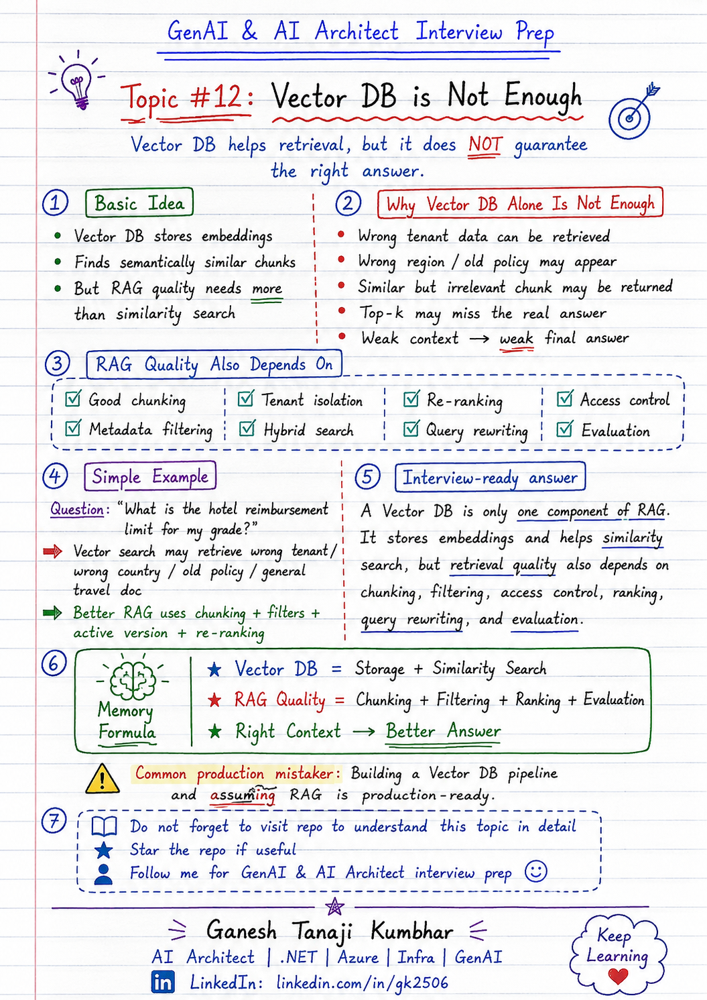

# GenAI & AI Architect Interview Prep

# Topic #12: Vector DB is Not Enough



---

## Question

In an interview, you may be asked:

> If we already have a Vector DB, why is our RAG system still giving poor answers?

Or:

> Is Vector DB enough to build a production-ready RAG system?

Or:

> What are the limitations of using only vector search in RAG?

Or:

> Why does retrieval fail even when embeddings and vector database are used?

---

## Why interviewer asks this

The interviewer is checking whether you understand that **Vector DB is only one component** of a RAG system.

Many candidates explain RAG like this:

> We create embeddings, store them in a vector database, retrieve top-k chunks, and send them to the LLM.

That is a good starting point, but not enough for production.

A senior or architect-level answer should explain:

> Vector DB helps with semantic similarity search, but good RAG quality also depends on chunking, metadata filtering, access control, ranking, query rewriting, evaluation, and monitoring.

This question tests your understanding of:

* Vector search limitations
* Chunking quality
* Metadata filtering
* Tenant isolation
* Hybrid search
* Re-ranking
* Query rewriting
* Retrieval evaluation
* Access control
* Production RAG architecture

---

## Basic answer

A Vector DB stores embeddings and helps find semantically similar chunks.

Simple answer:

> A Vector DB is useful for storing embeddings and retrieving similar content, but it does not guarantee that the retrieved content is correct, complete, secure, or relevant to the business context.

In simple words:

```text
Vector DB = Storage + Similarity Search
RAG Quality = Chunking + Filtering + Ranking + Evaluation
```

Example:

User asks:

> What is the hotel reimbursement limit for my grade?

A vector database may retrieve a semantically similar chunk, but it may still be from:

* Wrong tenant
* Wrong region
* Old policy
* Wrong document section
* Similar but irrelevant content

So Vector DB is important, but it is not the full RAG system.

---

## Architect-level answer

A Vector DB is only one part of the retrieval layer.

It helps store embeddings and perform similarity search, but production RAG requires more controls around retrieval quality, security, and correctness.

A strong architect-level answer would be:

> A Vector DB is not enough for production RAG because vector similarity alone does not understand tenant boundaries, access permissions, document versions, business rules, or whether the retrieved chunk fully answers the question. I would combine vector search with good chunking, metadata filtering, hybrid search, re-ranking, query rewriting, access control, evaluation, and observability to improve retrieval quality and reduce incorrect answers.

---

## Must mention in interview

When answering this question, try to mention these points:

---

### 1. Vector DB is not the same as RAG

A common mistake is assuming:

```text
Vector DB = RAG
```

This is not correct.

A Vector DB is only one storage and retrieval component.

A complete RAG system includes:

* Document ingestion
* Text extraction
* Chunking
* Metadata enrichment
* Embedding generation
* Vector storage
* Retrieval
* Filtering
* Ranking
* Context construction
* Prompting
* Answer generation
* Citation
* Evaluation
* Monitoring

So the better answer is:

```text
Vector DB is part of RAG, not the full RAG system.
```

---

### 2. Vector similarity does not guarantee correctness

Vector search finds semantically similar content.

But similar does not always mean correct.

Example:

User asks:

> What is the hotel reimbursement limit for my grade?

Vector search may retrieve:

* General travel policy
* Food allowance policy
* Old hotel policy
* Policy from another region
* Similar policy from another tenant

These chunks may look similar, but may not be the correct answer.

---

### 3. Chunking quality matters

If chunks are poorly created, vector search will retrieve poor context.

Bad chunking can cause:

* Missing context
* Incomplete answers
* Wrong section retrieval
* Duplicate chunks
* Broken meaning
* Poor source citation

Example:

```text
Chunk 1:
Hotel limit for Grade L5 is ₹6,000.

Chunk 2:
Receipt is mandatory and exception approval is allowed.
```

If only Chunk 1 is retrieved, the answer may miss receipt and exception details.

So good chunking is required before Vector DB can work well.

---

### 4. Metadata filtering is required

Vector DB may retrieve semantically similar content across all indexed documents.

But enterprise RAG needs filters such as:

* Tenant ID
* Region
* Role
* Department
* Document type
* Access level
* Active version
* Effective date

Example:

```text
tenantId = tenant-a
region = India
documentType = ExpensePolicy
status = Active
accessLevel = Employee
```

Without metadata filtering, the system may retrieve wrong or unauthorized content.

---

### 5. Access control is critical

A Vector DB does not automatically know what the logged-in user is allowed to see.

In enterprise systems, retrieval must respect user permissions.

Example:

An employee should not retrieve:

* Finance-only documents
* Admin-only policies
* Other employee records
* Another tenant’s documents

Important interview line:

> Unauthorized context should never be retrieved or sent to the LLM.

---

### 6. Top-K retrieval can miss the answer

Many RAG systems retrieve top-k chunks.

Example:

```text
topK = 5
```

But the correct chunk may be ranked lower, such as rank 8 or 12.

This can happen because of:

* Weak query
* Poor embeddings
* Similar irrelevant chunks
* Bad chunking
* Missing metadata filters
* Short user query
* Domain-specific terms

So relying only on top-k vector search is risky.

---

### 7. Hybrid search may be needed

Vector search is good for semantic similarity.

But keyword search is still useful for exact terms.

Example:

User asks:

```text
EXP-1024 reimbursement limit
```

Exact terms such as:

* EXP-1024
* Policy ID
* Employee grade
* Product code
* Error code
* Legal clause number

may work better with keyword or hybrid search.

Hybrid search combines:

```text
Vector search + Keyword search
```

This often improves retrieval quality.

---

### 8. Re-ranking can improve results

Initial retrieval may return many possible chunks.

A re-ranker can reorder results based on relevance to the user question.

Flow:

```text
Retrieve top 20 chunks
        ↓
Re-rank them
        ↓
Send best 3 to 5 chunks to LLM
```

This helps when vector search retrieves relevant but poorly ordered results.

---

### 9. Query rewriting may be needed

User questions are often short or unclear.

Example:

```text
Can I claim this?
```

The system may need to rewrite the query using context:

```text
Can the employee claim hotel reimbursement above the Grade L5 limit if receipt is missing?
```

Better query leads to better retrieval.

Query rewriting can help with:

* Ambiguous user questions
* Follow-up questions
* Missing context
* Domain-specific terms
* Short queries

---

### 10. Evaluation is required

A RAG system should be tested using real user questions.

Check:

* Did retrieval return the right chunk?
* Was the correct answer in top-k?
* Were unauthorized chunks filtered out?
* Was the final answer grounded?
* Were citations correct?
* Was latency acceptable?
* Was token cost acceptable?

Without evaluation, we cannot know whether the Vector DB pipeline is actually working.

---

## Real-world example

### Example: Expense Management AI Agent

User asks:

> What is the hotel reimbursement limit for my grade?

The system contains many documents:

```text
Tenant A - India Expense Policy
Tenant A - US Expense Policy
Tenant B - India Expense Policy
Tenant B - UK Expense Policy
Old Expense Policy 2024
Current Expense Policy 2026
Travel Policy
Food Policy
Cab Policy
```

If we use only vector search, the retriever may return:

```text
Old hotel policy
Wrong region policy
General travel policy
Food allowance section
Tenant B policy
```

Even though these chunks are semantically similar, they are not necessarily correct.

A better production RAG system should apply:

```text
tenantId = currentUser.tenantId
region = currentUser.region
documentType = ExpensePolicy
status = Active
accessLevel = Employee
```

Then use good chunking, ranking, and evaluation.

Correct retrieved chunk:

```text
Tenant A - India Expense Policy

For Grade L5 employees, the hotel reimbursement limit is ₹6,000 per night.
Receipt is mandatory.
Exception approval is allowed with manager approval.
```

Now the LLM can answer correctly.

---

## What can go wrong if we rely only on Vector DB?

### 1. Wrong tenant data

The system may retrieve another customer’s document.

```text
This is a security risk.
```

---

### 2. Wrong region policy

The system may retrieve US policy for an India user.

```text
This creates wrong business answers.
```

---

### 3. Old document version

The system may retrieve expired or inactive policy.

```text
This creates compliance risk.
```

---

### 4. Similar but irrelevant chunk

The retrieved chunk may be semantically similar but not useful.

```text
This creates weak answers.
```

---

### 5. Incomplete context

The chunk may contain only part of the answer.

```text
This creates incomplete responses.
```

---

### 6. Correct answer not in top-k

The right chunk may exist in the index but may not be retrieved.

```text
This creates false confidence.
```

---

## Better RAG retrieval flow

```text
User question
        ↓
Understand user context
        ↓
Rewrite query if needed
        ↓
Apply metadata filters
        ↓
Run hybrid search
        ↓
Retrieve candidate chunks
        ↓
Re-rank results
        ↓
Build final context
        ↓
Send context to LLM
        ↓
Generate grounded answer
        ↓
Evaluate and log result
```

---

## Common mistake

Many candidates say:

> We will use a Vector DB, so retrieval will work.

This is too basic.

Better answer:

> I would use a Vector DB for embedding storage and semantic search, but I would also design chunking, metadata filtering, access control, hybrid search, re-ranking, query rewriting, and evaluation because Vector DB alone does not guarantee correct retrieval.

Another common mistake:

> If the answer exists in the Vector DB, the system will find it.

Not always.

The answer may exist, but the system may still miss it because of poor chunking, weak query, bad ranking, missing metadata, or low top-k value.

---

## Better interview answer

A strong answer can be:

> A Vector DB is only one component of a RAG system. It stores embeddings and supports semantic similarity search, but production RAG needs more than that. Retrieval quality depends on chunking, metadata filtering, access control, hybrid search, re-ranking, query rewriting, and evaluation. Without these, the system may retrieve wrong tenant data, outdated policy, irrelevant chunks, or incomplete context. So I would not treat Vector DB as the full RAG solution.

---

## One-line answer

> Vector DB helps retrieve similar chunks, but production RAG needs filtering, ranking, access control, and evaluation to retrieve the right context.

---

## Memory formula

Use this formula:

```text
Vector DB = Storage + Similarity Search
```

But RAG quality needs:

```text
RAG Quality = Chunking + Filtering + Ranking + Evaluation
```

Another version:

```text
Right Context = Better Answer
```

Or:

```text
Vector DB helps retrieval, but it does not guarantee the right answer.
```

---

## Interview closing line

You can close your answer like this:

> In production RAG, I would never assume that adding a Vector DB makes the system production-ready. I would treat Vector DB as one component and focus equally on chunking, metadata filtering, access control, ranking, query rewriting, evaluation, and observability.

---

## Related upcoming topics

* What if the Correct Answer is Not in Top-K?
* Reducing Hallucination in RAG
* RAG evaluation
* Hybrid search
* Re-ranking
* Query rewriting
* Production RAG architecture
* Multi-tenant GenAI Architecture
* RBAC in AI Agents

---

## Reference Scenario

This topic can be understood using the common **Expense Management AI Agent** scenario used across this series.

You can refer to the scenario here:

```text
00-common-examples/expense-management-ai-agent-scenario.md
```

---

## About the Author

These notes are created and maintained by **Ganesh Tanaji Kumbhar**, an **AI Architect** with experience in **.NET, Azure, cloud architecture, infrastructure, enterprise application modernization, and GenAI solution design**.

I bring practical experience across:

* **.NET / C# / ASP.NET / Web API**
* **Azure App Services, Azure Functions, WebJobs, Azure SQL, Storage, Redis**
* **Cloud architecture and infrastructure modernization**
* **Application architecture and enterprise system design**
* **CI/CD, DevOps, monitoring, and production support**
* **GenAI, RAG, Agentic AI, and AI architecture patterns**

These notes are based on my real experience as both:

* An **interviewee**, facing AI, architecture, cloud, .NET, Azure, and system design rounds
* An **interviewer**, evaluating how candidates explain concepts, tradeoffs, project experience, and real-world design decisions

I write about:

* GenAI Architecture
* RAG System Design
* Agentic AI
* AI Architect Interview Preparation
* .NET and Azure Architecture
* Cloud and Enterprise AI Patterns

If you are preparing for **GenAI / AI Architect / Staff Engineer / Solution Architect / .NET Architect / Azure Architect** interviews, feel free to connect with me on LinkedIn.

🔗 **LinkedIn:** [Connect with me on LinkedIn](https://www.linkedin.com/in/gk2506/)

💬 You can also DM me on LinkedIn if you want to discuss AI architecture, interview preparation, .NET/Azure architecture, or practical GenAI learning.
