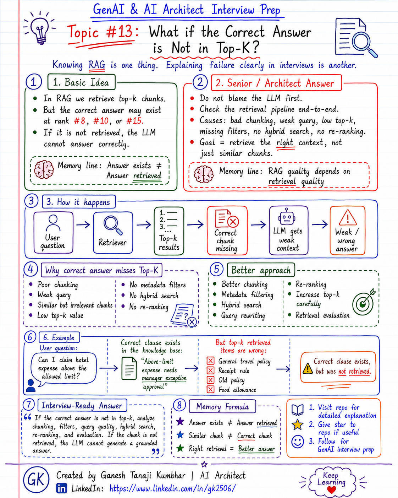

# GenAI & AI Architect Interview Prep

# Topic #13: What if the Correct Answer is Not in Top-K?



---

## Question

In an interview, you may be asked:

> What if the correct answer exists in the knowledge base but is not retrieved in the top-k results?

Or:

> Why does a RAG system fail even when the correct answer is present in the index?

Or:

> How would you improve retrieval if the correct answer is not coming in top-k?

Or:

> What will you do if the LLM gives a wrong answer because the right chunk was not retrieved?

---

## Why interviewer asks this

The interviewer is checking whether you understand that RAG failure is not always an LLM problem.

Many candidates say:

> The answer exists in the vector database, so the system should find it.

That is not always true.

A senior or architect-level answer should explain:

> The answer may exist in the index, but if it is not retrieved and passed to the LLM, the LLM cannot generate a grounded answer.

This question tests your understanding of:

* Top-k retrieval
* Retrieval failure
* Chunking quality
* Query rewriting
* Metadata filtering
* Hybrid search
* Re-ranking
* Embedding quality
* Retrieval evaluation
* RAG debugging
* Production RAG quality

---

## Basic answer

In RAG, we usually retrieve the top-k most relevant chunks.

Example:

```text
topK = 5
```

But sometimes the correct answer may be ranked lower.

Example:

```text
Correct answer is at rank 8, 10, or 15.
```

If the correct chunk is not retrieved and passed to the LLM, the LLM may generate an incomplete, weak, or wrong answer.

Simple answer:

> If the correct answer is not in top-k, I would analyze the retrieval pipeline instead of blaming the LLM first.

---

## Architect-level answer

In a RAG system, the LLM can only answer using the context it receives.

If the right chunk is not retrieved, the LLM may not have enough information to answer correctly.

This can happen because of:

* Poor chunking
* Weak user query
* Missing metadata filters
* Similar but irrelevant chunks
* Wrong embedding model
* Low top-k value
* No hybrid search
* No re-ranking
* Poor query rewriting
* No retrieval evaluation

A strong architect-level answer would be:

> If the correct answer is not in top-k, I would debug the retrieval pipeline end-to-end. I would check whether the document was ingested correctly, whether chunking preserved the answer, whether metadata filters are correct, whether the embedding model is suitable, whether hybrid search or re-ranking is needed, and whether the retrieval system has been evaluated with real user questions.

---

## Must mention in interview

When answering this question, try to mention these points:

---

### 1. Do not blame the LLM first

A common mistake is to say:

```text
The LLM gave the wrong answer.
```

But in many RAG failures, the problem happens before the LLM.

If the LLM does not receive the correct context, it cannot generate a grounded answer.

Important interview line:

> In RAG, answer quality depends heavily on retrieval quality.

---

### 2. Answer exists does not mean answer is retrieved

Just because the answer exists in the knowledge base does not mean it will be retrieved.

Simple formula:

```text
Answer Exists ≠ Answer Retrieved
```

The correct chunk may be present in the vector database but ranked outside the top-k results.

Example:

```text
topK = 5
Correct chunk rank = 12
```

In this case, the LLM never receives the correct chunk.

---

### 3. Similar chunk is not always the correct chunk

Vector search retrieves semantically similar chunks.

But similar does not always mean correct.

Example:

User asks:

```text
Can I claim hotel expense above the allowed limit?
```

Vector search may retrieve chunks about:

* Hotel booking rules
* Receipt requirements
* Travel policy overview
* Food allowance
* Old hotel policy

These are related to expenses, but they may not contain the exact exception approval rule.

Important formula:

```text
Similar Chunk ≠ Correct Chunk
```

---

### 4. Check chunking quality

Poor chunking is one of the most common reasons the correct answer is not retrieved.

Example policy:

```text
Hotel expenses above the limit require manager exception approval.
```

If the document is split badly, the answer may be separated from its heading, condition, or context.

Good chunking should preserve:

* Meaning
* Section context
* Policy clause
* Related conditions
* Tables
* Metadata
* Source reference

If chunking is wrong, retrieval will be weak.

---

### 5. Check metadata filters

Sometimes the correct chunk is excluded because filters are wrong.

Example:

User belongs to:

```text
tenant = Tenant A
region = India
role = Employee
```

But the metadata filter may incorrectly search only:

```text
region = US
```

or:

```text
documentStatus = Archived
```

In that case, the correct chunk will never be retrieved.

Check filters such as:

* tenantId
* region
* role
* department
* documentType
* accessLevel
* effectiveDate
* documentStatus
* version

---

### 6. Use hybrid search

Vector search is useful for semantic similarity.

But some queries need exact keyword matching.

Examples:

* Policy ID
* Error code
* Product code
* Expense ID
* Clause number
* Employee grade
* Legal term

Hybrid search combines:

```text
Vector search + Keyword search
```

This improves the chance of retrieving the correct chunk.

---

### 7. Use query rewriting

User queries are often short, vague, or conversational.

Example:

```text
Can I claim this?
```

This query may not retrieve the right policy.

The system may need to rewrite it using conversation context:

```text
Can the employee claim hotel reimbursement above the allowed Grade L5 limit if receipt is missing?
```

Better query means better retrieval.

Query rewriting helps with:

* Follow-up questions
* Ambiguous questions
* Short queries
* Missing context
* Domain-specific terms

---

### 8. Use re-ranking

Initial retrieval may return many possible chunks.

A re-ranker can reorder the results based on relevance to the user question.

Example flow:

```text
Retrieve top 20 chunks
        ↓
Re-rank chunks
        ↓
Select best 3 to 5 chunks
        ↓
Send final context to LLM
```

This is useful when the correct chunk is retrieved but not ranked high enough.

---

### 9. Increase top-k carefully

Increasing top-k may help, but it is not always the best solution.

Example:

```text
topK = 5 → topK = 10
```

This may bring the correct answer into context.

But increasing top-k can also cause:

* More token usage
* Higher cost
* More latency
* More irrelevant context
* Lost-in-the-middle issues

So top-k should be tuned carefully and evaluated.

---

### 10. Evaluate retrieval separately

Do not evaluate only the final LLM answer.

Evaluate retrieval independently.

Important retrieval metrics and checks:

* Was the correct chunk retrieved?
* Was it in top-1, top-3, top-5, or top-10?
* Was irrelevant context retrieved?
* Were metadata filters correct?
* Was the answer grounded in retrieved context?
* Were citations correct?

This helps identify whether the failure is in retrieval or generation.

---

## Real-world example

### Example: Expense Management AI Agent

User asks:

> Can I claim hotel expense above the allowed limit?

The correct policy clause says:

```text
Hotel expenses above the allowed limit require manager exception approval.
```

But top-k retrieval returns:

```text
1. General travel policy
2. Hotel booking rules
3. Receipt requirement
4. Old policy section
5. Food allowance policy
```

The correct exception approval clause exists in the knowledge base, but it is ranked lower and not included in the retrieved context.

So the LLM may answer:

```text
You cannot claim hotel expenses above the allowed limit.
```

This answer is incomplete because it missed the exception approval rule.

---

## Better retrieval approach

A better approach would be:

```text
User question
        ↓
Add conversation context
        ↓
Rewrite query
        ↓
Apply metadata filters
        ↓
Use hybrid search
        ↓
Retrieve more candidate chunks
        ↓
Re-rank results
        ↓
Select best chunks
        ↓
Generate grounded answer
```

Correct answer:

```text
You may claim hotel expenses above the allowed limit only if manager exception approval is allowed and approved as per policy.
```

---

## What can go wrong if correct answer is not in top-k?

### 1. LLM gives incomplete answer

The model answers using partial context.

```text
This creates weak or incomplete responses.
```

---

### 2. LLM gives wrong answer

The model may answer using irrelevant context.

```text
This creates incorrect business decisions.
```

---

### 3. Hallucination risk increases

If the retrieved context is weak, the model may fill gaps.

```text
This increases hallucination risk.
```

---

### 4. User loses trust

The user may know the correct answer exists in documents but the system still fails.

```text
This reduces trust in the AI system.
```

---

### 5. Production quality becomes inconsistent

The system works for some queries but fails for slightly different wording.

```text
This is a common production RAG issue.
```

---

## Debugging checklist

When the correct answer is not in top-k, check:

```text
1. Was the document ingested?
2. Was the answer extracted correctly?
3. Was the document chunked properly?
4. Does the chunk include enough context?
5. Is metadata correct?
6. Are filters too strict or wrong?
7. Is the embedding model suitable?
8. Is the user query too vague?
9. Is query rewriting needed?
10. Is hybrid search needed?
11. Is re-ranking needed?
12. Is top-k too low?
13. Are we evaluating retrieval quality?
```

---

## Common mistake

Many candidates say:

> Increase top-k.

This may help sometimes, but it is not always the complete answer.

Better answer:

> I would first analyze why the correct chunk is not ranking high. I would check chunking, metadata filters, query quality, embedding model, hybrid search, re-ranking, and retrieval evaluation. Increasing top-k is one option, but it should be done carefully because it increases cost, latency, and irrelevant context.

Another common mistake:

> The answer exists in Vector DB, so the LLM should answer correctly.

Better answer:

> The LLM can only answer from the context it receives. If the correct chunk is not retrieved, the LLM cannot generate a grounded answer.

---

## Better interview answer

A strong answer can be:

> If the correct answer is not in top-k, I would debug the retrieval pipeline rather than blaming the LLM first. I would verify document ingestion, chunking quality, metadata filters, embedding model, query rewriting, hybrid search, re-ranking, and retrieval evaluation. The answer may exist in the index, but if it is not retrieved and passed to the LLM, the model cannot generate a grounded answer. Increasing top-k may help, but it should be balanced against cost, latency, and irrelevant context.

---

## One-line answer

> If the correct answer is not in top-k, the RAG system has a retrieval-quality problem, not necessarily an LLM problem.

---

## Memory formula

Use this formula:

```text
Answer Exists ≠ Answer Retrieved
```

Another version:

```text
Similar Chunk ≠ Correct Chunk
```

Or:

```text
Right Retrieval = Better Answer
```

Most important rule:

```text
RAG quality depends on retrieval quality.
```

---

## Interview closing line

You can close your answer like this:

> In production RAG, I would evaluate retrieval separately from generation. If the correct answer is not in top-k, I would improve the retrieval pipeline through better chunking, metadata filtering, hybrid search, query rewriting, re-ranking, and retrieval evaluation before blaming the LLM.

---

## Related upcoming topics

* Reducing Hallucination in RAG
* RAG evaluation
* Hybrid search
* Re-ranking
* Query rewriting
* Lost-in-the-middle problem
* Production RAG architecture
* Multi-tenant GenAI Architecture
* Observability for AI Applications

---

## Reference Scenario

This topic can be understood using the common **Expense Management AI Agent** scenario used across this series.

You can refer to the scenario here:

```text
00-common-examples/expense-management-ai-agent-scenario.md
```

---

## About the Author

These notes are created and maintained by **Ganesh Tanaji Kumbhar**, an **AI Architect** with experience in **.NET, Azure, cloud architecture, infrastructure, enterprise application modernization, and GenAI solution design**.

I bring practical experience across:

* **.NET / C# / ASP.NET / Web API**
* **Azure App Services, Azure Functions, WebJobs, Azure SQL, Storage, Redis**
* **Cloud architecture and infrastructure modernization**
* **Application architecture and enterprise system design**
* **CI/CD, DevOps, monitoring, and production support**
* **GenAI, RAG, Agentic AI, and AI architecture patterns**

These notes are based on my real experience as both:

* An **interviewee**, facing AI, architecture, cloud, .NET, Azure, and system design rounds
* An **interviewer**, evaluating how candidates explain concepts, tradeoffs, project experience, and real-world design decisions

I write about:

* GenAI Architecture
* RAG System Design
* Agentic AI
* AI Architect Interview Preparation
* .NET and Azure Architecture
* Cloud and Enterprise AI Patterns

If you are preparing for **GenAI / AI Architect / Staff Engineer / Solution Architect / .NET Architect / Azure Architect** interviews, feel free to connect with me on LinkedIn.

🔗 **LinkedIn:** [Connect with me on LinkedIn](https://www.linkedin.com/in/gk2506/)

💬 You can also DM me on LinkedIn if you want to discuss AI architecture, interview preparation, .NET/Azure architecture, or practical GenAI learning.
