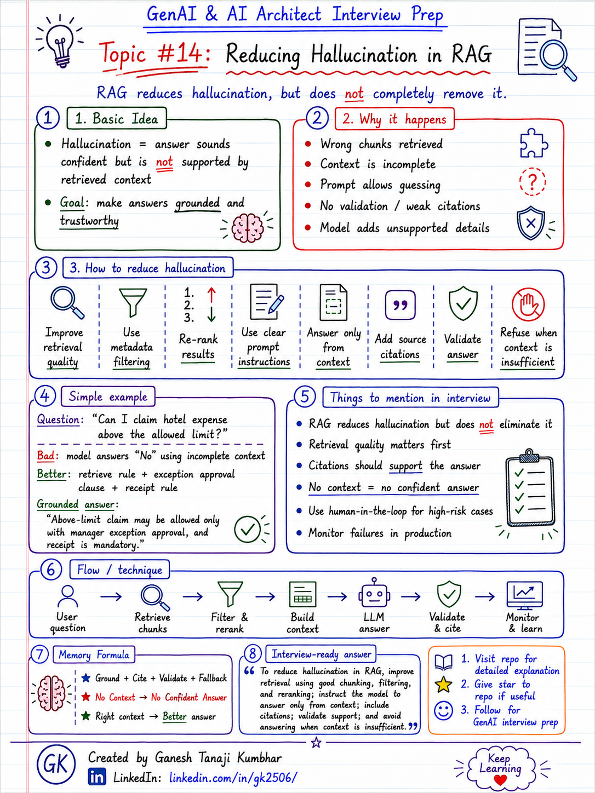

# GenAI & AI Architect Interview Prep

# Topic #14: Reducing Hallucination in RAG



---

## Question

In an interview, you may be asked:

> How do you reduce hallucination in a RAG system?

Or:

> Does RAG completely remove hallucination?

Or:

> What will you do if the LLM gives an answer that is not supported by retrieved documents?

Or:

> How do you make RAG answers more grounded and trustworthy?

---

## Why interviewer asks this

The interviewer is checking whether you understand that RAG reduces hallucination, but does not automatically eliminate it.

Many candidates say:

> We will use RAG, so hallucination will be solved.

That answer is incomplete.

A senior or architect-level answer should explain:

> RAG helps reduce hallucination by grounding the LLM with retrieved context, but hallucination can still happen if retrieval is poor, context is incomplete, prompt instructions are weak, or answer validation is missing.

This question tests your understanding of:

* Grounded generation
* Retrieval quality
* Context relevance
* Prompt constraints
* Source citation
* Confidence checks
* Answer validation
* Refusal behavior
* Guardrails
* RAG evaluation
* Production reliability

---

## Basic answer

Hallucination means the LLM generates an answer that sounds confident but is not supported by facts or provided context.

Simple answer:

> To reduce hallucination in RAG, we should make sure the LLM answers only from retrieved context, cite sources where possible, validate the answer, and avoid answering when the retrieved context is insufficient.

In simple words:

```text
Good Retrieval
      ↓
Grounded Context
      ↓
Controlled Prompt
      ↓
Validated Answer
      ↓
Lower Hallucination
```

Important point:

> RAG reduces hallucination, but it does not completely remove hallucination.

---

## Architect-level answer

In production RAG, hallucination should be handled at multiple layers.

I would not depend only on the LLM prompt.

A strong architect-level answer would be:

> To reduce hallucination in RAG, I would improve retrieval quality, use metadata filtering, pass only relevant context, instruct the model to answer only from retrieved context, include citations, validate whether the answer is supported by the retrieved chunks, and return “I do not have enough information” when context is insufficient. I would also evaluate hallucination rate using test questions and monitor failures in production.

---

## Must mention in interview

When answering this question, try to mention these points:

---

### 1. RAG reduces hallucination, but does not eliminate it

This is the first important point.

RAG gives the LLM external knowledge, but the LLM may still hallucinate if:

* Wrong chunks are retrieved
* Correct chunks are missing
* Context is incomplete
* Prompt allows assumptions
* Model over-generalizes
* Citations are not enforced
* No validation is done

A strong interview line:

> RAG improves grounding, but hallucination control needs retrieval quality, prompt constraints, validation, and fallback behavior.

---

### 2. Improve retrieval quality first

Hallucination often starts with poor retrieval.

If the LLM receives wrong context, it may generate a wrong answer.

Check retrieval quality:

* Are correct chunks retrieved?
* Is the right document version used?
* Are metadata filters correct?
* Is top-k enough?
* Is re-ranking needed?
* Is hybrid search needed?
* Are irrelevant chunks removed?

Simple formula:

```text
Poor Retrieval = Weak Context
Weak Context = Hallucination Risk
```

---

### 3. Use metadata filtering

Metadata filtering helps reduce hallucination by retrieving the correct context.

Example filters:

* tenantId
* region
* role
* department
* documentType
* accessLevel
* status
* effectiveDate
* version

Example:

```text
User from Tenant A / India asks about hotel reimbursement.
System should retrieve only Tenant A + India + Active Expense Policy.
```

Without filters, the system may retrieve wrong policy and produce a wrong answer.

---

### 4. Give clear prompt instructions

The prompt should clearly instruct the model to answer only from retrieved context.

Example instruction:

```text
Answer only using the provided context.
If the answer is not available in the context, say that you do not have enough information.
Do not guess.
Do not use unsupported assumptions.
```

This reduces unsupported answers.

But remember:

> Prompt instruction is helpful, but it is not enough by itself.

---

### 5. Add source citations

Citations make the answer more traceable.

The answer can include:

* Document name
* Section
* Page number
* Policy reference
* Source URL
* Chunk ID

Example:

```text
As per Expense Policy 2026, Hotel Reimbursement section, Grade L5 employees can claim up to ₹6,000 per night.
```

Source citation helps users verify the answer.

It also helps debug whether the answer was grounded in the right context.

---

### 6. Validate answer against context

For important use cases, validate whether the generated answer is supported by retrieved context.

Validation can check:

* Does the answer contain facts not present in context?
* Are numbers copied correctly?
* Are policy limits correct?
* Is the answer using the latest document?
* Are citations matching the answer?
* Is the model making assumptions?

Example:

If context says:

```text
Hotel limit is ₹6,000.
```

The answer should not say:

```text
Hotel limit is ₹8,000.
```

---

### 7. Avoid answering when context is insufficient

This is very important.

A good RAG system should know when not to answer.

If retrieved context is missing or weak, the system should say:

```text
I do not have enough information in the available documents to answer this confidently.
```

Or:

```text
I could not find the relevant policy section. Please check with HR/Finance or provide more details.
```

This is better than generating a confident but wrong answer.

Memory line:

```text
No Context = No Confident Answer
```

---

### 8. Use confidence checks carefully

Confidence score can help, but it should not be the only decision factor.

Confidence can be based on:

* Retrieval score
* Re-ranker score
* Number of supporting chunks
* Source reliability
* Consistency across chunks
* Answer validation result
* Whether required metadata matched

But be careful:

> High confidence does not always mean correct answer.

A strong system combines confidence with validation and business rules.

---

### 9. Use human-in-the-loop for high-risk cases

For high-risk decisions, the AI should not be the final decision maker.

Example high-risk actions:

* Approve reimbursement
* Reject claims
* Process payment
* Override policy
* Give legal/compliance decision
* Delete records
* Grant access

In such cases:

```text
AI recommends
Human approves
System executes
Audit logs
```

This reduces business risk from hallucinated or unsupported AI decisions.

---

### 10. Monitor hallucination in production

Hallucination control should continue after deployment.

Track:

* Unsupported answers
* Missing citations
* Wrong citations
* User corrections
* Low retrieval confidence
* Repeated failed queries
* Answer feedback
* Escalations to human support
* Queries with insufficient context

This helps improve the system over time.

---

## Real-world example

### Example: Expense Management AI Agent

User asks:

> Can I claim hotel expense above the allowed limit?

The correct policy says:

```text
Hotel expenses above the allowed limit require manager exception approval.
```

### Bad RAG behavior

If the system retrieves only this chunk:

```text
Hotel reimbursement limit for Grade L5 is ₹6,000 per night.
```

The LLM may answer:

```text
No, you cannot claim above ₹6,000.
```

This answer is incomplete because it missed the exception approval rule.

---

### Better RAG behavior

The system retrieves:

```text
Hotel reimbursement limit for Grade L5 is ₹6,000 per night.
Expenses above the limit require manager exception approval.
Receipt is mandatory.
```

Now the answer can be:

```text
You can claim above the limit only if manager exception approval is allowed and approved as per policy. A receipt is also mandatory.
```

This answer is more grounded because it uses the retrieved policy context.

---

## RAG hallucination reduction flow

```text
User question
        ↓
Retrieve relevant chunks
        ↓
Apply metadata filters
        ↓
Re-rank results
        ↓
Build clean context
        ↓
Prompt LLM to answer only from context
        ↓
Generate answer with citations
        ↓
Validate answer against context
        ↓
If context is insufficient, do not guess
        ↓
Log and monitor
```

---

## What can go wrong?

### 1. Wrong context is retrieved

The LLM may generate an answer using wrong or irrelevant context.

```text
Wrong Context = Wrong Answer
```

---

### 2. Context is incomplete

The answer may miss important conditions or exceptions.

```text
Partial Context = Partial Answer
```

---

### 3. LLM adds unsupported details

The model may add extra assumptions not present in retrieved documents.

```text
Unsupported Detail = Hallucination
```

---

### 4. Citation does not match answer

The answer may cite a document, but the cited document may not support the claim.

```text
Citation must support the answer.
```

---

### 5. System answers when it should refuse

If context is insufficient, the system should not guess.

```text
Better to say “I do not know” than give a wrong answer.
```

---

## Common hallucination reduction techniques

Use a combination of:

* Better chunking
* Metadata filtering
* Hybrid search
* Re-ranking
* Query rewriting
* Context compression
* Strong prompt instructions
* Source citations
* Answer validation
* Confidence checks
* Human-in-the-loop
* Retrieval evaluation
* Monitoring and feedback

---

## Common mistake

Many candidates say:

> We will use RAG to remove hallucination.

This is incomplete.

Better answer:

> RAG reduces hallucination by grounding answers in retrieved context, but hallucination can still happen if retrieval is wrong, context is incomplete, or the model is allowed to guess. I would combine good retrieval, prompt constraints, citations, validation, fallback behavior, and monitoring.

Another common mistake:

> If the LLM gives citations, the answer is correct.

Not always.

Citations must actually support the answer.

---

## Better interview answer

A strong answer can be:

> To reduce hallucination in RAG, I would first improve retrieval quality using good chunking, metadata filtering, hybrid search, and re-ranking. Then I would instruct the model to answer only from retrieved context, include citations, and avoid guessing when context is insufficient. For critical answers, I would validate whether the response is supported by the retrieved chunks and route high-risk decisions to a human approver. I would also monitor hallucination patterns in production using feedback and evaluation datasets.

---

## One-line answer

> Reduce hallucination in RAG by grounding answers in retrieved context, validating support, citing sources, and refusing to answer when context is insufficient.

---

## Memory formula

Use this formula:

```text
Ground
Cite
Validate
Fallback
```

Another version:

```text
Good Retrieval
+ Clear Prompt
+ Source Citation
+ Answer Validation
= Lower Hallucination
```

Or:

```text
No Context = No Confident Answer
```

---

## Interview closing line

You can close your answer like this:

> In production RAG, I would not assume that retrieval alone solves hallucination. I would design the system to retrieve the right context, constrain the model to that context, validate the answer, cite sources, and avoid unsupported answers when the context is insufficient.

---

## Related upcoming topics

* RAG evaluation
* Hybrid search
* Re-ranking
* Query rewriting
* Lost-in-the-middle problem
* Production RAG architecture
* Observability for AI Applications
* Guardrails in AI Applications
* Human-in-the-loop in GenAI systems

---

## Reference Scenario

This topic can be understood using the common **Expense Management AI Agent** scenario used across this series.

You can refer to the scenario here:

```text
00-common-examples/expense-management-ai-agent-scenario.md
```

---

## About the Author

These notes are created and maintained by **Ganesh Tanaji Kumbhar**, an **AI Architect** with experience in **.NET, Azure, cloud architecture, infrastructure, enterprise application modernization, and GenAI solution design**.

I bring practical experience across:

* **.NET / C# / ASP.NET / Web API**
* **Azure App Services, Azure Functions, WebJobs, Azure SQL, Storage, Redis**
* **Cloud architecture and infrastructure modernization**
* **Application architecture and enterprise system design**
* **CI/CD, DevOps, monitoring, and production support**
* **GenAI, RAG, Agentic AI, and AI architecture patterns**

These notes are based on my real experience as both:

* An **interviewee**, facing AI, architecture, cloud, .NET, Azure, and system design rounds
* An **interviewer**, evaluating how candidates explain concepts, tradeoffs, project experience, and real-world design decisions

I write about:

* GenAI Architecture
* RAG System Design
* Agentic AI
* AI Architect Interview Preparation
* .NET and Azure Architecture
* Cloud and Enterprise AI Patterns

If you are preparing for **GenAI / AI Architect / Staff Engineer / Solution Architect / .NET Architect / Azure Architect** interviews, feel free to connect with me on LinkedIn.

🔗 **LinkedIn:** [Connect with me on LinkedIn](https://www.linkedin.com/in/gk2506/)

💬 You can also DM me on LinkedIn if you want to discuss AI architecture, interview preparation, .NET/Azure architecture, or practical GenAI learning.
