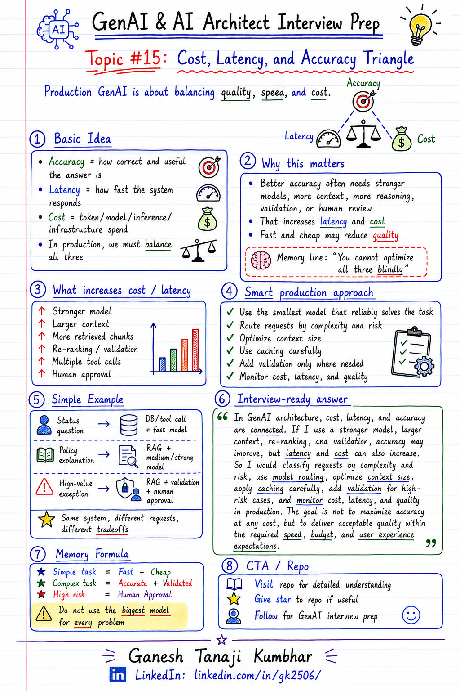

# GenAI & AI Architect Interview Prep

# Topic #15: Cost, Latency, and Accuracy Triangle



---

## Question

In an interview, you may be asked:

> How do you balance cost, latency, and accuracy in a GenAI application?

Or:

> Why can’t we always use the most powerful LLM for every request?

Or:

> How would you design a production GenAI system that is accurate but also fast and cost-effective?

Or:

> What tradeoffs do you consider while choosing model, prompt, RAG, and agent design?

---

## Why interviewer asks this

The interviewer is checking whether you understand real production AI tradeoffs.

Many candidates say:

> I will use the best model to get the best answer.

That answer is not enough.

In production systems, you cannot optimize only for accuracy.

You also need to think about:

* Response time
* Token cost
* Model cost
* User experience
* Business value
* Scalability
* Failure handling
* Throughput
* Monitoring
* Reliability

A senior or architect-level answer should explain:

> In production GenAI systems, accuracy, latency, and cost must be balanced based on use case, risk, user expectation, and business value.

This question tests your understanding of:

* Model selection
* Token usage
* Latency
* RAG design
* Prompt size
* Context size
* Caching
* Routing
* Fallbacks
* Evaluation
* Production tradeoffs

---

## Basic answer

The cost, latency, and accuracy triangle means:

```text
Higher accuracy usually needs more context, better models, more reasoning, or extra validation.
But that can increase cost and latency.
```

Simple explanation:

* **Accuracy** means how correct, useful, and grounded the answer is.
* **Latency** means how fast the system responds.
* **Cost** means how much money is spent on tokens, model calls, retrieval, tools, and infrastructure.

In real systems, we need to balance all three.

Simple answer:

> I would not use the biggest model for every request. I would classify the task, choose the right model, optimize prompts and context, use caching where possible, and apply stronger reasoning or human review only for high-risk cases.

---

## Architect-level answer

A strong architect-level answer would be:

> In production GenAI systems, I would balance cost, latency, and accuracy based on the business criticality of the task. For simple queries, I may use a smaller or faster model. For complex or high-risk queries, I may use a stronger model, better retrieval, validation, and human-in-the-loop. I would also optimize prompt size, retrieved context, token usage, caching, model routing, and monitoring. The goal is not to maximize accuracy at any cost, but to provide acceptable quality within required latency and budget.

---

## Must mention in interview

When answering this question, try to mention these points:

---

### 1. Do not use the biggest model for every request

A common mistake is to say:

```text
Use the most powerful model for best accuracy.
```

This may work in demos, but not always in production.

Bigger models can mean:

* Higher cost
* Higher latency
* Lower throughput
* More dependency on rate limits
* Poor user experience for simple tasks

Better answer:

> I would use the smallest model that can reliably solve the task.

---

### 2. Accuracy has a cost

Accuracy is important, but it is not free.

To improve accuracy, we may need:

* Better retrieval
* More chunks
* Larger context
* Stronger model
* Re-ranking
* Query rewriting
* Validation
* Multi-step reasoning
* Tool calling
* Human review

But each of these can increase:

* Token usage
* Latency
* Infrastructure cost
* Complexity

Memory line:

```text
Better Accuracy = More Work = More Cost/Latency
```

---

### 3. Latency affects user experience

Even if the answer is accurate, users may not like the system if it is too slow.

Example:

```text
A chatbot response taking 2 seconds may feel good.
A chatbot response taking 30 seconds may feel broken.
```

Latency matters especially for:

* Chat assistants
* Customer support
* Copilot experiences
* Search-based Q&A
* Real-time agent workflows
* Voice assistants
* Interactive applications

Important interview line:

> For user-facing GenAI applications, latency is part of product experience.

---

### 4. Cost matters at scale

One request may look cheap.

But production systems run at scale.

Example:

```text
₹1 per request looks small.
10 lakh requests per month becomes ₹10 lakh per month.
```

Cost can increase due to:

* Input tokens
* Output tokens
* Large prompts
* Large retrieved context
* Multiple model calls
* Re-ranking
* Tool calls
* Embedding generation
* Logging and storage
* Retry logic

Important line:

> Token cost becomes a serious architecture concern when usage grows.

---

### 5. Different tasks need different models

Not every task needs the same model.

Example:

```text
Simple FAQ answer        → Smaller/faster model
Document summarization   → Medium model
Complex policy reasoning → Stronger model
High-risk decision       → Stronger model + validation + human approval
```

This is called model routing.

Good systems route requests based on:

* Task complexity
* Risk level
* User role
* Required accuracy
* Expected latency
* Cost budget

---

### 6. Optimize context size

In RAG systems, sending too much context can hurt both cost and latency.

Large context means:

* More input tokens
* Higher cost
* Slower response
* More irrelevant information
* Lost-in-the-middle risk

Better approach:

* Retrieve relevant chunks
* Re-rank results
* Remove duplicate chunks
* Compress context
* Use metadata filtering
* Send only necessary information

Memory formula:

```text
Right Context > More Context
```

---

### 7. Use caching where possible

Caching can reduce both cost and latency.

Examples:

* Cache frequent answers
* Cache retrieval results
* Cache embeddings
* Cache system prompts
* Cache tool responses
* Cache policy documents
* Cache user/session context carefully

But caching must be safe.

Be careful with:

* Tenant isolation
* User permissions
* Stale data
* Sensitive information
* Policy version changes

Strong interview line:

> Caching is useful, but in enterprise AI systems it must be permission-aware and freshness-aware.

---

### 8. Use fallback design

If the best model is slow, costly, or unavailable, the system should have fallback options.

Examples:

* Retry with smaller prompt
* Use smaller model
* Return partial answer
* Ask clarifying question
* Use deterministic workflow
* Escalate to human
* Show “I do not have enough information”
* Queue background processing

Fallbacks help with:

* Cost control
* Latency control
* Reliability
* User trust

---

### 9. Measure instead of guessing

Do not choose architecture based only on opinion.

Measure:

* Answer accuracy
* Hallucination rate
* Retrieval quality
* Average latency
* P95/P99 latency
* Token usage
* Cost per request
* User feedback
* Escalation rate
* Failure rate

Important interview line:

> I would use evaluation data and production telemetry to tune the cost, latency, and accuracy balance.

---

### 10. Balance depends on use case

There is no single correct balance.

Example:

```text
Customer support chatbot:
Fast response and acceptable accuracy may be enough.

Legal/compliance assistant:
Accuracy and citations are more important than speed.

Expense approval agent:
Policy correctness and auditability are more important than saving a few tokens.
```

A strong answer should always connect tradeoffs to the business use case.

---

## Real-world example

### Example: Expense Management AI Agent

User asks:

> Why was my hotel expense rejected, and can I resubmit it?

The system may need to:

* Fetch expense details
* Retrieve policy
* Check hotel limit
* Check receipt status
* Check exception approval rule
* Generate answer
* Suggest next action

---

### Option 1: Use the biggest model for everything

Flow:

```text
Every request → Strongest LLM → Large context → Detailed answer
```

This may improve answer quality, but it can create problems:

* High cost
* Slower response
* Hard to scale
* Expensive for simple questions

This is not always a good production design.

---

### Option 2: Use smaller model for everything

Flow:

```text
Every request → Small model → Fast response
```

This may reduce cost and latency, but it can create problems:

* Weak reasoning
* Missed policy conditions
* Incomplete answers
* Higher hallucination risk
* Poor handling of complex questions

This is also not always good.

---

### Better approach

Use task-based routing.

Example:

```text
Simple status question
        ↓
Fast model + direct database/tool response

Policy explanation question
        ↓
RAG + medium/strong model + citations

High-value reimbursement exception
        ↓
RAG + validation + human approval
```

This gives a better balance of:

* Cost
* Latency
* Accuracy
* Risk control
* User experience

---

## Practical design approach

A production-ready approach can look like this:

```text
User question
        ↓
Classify intent and risk
        ↓
Choose model and flow
        ↓
Retrieve only relevant context
        ↓
Generate answer
        ↓
Validate if needed
        ↓
Fallback or escalate if confidence is low
        ↓
Track cost, latency, and quality
```

---

## What can go wrong?

### 1. Optimizing only for accuracy

If you only optimize for accuracy, the system may become:

* Too expensive
* Too slow
* Hard to scale
* Poor for interactive users

---

### 2. Optimizing only for cost

If you only optimize for cost, the system may give:

* Shallow answers
* Wrong answers
* Poor reasoning
* Low user trust

---

### 3. Optimizing only for latency

If you only optimize for speed, the system may skip:

* Proper retrieval
* Validation
* Re-ranking
* Human approval
* Safety checks

This can increase business risk.

---

### 4. Sending too much context

More context does not always mean better answer.

Too much context can cause:

* Higher token cost
* Higher latency
* Confusing context
* Lost-in-the-middle issues

---

### 5. No monitoring

Without monitoring, you cannot know:

* Which prompts are costly
* Which flows are slow
* Which model performs best
* Which answers are wrong
* Which users are dissatisfied

---

## Common mistake

Many candidates answer:

> I will use the best model for better accuracy.

This is incomplete.

Better answer:

> I would choose the model and architecture based on task complexity, risk, latency requirement, and cost budget. For simple tasks, I would use cheaper and faster paths. For complex or high-risk tasks, I would use stronger models, better retrieval, validation, and human approval.

Another common mistake:

> I will reduce cost by reducing tokens.

This is only one part of the answer.

Better answer:

> I would reduce cost using model routing, prompt optimization, context optimization, caching, batching where applicable, fewer unnecessary tool calls, and monitoring cost per request.

---

## Better interview answer

A strong answer can be:

> In GenAI architecture, cost, latency, and accuracy are connected. If I use a stronger model, larger context, re-ranking, and validation, accuracy may improve, but latency and cost can increase. If I use a smaller model and less context, the system may become faster and cheaper, but answer quality may drop. So I would classify requests by complexity and risk, use model routing, optimize context size, apply caching carefully, add validation for high-risk cases, and monitor cost, latency, and quality in production.

---

## One-line answer

> In production GenAI systems, we should not optimize only for accuracy; we must balance answer quality, response time, and cost based on the use case.

---

## Memory formula

Use this formula:

```text
Accuracy ↑
Cost ↑
Latency ↑
```

Another version:

```text
Right Model
+ Right Context
+ Right Validation
= Balanced GenAI System
```

Or:

```text
Simple Task = Fast + Cheap
Complex Task = Accurate + Validated
High Risk = Human Approval
```

Most important rule:

```text
Do not use the biggest model for every problem.
```

---

## Interview closing line

You can close your answer like this:

> In production GenAI systems, the best architecture is not the one that only gives the most accurate answer. It is the one that gives acceptable accuracy within the required latency, cost, risk, and user experience boundaries.

---

## Related upcoming topics

* P50, P95, and P99 Latency in LLM Apps
* Prompt Engineering vs Guardrails vs Validation
* Why Production AI Fails After Demo Success
* Fallback Design When LLM Fails
* Rate Limits, Retries, and Circuit Breaker
* Observability for AI Applications
* Model Selection
* Production RAG Architecture

---

## Reference Scenario

This topic can be understood using the common **Expense Management AI Agent** scenario used across this series.

You can refer to the scenario here:

```text
00-common-examples/expense-management-ai-agent-scenario.md
```

---

## About the Author

These notes are created and maintained by **Ganesh Tanaji Kumbhar**, an **AI Architect** with experience in **.NET, Azure, cloud architecture, infrastructure, enterprise application modernization, and GenAI solution design**.

I bring practical experience across:

* **.NET / C# / ASP.NET / Web API**
* **Azure App Services, Azure Functions, WebJobs, Azure SQL, Storage, Redis**
* **Cloud architecture and infrastructure modernization**
* **Application architecture and enterprise system design**
* **CI/CD, DevOps, monitoring, and production support**
* **GenAI, RAG, Agentic AI, and AI architecture patterns**

These notes are based on my real experience as both:

* An **interviewee**, facing AI, architecture, cloud, .NET, Azure, and system design rounds
* An **interviewer**, evaluating how candidates explain concepts, tradeoffs, project experience, and real-world design decisions

I write about:

* GenAI Architecture
* RAG System Design
* Agentic AI
* AI Architect Interview Preparation
* .NET and Azure Architecture
* Cloud and Enterprise AI Patterns

If you are preparing for **GenAI / AI Architect / Staff Engineer / Solution Architect / .NET Architect / Azure Architect** interviews, feel free to connect with me on LinkedIn.

🔗 **LinkedIn:** [Connect with me on LinkedIn](https://www.linkedin.com/in/gk2506/)

💬 You can also DM me on LinkedIn if you want to discuss AI architecture, interview preparation, .NET/Azure architecture, or practical GenAI learning.
