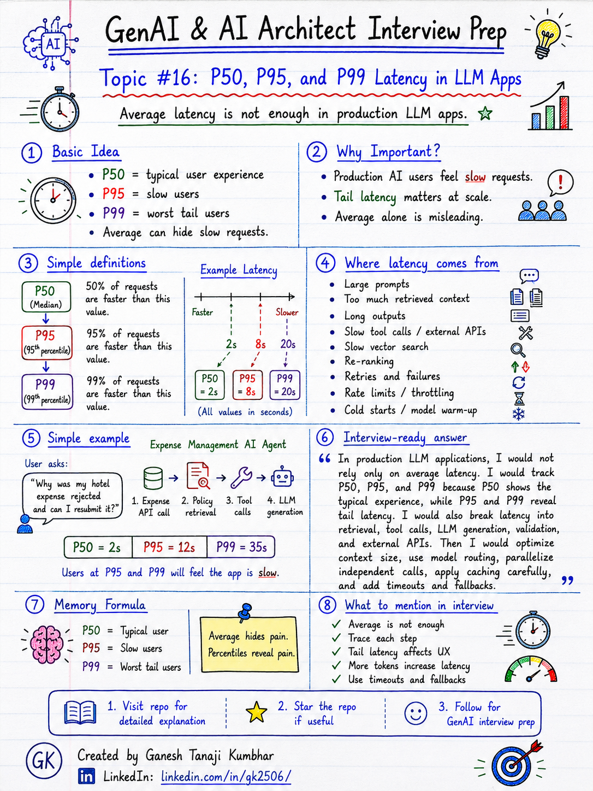

# GenAI & AI Architect Interview Prep

# Topic #16: P50, P95, and P99 Latency in LLM Apps



---

## Question

In an interview, you may be asked:

> What is P50, P95, and P99 latency?

Or:

> Why is average latency not enough in production GenAI applications?

Or:

> How do you monitor latency in an LLM-based application?

Or:

> What would you do if only a small percentage of users are getting very slow AI responses?

---

## Why interviewer asks this

The interviewer is checking whether you understand production performance, not just AI concepts.

Many candidates say:

> The average response time is 3 seconds, so the system is fine.

That answer is incomplete.

Average latency can hide slow user experiences.

In production GenAI systems, some requests may be fast, but some may be very slow because of:

* Large prompts
* Large retrieved context
* Long model output
* Slow tool calls
* Slow vector search
* Re-ranking
* Multi-step agent workflows
* Network delays
* Model rate limits
* Retry logic
* Cold starts
* Queueing
* External dependency slowness

A senior or architect-level answer should explain:

> Average latency is not enough. We should track percentile latency like P50, P95, and P99 because users feel the slow requests, especially at scale.

This question tests your understanding of:

* Production latency
* Percentile metrics
* Tail latency
* User experience
* LLM response time
* Token impact
* Tool-call latency
* RAG latency
* Monitoring
* Timeout and fallback design
* Performance tradeoffs

---

## Basic answer

Latency means how long a request takes to complete.

In LLM apps, latency usually means:

```text
User asks question
        ↓
System retrieves data / calls tools / calls LLM
        ↓
User receives response
```

Percentile latency helps us understand how fast or slow requests are across many users.

Simple definitions:

```text
P50 = 50% of requests completed within this time
P95 = 95% of requests completed within this time
P99 = 99% of requests completed within this time
```

Example:

```text
P50 latency = 2 seconds
P95 latency = 8 seconds
P99 latency = 20 seconds
```

Meaning:

* 50% of users got response within 2 seconds
* 95% of users got response within 8 seconds
* 99% of users got response within 20 seconds
* Slowest 1% of users may experience more than 20 seconds

Simple answer:

> P50 shows the typical experience, P95 shows slow experience for many edge cases, and P99 shows extreme tail latency. In production GenAI systems, P95 and P99 are very important because average latency can hide slow responses.

---

## Architect-level answer

A strong architect-level answer would be:

> In production LLM applications, I would not rely only on average latency. I would monitor P50, P95, and P99 latency separately for the complete request and also for each step such as retrieval, re-ranking, tool calls, LLM generation, validation, and external APIs. P50 tells me the normal user experience, while P95 and P99 reveal tail latency problems. If P95 or P99 is high, I would investigate slow prompts, large context, long outputs, slow dependencies, rate limits, retries, cold starts, and agent workflow complexity. Then I would optimize using model routing, context reduction, caching, parallel calls, timeouts, streaming, fallback responses, and better observability.

---

## Must mention in interview

When answering this question, try to mention these points:

---

### 1. Average latency is not enough

Average can hide bad user experience.

Example:

```text
90 users get response in 2 seconds
10 users get response in 30 seconds
```

The average may still look acceptable, but 10 users had a very bad experience.

Common mistake:

```text
Average latency is 4 seconds, so system is fine.
```

Better answer:

> I would check P50, P95, and P99 latency because average latency hides slow tail requests.

---

### 2. P50 means typical user experience

P50 is also called median latency.

If P50 is 2 seconds, it means:

```text
50% of requests completed within 2 seconds
```

This is useful to understand the normal experience for most users.

But P50 alone is not enough.

A system can have good P50 and bad P95/P99.

Example:

```text
P50 = 2 seconds
P95 = 15 seconds
P99 = 40 seconds
```

This means most users are fine, but some users are facing very slow responses.

---

### 3. P95 shows slow experience for important edge cases

P95 means 95% of requests completed within that time.

If P95 is 10 seconds, it means:

```text
95% of requests completed within 10 seconds
Slowest 5% took more than 10 seconds
```

P95 is important because it shows real production pain.

Many production issues first appear in P95:

* Slow retrieval
* Large documents
* Long answers
* Complex prompts
* Slow tool calls
* Rate limits
* Retry delays
* External API slowness

Strong interview line:

> P95 helps identify performance problems that average latency hides.

---

### 4. P99 shows tail latency

P99 means 99% of requests completed within that time.

If P99 is 25 seconds, it means:

```text
99% of requests completed within 25 seconds
Slowest 1% took more than 25 seconds
```

P99 matters in high-scale systems.

If your app handles millions of requests, even 1% can be a large number of users.

Example:

```text
10,00,000 requests/month
1% slow requests = 10,000 bad experiences
```

Memory line:

```text
Small percentage at scale becomes a big user problem.
```

---

### 5. LLM latency is affected by tokens

In LLM apps, latency is strongly affected by token count.

More input tokens can come from:

* Large system prompt
* Large chat history
* Too many retrieved chunks
* Long documents
* Large tool output
* Repeated instructions

More output tokens can come from:

* Long answers
* Detailed explanations
* JSON responses
* Multi-step reasoning output
* Summaries

Important line:

> More tokens usually mean more cost and more latency.

This connects with the previous topic:

```text
Cost + Latency + Accuracy are connected.
```

---

### 6. RAG adds latency

RAG improves grounding, but it adds extra steps.

A RAG flow may include:

```text
User question
        ↓
Query rewriting
        ↓
Embedding generation
        ↓
Vector / hybrid search
        ↓
Metadata filtering
        ↓
Re-ranking
        ↓
Context building
        ↓
LLM generation
```

Each step can add latency.

This does not mean RAG is bad.

It means we need to measure each step separately.

Strong interview line:

> I would break down latency by retrieval, re-ranking, context building, LLM call, and validation instead of measuring only total response time.

---

### 7. Tool calls and agents can increase latency

Agentic systems may call multiple tools.

Example:

```text
Check expense status
        ↓
Fetch policy
        ↓
Check receipt
        ↓
Check manager approval
        ↓
Generate answer
```

If these tool calls happen one by one, latency can increase quickly.

Better approach:

* Run independent calls in parallel
* Avoid unnecessary tool calls
* Cache safe tool results
* Add timeouts
* Use deterministic workflows where possible
* Avoid over-agentic design for simple tasks

Important line:

> Multi-step agent workflows should be measured carefully because every tool call adds latency and failure risk.

---

### 8. Use timeouts and fallbacks

A production system should not wait forever.

Use timeouts for:

* LLM calls
* Vector search
* External APIs
* Tool calls
* Re-ranker
* Validation service

Fallback examples:

* Return partial answer
* Ask user to try again
* Use smaller model
* Skip optional re-ranking
* Show cached answer
* Queue background processing
* Escalate to human
* Return “I could not complete this right now”

Strong interview line:

> For production systems, latency control needs timeout and fallback design.

---

### 9. Streaming can improve perceived latency

Sometimes total response time may be high, but streaming can improve user experience.

Example:

```text
Without streaming:
User waits 10 seconds and then sees full answer.

With streaming:
User starts seeing response after 1 second.
```

Streaming does not always reduce total processing time, but it improves perceived latency.

Use streaming carefully for:

* Chat answers
* Long explanations
* Summaries
* Assistant responses

But streaming may not be suitable for:

* Final approved decisions
* Structured JSON APIs
* Payment actions
* Compliance-sensitive responses requiring validation before showing output

---

### 10. Monitor latency by step, not only total time

For production GenAI apps, track latency at each step.

Example metrics:

```text
Total request latency
LLM latency
Retrieval latency
Embedding latency
Re-ranking latency
Tool-call latency
Validation latency
Database latency
External API latency
Queue wait time
Cold start time
```

This helps identify the real bottleneck.

Important interview line:

> If P95 is high, I need trace-level visibility to know which step is slow.

---

## Real-world example

### Example: Expense Management AI Agent

User asks:

> Why was my hotel expense rejected, and can I resubmit it?

The system may perform:

```text
1. Fetch expense details
2. Retrieve hotel policy
3. Check receipt status
4. Check approval rule
5. Generate answer
6. Validate answer
```

---

### Good P50 but bad P95 example

Suppose metrics show:

```text
P50 = 2 seconds
P95 = 12 seconds
P99 = 35 seconds
```

This means normal users get fast responses.

But some users are facing slow responses.

Possible reasons:

* Some expense records are slow to fetch
* Some policy retrieval queries return too many chunks
* Some answers generate too many tokens
* Some tool calls timeout and retry
* Some requests require validation and approval checks
* Some users ask complex follow-up questions

---

### Better production approach

Break down the request:

```text
Expense API call       = 300 ms
Policy retrieval       = 700 ms
Re-ranking             = 500 ms
LLM generation         = 4 seconds
Validation             = 800 ms
Total                  = 6.3 seconds
```

Now we can optimize the right part.

For example:

* Reduce retrieved chunks
* Use faster model for simple status questions
* Cache active policy
* Parallelize independent API calls
* Stream long answers
* Add timeout for slow tools
* Use fallback if validation service is slow

---

## Practical design approach

A production-ready latency strategy can look like this:

```text
User question
        ↓
Classify complexity and risk
        ↓
Choose fast path or deep path
        ↓
Run independent calls in parallel
        ↓
Retrieve only needed context
        ↓
Use right model
        ↓
Stream if suitable
        ↓
Validate only when needed
        ↓
Fallback on timeout
        ↓
Track P50 / P95 / P99
```

---

## What can go wrong?

### 1. Only tracking average latency

Average latency may look good while P95 and P99 are bad.

```text
Average hides tail latency.
```

---

### 2. Sending too much context

Too much context increases:

* Token count
* Cost
* Latency
* Lost-in-the-middle risk

```text
More context ≠ Better performance
```

---

### 3. Too many sequential tool calls

If each tool call takes 1 second and the agent calls 8 tools sequentially, the user waits at least 8 seconds before LLM generation.

```text
Sequential tools increase latency.
```

---

### 4. No timeout

Without timeout, slow dependencies can make the full AI response very slow.

```text
No timeout = unpredictable user experience.
```

---

### 5. Same model for every request

Using a strong model for every simple query can increase cost and latency.

```text
Simple task should not always use expensive path.
```

---

### 6. No tracing

Without tracing, we cannot know whether latency comes from:

* LLM
* Retrieval
* Re-ranking
* Tools
* Database
* External API
* Network
* Cold start

```text
No tracing = blind debugging.
```

---

## Common mistake

Many candidates say:

> Average latency is 3 seconds.

This is incomplete.

Better answer:

> I would check P50, P95, and P99 latency. P50 tells normal experience, while P95 and P99 show tail latency. In production, slow tail requests matter because even a small percentage of slow requests can affect many users at scale.

Another common mistake:

> The LLM is slow.

This is too generic.

Better answer:

> I would break down latency across retrieval, embedding, re-ranking, tool calls, LLM generation, validation, retries, and external APIs to identify the actual bottleneck.

---

## Better interview answer

A strong answer can be:

> I would not rely only on average latency in a production LLM application. I would track P50, P95, and P99 latency because P50 shows typical user experience, while P95 and P99 reveal tail latency. In GenAI systems, latency can come from large prompts, retrieved context, LLM generation, tool calls, re-ranking, validation, retries, rate limits, and external APIs. I would instrument each step using tracing, optimize context size, use model routing, parallelize independent calls, apply caching carefully, add timeouts and fallbacks, and monitor latency along with cost and answer quality.

---

## One-line answer

> P50 shows typical latency, P95 shows slow user experience, and P99 shows extreme tail latency that average latency can hide.

---

## Memory formula

Use this formula:

```text
P50 = Typical user
P95 = Slow users
P99 = Worst tail users
```

Another version:

```text
Average hides pain.
Percentiles reveal pain.
```

Or:

```text
Measure total latency.
Trace step latency.
Fix real bottleneck.
```

Most important rule:

```text
Do not judge production AI performance only by average latency.
```

---

## Interview closing line

You can close your answer like this:

> In production LLM apps, average latency is not enough. I would track P50, P95, and P99, break down latency by each step, and optimize based on real user impact. This helps balance speed, cost, reliability, and answer quality.

---

## Related upcoming topics

* Prompt Engineering vs Guardrails vs Validation
* Why Production AI Fails After Demo Success
* Fallback Design When LLM Fails
* Rate Limits, Retries, and Circuit Breaker
* Observability for AI Applications
* Model Selection
* Production RAG Architecture
* Cost, Latency, and Accuracy Triangle

---

## Reference Scenario

This topic can be understood using the common **Expense Management AI Agent** scenario used across this series.

You can refer to the scenario here:

```text
00-common-examples/expense-management-ai-agent-scenario.md
```

---

## About the Author

These notes are created and maintained by **Ganesh Tanaji Kumbhar**, an **AI Architect** with experience in **.NET, Azure, cloud architecture, infrastructure, enterprise application modernization, and GenAI solution design**.

I bring practical experience across:

* **.NET / C# / ASP.NET / Web API**
* **Azure App Services, Azure Functions, WebJobs, Azure SQL, Storage, Redis**
* **Cloud architecture and infrastructure modernization**
* **Application architecture and enterprise system design**
* **CI/CD, DevOps, monitoring, and production support**
* **GenAI, RAG, Agentic AI, and AI architecture patterns**

These notes are based on my real experience as both:

* An **interviewee**, facing AI, architecture, cloud, .NET, Azure, and system design rounds
* An **interviewer**, evaluating how candidates explain concepts, tradeoffs, project experience, and real-world design decisions

I write about:

* GenAI Architecture
* RAG System Design
* Agentic AI
* AI Architect Interview Preparation
* .NET and Azure Architecture
* Cloud and Enterprise AI Patterns

If you are preparing for **GenAI / AI Architect / Staff Engineer / Solution Architect / .NET Architect / Azure Architect** interviews, feel free to connect with me on LinkedIn.

🔗 **LinkedIn:** [Connect with me on LinkedIn](https://www.linkedin.com/in/gk2506/)

💬 You can also DM me on LinkedIn if you want to discuss AI architecture, interview preparation, .NET/Azure architecture, or practical GenAI learning.
