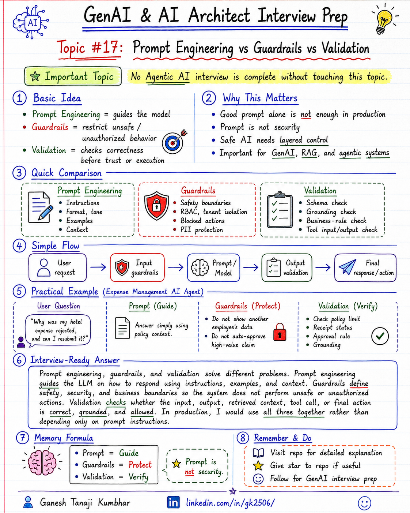

# GenAI & AI Architect Interview Prep

# Topic #17: Prompt Engineering vs Guardrails vs Validation



---

## Question

In an interview, you may be asked:

> What is the difference between prompt engineering, guardrails, and validation?

Or:

> Can prompt engineering alone make a GenAI application safe and reliable?

Or:

> How do you prevent an LLM from giving unsafe, incorrect, or unsupported answers?

Or:

> Where do you apply guardrails and validation in a production GenAI system?

---

## Why interviewer asks this

The interviewer is checking whether you understand that production GenAI safety is not only about writing a good prompt.

Many candidates say:

> I will add instructions in the prompt so the model behaves correctly.

That answer is incomplete.

A good prompt is important, but it is not enough for production systems.

A senior or architect-level answer should explain:

> Prompt engineering guides the model, guardrails restrict unsafe or unwanted behavior, and validation checks whether the input, output, or action is correct before trusting it.

This question tests your understanding of:

* Prompt design
* Input safety
* Output safety
* Business rule validation
* Grounding validation
* PII protection
* Role-based access
* Tool-call control
* Human approval
* Audit logging
* Production risk control

---

## Basic answer

Simple difference:

```text
Prompt Engineering = Guide the model

Guardrails = Prevent unsafe or unwanted behavior

Validation = Check correctness before trusting the result
```

In simple words:

* **Prompt engineering** tells the model what to do and how to respond.
* **Guardrails** define what the system should not allow.
* **Validation** checks whether the generated response or action is acceptable.

Basic answer:

> Prompt engineering improves model behavior through instructions, examples, and context. Guardrails protect the system from unsafe, unauthorized, or policy-violating behavior. Validation checks whether the input, output, or tool action is correct, grounded, and allowed before showing it to the user or executing it.

---

## Architect-level answer

A strong architect-level answer would be:

> In production GenAI systems, I would not rely only on prompt engineering. Prompts guide the model, but guardrails and validation provide control. I would use input guardrails to block unsafe or unauthorized requests, retrieval and tool guardrails to enforce permissions, prompt instructions to guide the response, output validation to check grounding, format, PII, policy compliance, and human approval for high-risk actions. This layered approach makes the system safer and more reliable.

---

## Must mention in interview

When answering this question, try to mention these points:

---

### 1. Prompt engineering guides behavior

Prompt engineering means writing clear instructions for the model.

It can control:

* Tone
* Format
* Role
* Output style
* Reasoning boundary
* Context usage
* Citation requirement
* Refusal instruction
* Tool usage instruction

Example prompt instruction:

```text
Answer only using the provided context.
If the answer is not available in the context, say:
"I do not have enough information."
Do not guess.
```

Prompt engineering is useful, but it is still soft control.

Important line:

> Prompt engineering guides the model, but it does not guarantee safe or correct behavior.

---

### 2. Guardrails restrict unsafe behavior

Guardrails are controls that prevent the system from doing unsafe, unauthorized, or unwanted things.

Guardrails can apply to:

* User input
* Prompt
* Retrieved context
* Tool calls
* Model output
* Final action
* Logs and storage

Examples:

```text
Do not allow users to access another tenant's data.
Do not allow AI to approve high-value claims automatically.
Do not expose PII in the response.
Do not call payment API without human approval.
```

Guardrails are important because the model may misunderstand instructions or user intent.

Memory line:

```text
Guardrails = Safety boundaries
```

---

### 3. Validation checks correctness

Validation means checking whether something is correct, complete, allowed, and safe.

Validation can happen:

* Before calling the model
* Before calling tools
* After model output
* Before showing response to user
* Before executing business action

Examples of validation:

* Is JSON schema valid?
* Are required fields present?
* Is the answer grounded in retrieved context?
* Are citations supporting the claim?
* Is the amount within allowed limit?
* Is the user authorized?
* Does the response contain PII?
* Is the tool call allowed?
* Is human approval required?

Memory line:

```text
Validation = Trust but verify
```

---

### 4. Prompt is not security

This is a very important interview point.

Do not treat prompt instructions as security controls.

Bad approach:

```text
Prompt: Do not show other user's data.
```

Better approach:

```text
Enforce tenant filtering, RBAC, access control, and data isolation before the model sees any data.
```

Prompt can guide the model, but security should be enforced outside the model.

Strong interview line:

> Security and authorization should be enforced in application logic, not only in the prompt.

---

### 5. Guardrails can be input-side and output-side

Guardrails are not only applied after the answer.

They can be applied at multiple stages.

Input-side guardrails:

* Block unsafe requests
* Detect prompt injection
* Check user authorization
* Validate tenant and role
* Remove or mask sensitive input
* Classify intent and risk

Output-side guardrails:

* Check for PII leakage
* Check unsafe content
* Check hallucination risk
* Check answer grounding
* Check format correctness
* Check policy compliance
* Escalate to human if needed

Simple flow:

```text
Input Guardrails
        ↓
LLM / RAG / Tools
        ↓
Output Guardrails
        ↓
Final Response or Action
```

---

### 6. Validation can be deterministic

Not everything should be left to the LLM.

Some validations should be deterministic.

Examples:

```text
Expense amount > allowed limit
Receipt missing
User role is not manager
Tenant ID mismatch
Required JSON field missing
Policy version is inactive
Approval amount exceeds threshold
```

These checks should be done using code, rules, database checks, or policy engines.

Important line:

> Use deterministic validation for business rules wherever possible.

---

### 7. Guardrails are especially important for tool calling

When an AI agent can call tools, guardrails become more important.

Tool calls can change real systems.

Examples:

* Create ticket
* Approve expense
* Send email
* Update database
* Trigger payment
* Delete record
* Grant access

For tool calls, check:

* Is the user authorized?
* Is the tool allowed for this user?
* Are parameters valid?
* Is the action high-risk?
* Is human approval required?
* Is audit logging enabled?

Strong interview line:

> Tool calling should be permission-aware, validated, and audited.

---

### 8. Validation is important for RAG answers

In RAG, validation checks whether the answer is supported by retrieved context.

Checks can include:

* Did the answer use retrieved context?
* Are citations present?
* Do citations support the answer?
* Is the answer using latest document version?
* Did the model add unsupported details?
* Is the answer complete?
* Is context insufficient?

Example:

If context says:

```text
Hotel reimbursement limit is ₹6,000.
```

The answer should not say:

```text
Hotel reimbursement limit is ₹8,000.
```

Memory line:

```text
Grounded Answer = Answer supported by context
```

---

### 9. Human-in-the-loop is also a guardrail

For high-risk actions, the AI should not be the final decision maker.

Examples:

* Approving high-value reimbursement
* Rejecting a claim
* Processing payment
* Giving legal decision
* Granting access
* Overriding compliance rules

Flow:

```text
AI recommends
        ↓
Human reviews
        ↓
Human approves
        ↓
System executes
        ↓
Audit logs
```

Important line:

> For high-risk decisions, AI should recommend, but humans should approve.

---

### 10. Observability is needed

Guardrails and validation should be logged and monitored.

Track:

* Blocked prompts
* Unsafe inputs
* Validation failures
* Unsupported answers
* PII detection
* Tool-call attempts
* Human escalation
* Refusal rate
* User feedback
* Policy violations
* Model output failures

This helps improve the system over time.

Strong interview line:

> In production, guardrail and validation failures should be observable, not hidden.

---

## Real-world example

### Example: Expense Management AI Agent

User asks:

> Why was my hotel expense rejected, and can I resubmit it?

The AI system may need to:

* Fetch expense details
* Retrieve expense policy
* Check receipt status
* Check reimbursement limit
* Check exception approval rule
* Generate answer
* Suggest next action

---

### Prompt engineering example

Prompt instruction:

```text
Answer in simple language.
Use only the retrieved policy context.
Explain the rejection reason.
Suggest the next possible action.
Do not approve or reject the claim yourself.
```

This guides the model response.

---

### Guardrail example

The system must ensure:

```text
User can only see their own expense.
AI cannot approve high-value claims.
AI cannot bypass policy rules.
AI cannot expose another employee's data.
Manager approval is required for exceptions.
```

This protects the system.

---

### Validation example

Before showing final answer, validate:

```text
Was the correct expense fetched?
Is the user authorized?
Is the policy active?
Is the hotel limit correct?
Is the receipt missing?
Is the answer supported by policy context?
Is approval required?
```

This checks correctness.

---

## Better production approach

A safer production flow can look like this:

```text
User question
        ↓
Authenticate user
        ↓
Check RBAC / tenant access
        ↓
Apply input guardrails
        ↓
Retrieve allowed context only
        ↓
Prompt LLM with clear instructions
        ↓
Generate response
        ↓
Validate answer against context and rules
        ↓
If high-risk, route to human approval
        ↓
Return answer with audit logging
```

This is better than relying only on prompt instructions.

---

## What can go wrong?

### 1. Relying only on prompt engineering

The prompt may say:

```text
Do not reveal sensitive data.
```

But if the system retrieves sensitive data incorrectly, the risk already exists.

```text
Prompt is not a replacement for access control.
```

---

### 2. No validation

The model may produce:

* Wrong amount
* Wrong policy interpretation
* Unsupported claim
* Invalid JSON
* Missing required fields
* Unsafe recommendation

Without validation, these errors may reach the user.

---

### 3. No tool-call guardrails

The agent may call tools incorrectly.

Example:

```text
Approve claim
Send email
Update ticket
Trigger payment
```

Without guardrails, this can create real business impact.

---

### 4. No grounding check

The answer may sound confident but may not be supported by retrieved context.

This creates hallucination risk.

```text
Confident answer is not always correct answer.
```

---

### 5. No human approval for high-risk actions

If the system directly executes high-risk actions, mistakes can become costly.

```text
High-risk action needs human approval.
```

---

## Common mistake

Many candidates say:

> I will write a better prompt.

This is incomplete.

Better answer:

> I would use prompt engineering to guide the model, guardrails to restrict unsafe or unauthorized behavior, and validation to verify the output or action before trusting it.

Another common mistake:

> Guardrails and validation are the same.

They are related, but not exactly the same.

Better answer:

> Guardrails define boundaries and prevent unsafe behavior, while validation checks whether the generated output, retrieved context, or requested action is correct and allowed.

---

## Better interview answer

A strong answer can be:

> Prompt engineering, guardrails, and validation solve different problems. Prompt engineering guides the LLM on how to respond. Guardrails define safety, security, and business boundaries so the system does not perform unsafe or unauthorized actions. Validation checks whether the input, output, retrieved context, tool call, or final action is correct, grounded, and allowed. In production, I would use all three together rather than depending only on prompt instructions.

---

## One-line answer

> Prompt engineering guides the model, guardrails restrict unsafe behavior, and validation verifies correctness before trusting the result.

---

## Memory formula

Use this formula:

```text
Prompt = Guide
Guardrails = Protect
Validation = Verify
```

Another version:

```text
Guide the model
Protect the system
Verify the result
```

Or:

```text
Prompt tells what to do
Guardrails define what not to allow
Validation checks if it is correct
```

Most important rule:

```text
Prompt is not security.
```

---

## Interview closing line

You can close your answer like this:

> In production GenAI systems, I would treat prompt engineering as only one layer. Real reliability comes from combining prompts with guardrails, validation, access control, human approval for high-risk actions, and observability.

---

## Related upcoming topics

* Why Production AI Fails After Demo Success
* Fallback Design When LLM Fails
* Rate Limits, Retries, and Circuit Breaker
* Observability for AI Applications
* PII Handling in GenAI Applications
* RBAC in AI Agents
* Audit Logging and Traceability
* Model Selection

---

## Reference Scenario

This topic can be understood using the common **Expense Management AI Agent** scenario used across this series.

You can refer to the scenario here:

```text
00-common-examples/expense-management-ai-agent-scenario.md
```

---

## About the Author

These notes are created and maintained by **Ganesh Tanaji Kumbhar**, an **AI Architect** with experience in **.NET, Azure, cloud architecture, infrastructure, enterprise application modernization, and GenAI solution design**.

I bring practical experience across:

* **.NET / C# / ASP.NET / Web API**
* **Azure App Services, Azure Functions, WebJobs, Azure SQL, Storage, Redis**
* **Cloud architecture and infrastructure modernization**
* **Application architecture and enterprise system design**
* **CI/CD, DevOps, monitoring, and production support**
* **GenAI, RAG, Agentic AI, and AI architecture patterns**

These notes are based on my real experience as both:

* An **interviewee**, facing AI, architecture, cloud, .NET, Azure, and system design rounds
* An **interviewer**, evaluating how candidates explain concepts, tradeoffs, project experience, and real-world design decisions

I write about:

* GenAI Architecture
* RAG System Design
* Agentic AI
* AI Architect Interview Preparation
* .NET and Azure Architecture
* Cloud and Enterprise AI Patterns

If you are preparing for **GenAI / AI Architect / Staff Engineer / Solution Architect / .NET Architect / Azure Architect** interviews, feel free to connect with me on LinkedIn.

🔗 **LinkedIn:** [Connect with me on LinkedIn](https://www.linkedin.com/in/gk2506/)

💬 You can also DM me on LinkedIn if you want to discuss AI architecture, interview preparation, .NET/Azure architecture, or practical GenAI learning.
