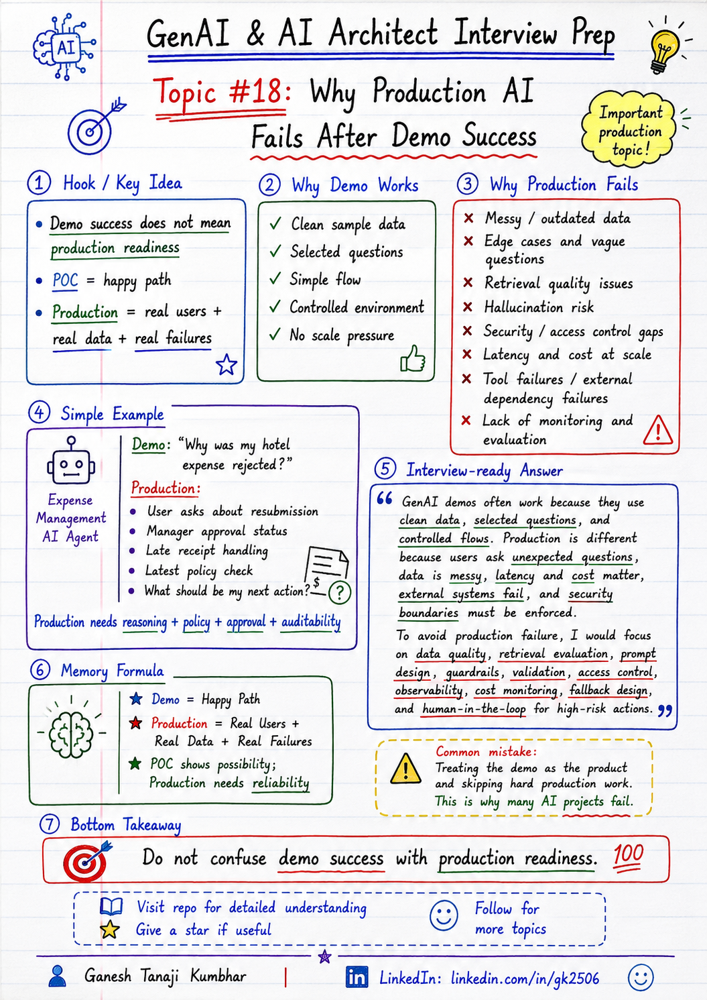

# GenAI & AI Architect Interview Prep

# Topic #18: Why Production AI Fails After Demo Success



---

## Question

In an interview, you may be asked:

> Why do many GenAI demos work well but fail in production?

Or:

> What are the common reasons an AI application fails after a successful POC?

Or:

> How would you move a GenAI solution from demo to production safely?

Or:

> What production risks do you consider before deploying an LLM-based application?

---

## Why interviewer asks this

The interviewer is checking whether you understand real-world AI delivery, not just demo building.

Many candidates can build a working GenAI demo.

But production systems face different challenges:

* Real users
* Messy data
* Edge cases
* Security
* Latency
* Cost
* Hallucination
* Rate limits
* Monitoring
* Access control
* Business workflows
* Failure handling

A senior or architect-level answer should explain:

> A GenAI demo proves that the idea can work in controlled conditions. Production proves that the system can work reliably, securely, and cost-effectively with real users, real data, failures, scale, and business constraints.

This question tests your understanding of:

* Production readiness
* AI reliability
* RAG quality
* Agent safety
* Observability
* Security
* Cost control
* Latency
* Fallback design
* Human-in-the-loop
* Evaluation
* Operational ownership

---

## Basic answer

A GenAI demo usually works because it is tested with a few controlled examples.

Production fails because real systems are not controlled.

Real users may ask unexpected questions.

Real data may be incomplete, duplicated, outdated, sensitive, or poorly structured.

External systems may fail.

LLM responses may be slow, costly, or incorrect.

Simple answer:

> GenAI demos fail in production because demos usually focus on happy-path answers, while production needs reliability, security, latency control, cost control, monitoring, fallback, access control, and evaluation.

---

## Architect-level answer

A strong architect-level answer would be:

> A GenAI demo may succeed with selected data, simple prompts, and controlled scenarios. But production requires handling real users, messy data, security boundaries, tenant isolation, hallucination, latency, token cost, rate limits, retries, tool failures, audit logging, evaluation, and human approval for risky actions. To move from demo to production, I would add proper data pipelines, retrieval evaluation, guardrails, validation, observability, access control, fallback design, cost monitoring, and a feedback loop.

---

## Must mention in interview

When answering this question, try to mention these points:

---

### 1. Demo data is usually clean

In a demo, we often use clean and selected documents.

Example:

```text
One PDF
Clean policy
Small dataset
Clear question
Expected answer
```

Production data is different.

It may contain:

* Old documents
* Duplicate documents
* Conflicting policies
* Missing metadata
* Poor formatting
* Scanned PDFs
* Tables
* Images
* Sensitive data
* Incomplete records

Important interview line:

> AI quality depends heavily on data quality.

---

### 2. Demo uses happy-path questions

In demos, users usually ask expected questions.

Production users ask real questions.

They may ask:

* Vague questions
* Follow-up questions
* Wrongly worded questions
* Multi-intent questions
* Out-of-scope questions
* Sensitive questions
* Questions requiring permissions
* Questions with missing context

Example:

```text
Demo question:
"What is the hotel reimbursement limit?"

Production question:
"My hotel expense got rejected. Can I resubmit it or do I need manager approval?"
```

The production question needs data lookup, policy retrieval, reasoning, and next-action guidance.

---

### 3. Retrieval may fail in production

In RAG demos, retrieval may work for simple examples.

In production, retrieval can fail because of:

* Bad chunking
* Missing metadata
* Wrong filters
* Old document versions
* Similar but irrelevant chunks
* Correct answer not in top-k
* No hybrid search
* No re-ranking
* Poor query rewriting

Memory line:

```text
Good demo answer does not guarantee good retrieval quality.
```

---

### 4. Hallucination is still possible

RAG reduces hallucination, but does not remove it completely.

Hallucination can happen when:

* Context is missing
* Wrong chunks are retrieved
* Model guesses
* Prompt allows assumptions
* Output is not validated
* Citations are weak
* User asks outside available knowledge

Important line:

> Production AI should know when not to answer.

Better behavior:

```text
"I do not have enough information in the available context to answer this confidently."
```

---

### 5. Security and access control are often missed in demos

A demo may not fully handle:

* Tenant isolation
* Role-based access control
* User permissions
* Sensitive data masking
* PII handling
* Audit logging
* Data leakage prevention
* Secure tool access

Bad approach:

```text
Prompt: Do not show other user's data.
```

Better approach:

```text
Enforce access control before retrieval, before tool calls, and before response generation.
```

Strong interview line:

> Prompt is not security. Access control must be enforced in application logic.

---

### 6. Cost becomes serious at scale

In a demo, cost may look small.

In production, cost can grow quickly due to:

* Large prompts
* Large context
* Long outputs
* Multiple LLM calls
* Agent tool calls
* Re-ranking
* Validation
* Retries
* Embedding generation
* Logging and storage

Example:

```text
₹1 per request may look small.
10 lakh requests per month becomes ₹10 lakh per month.
```

Important line:

> Token cost becomes an architecture concern at scale.

---

### 7. Latency becomes visible to users

A demo can tolerate slow responses.

Production users may not.

Latency can increase due to:

* Retrieval
* Re-ranking
* Tool calls
* External APIs
* Long context
* Long output
* Model selection
* Rate limits
* Retries
* Agent loops

Important line:

> In production GenAI apps, latency is part of user experience.

Measure:

```text
P50
P95
P99
```

Do not rely only on average latency.

---

### 8. Tool calls can fail or create risk

Agentic AI demos often show successful tool calling.

Production tool calls can fail or create real business impact.

Examples:

* Create ticket
* Send email
* Approve claim
* Update database
* Trigger payment
* Grant access
* Delete record

Before executing a tool call, check:

* Is the user authorized?
* Is the action allowed?
* Are parameters valid?
* Is human approval required?
* Is audit logging enabled?
* What happens if the tool fails?

Strong line:

> Tool calling should be permission-aware, validated, and audited.

---

### 9. No observability means blind debugging

In demos, we usually see the final answer.

In production, we need to know why the answer happened.

Track:

* Prompt
* Model version
* Retrieved chunks
* Retrieval score
* Tool calls
* Token usage
* Latency
* Errors
* User feedback
* Validation failures
* Guardrail blocks
* Hallucination reports
* Cost per request

Important line:

> Without observability, production AI issues become guesswork.

---

### 10. No evaluation process

A demo may be judged manually.

Production needs repeatable evaluation.

Evaluate:

* Retrieval accuracy
* Answer correctness
* Hallucination rate
* Citation quality
* Latency
* Cost
* Safety
* User satisfaction
* Business outcome

Important line:

> Production AI needs continuous evaluation, not one-time demo approval.

---

## Real-world example

### Example: Expense Management AI Agent

In a demo, the system may answer:

> Why was my hotel expense rejected?

And it correctly says:

```text
Your hotel expense was rejected because the amount exceeded the allowed limit.
```

This looks successful.

But in production, the user may ask:

> My hotel expense was rejected. Can I resubmit it? I have manager approval but the receipt was uploaded later.

Now the system must check:

* Expense record
* User identity
* Receipt status
* Policy limit
* Manager approval rule
* Exception workflow
* Latest policy version
* Allowed action
* Audit requirements

If the system only uses a simple prompt and basic retrieval, it may give an incomplete or wrong answer.

---

## Better production approach

A production-ready GenAI system should include:

```text
User question
        ↓
Authentication and authorization
        ↓
Input guardrails
        ↓
Intent and risk classification
        ↓
Allowed data retrieval
        ↓
RAG / tool calls
        ↓
Answer generation
        ↓
Validation and grounding check
        ↓
Human approval if high-risk
        ↓
Response with citation / next action
        ↓
Logging, monitoring, feedback
```

This is much stronger than a demo-only flow.

---

## What can go wrong?

### 1. Demo works only for selected examples

The system performs well for 5 sample questions but fails on real user questions.

```text
Demo coverage is not production coverage.
```

---

### 2. Wrong or outdated data is used

The model may answer from an old policy or wrong document version.

```text
Wrong data = wrong answer.
```

---

### 3. Retrieval returns similar but incorrect chunks

The answer may sound reasonable but may not use the correct policy section.

```text
Similar chunk is not always the correct chunk.
```

---

### 4. Cost increases unexpectedly

Multiple LLM calls, large prompts, and long context can make the system expensive.

```text
Small cost per request becomes large at scale.
```

---

### 5. Latency becomes unacceptable

The system may be accurate but too slow for real users.

```text
Accurate but slow can still fail as a product.
```

---

### 6. No fallback exists

If retrieval, model call, or tool call fails, the system may break.

```text
No fallback = poor production reliability.
```

---

### 7. No ownership after deployment

AI systems need ongoing monitoring and improvement.

Without ownership, issues remain hidden until users complain.

```text
Production AI is not deploy-and-forget.
```

---

## Common mistake

Many candidates say:

> The demo worked, so we can move to production.

This is incomplete.

Better answer:

> A successful demo only proves technical feasibility. Before production, I would validate data quality, retrieval quality, security, access control, latency, cost, hallucination risk, fallback design, monitoring, and evaluation.

Another common mistake:

> We will improve the prompt.

Better answer:

> Prompt improvement is only one part. Production readiness also needs data quality, guardrails, validation, observability, access control, and feedback loops.

---

## Better interview answer

A strong answer can be:

> GenAI demos often work because they use clean data, selected questions, and controlled flows. Production is different because users ask unexpected questions, data is messy, latency and cost matter, external systems fail, and security boundaries must be enforced. To avoid production failure, I would focus on data quality, retrieval evaluation, prompt design, guardrails, validation, access control, observability, cost monitoring, fallback design, and human-in-the-loop for high-risk actions.

---

## One-line answer

> GenAI demos prove feasibility, but production needs reliability, security, observability, cost control, latency control, and continuous evaluation.

---

## Memory formula

Use this formula:

```text
Demo = Happy Path
Production = Real Users + Real Data + Real Failures
```

Another version:

```text
Data Quality
+ Guardrails
+ Validation
+ Observability
+ Fallback
= Production Ready AI
```

Or:

```text
POC shows possibility.
Production needs reliability.
```

Most important rule:

```text
Do not confuse demo success with production readiness.
```

---

## Interview closing line

You can close your answer like this:

> I would treat demo success as the starting point, not the finish line. Before production, I would validate the solution against real data, real users, security rules, latency, cost, failures, monitoring, and business risk.

---

## Related upcoming topics

* Fallback Design When LLM Fails
* Rate Limits, Retries, and Circuit Breaker
* Observability for AI Applications
* Model Selection
* PII Handling in GenAI Applications
* RBAC in AI Agents
* Audit Logging and Traceability
* Production RAG Architecture

---

## Reference Scenario

This topic can be understood using the common **Expense Management AI Agent** scenario used across this series.

You can refer to the scenario here:

```text
00-common-examples/expense-management-ai-agent-scenario.md
```

---

## About the Author

These notes are created and maintained by **Ganesh Tanaji Kumbhar**, an **AI Architect** with experience in **.NET, Azure, cloud architecture, infrastructure, enterprise application modernization, and GenAI solution design**.

I bring practical experience across:

* **.NET / C# / ASP.NET / Web API**
* **Azure App Services, Azure Functions, WebJobs, Azure SQL, Storage, Redis**
* **Cloud architecture and infrastructure modernization**
* **Application architecture and enterprise system design**
* **CI/CD, DevOps, monitoring, and production support**
* **GenAI, RAG, Agentic AI, and AI architecture patterns**

These notes are based on my real experience as both:

* An **interviewee**, facing AI, architecture, cloud, .NET, Azure, and system design rounds
* An **interviewer**, evaluating how candidates explain concepts, tradeoffs, project experience, and real-world design decisions

I write about:

* GenAI Architecture
* RAG System Design
* Agentic AI
* AI Architect Interview Preparation
* .NET and Azure Architecture
* Cloud and Enterprise AI Patterns

If you are preparing for **GenAI / AI Architect / Staff Engineer / Solution Architect / .NET Architect / Azure Architect** interviews, feel free to connect with me on LinkedIn.

🔗 **LinkedIn:** [Connect with me on LinkedIn](https://www.linkedin.com/in/gk2506/)

💬 You can also DM me on LinkedIn if you want to discuss AI architecture, interview preparation, .NET/Azure architecture, or practical GenAI learning.
