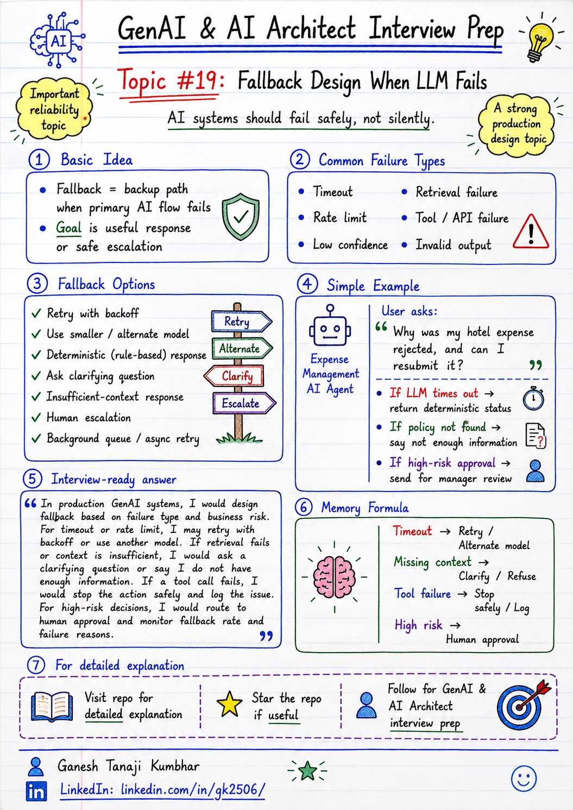

# GenAI & AI Architect Interview Prep

# Topic #19: Fallback Design When LLM Fails



---

## Question

In an interview, you may be asked:

> What will you do if the LLM fails?

Or:

> How do you design fallback handling in a GenAI application?

Or:

> What should happen when an AI response is slow, unavailable, wrong, or low confidence?

Or:

> How do you make an LLM-based system reliable in production?

---

## Why interviewer asks this

The interviewer is checking whether you understand production reliability.

Many candidates explain the happy path:

```text
User question → LLM answer → Response
```

But production systems do not always work like that.

LLM-based systems can fail because of:

* Model timeout
* Rate limit
* Network issue
* Invalid response format
* Hallucination risk
* Low confidence
* Retrieval failure
* Tool-call failure
* Policy violation
* Safety filter
* External API failure
* Cost or latency limit
* Context too large

A senior or architect-level answer should explain:

> A production GenAI system should not depend on only one successful LLM call. It should have fallback paths, retries, timeouts, degraded responses, deterministic flows, human escalation, and monitoring.

This question tests your understanding of:

* Reliability
* Resilience
* Timeout handling
* Retry strategy
* Fallback design
* Human escalation
* Low-confidence handling
* RAG failure handling
* Tool-call failure
* User experience
* Observability
* Production AI architecture

---

## Basic answer

Fallback means having a backup plan when the primary AI flow fails.

Simple answer:

> If the LLM fails, I would not let the system break silently. I would use retries, timeouts, cached responses, smaller models, deterministic rules, human escalation, or a graceful message depending on the use case and risk level.

In simple words:

```text
Primary AI flow fails
        ↓
Use safe backup path
        ↓
Return useful response or escalate
```

Fallback does not always mean calling another LLM.

Fallback can be:

* Retry
* Use cached answer
* Use smaller or different model
* Ask clarifying question
* Return partial answer
* Use deterministic workflow
* Escalate to human
* Queue for background processing
* Say “I do not have enough information”
* Stop high-risk action safely

---

## Architect-level answer

A strong architect-level answer would be:

> In production GenAI systems, I would design fallback based on failure type and business risk. For transient failures like timeout or rate limit, I may retry with backoff or use another model. For retrieval failure, I may ask a clarifying question or return “insufficient information.” For low-confidence or high-risk answers, I would route to human review. For tool-call failures, I would stop the action, log the issue, and provide a safe response. I would also monitor fallback rate, failure reason, latency, and user impact.

---

## Must mention in interview

When answering this question, try to mention these points:

---

### 1. Do not assume the LLM will always work

A common mistake is designing only the happy path.

Bad approach:

```text
User asks
    ↓
LLM answers
    ↓
Done
```

Production-ready systems need to handle:

* LLM unavailable
* LLM timeout
* Invalid output
* Unsafe output
* Unsupported answer
* Slow response
* Tool failure
* Retrieval failure

Important interview line:

> In production, LLM calls should be treated like external dependencies that can fail.

---

### 2. Use timeout

The system should not wait forever for the LLM or tool call.

Timeouts can be applied to:

* LLM call
* Embedding call
* Vector search
* Re-ranker
* Tool call
* External API
* Validation service

Example:

```text
If LLM response takes more than 10 seconds,
use fallback instead of keeping user waiting.
```

Strong interview line:

> Timeout protects user experience and prevents one slow dependency from blocking the full system.

---

### 3. Retry only when it makes sense

Retry can help for temporary failures.

Examples:

* Network issue
* Rate limit
* Temporary model error
* External API timeout
* Service unavailable

But retry should be controlled.

Use:

* Retry count limit
* Exponential backoff
* Jitter
* Circuit breaker
* Idempotency for actions

Bad retry design can increase:

* Cost
* Latency
* Duplicate tool actions
* Load on failing service
* User frustration

Important line:

> Retry is useful for transient failures, but unsafe for non-idempotent actions without proper control.

---

### 4. Use a smaller or alternate model

If the primary model is slow, costly, or unavailable, fallback can use another model.

Example:

```text
Primary model unavailable
        ↓
Use smaller/faster model
        ↓
Return simpler answer
```

But this should depend on use case.

A smaller model may be okay for:

* FAQ
* Simple summary
* Basic classification
* Status explanation

But not enough for:

* Complex reasoning
* Compliance decision
* High-risk approval
* Legal or financial recommendation

Strong interview line:

> Model fallback should consider task complexity and risk, not only availability.

---

### 5. Use deterministic fallback

Not every fallback should be another LLM.

For some cases, deterministic logic is better.

Examples:

```text
Expense status lookup
Policy threshold check
Receipt missing check
Approval workflow status
User permission check
```

Instead of asking the LLM again, the system can return a rule-based response.

Example:

```text
Your expense is currently rejected because receipt is missing.
Please upload the receipt and resubmit.
```

This is reliable and cheaper.

Memory line:

```text
When rules are clear, use deterministic fallback.
```

---

### 6. Ask a clarifying question

If the user question is vague, fallback can ask for more information.

Example:

User asks:

```text
Can I claim this?
```

The system may not know what “this” means.

Better fallback:

```text
Please share the expense type or expense ID so I can check the correct policy.
```

This is better than guessing.

Important line:

> Asking a clarifying question is a valid fallback when the system does not have enough context.

---

### 7. Return insufficient-context response

If retrieval fails or the answer is not grounded, the system should not hallucinate.

Bad response:

```text
Yes, you can claim it.
```

Better response:

```text
I could not find enough information in the available policy documents to answer this confidently.
```

This is important in RAG systems.

Memory line:

```text
No context = no confident answer
```

---

### 8. Use human escalation for high-risk cases

For high-risk scenarios, fallback should route to a human.

Examples:

* Approving payment
* Rejecting claim
* Granting access
* Compliance decision
* Legal decision
* High-value reimbursement
* Customer-impacting action

Flow:

```text
AI cannot decide confidently
        ↓
Create review task
        ↓
Human reviews
        ↓
Human approves/rejects
        ↓
Audit logs
```

Strong interview line:

> For high-risk decisions, fallback should be human review, not another guess from the model.

---

### 9. Queue background processing

Some requests do not need instant response.

If the AI task is long-running, fallback can queue the work.

Examples:

* Large document summary
* Bulk document analysis
* Complex claim review
* Multi-step investigation
* Report generation

Response to user:

```text
This may take longer. I have queued the request and will notify you once it is ready.
```

This improves user experience.

---

### 10. Monitor fallback rate

Fallbacks should be observable.

Track:

* How often fallback happens
* Which fallback path was used
* Failure reason
* Model timeout rate
* Retrieval failure rate
* Tool failure rate
* Low-confidence rate
* Human escalation rate
* User satisfaction
* Cost impact
* Latency impact

Important interview line:

> High fallback rate is a production signal that the AI system needs improvement.

---

## Real-world example

### Example: Expense Management AI Agent

User asks:

> Why was my hotel expense rejected, and can I resubmit it?

The system may need to:

* Fetch expense details
* Retrieve policy
* Check receipt status
* Check hotel limit
* Check exception approval rule
* Generate answer
* Suggest next action

---

### Failure scenario 1: LLM timeout

The LLM does not respond within the timeout.

Fallback:

```text
Use deterministic status response:
"Your expense is rejected. Receipt is missing. Please upload the receipt and resubmit."
```

If detailed policy explanation is needed, the system can say:

```text
I am unable to generate the detailed explanation right now. Please try again or contact Finance support.
```

---

### Failure scenario 2: Retrieval fails

The system cannot find the correct policy chunk.

Fallback:

```text
I could not find the relevant policy section to answer this confidently.
Please check with Finance or provide more details.
```

Better than hallucinating.

---

### Failure scenario 3: Tool call fails

The expense API is unavailable.

Fallback:

```text
I am unable to fetch your expense details right now.
Please try again later.
```

Also log:

```text
Expense API failure
User ID
Request ID
Timestamp
Correlation ID
```

---

### Failure scenario 4: High-risk action

User asks:

> Can you approve this exception?

Fallback:

```text
I cannot approve this automatically. I can create a request for manager review.
```

This is safer than direct action.

---

## Better production approach

A production-ready fallback flow can look like this:

```text
User request
        ↓
Classify intent and risk
        ↓
Run primary AI flow
        ↓
Did it succeed?
        ↓
If yes → return answer
        ↓
If no → identify failure type
        ↓
Apply fallback:
- retry
- smaller model
- cached answer
- deterministic response
- ask clarification
- insufficient-context response
- human escalation
- background queue
        ↓
Log failure and fallback path
        ↓
Monitor and improve
```

---

## What can go wrong?

### 1. No fallback

The system fails completely when the LLM fails.

```text
No fallback = poor production reliability
```

---

### 2. Retry without control

Too many retries can increase cost and latency.

```text
Bad retry design can make failure worse.
```

---

### 3. Fallback gives unsafe answer

A fallback should not reduce safety.

Example:

```text
Primary model refused because context was insufficient.
Fallback model gives confident answer without context.
```

This is dangerous.

---

### 4. Same fallback for every failure

Different failures need different fallback strategies.

Example:

```text
Rate limit → retry/backoff or alternate model
Missing context → ask clarification or refuse
High-risk action → human review
Tool failure → graceful message and retry later
```

---

### 5. No monitoring

If fallback happens silently, the team cannot improve the system.

```text
Hidden fallback = hidden production issue
```

---

## Common mistake

Many candidates say:

> I will retry the LLM call.

This is incomplete.

Better answer:

> Retry is only one fallback. I would choose fallback based on failure type and risk. For timeout or rate limit, retry or use alternate model. For missing context, ask clarification or refuse. For high-risk action, escalate to human. For tool failure, stop safely and show a graceful response.

Another common mistake:

> I will use another model.

This may help, but it is not always safe.

Better answer:

> Alternate model fallback should be used only when it is suitable for the task and risk level. For high-risk or low-confidence cases, human review is safer.

---

## Better interview answer

A strong answer can be:

> I would design fallback based on the failure type and business risk. If the LLM times out or hits a rate limit, I may retry with backoff or use an alternate model. If retrieval fails or context is insufficient, I would ask a clarifying question or say that I do not have enough information. If a tool call fails, I would stop the action safely and log the issue. For high-risk decisions, I would route to human approval. I would also track fallback rate, failure reasons, latency, cost, and user feedback to improve the system over time.

---

## One-line answer

> Fallback design means the AI system should fail safely, respond gracefully, and escalate when needed instead of depending on one successful LLM call.

---

## Memory formula

Use this formula:

```text
Timeout → Retry / Alternate model
Missing context → Clarify / Refuse
Tool failure → Stop safely / Log
High risk → Human approval
```

Another version:

```text
Fail safely
Respond gracefully
Escalate wisely
Monitor always
```

Or:

```text
LLM failed ≠ System failed
```

Most important rule:

```text
Do not let the AI system fail silently or act unsafely.
```

---

## Interview closing line

You can close your answer like this:

> In production GenAI systems, fallback is not optional. I would design the system to handle timeout, rate limit, retrieval failure, tool failure, low confidence, and high-risk actions with safe fallback paths, human escalation, and observability.

---

## Related upcoming topics

* Rate Limits, Retries, and Circuit Breaker
* Observability for AI Applications
* Model Selection
* PII Handling in GenAI Applications
* RBAC in AI Agents
* Audit Logging and Traceability
* Production RAG Architecture

---

## Reference Scenario

This topic can be understood using the common **Expense Management AI Agent** scenario used across this series.

You can refer to the scenario here:

```text
00-common-examples/expense-management-ai-agent-scenario.md
```

---

## About the Author

These notes are created and maintained by **Ganesh Tanaji Kumbhar**, an **AI Architect** with experience in **.NET, Azure, cloud architecture, infrastructure, enterprise application modernization, and GenAI solution design**.

I bring practical experience across:

* **.NET / C# / ASP.NET / Web API**
* **Azure App Services, Azure Functions, WebJobs, Azure SQL, Storage, Redis**
* **Cloud architecture and infrastructure modernization**
* **Application architecture and enterprise system design**
* **CI/CD, DevOps, monitoring, and production support**
* **GenAI, RAG, Agentic AI, and AI architecture patterns**

These notes are based on my real experience as both:

* An **interviewee**, facing AI, architecture, cloud, .NET, Azure, and system design rounds
* An **interviewer**, evaluating how candidates explain concepts, tradeoffs, project experience, and real-world design decisions

I write about:

* GenAI Architecture
* RAG System Design
* Agentic AI
* AI Architect Interview Preparation
* .NET and Azure Architecture
* Cloud and Enterprise AI Patterns

If you are preparing for **GenAI / AI Architect / Staff Engineer / Solution Architect / .NET Architect / Azure Architect** interviews, feel free to connect with me on LinkedIn.

🔗 **LinkedIn:** [Connect with me on LinkedIn](https://www.linkedin.com/in/gk2506/)

💬 You can also DM me on LinkedIn if you want to discuss AI architecture, interview preparation, .NET/Azure architecture, or practical GenAI learning.
