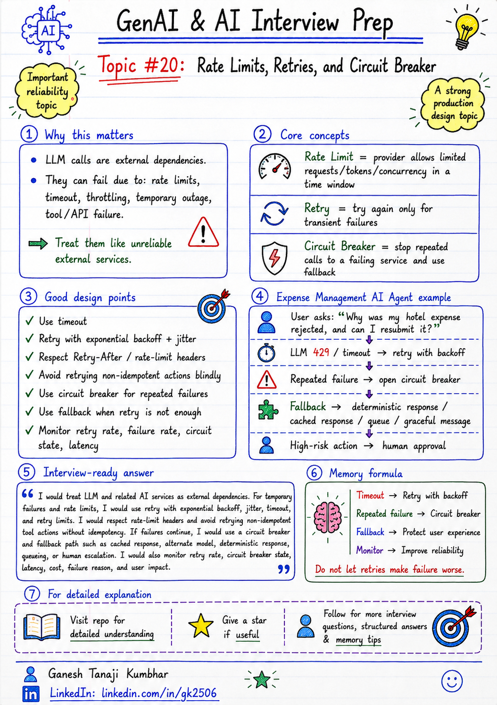

# GenAI & AI Architect Interview Prep

# Topic #20: Rate Limits, Retries, and Circuit Breaker



---

## Question

In an interview, you may be asked:

> How do you handle rate limits in an LLM-based application?
 
Or:

> What is retry strategy in GenAI systems?

Or:

> Why do we need circuit breaker when calling LLMs or external AI services?

Or:

> How do you design a reliable AI application when LLM APIs, vector DB, or tool APIs can fail?

---

## Why interviewer asks this

The interviewer is checking whether you understand that LLM calls are external dependencies.

Many candidates explain only the happy path:

```text
User question → LLM call → Answer
```

But production systems face failures.

LLM APIs and external services can fail due to:

* Rate limits
* Timeout
* Throttling
* Network issue
* Model overload
* Service unavailable
* Slow response
* Temporary outage
* Tool API failure
* Vector DB failure
* Re-ranker failure
* Authentication issue
* Quota exhaustion

A senior or architect-level answer should explain:

> LLM calls should be treated like any other unreliable external dependency. We need timeout, retry with backoff, circuit breaker, fallback, queueing, monitoring, and graceful degradation.

This question tests your understanding of:

* Production reliability
* Rate limits
* Retry strategy
* Exponential backoff
* Jitter
* Circuit breaker
* Timeout handling
* Fallback design
* Idempotency
* Queueing
* Load shedding
* Observability
* Cost and latency impact

---

## Basic answer

Rate limits mean the provider allows only a certain number of requests or tokens within a time window.

Example:

```text
Requests per minute
Tokens per minute
Requests per day
Concurrent request limit
```

Retry means trying the failed request again when the failure is temporary.

Circuit breaker means temporarily stopping calls to a failing service so the whole system does not keep waiting, retrying, and failing repeatedly.

Simple answer:

> For rate limits and temporary failures, I would use retries with exponential backoff and jitter. For repeated failures, I would open a circuit breaker and use fallback instead of continuously calling the failing service. I would also monitor failure rate, retry count, latency, and fallback usage.

---

## Architect-level answer

A strong architect-level answer would be:

> In production GenAI systems, I would treat LLM, embedding, vector search, re-ranking, and tool APIs as external dependencies. I would add timeouts, retry only for transient errors, use exponential backoff with jitter, respect rate-limit headers, avoid retry storms, and use circuit breaker when failure rate crosses a threshold. If the circuit is open, I would use fallback such as cached response, smaller model, queueing, deterministic response, or human escalation depending on risk. I would also monitor rate-limit errors, retry rate, circuit state, latency, cost, and user impact.

---

## Must mention in interview

When answering this question, try to mention these points:

---

### 1. LLM APIs are external dependencies

Do not assume LLM API will always respond successfully.

LLM calls can fail like any other external service.

Examples:

* Azure OpenAI / OpenAI rate limit
* Embedding API timeout
* Vector DB slow response
* Re-ranker unavailable
* External tool API failure
* Network issue
* Temporary service outage

Important interview line:

> LLM calls should be designed with the same reliability patterns we use for external APIs.

---

### 2. Rate limits are expected in production

Rate limits are not rare edge cases.

They can happen when:

* Traffic increases
* Many users ask questions together
* Prompts are large
* Output is long
* Multiple LLM calls happen per request
* Agent loops call the model repeatedly
* Batch jobs run during peak hours
* Retry logic creates extra load

Rate limits can be based on:

```text
Requests per minute
Tokens per minute
Concurrent requests
Daily quota
Model-level capacity
Region-level capacity
```

Important line:

> In GenAI systems, token rate limit is as important as request rate limit.

---

### 3. Retry should be controlled

Retry is useful for temporary failures, but bad retry logic can make production problems worse.

Retry can help for:

* Timeout
* Network glitch
* Temporary 429 rate limit
* 503 service unavailable
* Short-lived dependency issue

But retry should not be unlimited.

Use:

* Maximum retry count
* Exponential backoff
* Jitter
* Timeout
* Circuit breaker
* Idempotency checks
* Retry only for retryable errors

Bad retry design can cause:

* Higher cost
* Higher latency
* Duplicate actions
* More load on failing service
* Retry storm
* Poor user experience

Important interview line:

> Retry is not a solution for every failure. Retry only when the error is transient and the action is safe to retry.

---

### 4. Use exponential backoff and jitter

If many requests fail and all retry immediately, the system can overload the dependency again.

Bad retry:

```text
Retry immediately after failure
```

Better retry:

```text
Retry after 1 second
Retry after 2 seconds
Retry after 4 seconds
Add random jitter
```

Jitter means adding small randomness so all clients do not retry at the same time.

Memory line:

```text
Backoff reduces pressure.
Jitter avoids retry spikes.
```

---

### 5. Respect rate-limit headers

Many providers return rate-limit information.

Examples:

```text
Retry-After
Remaining requests
Remaining tokens
Reset time
```

Better systems use these signals.

Example:

```text
If Retry-After = 20 seconds,
do not retry immediately.
```

Strong interview line:

> I would respect provider rate-limit headers instead of blindly retrying.

---

### 6. Circuit breaker prevents repeated failure

Circuit breaker protects the system when a dependency is continuously failing.

It has three common states:

```text
Closed    = Calls are allowed
Open      = Calls are blocked temporarily
Half-open = Try limited calls to check recovery
```

Example:

```text
If 50% of LLM calls fail in last 1 minute,
open the circuit for 30 seconds.
```

When circuit is open:

* Do not call failing service
* Use fallback
* Return graceful response
* Queue request if suitable
* Try again later using half-open state

Important interview line:

> Circuit breaker prevents one failing dependency from affecting the full system.

---

### 7. Avoid retrying non-idempotent actions blindly

Some actions are safe to retry.

Example:

```text
Read expense status
Search policy
Generate answer
```

Some actions are risky to retry.

Example:

```text
Approve claim
Send payment
Create duplicate ticket
Send email
Update database
```

For non-idempotent actions, use:

* Idempotency key
* Request ID
* Deduplication
* Transaction status check
* Human approval
* Audit logging

Important line:

> Retrying action tools without idempotency can create duplicate business actions.

---

### 8. Use queueing for traffic spikes

If many requests arrive together, queueing can protect the system.

Useful for:

* Batch document processing
* Report generation
* Large summarization jobs
* Non-urgent workflows
* Background analysis
* Bulk embedding generation

Queueing helps:

* Smooth traffic spikes
* Respect rate limits
* Control concurrency
* Retry safely
* Improve reliability

Example:

```text
User submits large document analysis
        ↓
Request added to queue
        ↓
Worker processes when capacity is available
        ↓
User gets notification
```

---

### 9. Use fallback when retry is not enough

If retry fails or circuit is open, use fallback.

Fallback options:

* Smaller/faster model
* Cached answer
* Deterministic rule
* Ask clarifying question
* Return partial response
* Queue for later
* Human escalation
* Graceful error message

Example:

```text
LLM unavailable
        ↓
Return deterministic expense status
        ↓
Ask user to try detailed explanation later
```

Important line:

> Retry handles temporary failure. Fallback protects user experience when failure continues.

---

### 10. Monitor everything

Rate limit and retry behavior should be visible.

Track:

* Rate-limit errors
* Retry count
* Retry success rate
* Circuit breaker open count
* Timeout count
* Dependency failure rate
* P50 / P95 / P99 latency
* Token usage
* Cost impact
* Queue length
* Fallback rate
* User impact

Strong interview line:

> If retries and circuit breakers are not observable, production reliability issues remain hidden.

---

## Real-world example

### Example: Expense Management AI Agent

User asks:

> Why was my hotel expense rejected, and can I resubmit it?

The system may call:

* Expense API
* Policy search
* Embedding service
* Vector DB
* LLM
* Validation service
* Notification service

---

### Failure scenario 1: LLM rate limit

The LLM provider returns:

```text
429 Too Many Requests
```

Bad approach:

```text
Retry immediately for every failed request.
```

This can create more load and more failures.

Better approach:

```text
Respect Retry-After header
Use exponential backoff with jitter
Limit retry count
Use fallback if retry fails
Monitor rate-limit errors
```

---

### Failure scenario 2: Expense API timeout

The expense API does not respond.

Fallback:

```text
I am unable to fetch your expense details right now.
Please try again later.
```

Also log:

```text
User ID
Expense ID
Correlation ID
Failure reason
Dependency name
Timestamp
```

---

### Failure scenario 3: Repeated LLM failures

If many LLM calls fail continuously:

```text
Circuit breaker opens
        ↓
Stop calling LLM temporarily
        ↓
Use cached / deterministic / graceful fallback
        ↓
Try limited call after cooldown
```

This protects the system from repeated failures.

---

### Failure scenario 4: Action tool retry risk

User asks:

> Create an approval request for this expense.

If the tool times out after creating the request, retrying blindly may create duplicate approval requests.

Better approach:

```text
Use idempotency key
Check request status before retry
Log action attempt
Avoid duplicate submission
```

---

## Better production approach

A production-ready reliability flow can look like this:

```text
User request
        ↓
Classify intent and risk
        ↓
Call dependency with timeout
        ↓
Success?
        ↓
If temporary failure:
    Retry with backoff + jitter
        ↓
If repeated failure:
    Open circuit breaker
        ↓
Use fallback:
    cached response
    deterministic response
    alternate model
    queue
    human escalation
        ↓
Log and monitor
```

---

## What can go wrong?

### 1. Retry storm

Many failed requests retry together and overload the service.

```text
Bad retries can increase outage impact.
```

---

### 2. Infinite retry

Unlimited retries increase latency, cost, and user frustration.

```text
Retry must have limits.
```

---

### 3. Duplicate business action

Retrying tool calls without idempotency can create duplicate actions.

```text
Unsafe retry can create real business issues.
```

---

### 4. No circuit breaker

The system keeps calling a failing dependency and wastes time, money, and capacity.

```text
No circuit breaker = repeated failure.
```

---

### 5. No fallback

If dependency fails, the user gets a broken experience.

```text
No fallback = poor reliability.
```

---

### 6. No monitoring

The team may not know rate limits are happening until users complain.

```text
No observability = blind production support.
```

---

## Common mistake

Many candidates say:

> I will retry the request.

This is incomplete.

Better answer:

> I would retry only transient failures using exponential backoff and jitter, limit retry count, respect rate-limit headers, and avoid retrying non-idempotent actions blindly.

Another common mistake:

> I will switch to another model.

This may help, but it is not enough.

Better answer:

> I would use model fallback only when appropriate, and combine it with timeout, circuit breaker, queueing, deterministic fallback, human escalation, and monitoring.

---

## Better interview answer

A strong answer can be:

> I would treat LLM and related AI services as external dependencies. For temporary failures and rate limits, I would use retry with exponential backoff, jitter, timeout, and retry limits. I would respect rate-limit headers and avoid retrying non-idempotent tool actions without idempotency. If failures continue, I would use a circuit breaker and fallback path such as cached response, alternate model, deterministic response, queueing, or human escalation. I would also monitor retry rate, circuit breaker state, latency, cost, failure reason, and user impact.

---

## One-line answer

> Use timeout, controlled retries, exponential backoff, circuit breaker, and fallback so the AI system remains reliable when dependencies fail.

---

## Memory formula

Use this formula:

```text
Timeout
Retry with backoff
Circuit breaker
Fallback
Monitor
```

Another version:

```text
Transient failure → Retry
Repeated failure → Circuit breaker
Business risk → Human approval
```

Or:

```text
Backoff protects dependency.
Circuit breaker protects system.
Fallback protects user experience.
```

Most important rule:

```text
Do not let retries make failure worse.
```

---

## Interview closing line

You can close your answer like this:

> In production GenAI systems, I would not call the LLM blindly. I would design dependency calls with timeout, retry limits, exponential backoff, jitter, circuit breaker, fallback, idempotency for actions, and observability.

---

## Related upcoming topics

* Observability for AI Applications
* Model Selection
* PII Handling in GenAI Applications
* RBAC in AI Agents
* Audit Logging and Traceability
* Production RAG Architecture
* Fallback Design When LLM Fails

---

## Reference Scenario

This topic can be understood using the common **Expense Management AI Agent** scenario used across this series.

You can refer to the scenario here:

```text
00-common-examples/expense-management-ai-agent-scenario.md
```

---

## About the Author

These notes are created and maintained by **Ganesh Tanaji Kumbhar**, an **AI Architect** with experience in **.NET, Azure, cloud architecture, infrastructure, enterprise application modernization, and GenAI solution design**.

I bring practical experience across:

* **.NET / C# / ASP.NET / Web API**
* **Azure App Services, Azure Functions, WebJobs, Azure SQL, Storage, Redis**
* **Cloud architecture and infrastructure modernization**
* **Application architecture and enterprise system design**
* **CI/CD, DevOps, monitoring, and production support**
* **GenAI, RAG, Agentic AI, and AI architecture patterns**

These notes are based on my real experience as both:

* An **interviewee**, facing AI, architecture, cloud, .NET, Azure, and system design rounds
* An **interviewer**, evaluating how candidates explain concepts, tradeoffs, project experience, and real-world design decisions

I write about:

* GenAI Architecture
* RAG System Design
* Agentic AI
* AI Architect Interview Preparation
* .NET and Azure Architecture
* Cloud and Enterprise AI Patterns

If you are preparing for **GenAI / AI Architect / Staff Engineer / Solution Architect / .NET Architect / Azure Architect** interviews, feel free to connect with me on LinkedIn.

🔗 **LinkedIn:** [Connect with me on LinkedIn](https://www.linkedin.com/in/gk2506/)

💬 You can also DM me on LinkedIn if you want to discuss AI architecture, interview preparation, .NET/Azure architecture, or practical GenAI learning.
