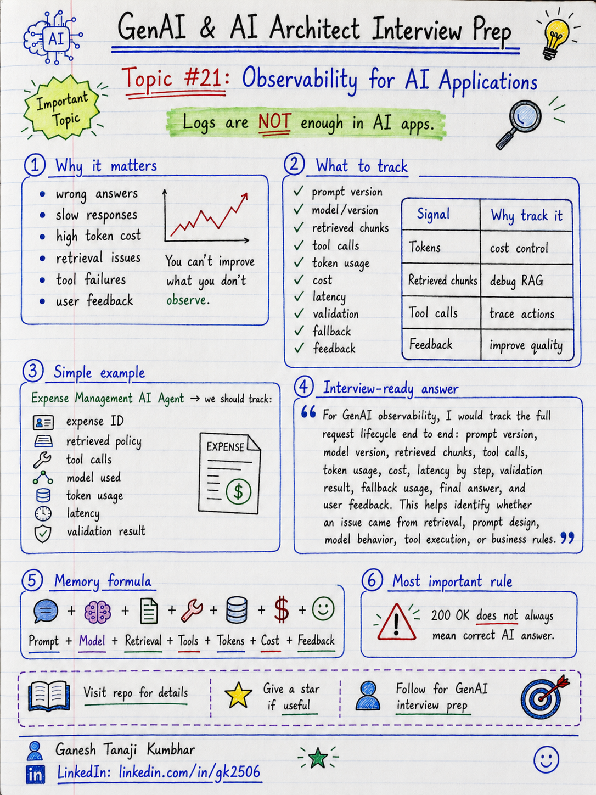

# GenAI & AI Architect Interview Prep

# Topic #21: Observability for AI Applications



---

## Question

In an interview, you may be asked:

> How do you monitor a GenAI application in production?

Or:

> What observability metrics would you track for an LLM-based system?

Or:

> Why are normal application logs not enough for AI applications?

Or:

> How do you debug wrong, slow, costly, or hallucinated AI responses?

---

## Why interviewer asks this

The interviewer is checking whether you understand that production AI systems need more than normal logs.

Many candidates say:

> I will log errors and monitor latency.

That answer is incomplete.

Traditional monitoring is still required, but GenAI systems need additional visibility into:

* Prompt
* Model
* Token usage
* Cost
* Latency
* Retrieved chunks
* Tool calls
* User feedback
* Hallucination risk
* Guardrail failures
* Validation failures
* Fallback usage
* Model version
* Retrieval quality
* Final answer quality

A senior or architect-level answer should explain:

> Observability in GenAI applications means tracking not only infrastructure and API metrics, but also AI-specific signals like prompts, responses, retrieval quality, token usage, model behavior, tool calls, guardrails, validation, cost, and user feedback.

This question tests your understanding of:

* Production monitoring
* LLM tracing
* Prompt logging
* Token usage
* Cost tracking
* RAG observability
* Agent observability
* Tool-call tracing
* Hallucination monitoring
* User feedback loop
* Model version tracking
* Evaluation and continuous improvement

---

## Basic answer

Observability means understanding what is happening inside the system.

For normal applications, we usually track:

* Logs
* Errors
* Latency
* CPU
* Memory
* API failures
* Database performance

For GenAI applications, we need all of that plus AI-specific signals.

Simple answer:

> For a GenAI application, I would monitor request latency, errors, model calls, token usage, cost, prompts, responses, retrieved context, tool calls, guardrail failures, validation failures, fallback usage, and user feedback.

In simple words:

```text
Normal App Observability
        +
AI-specific Observability
        =
Production-ready GenAI Monitoring
```

---

## Architect-level answer

A strong architect-level answer would be:

> In production GenAI applications, I would design observability across the full AI request lifecycle. I would track user request, prompt version, model version, retrieved chunks, retrieval scores, tool calls, token usage, latency by step, cost, guardrail decisions, validation results, fallback path, final answer, citations, and user feedback. I would also use correlation IDs and tracing to debug each request end-to-end. This helps identify whether a failure came from retrieval, prompt, model, tool, validation, latency, cost, or access control.

---

## Must mention in interview

When answering this question, try to mention these points:

---

### 1. Logs alone are not enough

A common mistake is to say:

```text
We will check application logs.
```

Logs are useful, but they may not explain why the AI gave a wrong answer.

For example, if a user says:

```text
The AI gave the wrong policy answer.
```

Normal logs may only show:

```text
API returned 200 OK
```

But that does not tell us:

* What prompt was sent?
* Which model was used?
* Which chunks were retrieved?
* Was the correct chunk missing?
* Did validation fail?
* Did fallback happen?
* Was the answer grounded?
* Which tool calls were executed?

Important interview line:

> In GenAI systems, a successful API response does not always mean a correct AI response.

---

### 2. Track the full AI request flow

A GenAI request may have many steps.

Example:

```text
User question
        ↓
Intent classification
        ↓
Retrieval / tool calls
        ↓
Prompt construction
        ↓
LLM call
        ↓
Validation
        ↓
Fallback if needed
        ↓
Final response
```

Observability should cover each step.

Track:

* Request ID
* User ID or anonymized user reference
* Tenant ID
* Session ID
* Prompt version
* Model name and version
* Retrieval query
* Retrieved document IDs
* Tool calls
* Latency per step
* Final response
* Feedback

Strong interview line:

> I would use correlation ID and distributed tracing to follow the full GenAI request path.

---

### 3. Track latency by step

Do not track only total response time.

Break latency into:

* API latency
* Authentication latency
* Retrieval latency
* Embedding latency
* Vector search latency
* Re-ranking latency
* Tool-call latency
* LLM latency
* Validation latency
* Queue wait time
* Fallback latency

Example:

```text
Total latency = 9 seconds

Retrieval = 1 second
Tool calls = 2 seconds
LLM generation = 5 seconds
Validation = 1 second
```

Now we know where to optimize.

Important line:

> If P95 or P99 latency is high, step-level tracing helps find the real bottleneck.

---

### 4. Track token usage and cost

In GenAI systems, cost is directly connected to token usage.

Track:

* Input tokens
* Output tokens
* Total tokens
* Tokens by model
* Tokens by tenant
* Tokens by user
* Tokens by feature
* Cost per request
* Cost per workflow
* Daily and monthly cost
* Retry cost
* Failed request cost

Important interview line:

> Token usage should be treated as a production cost metric, not just a technical detail.

Example:

```text
Large prompt
+ Too much retrieved context
+ Long output
+ Multiple retries
= Higher cost
```

---

### 5. Track model and prompt version

AI behavior can change when we change:

* Model
* Prompt
* System message
* Retrieval strategy
* Chunking
* Temperature
* Context size
* Tool definitions
* Guardrails
* Validation logic

So we should log:

```text
modelName
modelVersion
promptVersion
temperature
maxTokens
retrievalStrategy
toolVersion
guardrailVersion
```

This helps when debugging.

Example:

```text
The answer quality dropped after prompt version v4.
```

Without version tracking, root cause is difficult.

---

### 6. Track RAG retrieval quality

For RAG systems, final answer quality depends heavily on retrieval.

Track:

* Retrieval query
* Top-k results
* Retrieved document IDs
* Chunk IDs
* Retrieval scores
* Re-ranker scores
* Metadata filters
* Tenant filters
* Document version
* Citation source
* Whether answer used retrieved context
* Whether correct chunk was retrieved

Important line:

> If the answer is wrong, first check whether the right context was retrieved.

Memory line:

```text
Bad Retrieval = Bad Answer
```

---

### 7. Track tool calls in AI agents

Agentic AI systems can call tools.

Tool calls should be observable.

Track:

* Tool name
* Tool input parameters
* Tool output
* Tool latency
* Tool error
* Retry count
* Authorization result
* Human approval status
* Action outcome
* Correlation ID

Examples of tool calls:

* Fetch expense details
* Create ticket
* Send email
* Approve request
* Update database
* Trigger workflow

Important interview line:

> Tool calls should be permission-aware, validated, audited, and traceable.

---

### 8. Track guardrail and validation results

Guardrails and validation should not be hidden.

Track:

* Input blocked
* Prompt injection detected
* PII detected
* Unauthorized access attempt
* Unsafe output
* Invalid JSON
* Missing citation
* Hallucination risk
* Unsupported answer
* Human escalation
* Policy violation
* Validation failure reason

Example:

```text
Answer blocked because citation did not support the claim.
```

This helps improve system safety.

Strong interview line:

> Guardrail and validation failures should be observable, not silent.

---

### 9. Track fallback usage

Fallbacks are important production signals.

Track:

* Fallback count
* Fallback type
* Failure reason
* Timeout rate
* Rate-limit rate
* Retrieval failure rate
* Tool failure rate
* Low-confidence rate
* Human escalation rate
* User impact

Fallback examples:

* Retry
* Alternate model
* Cached response
* Deterministic response
* Clarifying question
* Human escalation
* Queue for later
* Graceful failure

Important line:

> A high fallback rate usually means the AI system needs improvement.

---

### 10. Collect user feedback

AI quality is not only technical.

Users can help identify issues.

Collect:

* Thumbs up / thumbs down
* User comment
* Was answer useful?
* Was answer correct?
* Did user escalate?
* Did user retry same question?
* Did user ignore answer?
* Did user complete intended action?

This helps improve:

* Prompts
* Retrieval
* Tool flow
* Guardrails
* Evaluation datasets
* User experience

Important line:

> User feedback should become part of the continuous improvement loop.

---

## Real-world example

### Example: Expense Management AI Agent

User asks:

> Why was my hotel expense rejected, and can I resubmit it?

The system may perform:

```text
1. Authenticate user
2. Fetch expense details
3. Retrieve policy
4. Check receipt status
5. Check approval rule
6. Generate answer
7. Validate response
8. Return answer with next action
```

---

### What should be observed?

For this request, track:

```text
Request ID
User / tenant
Expense ID
Intent
Retrieved policy document
Chunk IDs
Policy version
Tool calls
LLM model
Prompt version
Input tokens
Output tokens
Latency by step
Validation result
Fallback used or not
Final answer
User feedback
```

If the user says:

> This answer is wrong.

We can debug:

* Was the correct expense fetched?
* Was the latest policy used?
* Was receipt status correct?
* Did the retrieved chunk include exception rule?
* Did the model add unsupported details?
* Did validation miss the issue?
* Did fallback happen?
* Was the answer based on user’s permissions?

This is real observability.

---

## Better production approach

A production-ready observability flow can look like this:

```text
User request
        ↓
Create correlation ID
        ↓
Track intent and risk
        ↓
Trace retrieval and tool calls
        ↓
Track prompt and model version
        ↓
Track token usage and latency
        ↓
Track guardrails and validation
        ↓
Track fallback path
        ↓
Return response
        ↓
Collect feedback
        ↓
Use metrics to improve system
```

---

## What can go wrong?

### 1. Only logging final answer

If you only log the final answer, debugging becomes difficult.

```text
Final answer alone does not explain why the answer happened.
```

---

### 2. No retrieval visibility

If retrieval is hidden, you cannot debug RAG failures.

```text
No retrieval trace = blind RAG debugging.
```

---

### 3. No token and cost tracking

The system may become expensive without warning.

```text
No token tracking = no cost control.
```

---

### 4. No prompt version tracking

If answer quality changes, you may not know which prompt caused it.

```text
No prompt version = difficult root cause analysis.
```

---

### 5. No tool-call audit

If an AI agent performs an action, you must know what happened.

```text
No tool audit = business and compliance risk.
```

---

### 6. No feedback loop

Without feedback, the system may keep repeating the same mistakes.

```text
No feedback loop = no continuous improvement.
```

---

## Common mistake

Many candidates say:

> We will monitor logs and errors.

This is incomplete.

Better answer:

> In GenAI systems, I would monitor normal application metrics plus AI-specific metrics such as prompt version, model version, token usage, cost, retrieved chunks, tool calls, validation result, fallback usage, hallucination reports, and user feedback.

Another common mistake:

> The API returned 200, so the AI response was successful.

Better answer:

> A 200 response only means the API call succeeded. The AI answer may still be wrong, unsupported, unsafe, slow, or too costly.

---

## Better interview answer

A strong answer can be:

> For GenAI observability, I would track the full request lifecycle, not only API logs. I would capture correlation ID, prompt version, model version, token usage, cost, latency by step, retrieved chunks, retrieval scores, tool calls, guardrail decisions, validation results, fallback usage, final answer, and user feedback. This helps debug whether an issue came from retrieval, prompt, model, tool call, access control, validation, latency, or cost. I would also use dashboards and alerts for high latency, high cost, retrieval failures, hallucination reports, and fallback spikes.

---

## One-line answer

> Observability for AI applications means tracking prompts, models, retrieval, tools, tokens, cost, latency, validation, fallback, and feedback across the full request flow.

---

## Memory formula

Use this formula:

```text
Prompt
Model
Retrieval
Tools
Tokens
Cost
Latency
Validation
Fallback
Feedback
```

Another version:

```text
Trace the request.
Measure the cost.
Check the context.
Validate the answer.
Learn from feedback.
```

Or:

```text
Normal logs show what happened.
AI observability explains why it happened.
```

Most important rule:

```text
A successful API call does not always mean a successful AI answer.
```

---

## Interview closing line

You can close your answer like this:

> In production GenAI systems, observability should help answer not only whether the system failed, but also why it gave a specific answer, what context it used, what it cost, how long it took, and whether users trusted it.

---

## Related upcoming topics

* Multi-tenant GenAI Architecture
* RBAC in AI Agents
* PII Handling in GenAI Applications
* Audit Logging and Traceability
* Model Selection
* Azure OpenAI + Azure AI Search Reference Architecture
* Semantic Kernel vs LangChain
* How Do You Measure AI System Quality?

---

## Reference Scenario

This topic can be understood using the common **Expense Management AI Agent** scenario used across this series.

You can refer to the scenario here:

```text
00-common-examples/expense-management-ai-agent-scenario.md
```

---

## About the Author

These notes are created and maintained by **Ganesh Tanaji Kumbhar**, an **AI Architect** with experience in **.NET, Azure, cloud architecture, infrastructure, enterprise application modernization, and GenAI solution design**.

I bring practical experience across:

* **.NET / C# / ASP.NET / Web API**
* **Azure App Services, Azure Functions, WebJobs, Azure SQL, Storage, Redis**
* **Cloud architecture and infrastructure modernization**
* **Application architecture and enterprise system design**
* **CI/CD, DevOps, monitoring, and production support**
* **GenAI, RAG, Agentic AI, and AI architecture patterns**

These notes are based on my real experience as both:

* An **interviewee**, facing AI, architecture, cloud, .NET, Azure, and system design rounds
* An **interviewer**, evaluating how candidates explain concepts, tradeoffs, project experience, and real-world design decisions

I write about:

* GenAI Architecture
* RAG System Design
* Agentic AI
* AI Architect Interview Preparation
* .NET and Azure Architecture
* Cloud and Enterprise AI Patterns

If you are preparing for **GenAI / AI Architect / Staff Engineer / Solution Architect / .NET Architect / Azure Architect** interviews, feel free to connect with me on LinkedIn.

🔗 **LinkedIn:** [Connect with me on LinkedIn](https://www.linkedin.com/in/gk2506/)

💬 You can also DM me on LinkedIn if you want to discuss AI architecture, interview preparation, .NET/Azure architecture, or practical GenAI learning.
