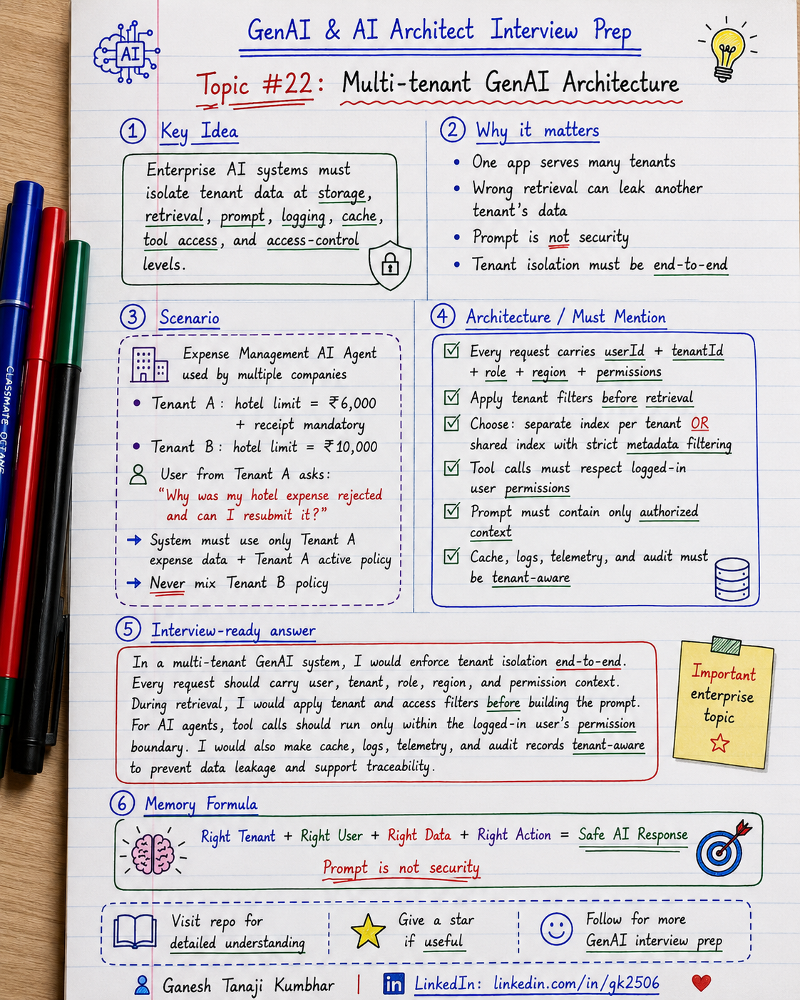

# GenAI & AI Architect Interview Prep

# Topic #22: Multi-tenant GenAI Architecture



---

## Question

In an interview, you may be asked:

> How would you design a multi-tenant GenAI application?

Or:

> How do you make sure one customer’s data is not used to answer another customer’s question?

Or:

> How do you handle tenant isolation in a RAG or AI Agent system?

Or:

> What are the security risks in a multi-tenant GenAI architecture?

---

## Why interviewer asks this

The interviewer is checking whether you understand enterprise AI security and data isolation.

Many candidates explain RAG or AI agents only from a feature point of view.

But enterprise systems usually have multiple customers, departments, regions, business units, or legal entities.

A senior or architect-level answer should explain:

> In a multi-tenant GenAI system, tenant isolation must be enforced across storage, indexing, retrieval, prompts, tool calls, logs, cache, monitoring, and access control. The AI system should only use data that the current user and tenant are authorized to access.

This question tests your understanding of:

* Tenant isolation
* RBAC
* Data security
* Metadata filtering
* Vector index design
* RAG security
* Tool-call authorization
* Prompt construction
* Logging and audit
* PII protection
* Caching risk
* Enterprise GenAI architecture

---

## Basic answer

Multi-tenant architecture means one application serves multiple tenants.

A tenant can be:

* Customer
* Organization
* Business unit
* Department
* Region
* Legal entity

In GenAI applications, multi-tenancy is sensitive because the system may retrieve data, summarize documents, call tools, and generate answers.

Simple answer:

> In a multi-tenant GenAI system, every request should carry tenant and user context. The system should filter data by tenant, enforce RBAC, retrieve only allowed documents, call only allowed tools, avoid leaking tenant data in prompts or logs, and audit all AI actions.

Simple formula:

```text
Right User
+ Right Tenant
+ Right Permissions
+ Right Data
= Safe GenAI Response
```

---

## Architect-level answer

A strong architect-level answer would be:

> I would design multi-tenant GenAI architecture with tenant isolation at every layer. At authentication, I would identify user, tenant, role, and permissions. At storage and indexing, I would either use separate indexes per tenant or shared index with strict tenant metadata filtering. During retrieval, I would always apply tenantId, accessLevel, region, documentStatus, and role filters before passing context to the LLM. For AI agents, every tool call should execute within the user’s permission boundary. I would also make cache, logs, telemetry, prompts, citations, and audit records tenant-aware to avoid cross-tenant data leakage.

---

## Must mention in interview

When answering this question, try to mention these points:

---

### 1. Tenant isolation must be end-to-end

Tenant isolation is not only a database concern.

It should be enforced across:

* Authentication
* Authorization
* Document storage
* Vector index
* Retrieval
* Prompt construction
* Tool calls
* Cache
* Logs
* Telemetry
* Audit records
* Feedback data

Important interview line:

> Multi-tenancy in GenAI is not just about storing tenantId. It is about enforcing tenant boundaries throughout the AI request lifecycle.

---

### 2. Do not rely only on prompt instructions

Bad approach:

```text
Prompt:
Do not answer using other tenant's data.
```

This is not enough.

The model should never receive unauthorized tenant data in the first place.

Better approach:

```text
Apply tenant and permission filters before retrieval and before prompt construction.
```

Strong interview line:

> Prompt is not security. Tenant isolation must be enforced in application logic and retrieval design.

---

### 3. Every request should carry tenant context

Every AI request should include security context such as:

```text
userId
tenantId
role
department
region
permissions
sessionId
correlationId
```

This context should be used for:

* Data filtering
* Tool authorization
* Policy selection
* Audit logging
* Response generation
* Monitoring

Example:

```text
User = Employee A
Tenant = Tenant-India
Role = Employee
Region = India
```

The system should retrieve and use only documents allowed for that tenant, role, and region.

---

### 4. Choose index strategy carefully

There are two common approaches.

---

### Option 1: Separate index per tenant

Each tenant has a separate vector index.

Example:

```text
Tenant A → Index A
Tenant B → Index B
Tenant C → Index C
```

Advantages:

* Strong isolation
* Easier compliance boundaries
* Easier tenant-level deletion
* Lower cross-tenant leakage risk

Tradeoffs:

* More operational overhead
* More indexes to manage
* More cost for many tenants
* Harder global search if needed

---

### Option 2: Shared index with tenant metadata filtering

All tenant documents are stored in one shared index, but every chunk has tenant metadata.

Example metadata:

```text
tenantId = TenantA
region = India
documentType = ExpensePolicy
accessLevel = Employee
documentStatus = Active
```

Advantages:

* Easier to operate
* Lower infrastructure overhead
* Easier to scale for many small tenants

Tradeoffs:

* Requires strict filter enforcement
* Higher risk if filters are missed
* Testing must verify no cross-tenant retrieval
* Access control must be very carefully designed

Important interview line:

> Separate index gives stronger isolation, while shared index needs strict metadata filtering and strong testing.

---

### 5. Metadata filtering is critical in RAG

In multi-tenant RAG, retrieval should never happen without filters.

Common filters:

* tenantId
* userId
* role
* region
* department
* documentType
* accessLevel
* documentStatus
* effectiveDate
* policyVersion

Example:

```text
tenantId = TenantA
region = India
role = Employee
documentStatus = Active
```

This ensures the model receives only valid context.

Memory line:

```text
No Tenant Filter = Data Leak Risk
```

---

### 6. AI agents must respect user permissions

In AI agent systems, tools can take actions.

Examples:

* Fetch expense details
* Create approval request
* Send notification
* Update ticket
* Approve claim
* Export report
* Change user access

The agent should not get admin-level access by default.

Tool calls should check:

* Is the user authenticated?
* Is the user allowed to access this tenant?
* Is the user allowed to perform this action?
* Are tool parameters valid?
* Is human approval required?
* Is audit logging enabled?

Strong interview line:

> AI agents should act within the logged-in user’s permission boundary, not with unrestricted system access.

---

### 7. Prompt construction must be tenant-safe

Before building the prompt, check:

* Are retrieved chunks from the correct tenant?
* Are documents active and allowed?
* Is the user allowed to view this context?
* Is PII masked if needed?
* Are citations from allowed documents only?

Bad prompt construction:

```text
Prompt contains documents from multiple tenants.
```

Good prompt construction:

```text
Prompt contains only authorized tenant-specific context.
```

Important line:

> The LLM should receive only the minimum allowed context needed to answer the question.

---

### 8. Caching must be tenant-aware

Caching can improve latency and cost, but it can create security risk.

Risky cache key:

```text
question = "What is hotel reimbursement limit?"
```

This is unsafe because different tenants may have different policies.

Better cache key:

```text
tenantId + role + region + policyVersion + normalizedQuestion
```

Cache must respect:

* Tenant
* Role
* User permissions
* Region
* Policy version
* Data freshness
* PII rules

Strong interview line:

> In multi-tenant GenAI systems, cache must be permission-aware and tenant-aware.

---

### 9. Logs and telemetry must not leak tenant data

AI logs may contain sensitive information.

Be careful while logging:

* Prompts
* User questions
* Retrieved chunks
* Model responses
* Tool outputs
* Error messages
* PII
* Tenant identifiers
* Business documents

Good logging should include:

* Correlation ID
* Tenant ID or masked tenant reference
* Model name
* Prompt version
* Retrieval status
* Tool-call result
* Token usage
* Latency
* Validation result
* Error category

But avoid storing sensitive content unnecessarily.

Important line:

> Observability is important, but logs should not become another data leakage path.

---

### 10. Audit logging is important

In enterprise GenAI, we should be able to answer:

* Who asked the question?
* Which tenant was used?
* Which documents were retrieved?
* Which model answered?
* Which tools were called?
* What action was suggested or executed?
* Was human approval involved?
* What was the final response?

Audit logs are important for:

* Compliance
* Debugging
* Security review
* Customer trust
* Incident investigation

Memory line:

```text
Traceability builds trust.
```

---

## Detailed Scenario: Expense Management AI Agent

Let us explain this topic using the common scenario used in this series.

### Business context

Assume we are building an **Expense Management AI Agent** for multiple companies.

The same platform is used by many tenants.

Example:

```text
Tenant A = Alpha Finance
Tenant B = Beta Retail
Tenant C = Global Manufacturing
```

Each tenant has its own:

* Employees
* Managers
* Expense policies
* Approval rules
* Reimbursement limits
* Regional rules
* Finance team
* Documents
* Audit requirements

Now a user from Tenant A asks:

> Why was my hotel expense rejected, and can I resubmit it?

The AI system must answer using only Tenant A’s data.

It must not use Tenant B’s policy, Tenant C’s approval rules, or another employee’s expense details.

---

## Scenario data

### User context

```text
userId = EMP-1024
tenantId = Tenant-A
role = Employee
region = India
department = Sales
```

### User question

```text
Why was my hotel expense rejected, and can I resubmit it?
```

### Expense record

```text
expenseId = EXP-7890
expenseType = Hotel
amount = ₹8,500
status = Rejected
reason = Missing receipt and amount above limit
```

### Tenant A policy

```text
Hotel limit for India Sales employees = ₹6,000 per night.
Receipt is mandatory.
Above-limit expenses require manager exception approval.
```

### Tenant B policy

```text
Hotel limit = ₹10,000 per night.
Receipt may be optional for some roles.
```

If the AI accidentally retrieves Tenant B’s policy, it may give the wrong answer.

Bad answer:

```text
You can claim this because the hotel limit is ₹10,000.
```

This is a cross-tenant data and business logic issue.

Correct answer:

```text
Your expense was rejected because the amount is above the ₹6,000 hotel limit and the receipt is missing. You may resubmit after uploading the receipt, and above-limit reimbursement will require manager exception approval as per Tenant A policy.
```

---

## How the architecture should handle this scenario

### Step 1: Authenticate user

The system identifies:

```text
userId
tenantId
role
region
permissions
```

No AI processing should happen without knowing the user and tenant context.

---

### Step 2: Fetch only allowed expense data

The expense API should be called with tenant and user filters.

Example:

```text
GetExpense(expenseId, tenantId, userId)
```

This prevents one user from fetching another tenant’s expense.

---

### Step 3: Retrieve policy using tenant filters

The RAG query should include filters.

Example:

```text
tenantId = Tenant-A
region = India
documentType = ExpensePolicy
documentStatus = Active
role = Employee
```

The retriever should not search all tenant policies blindly.

---

### Step 4: Build tenant-safe prompt

The prompt should include only:

* Tenant A expense data
* Tenant A active policy chunks
* User’s allowed context
* Required instructions
* Citation information

It should not include other tenant documents.

---

### Step 5: Validate final answer

Before returning the answer, validate:

* Is the expense record from correct tenant?
* Is the retrieved policy from correct tenant?
* Is the user allowed to see this data?
* Is the answer grounded in retrieved context?
* Does answer include unsupported policy?
* Is human approval required?

---

### Step 6: Log and audit safely

Audit record can include:

```text
correlationId
tenantId
userId
expenseId
retrievedDocumentIds
modelName
promptVersion
toolCalls
validationResult
finalAction
```

But avoid logging full sensitive data unless required and approved.

---

## Real-world example

### Bad design

```text
User question
        ↓
Search all policies in vector DB
        ↓
Send top chunks to LLM
        ↓
LLM answers
```

Problem:

* No tenant filter
* No role filter
* No document version check
* No permission check
* Risk of cross-tenant answer

---

### Better design

```text
User question
        ↓
Authenticate user
        ↓
Load tenant + role + region context
        ↓
Fetch only allowed expense data
        ↓
Retrieve only tenant-specific active policy
        ↓
Build tenant-safe prompt
        ↓
Generate grounded answer
        ↓
Validate tenant, permission, and citation
        ↓
Return answer with audit log
```

This is production-ready thinking.

---

## What can go wrong?

### 1. Cross-tenant retrieval

The system retrieves chunks from another tenant.

```text
Wrong tenant data = serious security issue
```

---

### 2. Shared cache leakage

A cached answer from Tenant A is shown to Tenant B.

```text
Cache without tenant key = data leak risk
```

---

### 3. Tool call bypasses authorization

The agent calls an API with system-level access and fetches unauthorized data.

```text
Agent tool access must be permission-aware
```

---

### 4. Logs contain sensitive tenant data

Prompts or retrieved chunks are stored in logs without masking.

```text
Logs can become leakage points
```

---

### 5. Wrong policy version is used

The system retrieves an old or inactive policy.

```text
Wrong version = wrong business answer
```

---

### 6. Prompt includes too much context

The model receives unnecessary data from other users or departments.

```text
Minimum required context is safer
```

---

## Common mistake

Many candidates say:

> Add tenantId in metadata.

This is only part of the answer.

Better answer:

> I would enforce tenant isolation across authentication, authorization, storage, vector indexing, retrieval, prompt construction, tool calls, cache, logs, telemetry, and audit records.

Another common mistake:

> The prompt will tell the model not to use other tenant data.

Better answer:

> The model should never receive unauthorized tenant data. Tenant isolation should be enforced before retrieval and before prompt construction.

---

## Better interview answer

A strong answer can be:

> In a multi-tenant GenAI system, I would enforce tenant isolation end-to-end. Every request should carry user, tenant, role, region, and permission context. At the data layer, I would choose either separate indexes per tenant or shared index with strict tenant metadata filtering. During retrieval, I would always apply tenant, role, access-level, document-status, and region filters before building the prompt. For AI agents, tool calls should execute only within the logged-in user’s permission boundary. I would also make caching, logging, telemetry, feedback, and audit records tenant-aware to prevent leakage and support traceability.

---

## One-line answer

> Multi-tenant GenAI architecture means the AI system must answer using only the data, tools, and actions allowed for the current tenant and user.

---

## Memory formula

Use this formula:

```text
User
+ Tenant
+ Role
+ Permissions
+ Allowed Data
= Safe AI Response
```

Another version:

```text
Isolate Storage
Filter Retrieval
Secure Prompt
Authorize Tools
Audit Everything
```

Or:

```text
Right Tenant
Right User
Right Data
Right Action
```

Most important rule:

```text
The LLM should never see data the user is not allowed to access.
```

---

## Interview closing line

You can close your answer like this:

> In enterprise GenAI, multi-tenancy is not optional. I would design tenant isolation across data storage, retrieval, prompt construction, tool calls, cache, logs, monitoring, and audit so that every AI response stays within the correct tenant and user permission boundary.

---

## Related upcoming topics

* RBAC in AI Agents
* PII Handling in GenAI Applications
* Audit Logging and Traceability
* Model Selection
* Azure OpenAI + Azure AI Search Reference Architecture
* Semantic Kernel vs LangChain
* How would you design an Agentic AI system?

---

## Reference Scenario

This topic can be understood using the common **Expense Management AI Agent** scenario used across this series.

You can refer to the scenario here:

```text
00-common-examples/expense-management-ai-agent-scenario.md
```

---

## About the Author

These notes are created and maintained by **Ganesh Tanaji Kumbhar**, an **AI Architect** with experience in **.NET, Azure, cloud architecture, infrastructure, enterprise application modernization, and GenAI solution design**.

I bring practical experience across:

* **.NET / C# / ASP.NET / Web API**
* **Azure App Services, Azure Functions, WebJobs, Azure SQL, Storage, Redis**
* **Cloud architecture and infrastructure modernization**
* **Application architecture and enterprise system design**
* **CI/CD, DevOps, monitoring, and production support**
* **GenAI, RAG, Agentic AI, and AI architecture patterns**

These notes are based on my real experience as both:

* An **interviewee**, facing AI, architecture, cloud, .NET, Azure, and system design rounds
* An **interviewer**, evaluating how candidates explain concepts, tradeoffs, project experience, and real-world design decisions

I write about:

* GenAI Architecture
* RAG System Design
* Agentic AI
* AI Architect Interview Preparation
* .NET and Azure Architecture
* Cloud and Enterprise AI Patterns

If you are preparing for **GenAI / AI Architect / Staff Engineer / Solution Architect / .NET Architect / Azure Architect** interviews, feel free to connect with me on LinkedIn.

🔗 **LinkedIn:** [Connect with me on LinkedIn](https://www.linkedin.com/in/gk2506/)

💬 You can also DM me on LinkedIn if you want to discuss AI architecture, interview preparation, .NET/Azure architecture, or practical GenAI learning.
