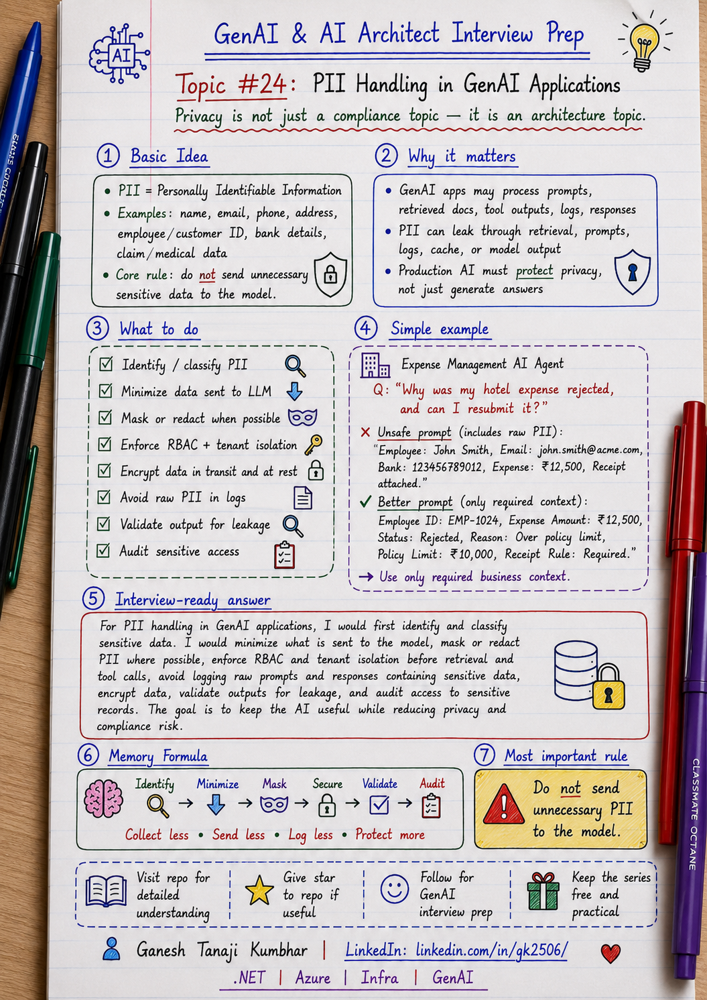

# GenAI & AI Architect Interview Prep

# Topic #24: PII Handling in GenAI Applications



---

## Question

In an interview, you may be asked:

> How do you handle PII in GenAI applications?

Or:

> Should we send sensitive user data to an LLM?

Or:

> How do you prevent PII leakage in a RAG or AI Agent system?

Or:

> What security controls would you add before using enterprise data with GenAI?

---

## Why interviewer asks this

The interviewer is checking whether you understand enterprise AI data protection.

Many candidates focus only on:

```text
Prompt
LLM
Response
```

But enterprise GenAI systems may process sensitive information such as:

* Name
* Email
* Phone number
* Address
* Employee ID
* Customer ID
* Bank details
* Health information
* Claim details
* Invoice data
* Payment information
* Location
* Business documents
* Legal or compliance data

A senior or architect-level answer should explain:

> In GenAI applications, PII should be minimized, masked where possible, protected during retrieval and prompt construction, encrypted in storage and transit, controlled through access permissions, and carefully handled in logs, telemetry, model calls, and responses.

This question tests your understanding of:

* PII identification
* Data minimization
* Masking and redaction
* Encryption
* Access control
* Prompt safety
* Logging risk
* RAG data leakage
* AI Agent tool safety
* Compliance
* Audit logging
* Human review

---

## Basic answer

PII means **Personally Identifiable Information**.

It is any data that can identify a person directly or indirectly.

Examples:

```text
Name
Email
Phone number
Address
Employee ID
Customer ID
Bank account number
Claim number
PAN / Aadhaar / SSN
Medical details
Location data
```

Simple answer:

> In a GenAI application, I would avoid sending unnecessary PII to the model. I would identify sensitive fields, mask or redact them where possible, enforce access control, encrypt data, avoid storing sensitive prompts and responses in logs, and audit who accessed what information.

Simple formula:

```text
Collect less
Mask more
Access carefully
Log safely
Audit always
```

---

## Architect-level answer

A strong architect-level answer would be:

> I would handle PII in GenAI applications using a layered approach. First, I would identify and classify sensitive data. Then I would minimize what is sent to the model, mask or redact PII where possible, and enforce RBAC and tenant isolation before retrieval or tool calls. During prompt construction, I would include only the minimum required context. I would also encrypt data in transit and at rest, avoid logging raw PII in prompts or responses, monitor for PII leakage, and audit access to sensitive data. For high-risk or regulated use cases, I would add human review and compliance controls.

---

## Must mention in interview

When answering this question, try to mention these points:

---

### 1. First identify what is PII

Before protecting PII, we need to know what PII exists in the system.

PII can be obvious:

```text
Name
Email
Phone number
Address
ID number
```

PII can also be indirect:

```text
Employee ID
Claim ID
Expense ID
Location
Department
Combination of role + location + date
```

Important interview line:

> PII handling starts with data classification.

---

### 2. Apply data minimization

Do not send all available data to the LLM.

Bad approach:

```text
Send full employee profile
Send full expense history
Send full claim document
Send full customer record
```

Better approach:

```text
Send only the fields required to answer the question.
```

Example:

If the user asks:

> Why was my hotel expense rejected?

The model may need:

```text
expenseType
amount
status
rejectionReason
policyLimit
receiptStatus
```

It may not need:

```text
full address
bank account
personal phone number
family details
full employee profile
```

Strong interview line:

> The safest PII is the PII we do not send to the model.

---

### 3. Mask or redact sensitive data

If PII is not required for the model to reason, mask it.

Example:

```text
Original:
Employee: Rahul Sharma
Email: rahul.sharma@company.com
Phone: 9876543210

Masked:
Employee: EMP-1024
Email: r***@company.com
Phone: ******3210
```

Masking can be applied to:

* User input
* Retrieved documents
* Tool outputs
* Prompt context
* Model response
* Logs
* Telemetry

Important line:

> Mask PII before it reaches the model when exact identity is not required.

---

### 4. Enforce access control before retrieval

PII leakage can happen before the LLM is called.

In RAG systems, retrieval must respect:

* tenantId
* userId
* role
* department
* region
* document access level
* data classification
* policy status

Bad approach:

```text
Search all documents
Send retrieved chunks to LLM
Ask model not to reveal sensitive data
```

Better approach:

```text
Apply permission filters before retrieval
Send only authorized context to LLM
```

Strong interview line:

> The LLM should never receive PII that the user is not authorized to access.

---

### 5. Prompt is not enough for privacy

Do not rely only on prompt instructions.

Bad prompt-only control:

```text
Do not reveal PII.
```

This is useful, but not sufficient.

Better approach:

```text
Detect PII
Mask PII
Apply RBAC
Apply tenant filtering
Validate output
Audit access
```

Important interview line:

> Privacy should be enforced in application logic, not only in the prompt.

---

### 6. Be careful with logs and telemetry

GenAI applications often log:

* User questions
* Prompts
* Retrieved chunks
* Tool outputs
* Model responses
* Error messages
* Debug traces
* Feedback

These can contain PII.

Bad logging:

```text
Log full prompt with employee details and claim information.
```

Better logging:

```text
Log correlationId, userId hash, tenantId, model name, prompt version, token count, latency, validation status, and masked fields.
```

Important line:

> Logs should not become another PII leakage path.

---

### 7. Encrypt data in transit and at rest

PII should be protected technically.

Use:

* HTTPS / TLS for data in transit
* Encryption at rest
* Key management
* Secret management
* Access-controlled storage
* Secure network boundaries
* Managed identities where possible

But remember:

> Encryption is necessary, but it does not replace access control, masking, and safe prompt design.

---

### 8. Validate model output for PII leakage

Even if input is controlled, model output should be checked.

Output validation can detect:

* Exposed phone numbers
* Emails
* Addresses
* Customer identifiers
* Sensitive claim details
* Bank details
* Unauthorized personal data
* PII copied from retrieved context

If PII is detected unexpectedly:

```text
Block response
Mask response
Ask for human review
Return safe response
Log validation failure
```

Strong interview line:

> PII validation should happen before the final answer is shown to the user.

---

### 9. Tool calls must be permission-aware

AI agents may call tools that return sensitive data.

Examples:

* Get employee profile
* Fetch claim details
* Get payment status
* Retrieve medical document
* Export report
* Send email
* Update customer record

Before tool execution, check:

* Is the user authenticated?
* Is the user allowed to call this tool?
* Is the user allowed to access this record?
* Is the tool returning unnecessary PII?
* Should the result be masked?
* Should the action be audited?

Memory line:

```text
Tool output can leak PII.
```

---

### 10. Keep audit trail

For sensitive data access, audit is important.

Audit should capture:

* Who accessed data?
* Which tenant?
* Which record?
* Which tool was called?
* Which documents were retrieved?
* Was PII masked?
* Was response blocked or allowed?
* Was human approval involved?
* When did it happen?
* What was the correlation ID?

Important line:

> In enterprise AI, PII access should be traceable.

---

## Detailed Scenario: Expense Management AI Agent

Let us explain this topic using the common scenario used in this series.

### Business context

Assume we are building an **Expense Management AI Agent** for multiple companies.

Employees can ask questions like:

```text
Why was my hotel expense rejected?
Can I resubmit this expense?
What receipt is missing?
Can my manager approve this exception?
```

The system may access:

* Employee profile
* Expense record
* Receipt image
* Policy document
* Approval workflow
* Manager details
* Finance comments

Some of this data may contain PII.

---

## Scenario data

### User context

```text
userId = EMP-1024
tenantId = Tenant-A
role = Employee
region = India
department = Sales
```

### User question

```text
Why was my hotel expense rejected, and can I resubmit it?
```

### Expense record

```text
expenseId = EXP-7890
employeeName = Rahul Sharma
employeeEmail = rahul.sharma@company.com
expenseType = Hotel
amount = ₹8,500
status = Rejected
reason = Missing receipt and amount above limit
bankAccountLast4 = 1234
managerName = Priya Mehta
```

### Policy context

```text
Hotel limit for India Sales employees = ₹6,000 per night.
Receipt is mandatory.
Above-limit expenses require manager exception approval.
```

---

## What data is needed?

To answer the user’s question, the LLM likely needs:

```text
expenseType = Hotel
amount = ₹8,500
status = Rejected
reason = Missing receipt and amount above limit
policyLimit = ₹6,000
receiptRequired = Yes
managerApprovalRequired = Yes
```

The LLM may not need:

```text
employeeEmail
bankAccountLast4
full employee profile
personal phone number
home address
```

So the prompt should be minimized.

---

## Bad prompt example

```text
Employee Rahul Sharma, email rahul.sharma@company.com, bank ending 1234, submitted hotel expense EXP-7890 for ₹8,500. The expense was rejected because receipt is missing and amount is above limit...
```

Problem:

* Unnecessary email
* Unnecessary bank detail
* Too much identity information
* Higher privacy risk

---

## Better prompt example

```text
Employee EMP-1024 submitted hotel expense EXP-7890 for ₹8,500.
Status: Rejected.
Reason: Missing receipt and amount above policy limit.
Policy: Hotel limit is ₹6,000. Receipt is mandatory. Above-limit expenses require manager exception approval.
Answer the user with rejection reason and next action.
```

This is safer because it uses only required data.

---

## Correct response

```text
Your hotel expense was rejected because the amount ₹8,500 is above the ₹6,000 hotel limit and the receipt is missing. You can upload the receipt and resubmit it. Since the amount is above the limit, manager exception approval will be required.
```

This response is useful without exposing unnecessary PII.

---

## Better production flow

A production-ready PII handling flow can look like this:

```text
User question
        ↓
Authenticate user
        ↓
Load tenant, role, permissions
        ↓
Fetch allowed data only
        ↓
Detect sensitive fields
        ↓
Mask or remove unnecessary PII
        ↓
Retrieve authorized policy context
        ↓
Build minimum safe prompt
        ↓
Generate answer
        ↓
Validate output for PII leakage
        ↓
Return safe response
        ↓
Audit access and masking result
```

---

## What can go wrong?

### 1. Full records sent to LLM

The application sends complete employee or customer records even when not required.

```text
More data = more privacy risk
```

---

### 2. Logs store raw prompts

Prompts may contain emails, phone numbers, claim details, or bank information.

```text
Raw prompt logs can leak PII
```

---

### 3. Retrieval ignores permissions

The RAG system retrieves documents containing another user’s personal data.

```text
Unauthorized retrieval = PII leak
```

---

### 4. Tool returns too much data

A tool returns full employee profile when only expense status was needed.

```text
Tool output should be minimized
```

---

### 5. Model response exposes sensitive data

The model includes personal details in the answer unnecessarily.

```text
Output validation is required
```

---

### 6. Cache leaks personal answer

A cached answer containing one user’s details is shown to another user.

```text
Cache must be user/tenant/permission-aware
```

---

## Common mistake

Many candidates say:

> We will tell the model not to reveal PII.

This is incomplete.

Better answer:

> I would detect and classify PII, minimize data sent to the model, mask sensitive fields where possible, enforce RBAC and tenant isolation, validate output, avoid raw PII in logs, and audit sensitive data access.

Another common mistake:

> We will not store PII.

This may not be realistic.

Better answer:

> If the system must process PII, we should minimize, protect, mask, encrypt, control access, and audit it.

---

## Better interview answer

A strong answer can be:

> For PII handling in GenAI applications, I would first identify and classify sensitive data. I would apply data minimization so only required fields are sent to the model. Where possible, I would mask or redact PII before prompt construction. I would enforce RBAC and tenant isolation before retrieval and tool calls. I would avoid logging raw prompts and responses containing PII, encrypt sensitive data, validate model output for leakage, and audit access to sensitive records. The goal is to keep the AI useful while reducing privacy and compliance risk.

---

## One-line answer

> PII handling in GenAI means minimizing, masking, securing, validating, and auditing sensitive data across retrieval, prompts, tools, logs, and responses.

---

## Memory formula

Use this formula:

```text
Identify
Minimize
Mask
Secure
Validate
Audit
```

Another version:

```text
Collect less
Send less
Log less
Protect more
```

Or:

```text
PII should be:
Required only
Masked where possible
Access-controlled always
Logged carefully
Audited properly
```

Most important rule:

```text
Do not send unnecessary PII to the model.
```

---

## Interview closing line

You can close your answer like this:

> In enterprise GenAI systems, I would treat PII protection as an end-to-end design concern. The system should minimize sensitive data, enforce access control, mask where possible, validate output, protect logs, and audit access before trusting the AI flow in production.

---

## Related upcoming topics

* Audit Logging and Traceability
* Model Selection
* Azure OpenAI + Azure AI Search Reference Architecture
* Semantic Kernel vs LangChain
* How would you design an Agentic AI system?
* How Do You Measure AI System Quality?

---

## Reference Scenario

This topic can be understood using the common **Expense Management AI Agent** scenario used across this series.

You can refer to the scenario here:

```text
00-common-examples/expense-management-ai-agent-scenario.md
```

---

## About the Author

These notes are created and maintained by **Ganesh Tanaji Kumbhar**, an **AI Architect** with experience in **.NET, Azure, cloud architecture, infrastructure, enterprise application modernization, and GenAI solution design**.

I bring practical experience across:

* **.NET / C# / ASP.NET / Web API**
* **Azure App Services, Azure Functions, WebJobs, Azure SQL, Storage, Redis**
* **Cloud architecture and infrastructure modernization**
* **Application architecture and enterprise system design**
* **CI/CD, DevOps, monitoring, and production support**
* **GenAI, RAG, Agentic AI, and AI architecture patterns**

These notes are based on my real experience as both:

* An **interviewee**, facing AI, architecture, cloud, .NET, Azure, and system design rounds
* An **interviewer**, evaluating how candidates explain concepts, tradeoffs, project experience, and real-world design decisions

I write about:

* GenAI Architecture
* RAG System Design
* Agentic AI
* AI Architect Interview Preparation
* .NET and Azure Architecture
* Cloud and Enterprise AI Patterns

If you are preparing for **GenAI / AI Architect / Staff Engineer / Solution Architect / .NET Architect / Azure Architect** interviews, feel free to connect with me on LinkedIn.

🔗 **LinkedIn:** [Connect with me on LinkedIn](https://www.linkedin.com/in/gk2506/)

💬 You can also DM me on LinkedIn if you want to discuss AI architecture, interview preparation, .NET/Azure architecture, or practical GenAI learning.
