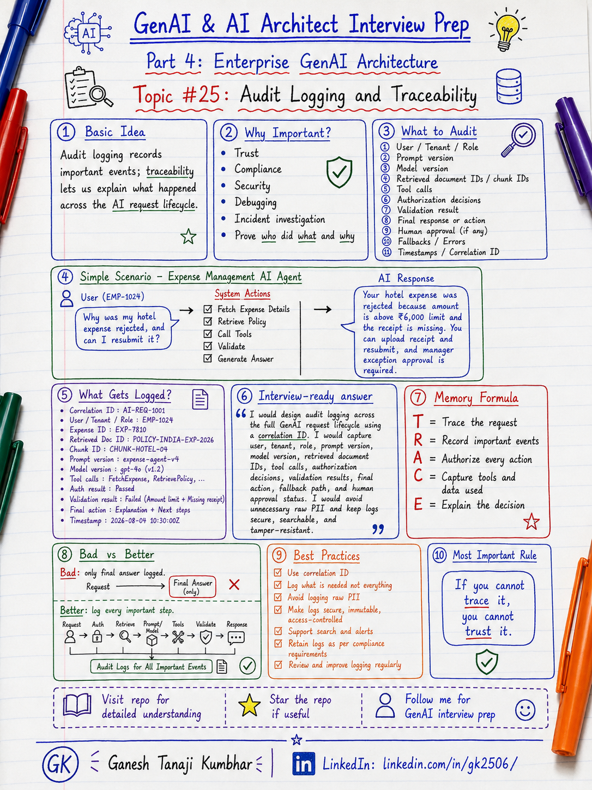

# GenAI & AI Architect Interview Prep

# Topic #25: Audit Logging and Traceability



---

## Question

In an interview, you may be asked:

> How do you design audit logging for a GenAI application?

Or:

> How do you trace why an AI system gave a specific answer?

Or:

> What should be logged when an AI Agent calls tools or makes recommendations?

Or:

> How do you make GenAI responses explainable and traceable in enterprise systems?

---

## Why interviewer asks this

The interviewer is checking whether you understand enterprise trust, compliance, and production support.

Many candidates say:

> We will log the prompt and response.

That answer is incomplete.

In enterprise GenAI systems, audit logging is not only about debugging.

It is also about answering:

* Who asked the question?
* Which tenant was involved?
* What data was retrieved?
* Which model was used?
* Which prompt version was used?
* Which tool was called?
* Was the action allowed?
* Was human approval required?
* What final answer was returned?
* Was sensitive data accessed?
* Why was a decision made?

A senior or architect-level answer should explain:

> Audit logging and traceability help us understand what happened, why it happened, who was involved, what data was used, what action was taken, and whether the AI system followed security, compliance, and business rules.

This question tests your understanding of:

* Audit logging
* Traceability
* AI observability
* Compliance
* Security review
* Tool-call audit
* RAG traceability
* Prompt and model versioning
* Human approval tracking
* PII-safe logging
* Incident investigation
* Enterprise GenAI governance

---

## Basic answer

Audit logging means recording important events so that we can later review what happened.

Traceability means being able to follow the full path of an AI request from user input to final response or action.

Simple answer:

> In a GenAI application, I would log the user, tenant, request ID, prompt version, model version, retrieved documents, tool calls, permission checks, validation results, final response, fallback path, and human approval details where applicable. Logs should be secure, PII-safe, and useful for debugging, compliance, and audit review.

Simple formula:

```text
Who asked?
What data was used?
What model responded?
What action happened?
Why was it allowed?
```

---

## Architect-level answer

A strong architect-level answer would be:

> I would design audit logging across the full GenAI request lifecycle. Every request should have a correlation ID. I would capture user, tenant, role, permissions, prompt version, model version, retrieval query, retrieved document IDs, tool calls, authorization decisions, validation results, fallback usage, human approval status, final response, and timestamps. For sensitive data, I would avoid logging raw PII and instead log masked values, references, hashes, or document IDs. Audit logs should be access-controlled, tamper-resistant, searchable, and retained based on compliance requirements.

---

## Must mention in interview

When answering this question, try to mention these points:

---

### 1. Audit logging is different from normal logging

Normal logs usually help developers debug technical issues.

Examples:

```text
API failed
Database timeout
Exception occurred
Request took 5 seconds
```

Audit logs answer business and compliance questions.

Examples:

```text
Who accessed this record?
Which document was used?
Which tool was called?
Was the user authorized?
Was approval required?
What final action was taken?
```

Important interview line:

> Application logs help debug the system. Audit logs help prove what happened.

---

### 2. Use correlation ID for every AI request

Every AI request should have a unique correlation ID.

Example:

```text
correlationId = AI-REQ-2026-000123
```

This ID should connect:

* User request
* Authentication result
* Retrieval step
* LLM call
* Tool calls
* Validation
* Fallback
* Final response
* User feedback
* Human approval

Strong interview line:

> Without correlation ID, tracing an AI request across multiple steps becomes difficult.

---

### 3. Track user, tenant, role, and permissions

Audit logs should show who performed the action and under which permission boundary.

Capture:

```text
userId
tenantId
role
department
region
permissionSet
sessionId
```

This is important for:

* Multi-tenant isolation
* RBAC review
* Security investigation
* Compliance
* Data access review

Example:

```text
User EMP-1024 from Tenant-A asked about expense EXP-7890 using Employee role.
```

---

### 4. Track prompt and model version

AI behavior can change when we change prompt or model.

Audit should capture:

```text
promptVersion
modelName
modelVersion
temperature
maxTokens
systemInstructionVersion
```

Example:

```text
model = gpt-x
promptVersion = expense-agent-v3
temperature = 0.2
```

This helps answer:

* Did behavior change after prompt update?
* Which model generated the answer?
* Was the approved model used?
* Did a high-risk task use the correct model?

Important line:

> Prompt and model versioning are important for AI traceability.

---

### 5. Track retrieved documents and chunks

In RAG systems, audit logs should show what context was used.

Capture:

```text
retrievalQuery
documentIds
chunkIds
retrievalScores
metadataFilters
tenantFilter
documentVersion
citationIds
```

This helps debug questions like:

* Did the system retrieve the correct policy?
* Was an old document used?
* Was the tenant filter applied?
* Did the answer cite the right document?
* Was the correct chunk missing?

Memory line:

```text
No retrieval trace = no RAG traceability
```

---

### 6. Track tool calls in AI agents

AI agents can call tools that read or change business systems.

Audit every important tool call.

Capture:

```text
toolName
toolInputReference
toolOutputReference
authorizationResult
validationResult
actionStatus
retryCount
timestamp
```

Examples of tools:

* Get expense details
* Retrieve policy
* Create approval request
* Send email
* Update claim status
* Trigger payment
* Export report

Important interview line:

> Any AI tool call that reads or changes business data should be auditable.

---

### 7. Track authorization and validation decisions

Audit should show whether the system checked security and business rules.

Capture:

* Was user authorized?
* Was tenant filter applied?
* Was RBAC check passed?
* Was PII masked?
* Was output validation passed?
* Was human approval required?
* Was action blocked or allowed?
* Why was it blocked?

Example:

```text
Action: CreateApprovalRequest
Authorization: Allowed
Validation: Passed
HumanApprovalRequired: Yes
```

Strong interview line:

> Audit logs should record not only what action happened, but also why it was allowed or blocked.

---

### 8. Avoid logging raw PII unnecessarily

Audit logging should not become a privacy risk.

Bad approach:

```text
Log full prompt, full retrieved document, full employee profile, full bank details.
```

Better approach:

```text
Log document ID, chunk ID, masked user reference, correlation ID, and validation result.
```

For sensitive data, prefer:

* Masked values
* Tokenized references
* Hashes
* Record IDs
* Document IDs
* Access decision
* Minimal required context

Important interview line:

> Audit logs should be useful, but they should not become a new data leakage path.

---

### 9. Make audit logs secure and tamper-resistant

Audit logs are sensitive.

Protect them using:

* Access control
* Encryption
* Retention policy
* Immutable storage where required
* Tamper-resistant design
* Restricted admin access
* Monitoring for suspicious access
* Secure export process

Important line:

> Audit logs should be protected because they may contain sensitive operational and compliance information.

---

### 10. Audit human-in-the-loop decisions

For high-risk actions, the AI should not be the final decision maker.

Audit should capture:

* AI recommendation
* Human approver
* Approval decision
* Approval timestamp
* Reason/comment
* Final action executed
* Policy version used
* Correlation ID

Example:

```text
AI recommended manager review.
Manager approved exception.
System created reimbursement request.
```

Memory line:

```text
AI recommends.
Human approves.
Audit proves.
```

---

## Detailed Scenario: Expense Management AI Agent

Let us explain this topic using the common scenario used in this series.

### Business context

Assume we are building an **Expense Management AI Agent** for multiple companies.

Employees can ask:

```text
Why was my expense rejected?
Can I resubmit this claim?
What policy rule applies?
Can you create an approval request?
Can my manager approve this exception?
```

The system may:

* Fetch expense details
* Retrieve policy documents
* Call approval tools
* Generate explanation
* Suggest next action
* Create workflow request
* Route to manager
* Log audit trail

For enterprise systems, it is not enough that the AI gives an answer.

We must be able to trace how the answer was generated.

---

## Scenario data

### User context

```text
userId = EMP-1024
tenantId = Tenant-A
role = Employee
region = India
department = Sales
```

### User question

```text
Why was my hotel expense rejected, and can I resubmit it?
```

### Expense record

```text
expenseId = EXP-7890
expenseType = Hotel
amount = ₹8,500
status = Rejected
reason = Missing receipt and amount above limit
```

### Retrieved policy

```text
documentId = POLICY-INDIA-EXPENSE-2026
chunkId = CHUNK-HOTEL-REIMBURSEMENT-04
policyVersion = v2026.1
```

Policy says:

```text
Hotel limit for India Sales employees = ₹6,000 per night.
Receipt is mandatory.
Above-limit expenses require manager exception approval.
```

### AI response

```text
Your hotel expense was rejected because the amount is above the ₹6,000 hotel limit and the receipt is missing. You can upload the receipt and resubmit it. Since the amount is above the limit, manager exception approval will be required.
```

---

## What should be audited?

For this request, audit should capture:

```text
correlationId = AI-REQ-1001
userId = EMP-1024
tenantId = Tenant-A
role = Employee
questionType = ExpenseStatusAndPolicyExplanation
expenseId = EXP-7890
retrievedDocumentId = POLICY-INDIA-EXPENSE-2026
retrievedChunkId = CHUNK-HOTEL-REIMBURSEMENT-04
modelName = selected-model
promptVersion = expense-agent-v4
toolCalls = GetExpenseDetails, RetrievePolicy
authorizationResult = Passed
validationResult = Passed
finalAction = ExplanationOnly
humanApprovalRequired = No
timestamp = 2026-08-04T10:30:00
```

This gives traceability without storing unnecessary sensitive details.

---

## Example: Tool-call audit

Suppose the user asks:

> Can you create a manager approval request?

The agent should not directly approve the claim.

It may call:

```text
CreateApprovalRequest(expenseId, managerId)
```

Audit should capture:

```text
toolName = CreateApprovalRequest
requestedBy = EMP-1024
tenantId = Tenant-A
authorization = Allowed
actionType = CreateRequest
humanApprovalRequired = Yes
status = Created
approvalRequestId = APR-4567
correlationId = AI-REQ-1002
```

This helps answer later:

* Who requested the approval?
* Which tool created it?
* Was the user allowed?
* Was the action high-risk?
* Was a manager involved?
* What request ID was generated?

---

## Bad design

```text
User question
        ↓
Agent retrieves data
        ↓
Agent calls tools
        ↓
LLM answers
        ↓
Only final answer is logged
```

Problem:

* No retrieval trace
* No tool-call trace
* No permission decision
* No model version
* No prompt version
* No validation status
* Difficult to debug
* Difficult to audit

---

## Better design

```text
User question
        ↓
Create correlation ID
        ↓
Authenticate user
        ↓
Log tenant + role + permission context
        ↓
Retrieve allowed documents
        ↓
Log document IDs + chunk IDs
        ↓
Build prompt with prompt version
        ↓
Call model with model version
        ↓
Validate answer
        ↓
Log validation result
        ↓
Call tools only if authorized
        ↓
Log tool calls and action result
        ↓
Return answer
        ↓
Capture feedback
```

This is production-ready thinking.

---

## What can go wrong?

### 1. Only final answer is logged

The final answer does not explain why the answer was generated.

```text
Final answer alone is not traceability.
```

---

### 2. No retrieval audit

The system cannot prove which documents were used.

```text
No document trace = weak RAG audit.
```

---

### 3. No tool-call audit

The agent may perform actions without traceability.

```text
No tool audit = business risk.
```

---

### 4. Logs contain raw PII

Audit logs may expose sensitive employee or customer information.

```text
Unsafe logs can become leakage points.
```

---

### 5. No prompt or model version

If behavior changes after deployment, debugging becomes difficult.

```text
No versioning = difficult root cause analysis.
```

---

### 6. Audit logs can be modified

If logs are editable without control, they cannot be trusted.

```text
Audit logs should be protected from tampering.
```

---

## Common mistake

Many candidates say:

> We will log prompts and responses.

This is incomplete.

Better answer:

> I would log the full AI request lifecycle using correlation ID, user context, tenant, prompt version, model version, retrieved document IDs, tool calls, authorization decisions, validation results, final action, fallback path, and human approval status.

Another common mistake:

> We will log everything.

This is also risky.

Better answer:

> Audit logs should capture what is needed for traceability, but avoid unnecessary raw PII, sensitive prompts, and full document content unless required and approved.

---

## Better interview answer

A strong answer can be:

> For audit logging and traceability in GenAI systems, I would track the full request lifecycle using a correlation ID. I would log user, tenant, role, permissions, prompt version, model version, retrieved document IDs, chunk IDs, tool calls, authorization decisions, validation results, fallback path, human approval status, final action, and timestamps. I would avoid logging raw PII unnecessarily and use masking, references, or hashes where possible. Audit logs should be secure, access-controlled, tamper-resistant, searchable, and retained according to compliance requirements.

---

## One-line answer

> Audit logging in GenAI means being able to trace who asked, what data was used, what model responded, what tools were called, and why the final answer or action was allowed.

---

## Memory formula

Use this formula:

```text
Who
Asked What
Used Which Data
Called Which Tool
Got What Answer
Why Allowed
```

Another version:

```text
User
+ Tenant
+ Prompt
+ Model
+ Retrieval
+ Tool
+ Validation
+ Final Action
= Traceable AI
```

Or:

```text
Trace the request
Protect the logs
Prove the decision
```

Most important rule:

```text
If you cannot trace it, you cannot trust it.
```

---

## Interview closing line

You can close your answer like this:

> In enterprise GenAI systems, audit logging should help us prove what happened, why it happened, who was involved, which data and model were used, which tools were called, and whether the final response or action followed security and business rules.

---

## Related upcoming topics

* Model Selection
* Azure OpenAI + Azure AI Search Reference Architecture
* Semantic Kernel vs LangChain
* How would you design an Agentic AI system?
* How Do You Measure AI System Quality?

---

## Reference Scenario

This topic can be understood using the common **Expense Management AI Agent** scenario used across this series.

You can refer to the scenario here:

```text
00-common-examples/expense-management-ai-agent-scenario.md
```

---

## About the Author

These notes are created and maintained by **Ganesh Tanaji Kumbhar**, an **AI Architect** with experience in **.NET, Azure, cloud architecture, infrastructure, enterprise application modernization, and GenAI solution design**.

I bring practical experience across:

* **.NET / C# / ASP.NET / Web API**
* **Azure App Services, Azure Functions, WebJobs, Azure SQL, Storage, Redis**
* **Cloud architecture and infrastructure modernization**
* **Application architecture and enterprise system design**
* **CI/CD, DevOps, monitoring, and production support**
* **GenAI, RAG, Agentic AI, and AI architecture patterns**

These notes are based on my real experience as both:

* An **interviewee**, facing AI, architecture, cloud, .NET, Azure, and system design rounds
* An **interviewer**, evaluating how candidates explain concepts, tradeoffs, project experience, and real-world design decisions

I write about:

* GenAI Architecture
* RAG System Design
* Agentic AI
* AI Architect Interview Preparation
* .NET and Azure Architecture
* Cloud and Enterprise AI Patterns

If you are preparing for **GenAI / AI Architect / Staff Engineer / Solution Architect / .NET Architect / Azure Architect** interviews, feel free to connect with me on LinkedIn.

🔗 **LinkedIn:** [Connect with me on LinkedIn](https://www.linkedin.com/in/gk2506/)

💬 You can also DM me on LinkedIn if you want to discuss AI architecture, interview preparation, .NET/Azure architecture, or practical GenAI learning.
