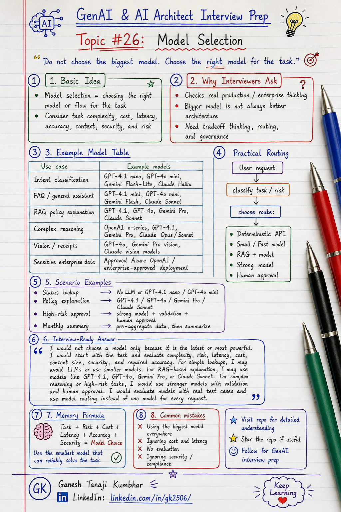

# GenAI & AI Architect Interview Prep

# Topic #26: Model Selection




---

## Important note on model names

The model names in this topic are examples to explain model-selection thinking. Model availability, naming, pricing, context limits, and regional support can change frequently. In real enterprise projects, always check your approved provider catalog, cloud region, security policy, compliance requirements, and evaluation results before finalizing the model.

---

## Question

In an interview, you may be asked:

> How do you select the right model for a GenAI application?

Or:

> Should we always use the most powerful LLM?

Or:

> How do you balance model capability, cost, latency, and security?

Or:

> How would you design model selection or model routing in an enterprise GenAI system?

---

## Why interviewer asks this

The interviewer is checking whether you understand practical GenAI architecture beyond just calling an LLM API.

Many candidates say:

> I will use the best available model for better accuracy.

That answer is incomplete.

In production GenAI systems, the best model is not always the biggest model.

A senior or architect-level answer should explain:

> Model selection depends on task complexity, accuracy requirement, latency expectation, token cost, context size, data sensitivity, security, compliance, tool-calling need, reasoning need, and production scale.

This question tests your understanding of:

* Model capability
* Model routing
* Cost control
* Latency
* Accuracy
* Context size
* Data sensitivity
* Task complexity
* RAG usage
* Tool calling
* Structured output
* Evaluation
* Fallback
* Enterprise governance

---

## Basic answer

Model selection means choosing the right AI model for the right task.

Simple answer:

> I would not use the largest model for every request. I would select the model based on task complexity, accuracy requirement, latency, cost, context size, security, and business risk.

Simple formula:

```text
Right Task
+ Right Model
+ Right Cost
+ Right Latency
+ Right Risk Control
= Better GenAI Architecture
```

In simple words:

```text
Simple task
        → GPT-4.1 nano / GPT-4o mini / Gemini Flash-Lite / Claude Haiku

General assistant or FAQ
        → GPT-4.1 mini / GPT-4o mini / Gemini Flash / Claude Sonnet

Policy explanation using RAG
        → GPT-4.1 / GPT-4o / Gemini Pro / Claude Sonnet

Complex reasoning or multi-step agent task
        → OpenAI o-series / GPT-4.1 / Gemini Pro / Claude Opus or Sonnet

High-risk business decision
        → Strong reasoning model + validation + human approval

Sensitive enterprise data
        → Enterprise-approved model deployment only
```

Important note:

> Model names and availability change frequently. In interviews, do not focus only on one vendor or one model name. Explain the selection logic: task complexity, risk, cost, latency, context length, security, compliance, and evaluation results.

---

## Architect-level answer

A strong architect-level answer would be:

> I would select models based on use case, task complexity, risk, latency, cost, context length, data sensitivity, and required output quality. For simple classification or FAQ-style answers, I may use GPT-4.1 nano, GPT-4o mini, Gemini Flash-Lite, or Claude Haiku. For RAG-based policy explanation, I may use GPT-4.1, GPT-4o, Gemini Pro, or Claude Sonnet. For complex reasoning or high-risk recommendations, I may use OpenAI o-series, GPT-4.1, Gemini Pro, or Claude Opus/Sonnet with validation and human approval. For sensitive enterprise data, I would use approved enterprise model deployments with proper security, privacy, logging, and compliance controls. I would also evaluate models using real test data, monitor quality and cost in production, and use model routing instead of one model for all requests.

---

## Must mention in interview

When answering this question, try to mention these points:

---

### 1. Do not use the biggest model for every task

This is the most important point.

A common mistake is:

```text
Use the most powerful model for every request.
```

This may improve quality for some tasks, but it can create problems:

* Higher cost
* Higher latency
* Lower throughput
* More rate-limit pressure
* Poor scalability
* Over-engineering for simple tasks

Better answer:

```text
Use the smallest model that can reliably solve the task.

But for high-risk or complex tasks:
Use the model that gives acceptable quality with validation and control.
```

Important interview line:

> Bigger model does not always mean better architecture.

---

### 2. Start with the task, not the model

Before selecting a model, understand the task.

Ask:

* Is it a simple FAQ?
* Is it summarization?
* Is it classification?
* Is it document Q&A?
* Does it need reasoning?
* Does it need tool calling?
* Does it need structured JSON output?
* Does it involve sensitive data?
* Is it high-risk?
* Does it need citations?
* Is latency critical?

Good model selection starts with business requirement.

Memory line:

```text
Task first, model later.
```

---

### 3. Match model capability with task complexity

Different tasks need different levels of model capability.

Example:

```text
Simple intent classification
        → GPT-4.1 nano / GPT-4o mini / Gemini Flash-Lite / Claude Haiku

Basic FAQ answer
        → GPT-4.1 mini / GPT-4o mini / Gemini Flash / Claude Sonnet

Policy explanation using RAG
        → GPT-4.1 / GPT-4o / Gemini Pro / Claude Sonnet

Complex multi-step reasoning
        → OpenAI o-series / GPT-4.1 / Gemini Pro / Claude Opus or Sonnet

High-risk recommendation
        → Strong reasoning model + validation + human approval
```

This avoids unnecessary cost while maintaining quality.

---

### 4. Consider cost and latency

Model selection is directly connected to cost and latency.

A stronger model may give better answers, but it may also increase:

* Token cost
* Response time
* Infrastructure cost
* Queueing
* Rate-limit issues
* User wait time

Important line:

> In production, model selection is not only an AI decision; it is also a cost and user experience decision.

Example:

```text
Using a large model for every simple status query may be expensive and slow.
```

Better:

```text
Use deterministic API or smaller model for simple status.
Use stronger model only when explanation or reasoning is needed.
```

---

### 5. Consider context length

Some tasks need large context.

Examples:

* Long document summarization
* Contract review
* Multi-page policy Q&A
* Multiple retrieved chunks
* Long chat history
* Multi-step agent memory

But larger context can increase:

* Cost
* Latency
* Lost-in-the-middle risk
* Irrelevant context
* Hallucination risk

Strong interview line:

> Large context window is useful, but it should not replace good retrieval and context selection.

Better approach:

```text
Retrieve right context
Compress if needed
Send only useful chunks
Choose model with enough context capacity
```

---

### 6. Consider data sensitivity and compliance

For enterprise GenAI, model selection is not only about intelligence.

It also depends on:

* Where data is processed
* Whether data is stored by provider
* Enterprise privacy settings
* Region requirements
* Compliance requirements
* Encryption
* Logging
* Auditability
* PII handling
* Security approval

Important line:

> For sensitive enterprise data, use only approved models and approved deployment patterns.

Example:

```text
Public model endpoint may be fine for generic content.
Enterprise confidential data may require approved private deployment or enterprise-safe service.
```

---

### 7. Consider output format requirement

Some use cases need structured output.

Examples:

```text
JSON response
Classification label
Risk score
Action recommendation
Tool parameters
Validation result
```

For structured output, check:

* Does the model follow schema reliably?
* Does it support JSON mode or structured output?
* How often does it produce invalid format?
* Is output validation required?
* Can smaller model handle the format?

Important line:

> For structured outputs, model reliability should be tested, not assumed.

---

### 8. Consider tool calling capability

AI agents often need tool calling.

Examples:

* Search policy
* Fetch expense status
* Create ticket
* Send email
* Trigger approval workflow
* Update database

Model selection should consider:

* Can the model choose tools correctly?
* Can it generate valid tool parameters?
* Can it handle tool errors?
* Does it follow tool-calling instructions?
* Does it avoid unnecessary tool calls?

Strong interview line:

> In agentic systems, model selection should include tool-use reliability, not only answer quality.

---

### 9. Use model routing

One model for all requests is rarely ideal.

Better approach:

```text
Request comes in
        ↓
Classify task type and risk
        ↓
Route to suitable model or flow
```

Example routing:

```text
Status lookup
        → API response / no LLM

Simple FAQ
        → GPT-4.1 mini / GPT-4o mini / Gemini Flash / Claude Haiku

Policy explanation
        → RAG + GPT-4.1 / GPT-4o / Gemini Pro / Claude Sonnet

Complex exception reasoning
        → OpenAI o-series / GPT-4.1 / Claude Opus or Sonnet / Gemini Pro

High-risk decision
        → Strong reasoning model + validation + human approval
```

This gives better balance of:

* Cost
* Latency
* Accuracy
* Safety
* User experience

---

### 10. Evaluate models with real test data

Do not select a model based only on marketing or demos.

Use evaluation data.

Evaluate:

* Answer accuracy
* Grounding quality
* Hallucination rate
* Citation correctness
* Tool-call accuracy
* JSON validity
* Latency
* Cost per request
* Failure rate
* Refusal quality
* User satisfaction

Important line:

> Model selection should be evidence-based using evaluation results, not opinion-based.

---

## Detailed Scenario: Expense Management AI Agent

Let us explain this topic using the common scenario used in this series.

### Business context

Assume we are building an **Expense Management AI Agent** for multiple companies.

Users can ask different types of questions:

```text
What is the status of my expense?
Why was my hotel expense rejected?
Can I resubmit it?
What policy rule applies?
Can you create a manager approval request?
Can you approve this exception?
Can you summarize my monthly expenses?
```

All these questions should not necessarily use the same model.

---

## Scenario 1: Simple status lookup

### User asks

```text
What is the status of my expense EXP-7890?
```

The system only needs to call the expense API.

Model may not be needed.

Better approach:

```text
Call GetExpenseStatus API
Return deterministic response
```

Example answer:

```text
Your expense EXP-7890 is currently rejected because the receipt is missing.
```

Model selection:

```text
No LLM if API response is enough.

If natural language formatting is needed:
        → GPT-4.1 nano / GPT-4o mini / Gemini Flash-Lite / Claude Haiku
```

Why?

* Fast
* Cheap
* Reliable
* No unnecessary token cost

---

## Scenario 2: Policy explanation

### User asks

```text
Why was my hotel expense rejected, and can I resubmit it?
```

The system needs:

* Expense status
* Receipt status
* Policy retrieval
* Explanation
* Next action

Better approach:

```text
Expense API + RAG + medium/strong model
```

Model selection:

```text
Use a model that can explain policy clearly and follow retrieved context.

Example choices:
        → GPT-4.1
        → GPT-4o
        → Gemini Pro
        → Claude Sonnet
```

Why?

* Requires natural language explanation
* Needs grounded answer
* Needs next-action guidance
* May need citations

---

## Scenario 3: High-value exception

### User asks

```text
Can you approve this hotel expense exception?
```

This is a high-risk action.

The AI should not approve directly.

Better approach:

```text
Strong model for recommendation
Validation
Human approval
Audit logging
```

Model selection:

```text
Use a stronger reasoning-capable model for recommendation.

Example choices:
        → OpenAI o-series
        → GPT-4.1
        → Claude Opus / Sonnet
        → Gemini Pro

Final approval should still go to human workflow.
```

Why?

* Business risk
* Compliance risk
* Financial impact
* Audit required

---

## Scenario 4: Monthly expense summary

### User asks

```text
Summarize my expenses for last month.
```

The system may need many records.

Model selection depends on size:

```text
Small dataset
        → GPT-4.1 mini / GPT-4o mini / Gemini Flash / Claude Sonnet

Large dataset
        → Pre-aggregate using code/database first
        → Then summarize using GPT-4.1 / GPT-4o / Gemini Pro / Claude Sonnet
```

Important point:

> Do not send unnecessary raw data to the model. Aggregate and minimize first.

---

## Scenario 5: Sensitive data

### User asks

```text
Show me all rejected expenses with employee names and bank details.
```

This may include PII or restricted data.

Model selection is not the first decision.

First check:

* Is the user authorized?
* Is this data required?
* Can PII be masked?
* Should this request be blocked?
* Should audit logging be added?

Important line:

> Security and access control come before model selection.

---

## Model routing design

A production-ready model routing flow can look like this:

```text
User request
        ↓
Authenticate user
        ↓
Load tenant, role, permissions
        ↓
Classify intent
        ↓
Classify risk
        ↓
Check data sensitivity
        ↓
Choose flow:
    - deterministic API
    - GPT-4.1 nano / GPT-4o mini
    - Gemini Flash-Lite / Claude Haiku
    - GPT-4.1 / GPT-4o / Gemini Pro / Claude Sonnet
    - OpenAI o-series / Claude Opus for complex reasoning
    - human approval
        ↓
Validate output
        ↓
Log cost, latency, model, and result
```

This is stronger than using one model for everything.

---

## Model selection criteria

When selecting a model, evaluate these criteria:

| Criteria          | Why it matters                                         |
| ----------------- | ------------------------------------------------------ |
| Task complexity   | Simple and complex tasks need different capability     |
| Accuracy          | Some tasks need very high correctness                  |
| Latency           | User-facing apps need fast responses                   |
| Cost              | Token cost matters at scale                            |
| Context length    | Long documents need enough context or better retrieval |
| Security          | Sensitive data needs approved deployment               |
| Tool calling      | Agents need reliable tool selection                    |
| Structured output | JSON/schema reliability matters                        |
| Multimodal need   | Images, receipts, or PDFs may need vision capability   |
| Region/compliance | Enterprise data may have location rules                |
| Fallback          | Alternate model may be needed                          |
| Evaluation score  | Final choice should be measured                        |


---

## Example model selection table

The exact model choice depends on enterprise approval, cloud provider, region, cost, latency, and compliance requirements.

| Use case | Example model choices | Why |
|---|---|---|
| Simple intent classification | GPT-4.1 nano, GPT-4o mini, Gemini Flash-Lite, Claude Haiku | Fast, low-cost, good for lightweight routing |
| Simple FAQ answer | GPT-4.1 mini, GPT-4o mini, Gemini Flash, Claude Sonnet | Balanced quality, speed, and cost |
| Status lookup response | No LLM, deterministic API response, or GPT-4.1 nano for wording | If data is already structured, LLM may not be needed |
| RAG-based policy explanation | GPT-4.1, GPT-4o, Gemini Pro, Claude Sonnet | Better instruction following and explanation quality |
| Long document summarization | GPT-4.1, GPT-4o, Gemini Pro, Claude Sonnet / Opus | Needs larger context handling and better summarization |
| Complex reasoning | OpenAI o-series, GPT-4.1, Gemini Pro, Claude Opus / Sonnet | Better for multi-step reasoning and difficult decisions |
| Tool-calling AI agent | GPT-4.1, GPT-4o, Claude Sonnet, Gemini Pro | Needs reliable tool selection and parameter generation |
| Structured JSON output | GPT-4.1, GPT-4o, Gemini Pro, Claude Sonnet | Must be tested for schema-following reliability |
| High-risk approval recommendation | OpenAI o-series / GPT-4.1 / Claude Opus or Sonnet + validation + human approval | Model can recommend, but final approval should be controlled |
| Multimodal receipt or image understanding | GPT-4o, Gemini vision-capable models, Claude vision-capable models | Useful when receipts, screenshots, or scanned documents are involved |
| Sensitive enterprise data | Approved Azure OpenAI / approved enterprise model deployment | Security, privacy, region, logging, and compliance matter more than model popularity |

Interview point:

> Do not memorize this table as a fixed rule. Use it to explain how you think. A strong answer is not “I will use GPT-4.1 everywhere.” A strong answer is “I will choose the model based on task complexity, risk, cost, latency, data sensitivity, and measured evaluation results.”

---

## Practical model routing example

A production GenAI system may not use one model for everything.

Example routing:

```text
User request
        ↓
Classify intent, risk, and data sensitivity
        ↓
Choose route
```

| Request type | Better route |
|---|---|
| “What is my expense status?” | Deterministic API response |
| “Explain why it was rejected.” | RAG + GPT-4.1 mini / GPT-4o mini / Claude Sonnet |
| “Can I resubmit it?” | RAG + policy validation |
| “Can you approve it?” | Strong reasoning model recommendation + human approval |
| “Summarize all my expenses.” | Pre-aggregate data + summarization model |
| “Show sensitive employee details.” | RBAC check first, then block or mask if needed |
| “Extract details from receipt image.” | Vision-capable model such as GPT-4o / Gemini vision-capable model / Claude vision-capable model |

Memory line:

```text
One app can use multiple models.
One request can use multiple routes.
Model routing is production thinking.
```

---

## What can go wrong?

### 1. Biggest model used everywhere

The system becomes expensive and slow.

```text
Best model everywhere = poor cost control
```

---

### 2. Small model used for complex reasoning

The system becomes cheap but unreliable.

```text
Too small model = weak reasoning risk
```

---

### 3. Model selected without evaluation

The team chooses a model based on assumption.

```text
No evaluation = guess-based architecture
```

---

### 4. Context length used as shortcut

The team sends everything to a large-context model.

```text
More context ≠ better answer
```

---

### 5. Security ignored

The model may receive sensitive or unauthorized data.

```text
Wrong model path = compliance risk
```

---

### 6. No fallback model

If the selected model is slow, unavailable, or rate-limited, the system fails.

```text
No fallback = poor reliability
```

---

### 7. No cost monitoring

The system works technically but becomes too expensive.

```text
No cost tracking = surprise bill
```

---

## Common mistake

Many candidates say:

> Use the latest or most powerful model.

This is incomplete.

Better answer:

> I would choose the model based on task complexity, cost, latency, accuracy, context need, security, compliance, and risk. I would also evaluate it using real test cases.

Another common mistake:

> One model is enough for the whole application.

Better answer:

> A production GenAI system may use model routing. Simple requests can use smaller models or deterministic flows, while complex or high-risk requests can use stronger models with validation and human approval.

---

## Better interview answer

A strong answer can be:

> I would not select a model only because it is the latest or most powerful. I would first classify the task by complexity, risk, latency, cost, context length, data sensitivity, and required accuracy. For simple status lookups, I may avoid LLM completely and use deterministic APIs. For lightweight classification or formatting, I may use GPT-4.1 nano, GPT-4o mini, Gemini Flash-Lite, or Claude Haiku. For RAG-based policy explanation, I may use GPT-4.1, GPT-4o, Gemini Pro, or Claude Sonnet. For complex reasoning or high-risk recommendations, I may use a stronger reasoning-capable model with validation and human approval. I would evaluate models using real test cases, monitor cost and latency in production, and use model routing instead of one model for every request.

---

## One-line answer

> Model selection means choosing the right model or flow for the task based on accuracy, cost, latency, context, security, and business risk.

---

## Memory formula

Use this formula:

```text
Task
+ Risk
+ Cost
+ Latency
+ Accuracy
+ Security
= Model Choice
```

Another version:

```text
Simple lookup
        → No LLM / deterministic API

Lightweight task
        → GPT-4.1 nano / GPT-4o mini / Gemini Flash-Lite / Claude Haiku

RAG explanation
        → GPT-4.1 / GPT-4o / Gemini Pro / Claude Sonnet

Complex reasoning
        → OpenAI o-series / GPT-4.1 / Claude Opus / Gemini Pro

High risk
        → Strong model + validation + human approval
```

Or:

```text
Do not choose the biggest model.
Choose the right model for the task.
```

Most important rule:

```text
Use the smallest model that can reliably solve the task.

But for high-risk or complex tasks:
Use the model that gives acceptable quality with validation and control.
```

---

## Interview closing line

You can close your answer like this:

> In enterprise GenAI systems, model selection should be based on measured business and technical tradeoffs. I would use the right model for the right task, evaluate quality with real data, monitor cost and latency, and use model routing for production-scale flexibility.

---

## Related upcoming topics

* Azure OpenAI + Azure AI Search Reference Architecture
* Semantic Kernel vs LangChain
* How would you design an Agentic AI system?
* Design an Enterprise Document Q&A System
* How Do You Measure AI System Quality?

---

## Reference Scenario

This topic can be understood using the common **Expense Management AI Agent** scenario used across this series.

You can refer to the scenario here:

```text
00-common-examples/expense-management-ai-agent-scenario.md
```

---

## About the Author

These notes are created and maintained by **Ganesh Tanaji Kumbhar**, an **AI Architect** with experience in **.NET, Azure, cloud architecture, infrastructure, enterprise application modernization, and GenAI solution design**.

I bring practical experience across:

* **.NET / C# / ASP.NET / Web API**
* **Azure App Services, Azure Functions, WebJobs, Azure SQL, Storage, Redis**
* **Cloud architecture and infrastructure modernization**
* **Application architecture and enterprise system design**
* **CI/CD, DevOps, monitoring, and production support**
* **GenAI, RAG, Agentic AI, and AI architecture patterns**

These notes are based on my real experience as both:

* An **interviewee**, facing AI, architecture, cloud, .NET, Azure, and system design rounds
* An **interviewer**, evaluating how candidates explain concepts, tradeoffs, project experience, and real-world design decisions

I write about:

* GenAI Architecture
* RAG System Design
* Agentic AI
* AI Architect Interview Preparation
* .NET and Azure Architecture
* Cloud and Enterprise AI Patterns

If you are preparing for **GenAI / AI Architect / Staff Engineer / Solution Architect / .NET Architect / Azure Architect** interviews, feel free to connect with me on LinkedIn.

🔗 **LinkedIn:** [Connect with me on LinkedIn](https://www.linkedin.com/in/gk2506/)

💬 You can also DM me on LinkedIn if you want to discuss AI architecture, interview preparation, .NET/Azure architecture, or practical GenAI learning.
