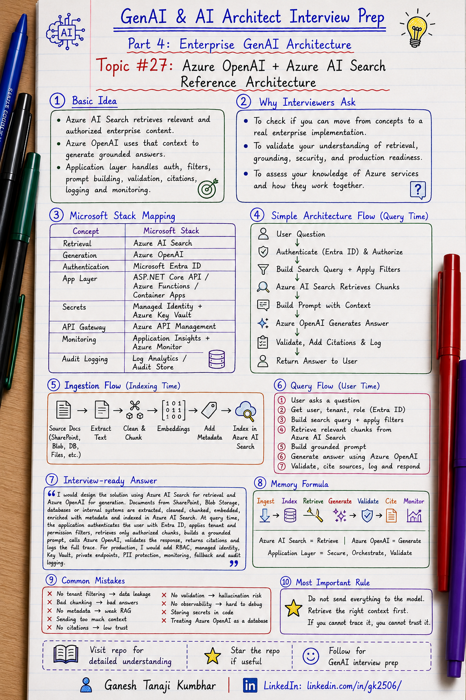

# GenAI & AI Architect Interview Prep

# Topic #27: Azure OpenAI + Azure AI Search Reference Architecture



---

## Important Note: Moving from Concepts to Technology

Until now, this series has mostly focused on **GenAI and Agentic AI concepts**, architecture principles, design tradeoffs, and interview fundamentals.

We covered topics like:

* When to use or avoid AI Agents
* Agent vs Workflow vs Chatbot
* Tool calling
* Agent memory
* Human-in-the-loop
* RAG fundamentals
* Chunking
* Metadata filtering
* Tenant isolation
* Hallucination reduction
* Cost, latency, and accuracy tradeoffs
* Guardrails
* Fallbacks
* Observability
* Multi-tenant design
* RBAC
* PII handling
* Audit logging
* Model selection

From this topic, we are moving one step deeper.

We are now mapping those concepts to a **specific technology stack**.

This topic focuses on the **Microsoft / Azure stack** for building enterprise RAG systems.

The focus is on:

* **Azure OpenAI**
* **Azure AI Search**
* **Azure App Service / Azure Functions / Azure Container Apps**
* **ASP.NET Core Web API**
* **Azure Blob Storage / SharePoint / enterprise data sources**
* **Microsoft Entra ID**
* **Managed Identity**
* **Azure Key Vault**
* **Azure API Management**
* **Application Insights**
* **Azure Monitor**
* **RBAC, private networking, audit logging, and enterprise security**

The architecture concepts are common across platforms, but the examples in this topic are explained using the **Microsoft stack**.

Important note for this topic:

> Previous topics covered platform-independent GenAI architecture concepts. This topic shows how those concepts can be implemented using the Microsoft stack, mainly Azure OpenAI and Azure AI Search.


An interview-style line would be:

> For an enterprise RAG solution on Azure, I would use Azure AI Search as the retrieval layer, Azure OpenAI as the generation layer, and an application orchestration layer to handle authentication, authorization, tenant filtering, prompt construction, validation, monitoring, and audit logging.

---

## Question

In an interview, you may be asked:

> How would you design an enterprise RAG system using Azure OpenAI and Azure AI Search?

Or:

> What is the reference architecture for document Q&A using Azure OpenAI and Azure AI Search?

Or:

> How do Azure OpenAI and Azure AI Search work together in a GenAI application?

Or:

> How would you secure and productionize a RAG solution on Azure?

---

## Why interviewer asks this

The interviewer is checking whether you can move from **concept explanation** to **technology-based architecture design**.

Many candidates can explain RAG at a high level:

> Retrieve relevant context and send it to the LLM.

That is a good starting point, but it is not enough for enterprise architecture.

A senior or architect-level answer should explain:

> Azure AI Search retrieves the right enterprise knowledge, and Azure OpenAI generates a grounded answer using that retrieved context. The application layer handles authentication, authorization, tenant filtering, retrieval, prompt construction, model calls, response validation, citations, logging, monitoring, fallback, and audit trail.

This question tests whether you can connect previous concepts with real services:

| Concept covered earlier | Microsoft stack implementation                       |
| ----------------------- | ---------------------------------------------------- |
| RAG                     | Azure OpenAI + Azure AI Search                       |
| Retrieval               | Azure AI Search                                      |
| Generation              | Azure OpenAI                                         |
| Metadata filtering      | Azure AI Search filters                              |
| Tenant isolation        | Entra ID + RBAC + metadata filters                   |
| PII handling            | App layer + validation + masking                     |
| Audit logging           | Application Insights / Log Analytics / audit store   |
| Observability           | Application Insights + Azure Monitor                 |
| Secrets                 | Azure Key Vault                                      |
| Secure access           | Managed Identity                                     |
| API gateway             | Azure API Management                                 |
| App hosting             | Azure App Service / Azure Functions / Container Apps |

This question checks your understanding of:

* RAG architecture
* Azure OpenAI
* Azure AI Search
* Embeddings
* Indexing pipeline
* Chunking
* Metadata filtering
* Tenant isolation
* Retrieval quality
* Prompt construction
* Grounded generation
* Citations
* RBAC
* PII protection
* Private networking
* Monitoring
* Cost control
* Production readiness

---

## Basic answer

Azure OpenAI and Azure AI Search are commonly used together to build enterprise RAG applications on the Microsoft stack.

Simple answer:

> Azure AI Search stores indexed enterprise content and retrieves the most relevant chunks. Azure OpenAI uses those retrieved chunks as context and generates a grounded answer. The application layer controls authentication, authorization, retrieval filters, prompt building, response validation, logging, and user experience.

Simple flow:

```text
User Question
        ↓
Application API
        ↓
Authentication + Authorization
        ↓
Azure AI Search Retrieval
        ↓
Relevant Chunks + Metadata
        ↓
Azure OpenAI Prompt
        ↓
Generated Answer + Citations
        ↓
Validation + Logging
        ↓
User Response
```

Simple formula:

```text
Enterprise Data
+ Azure AI Search
+ Azure OpenAI
+ Microsoft Security Stack
+ Validation
+ Monitoring
= Production RAG Architecture
```

---

## Architect-level answer

A strong architect-level answer would be:

> I would design the solution with a secure ingestion pipeline and a secure query pipeline using the Microsoft stack. In ingestion, documents from SharePoint, Blob Storage, databases, or enterprise systems are extracted, cleaned, chunked, embedded, enriched with metadata, and indexed into Azure AI Search. In the query flow, the application authenticates the user using Microsoft Entra ID, applies tenant and permission filters, retrieves relevant chunks from Azure AI Search, builds a grounded prompt, calls Azure OpenAI, validates the answer, returns citations, and logs the full trace using Application Insights or an audit store. I would also add managed identity, Key Vault, RBAC, PII masking, private networking, monitoring, evaluation, fallback, and audit logging for production readiness.

---

## Must mention in interview

When answering this question, try to mention these points:

---

### 1. Move from concept to implementation

Earlier topics explained concepts such as RAG, chunking, metadata filtering, tenant isolation, PII handling, audit logging, model selection, fallback, and observability.

In this topic, we map those concepts to a practical Microsoft-stack implementation.

For example:

| Concept                         | Microsoft-stack implementation                            |
| ------------------------------- | --------------------------------------------------------- |
| RAG                             | Azure OpenAI + Azure AI Search                            |
| Retrieval                       | Azure AI Search                                           |
| Generation                      | Azure OpenAI                                              |
| Application orchestration       | ASP.NET Core API / Azure Functions / Azure Container Apps |
| Authentication                  | Microsoft Entra ID                                        |
| Tenant and permission filtering | RBAC + metadata filters                                   |
| Secrets                         | Managed Identity + Azure Key Vault                        |
| Monitoring                      | Application Insights + Azure Monitor                      |
| Audit trail                     | Log Analytics / audit store                               |

This is the important shift:

```text
Concept-level answer:
Use retrieval, grounding, validation, and monitoring.

Technology-level answer:
Use Azure AI Search for retrieval, Azure OpenAI for generation, and a secure application layer to orchestrate authentication, authorization, filtering, prompt building, validation, citations, monitoring, and audit logging.
```

Interview-style answer:

> I would design the RAG solution using Azure AI Search to retrieve relevant and authorized enterprise content, Azure OpenAI to generate grounded responses, and an application layer to enforce security, tenant isolation, validation, citations, observability, and auditability.

---

### 2. Understand the Microsoft / Azure stack

For this topic, we are not discussing AWS, GCP, open-source vector databases, or generic LangChain-based architecture.

The stack is:

```text
Microsoft Entra ID
Azure API Management
Azure App Service / Azure Functions / Azure Container Apps
ASP.NET Core Web API
Azure OpenAI
Azure AI Search
Azure Blob Storage / SharePoint / enterprise data sources
Azure Key Vault
Managed Identity
Application Insights
Azure Monitor
Log Analytics
```

Important interview line:

> In the Microsoft stack, Azure AI Search acts as the retrieval layer and Azure OpenAI acts as the generation layer. The application layer orchestrates security, retrieval, prompt construction, validation, and monitoring.

---

### 3. Separate ingestion pipeline and query pipeline

A good RAG architecture has two main flows:

```text
Ingestion Flow
        → Prepare knowledge

Query Flow
        → Answer user question
```

Do not mix both concepts.

Ingestion happens before user questions.

Query flow happens when the user asks a question.

Important interview line:

> RAG architecture has two important pipelines: indexing data and answering user questions.

---

### 4. Ingestion pipeline prepares enterprise data

The ingestion pipeline converts enterprise documents into searchable knowledge.

Typical steps:

```text
Source Documents
        ↓
Extract Text
        ↓
Clean / Normalize
        ↓
Chunk Content
        ↓
Generate Embeddings
        ↓
Add Metadata
        ↓
Index in Azure AI Search
```

Source examples:

* SharePoint documents
* Azure Blob Storage files
* PDFs
* Word documents
* PowerPoint files
* HTML pages
* Policy documents
* Knowledge base articles
* Database records
* Internal business documents

Important point:

> Poor ingestion quality creates poor retrieval quality.

---

### 5. Chunking is critical

Azure AI Search can retrieve content, but retrieval quality depends heavily on chunking.

Bad chunking causes:

* Incomplete context
* Wrong retrieval
* Missing answer
* Higher hallucination risk
* Weak citations
* Poor user trust

Good chunks should be:

* Meaningful
* Not too small
* Not too large
* Metadata-rich
* Aligned with document structure
* Easy to cite

Example:

```text
Bad chunk:
"Approval is required..."

Better chunk:
"Hotel expenses above ₹6,000 require manager approval and receipt submission."
```

Memory line:

```text
Bad chunks = bad retrieval
Bad retrieval = bad answer
```

---

### 6. Metadata is not optional

Enterprise RAG systems need metadata.

Examples:

```text
tenantId
department
region
documentType
documentVersion
accessLevel
createdDate
effectiveDate
owner
sourceSystem
language
```

Metadata helps with:

* Tenant isolation
* RBAC filtering
* Region-specific policies
* Version control
* Audit logging
* Better retrieval
* Better citations

Strong interview line:

> Vector similarity alone is not enough. Enterprise retrieval needs metadata filtering.

---

### 7. Apply security before retrieval

Do not retrieve all documents and then ask the model to ignore unauthorized data.

Bad approach:

```text
Retrieve all documents
        ↓
Ask LLM to use only allowed documents
```

Better approach:

```text
Authenticate user using Microsoft Entra ID
        ↓
Identify tenant, role, permissions
        ↓
Apply filters in Azure AI Search
        ↓
Retrieve only allowed documents
```

Important line:

> The LLM should never receive data the user is not allowed to access.

---

### 8. Azure AI Search is the retrieval layer

Azure AI Search is responsible for retrieving relevant enterprise content.

It may support:

* Keyword search
* Vector search
* Hybrid search
* Metadata filtering
* Scoring
* Ranking
* Semantic ranking depending on configuration

In RAG architecture, Azure AI Search usually returns:

```text
documentId
chunkId
content
score
source
metadata
```

Then the application uses those chunks to build context for the LLM.

Important line:

> Azure AI Search retrieves the right enterprise context.

---

### 9. Azure OpenAI is the generation layer

Azure OpenAI should not be treated as the knowledge store.

It generates the response based on:

* User question
* System instruction
* Retrieved context
* Conversation history if required
* Tool results if required
* Response format rules

Important line:

> Azure AI Search retrieves knowledge. Azure OpenAI explains it.

---

### 10. Application layer is the orchestrator

The application layer is very important.

It can be built using:

* ASP.NET Core Web API
* Azure App Service
* Azure Functions
* Azure Container Apps
* AKS if required
* Backend-for-frontend service
* API Management in front of APIs

The application layer handles:

```text
Authentication
Authorization
Tenant filtering
Search query construction
Prompt construction
Azure OpenAI call
Response validation
Citation formatting
PII masking
Fallback handling
Logging
Audit trail
```

Important line:

> Do not put all responsibility on the LLM. The application layer must control the flow.

---

### 11. Prompt construction matters

The prompt should be built carefully.

It should include:

* System role
* User question
* Retrieved context
* Citation instructions
* Refusal instruction
* Output format
* Safety rules
* Tenant or role context if needed

Example instruction:

```text
Answer only from the provided context.
If the answer is not present in the context, say you do not have enough information.
Do not guess.
Cite the source document when possible.
```

Important line:

> RAG reduces hallucination only when prompt, retrieval, and validation are designed properly.

---

### 12. Return citations

Enterprise users need to trust the answer.

A good RAG response should show:

* Answer
* Source document
* Section or chunk reference
* Policy version
* Confidence or limitation where useful

Example:

```text
Your hotel expense was rejected because the amount is above the allowed limit and the receipt is missing.

Source:
Policy: India Expense Policy
Section: Hotel Reimbursement
Version: 2026.1
```

Memory line:

```text
No citation = low trust
```

---

### 13. Add validation before response

Do not directly return the model output.

Validate:

* Is answer grounded?
* Are citations present?
* Is PII leaked?
* Is the answer allowed for the user?
* Is the output format correct?
* Is the action safe?
* Is fallback needed?

Important line:

> In production RAG, generation is not the final step. Validation is also required.

---

### 14. Add observability and audit logging

For every request, log important trace information:

```text
correlationId
userId
tenantId
questionType
searchQuery
filtersApplied
documentIds
chunkIds
modelName
promptVersion
latency
tokenUsage
validationResult
finalResponseStatus
```

Microsoft stack examples:

```text
Application Insights
Azure Monitor
Log Analytics
Custom audit store
Storage account with immutability if required
```

This helps answer:

* Which document was used?
* Which chunk was retrieved?
* Which model responded?
* Was tenant filter applied?
* Why did the system answer incorrectly?
* How much did the request cost?
* Was sensitive data accessed?

Important line:

> If you cannot trace the answer, you cannot trust the answer.

---

### 15. Secure the architecture

Enterprise RAG using the Microsoft stack should include:

* Microsoft Entra ID authentication
* RBAC
* Managed identities
* Private endpoints where required
* Key Vault for secrets
* Network restrictions
* Encryption
* PII masking
* Audit logs
* Content safety checks
* Least privilege access
* Application Insights monitoring

Important line:

> RAG architecture is not only search plus LLM. It is search plus LLM plus enterprise security.

---

## Detailed Scenario: Expense Management AI Agent

Let us explain this topic using the common scenario used in this series.

### Business context

Assume we are building an **Expense Management AI Agent** for multiple companies.

Employees can ask:

```text
Why was my hotel expense rejected?
Can I resubmit this expense?
What policy rule applies?
Do I need manager approval?
```

The system has enterprise documents such as:

```text
India Expense Policy
UK Expense Policy
Hotel Reimbursement Policy
Receipt Submission Policy
Manager Approval Policy
Finance Exception Policy
```

The architecture should ensure that the user gets an answer from the correct tenant, correct region, correct policy, and latest approved document.

---

## Microsoft stack for this scenario

A practical Microsoft stack can be:

```text
Frontend
        → Web app / Teams app / Mobile app

API layer
        → Azure API Management + ASP.NET Core Web API

Authentication
        → Microsoft Entra ID

Business logic
        → Azure App Service / Azure Functions / Azure Container Apps

Knowledge source
        → SharePoint / Azure Blob Storage / SQL Database / internal systems

Retrieval
        → Azure AI Search

Generation
        → Azure OpenAI

Secrets and identity
        → Managed Identity + Azure Key Vault

Monitoring
        → Application Insights + Azure Monitor

Audit
        → Log Analytics / audit database / secure storage
```

---

## Ingestion flow for this scenario

### Step 1: Source documents

Documents are stored in enterprise systems.

Examples:

```text
SharePoint
Azure Blob Storage
Document Management System
Internal Knowledge Base
Policy Database
```

### Step 2: Extract text

The system extracts text from documents.

For example:

```text
India Expense Policy.pdf
        ↓
Extract text from PDF
```

### Step 3: Clean content

Remove unnecessary content such as:

* Repeated headers
* Footers
* Page numbers
* Broken formatting
* Duplicate text
* Empty sections

### Step 4: Chunk content

Convert policy content into meaningful chunks.

Example chunk:

```text
Document: India Expense Policy
Section: Hotel Reimbursement
ChunkId: CHUNK-HOTEL-001

Hotel expenses above ₹6,000 per night require manager exception approval.
Receipt submission is mandatory for reimbursement.
```

### Step 5: Generate embeddings

Generate embeddings for each chunk.

Conceptually:

```text
Text Chunk
        ↓
Embedding Model
        ↓
Vector Representation
```

### Step 6: Add metadata

Add metadata before indexing.

Example:

```text
tenantId = Tenant-A
region = India
department = Sales
documentType = ExpensePolicy
documentVersion = 2026.1
effectiveDate = 2026-01-01
accessLevel = Employee
```

### Step 7: Index in Azure AI Search

Store searchable fields, vector fields, and metadata in Azure AI Search.

Example index fields:

```text
id
content
contentVector
documentId
chunkId
tenantId
region
department
documentType
documentVersion
effectiveDate
accessLevel
sourceUrl
```

Important line:

> Index design directly affects retrieval quality, security, and citations.

---

## Query flow for this scenario

### User question

```text
Why was my hotel expense rejected, and can I resubmit it?
```

### Step 1: Authenticate user

The application identifies:

```text
userId = EMP-1024
tenantId = Tenant-A
role = Employee
region = India
department = Sales
```

### Step 2: Fetch business data if required

The system may call an expense API:

```text
GetExpenseDetails(EXP-7890)
```

Result:

```text
expenseType = Hotel
amount = ₹8,500
status = Rejected
reason = Missing receipt and amount above limit
```

### Step 3: Build search query

The application builds a retrieval query:

```text
hotel expense reimbursement limit receipt manager approval
```

### Step 4: Apply filters

Apply metadata filters before retrieval:

```text
tenantId = Tenant-A
region = India
documentType = ExpensePolicy
accessLevel <= Employee
effectiveDate <= today
```

This prevents cross-tenant or unauthorized retrieval.

### Step 5: Retrieve chunks from Azure AI Search

Azure AI Search returns relevant chunks:

```text
documentId = POLICY-INDIA-EXPENSE-2026
chunkId = CHUNK-HOTEL-001
score = 0.89
content = Hotel expenses above ₹6,000 require manager approval. Receipt is mandatory.
```

### Step 6: Build grounded prompt

The application sends the LLM:

```text
System instruction:
You are an expense policy assistant.
Answer only from provided context.
Do not guess.
If context is insufficient, say so.
Cite policy source.

User question:
Why was my hotel expense rejected, and can I resubmit it?

Expense data:
Hotel expense = ₹8,500
Status = Rejected
Reason = Missing receipt and amount above limit

Retrieved context:
Hotel expenses above ₹6,000 require manager approval.
Receipt is mandatory.
```

### Step 7: Generate answer using Azure OpenAI

The model generates:

```text
Your hotel expense was rejected because the amount is above the ₹6,000 hotel limit and the receipt is missing. You can resubmit it after uploading the receipt. Since the amount is above the limit, manager exception approval will be required.
```

### Step 8: Validate response

Validate:

```text
Is answer grounded? Yes
Is citation available? Yes
Is PII leaked? No
Is user allowed? Yes
Is action safe? Yes
```

### Step 9: Return answer with citation

Final response:

```text
Your hotel expense was rejected because it is above the ₹6,000 hotel limit and the receipt is missing.

You can resubmit it after uploading the receipt. Since the amount is above the limit, manager exception approval will be required.

Source:
India Expense Policy, Hotel Reimbursement, Version 2026.1
```

### Step 10: Log trace

Audit log:

```text
correlationId = AI-REQ-1001
userId = EMP-1024
tenantId = Tenant-A
retrievedDocumentId = POLICY-INDIA-EXPENSE-2026
retrievedChunkId = CHUNK-HOTEL-001
model = selected Azure OpenAI deployment
promptVersion = expense-rag-v3
validationResult = Passed
latency = 2.1 sec
```

---

## Reference architecture

A practical Microsoft / Azure reference architecture can look like this:

```text
Users
  ↓
Web App / Mobile App / Teams App
  ↓
Azure API Management
  ↓
Application API / Orchestrator
  ↓
Microsoft Entra ID Authentication
  ↓
Authorization + Tenant Filter
  ↓
Azure AI Search
  ↓
Retrieved Chunks + Metadata
  ↓
Prompt Builder
  ↓
Azure OpenAI
  ↓
Response Validator
  ↓
Application Insights + Azure Monitor + Audit Logs
  ↓
User Response with Citations
```

For ingestion:

```text
Enterprise Data Sources
  ↓
Data Ingestion Job
  ↓
Text Extraction
  ↓
Cleaning
  ↓
Chunking
  ↓
Embedding Generation
  ↓
Metadata Enrichment
  ↓
Azure AI Search Index
```

---

## Components and responsibilities

| Component                          | Responsibility                            |
| ---------------------------------- | ----------------------------------------- |
| Web App / Client                   | User interface                            |
| Azure API Management               | Gateway, throttling, policies             |
| ASP.NET Core API / Azure Functions | Business orchestration                    |
| Microsoft Entra ID                 | Authentication                            |
| Authorization layer                | RBAC, tenant, permission checks           |
| Azure AI Search                    | Keyword, vector, hybrid retrieval         |
| Embedding model                    | Converts text into vectors                |
| Prompt builder                     | Combines question, context, and rules     |
| Azure OpenAI                       | Generates grounded answer                 |
| Response validator                 | Checks grounding, PII, format, and safety |
| Application Insights               | Monitoring and telemetry                  |
| Azure Monitor / Log Analytics      | Operational monitoring                    |
| Audit store                        | Traceability and compliance               |
| Azure Key Vault                    | Secret management                         |
| Managed Identity                   | Secure service-to-service access          |
| Blob Storage / SharePoint          | Source documents                          |

---

## What can go wrong?

### 1. Treating this only as an LLM call

The team may think Azure OpenAI alone can solve document Q&A.

```text
LLM call alone ≠ Enterprise RAG
```

Better approach:

```text
Azure AI Search retrieves context.
Azure OpenAI generates answer.
Application layer secures and validates the flow.
```

---

### 2. No tenant filtering

The system may retrieve another tenant’s document.

```text
No tenant filter = data leakage risk
```

---

### 3. Poor chunking

The correct answer may not appear in the retrieved chunks.

```text
Bad chunking = bad answer
```

---

### 4. No metadata

The system cannot filter by tenant, region, role, or document version.

```text
No metadata = weak enterprise RAG
```

---

### 5. Sending too much context

More context can increase cost, latency, and confusion.

```text
More context is not always better context
```

---

### 6. No citations

Users cannot verify the answer.

```text
No citation = low trust
```

---

### 7. No validation

The LLM output may contain hallucination or unauthorized information.

```text
Generation without validation = production risk
```

---

### 8. No observability

The team cannot debug why the answer was wrong.

```text
No trace = no root cause
```

---

### 9. No fallback

If search returns poor results or the model fails, the user gets a bad answer.

```text
No fallback = poor user experience
```

---

### 10. Secrets stored in code

Azure OpenAI keys, Search keys, or database secrets should not be stored in code.

Better approach:

```text
Managed Identity
Azure Key Vault
Least privilege access
```

---

### 11. Treating Azure OpenAI as a database

Azure OpenAI should not be treated as a document store.

Better approach:

```text
Source system stores documents
Azure AI Search indexes and retrieves context
Azure OpenAI generates answer from retrieved context
```

---

## Common mistake

Many candidates say:

> Azure OpenAI will read the documents and answer.

This is incomplete.

Better answer:

> Documents should be ingested, chunked, embedded, enriched with metadata, and indexed into Azure AI Search. At query time, the application retrieves only authorized and relevant chunks, sends them as context to Azure OpenAI, validates the answer, returns citations, and logs the full trace.

Another common mistake:

> We will put all documents in the prompt.

This is not scalable.

Better answer:

> Use retrieval to select only the most relevant and authorized chunks before calling the model.

Another common mistake:

> Azure AI Search and Azure OpenAI are enough.

This is not production-ready.

Better answer:

> Enterprise RAG also needs authentication, authorization, tenant filtering, Key Vault, managed identity, private networking, validation, monitoring, audit logging, and fallback.

---

## Better interview answer

A strong answer can be:

> I would design this as a secure enterprise RAG architecture on the Microsoft stack. The ingestion pipeline would extract documents from sources like SharePoint, Blob Storage, databases, or internal systems, clean and chunk the content, generate embeddings, add metadata, and index everything in Azure AI Search. During the query flow, the application would authenticate the user using Microsoft Entra ID, apply tenant and permission filters, retrieve only authorized chunks from Azure AI Search, build a grounded prompt, call Azure OpenAI, validate the response, return citations, and log the full trace. For production readiness, I would add RBAC, managed identity, Key Vault, private endpoints where required, PII protection, Application Insights, Azure Monitor, fallback handling, evaluation, and audit logging.

---

## One-line answer

> Azure AI Search retrieves the right enterprise context, and Azure OpenAI uses that context to generate a grounded, secure, and traceable answer in the Microsoft stack.

---

## Memory formula

Use this formula:

```text
Concepts
→ Microsoft Stack
→ Secure RAG
```

Expanded version:

```text
Ingest
Chunk
Embed
Index
Retrieve
Generate
Validate
Cite
Monitor
```

Another version:

```text
Data
+ Azure AI Search
+ Azure OpenAI
+ Microsoft Security Stack
+ Validation
= Enterprise RAG
```

Or:

```text
Azure AI Search = Retrieve
Azure OpenAI = Generate
Application Layer = Secure, Orchestrate, Validate
Microsoft Stack = Identity, Monitor, Protect
```

Most important rule:

```text
Do not send everything to the model.
Retrieve the right context first.
```

---

## Interview closing line

You can close your answer like this:

> Azure OpenAI plus Azure AI Search should not be treated as just a vector search demo. For enterprise use, I would design secure ingestion, metadata-rich indexing, permission-aware retrieval, grounded generation, response validation, citations, monitoring, fallback, and auditability.

---

## Related upcoming topics

* Semantic Kernel vs LangChain
* How would you design an Agentic AI system?
* Design an Enterprise Document Q&A System
* Design an AI Support Assistant
* How Do You Measure AI System Quality?

---

## Reference Scenario

This topic can be understood using the common **Expense Management AI Agent** scenario used across this series.

You can refer to the scenario here:

```text
00-common-examples/expense-management-ai-agent-scenario.md
```

---

## About the Author

These notes are created and maintained by **Ganesh Tanaji Kumbhar**, an **AI Architect** with experience in **.NET, Azure, cloud architecture, infrastructure, enterprise application modernization, and GenAI solution design**.

I bring practical experience across:

* **.NET / C# / ASP.NET / Web API**
* **Azure App Services, Azure Functions, WebJobs, Azure SQL, Storage, Redis**
* **Cloud architecture and infrastructure modernization**
* **Application architecture and enterprise system design**
* **CI/CD, DevOps, monitoring, and production support**
* **GenAI, RAG, Agentic AI, and AI architecture patterns**

These notes are based on my real experience as both:

* An **interviewee**, facing AI, architecture, cloud, .NET, Azure, and system design rounds
* An **interviewer**, evaluating how candidates explain concepts, tradeoffs, project experience, and real-world design decisions

I write about:

* GenAI Architecture
* RAG System Design
* Agentic AI
* AI Architect Interview Preparation
* .NET and Azure Architecture
* Cloud and Enterprise AI Patterns

If you are preparing for **GenAI / AI Architect / Staff Engineer / Solution Architect / .NET Architect / Azure Architect** interviews, feel free to connect with me on LinkedIn.

🔗 **LinkedIn:** [Connect with me on LinkedIn](https://www.linkedin.com/in/gk2506/)

💬 You can also DM me on LinkedIn if you want to discuss AI architecture, interview preparation, .NET/Azure architecture, or practical GenAI learning.
