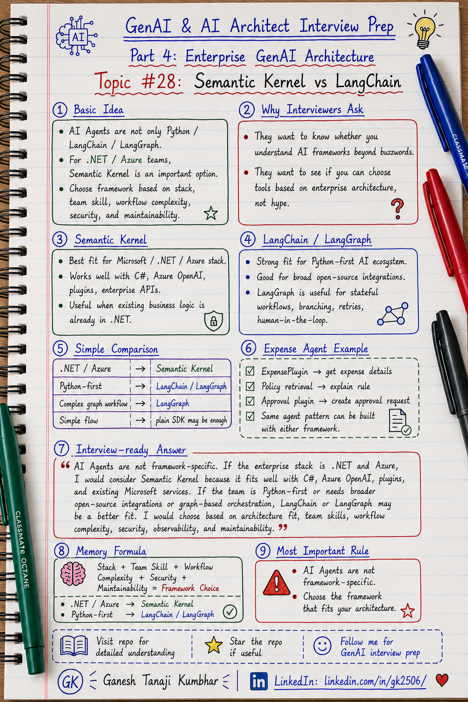

# GenAI & AI Architect Interview Prep

# Topic #28: Semantic Kernel vs LangChain



---

## Important Note: Microsoft Stack Perspective

In the previous topic, we moved from **GenAI concepts** to a **specific technology stack** using:

* Azure OpenAI
* Azure AI Search
* Microsoft Entra ID
* Azure Key Vault
* Application Insights
* Azure Monitor
* ASP.NET Core / Azure Functions / Azure Container Apps

This topic continues that direction.

There is a common misconception that AI Agents, RAG systems, and LLM applications are only built using:

* Python
* LangChain
* LangGraph
* Open-source vector databases

That is not correct.

If you come from a **.NET / Azure / Microsoft stack background**, you should also understand **Semantic Kernel**.

Semantic Kernel is especially relevant when you want to connect LLMs with:

* Existing .NET code
* Enterprise APIs
* Plugins
* Business workflows
* Azure OpenAI
* Microsoft ecosystem services
* Secure enterprise applications

This does not mean Semantic Kernel is always better than LangChain.

It means:

> Choose the framework based on your technology stack, team skills, enterprise environment, orchestration needs, and production requirements.

---

## Question

In an interview, you may be asked:

> What is the difference between Semantic Kernel and LangChain?

Or:

> If you are building an AI Agent in a .NET / Azure environment, would you use Semantic Kernel or LangChain?

Or:

> Is Agentic AI only possible with LangChain or LangGraph?

Or:

> How do you choose an orchestration framework for an enterprise GenAI application?

---

## Why interviewer asks this

The interviewer is checking whether you understand AI application frameworks beyond buzzwords.

Many candidates say:

> For AI Agents, we use LangChain or LangGraph.

That answer is incomplete.

LangChain and LangGraph are very popular, especially in the Python ecosystem.

But enterprise teams using Microsoft technologies may prefer Semantic Kernel because it fits naturally with:

* .NET / C#
* Azure OpenAI
* Existing business services
* Microsoft identity and security patterns
* Plugin-based integration
* Enterprise application architecture

A senior or architect-level answer should explain:

> AI Agents are not tied to one framework or one programming language. Semantic Kernel, LangChain, and LangGraph are different ways to orchestrate models, tools, memory, prompts, workflows, and agents. The right choice depends on the stack, complexity, team skills, security needs, and production architecture.

This question tests your understanding of:

* AI orchestration frameworks
* Semantic Kernel
* LangChain
* LangGraph
* Tool calling
* Plugins
* Agents
* Workflows
* RAG
* .NET and Azure integration
* Python ecosystem
* Enterprise architecture
* Production readiness
* Framework tradeoffs

---

## Basic answer

Semantic Kernel and LangChain are both used to build LLM-powered applications, but they come from different ecosystems and design styles.

Simple answer:

> Semantic Kernel is a Microsoft-oriented AI orchestration SDK that works well with .NET, C#, Azure OpenAI, plugins, and enterprise Microsoft-stack applications. LangChain is a popular framework for building LLM applications, especially in the Python ecosystem, with strong support for chains, agents, tools, integrations, and LangGraph-based workflows.

Simple comparison:

```text
Semantic Kernel
        → Good fit for .NET / Azure / Microsoft stack

LangChain / LangGraph
        → Good fit for Python-first LLM apps and graph-based agent workflows
```

Important note:

```text
AI Agents are not specific to Python.
AI Agents are not specific to LangChain.
AI Agents are not specific to LangGraph.
```

---

## Architect-level answer

A strong architect-level answer would be:

> I would not choose a framework only because it is popular. If the enterprise application is already built on .NET, Azure OpenAI, Entra ID, Azure Functions, App Service, and existing C# services, Semantic Kernel can be a strong choice because it integrates well with the Microsoft ecosystem and allows existing business logic to be exposed as plugins. If the team is Python-first, needs broad open-source integrations, or wants graph-based orchestration using LangGraph, LangChain may be a better fit. For production systems, I would evaluate framework fit based on team skills, hosting model, security, observability, tool-calling reliability, workflow complexity, maintainability, and enterprise support.

---

## Must mention in interview

When answering this question, try to mention these points:

---

### 1. AI Agents are framework-independent

An AI Agent is a design pattern.

It usually includes:

* Goal
* Reasoning
* Tool usage
* Memory or context
* Planning or routing
* Validation
* Guardrails
* Human approval
* Audit logging

This can be implemented using:

* Semantic Kernel
* LangChain
* LangGraph
* OpenAI / Azure OpenAI SDKs directly
* Custom orchestration code
* Workflow engines
* Durable Functions
* Business process engines

Important line:

> Agentic AI is an architecture pattern. LangChain, LangGraph, and Semantic Kernel are implementation options.

---

### 2. Semantic Kernel fits naturally with Microsoft stack

Semantic Kernel is useful when your enterprise stack is already Microsoft-oriented.

Good fit examples:

* .NET applications
* C# business services
* Azure OpenAI
* Azure Functions
* Azure App Service
* Azure Container Apps
* Microsoft Entra ID
* Azure Key Vault
* Application Insights
* Existing enterprise APIs

In Microsoft-stack teams, Semantic Kernel can help expose existing business logic as AI-callable functions or plugins.

Example:

```text
Existing C# service:
GetExpenseStatus(expenseId)

Expose as Semantic Kernel plugin:
ExpensePlugin.GetExpenseStatus()

Agent can call:
GetExpenseStatus → RetrievePolicy → GenerateAnswer
```

Important line:

> For .NET and Azure teams, Semantic Kernel is worth understanding because it maps well to existing Microsoft-stack applications.

---

### 3. LangChain is strong in Python-first AI ecosystem

LangChain is widely used for building LLM applications, especially in Python-first environments.

It is commonly used for:

* Prompt orchestration
* Tool calling
* Agents
* RAG pipelines
* LLM integrations
* Data source integrations
* Prototyping
* AI workflows

LangChain has a large ecosystem and many examples.

Good fit examples:

* Python-first teams
* Data science teams
* Rapid GenAI experimentation
* Broad open-source integration needs
* Existing LangChain-based codebase

Important line:

> LangChain is strong when the team, ecosystem, and existing AI codebase are Python-oriented.

---

### 4. LangGraph is useful for stateful agent workflows

LangGraph is often used when you need more explicit workflow control.

It is useful for:

* Multi-step workflows
* Stateful agents
* Conditional routing
* Human-in-the-loop
* Retry loops
* Agent graphs
* Complex orchestration
* Long-running processes

Example:

```text
User request
        ↓
Classify intent
        ↓
Retrieve data
        ↓
Call tool
        ↓
Validate response
        ↓
Human approval if needed
        ↓
Final response
```

This can be represented as a graph with states and transitions.

Important line:

> LangGraph is useful when agent flow needs explicit state, branches, retries, and controlled orchestration.

---

### 5. Do not choose based on hype

A common mistake is choosing a framework because everyone is talking about it.

Bad answer:

```text
Everyone uses LangChain, so I will use LangChain.
```

Better answer:

```text
I will choose based on stack fit, team skill, workflow complexity, integrations, security, observability, and maintainability.
```

Important line:

> Framework selection should be architecture-driven, not hype-driven.

---

### 6. Compare by enterprise factors

When comparing Semantic Kernel and LangChain, evaluate:

| Criteria                       | Semantic Kernel                         | LangChain / LangGraph                               |
| ------------------------------ | --------------------------------------- | --------------------------------------------------- |
| Best fit                       | Microsoft / .NET / Azure stack          | Python-first AI ecosystem                           |
| Common language fit            | C#, .NET, also supports other languages | Python-first, also has JS ecosystem                 |
| Azure OpenAI integration       | Strong fit                              | Supported, but not Microsoft-native design          |
| Existing .NET business logic   | Natural fit through plugins/functions   | Usually needs wrapper/API boundary                  |
| Open-source AI ecosystem       | Smaller than LangChain ecosystem        | Very broad ecosystem                                |
| Agent workflow style           | Plugins, kernel, agents, orchestration  | Chains, agents, LangGraph state workflows           |
| Enterprise Microsoft alignment | Strong                                  | Depends on implementation                           |
| Best for                       | Azure/.NET enterprise apps              | Python AI apps, broad integrations, graph workflows |

Do not present this as one being universally better.

Better framing:

> Semantic Kernel is often a better fit for Microsoft-stack enterprise teams, while LangChain/LangGraph may be a better fit for Python-first teams and graph-heavy agent workflows.

---

### 7. Existing enterprise code matters

Enterprise teams usually already have:

* Existing APIs
* Existing services
* Existing authentication
* Existing business rules
* Existing audit logging
* Existing monitoring
* Existing deployment pipelines

A good AI framework should work with those systems.

For .NET teams, this matters a lot.

Example:

```text
Existing enterprise system:
Claims API
Policy API
User Profile API
Approval Workflow API

Semantic Kernel approach:
Expose those APIs or C# methods as plugins.

Agent uses:
Retrieve claim → Check policy → Create approval request → Return explanation
```

Important line:

> In enterprise architecture, the best framework is often the one that integrates cleanly with existing systems.

---

### 8. Security and governance matter more than framework name

For enterprise systems, framework choice is only one part of the design.

You still need:

* Authentication
* Authorization
* Tenant isolation
* PII handling
* Audit logging
* Prompt/version tracking
* Tool-call control
* Human approval
* Monitoring
* Fallback
* Cost control
* Evaluation

Important line:

> Semantic Kernel or LangChain alone does not make the system production-ready. Architecture controls do.

---

### 9. RAG can be built with either approach

RAG is not owned by any one framework.

RAG requires:

```text
Retrieve relevant context
        ↓
Build grounded prompt
        ↓
Generate answer
        ↓
Validate response
        ↓
Return citations
```

In Microsoft stack:

```text
Azure AI Search
        + Azure OpenAI
        + Application Layer
        + Semantic Kernel if orchestration is needed
```

In Python ecosystem:

```text
Vector DB / Search service
        + LLM
        + LangChain / LangGraph
        + Application Layer
```

Important line:

> RAG is an architecture pattern. Semantic Kernel and LangChain are ways to implement it.

---

### 10. You can also use no framework initially

For simple use cases, you may not need Semantic Kernel or LangChain.

Example:

```text
User asks question
        ↓
Call Azure AI Search
        ↓
Build prompt
        ↓
Call Azure OpenAI
        ↓
Return answer with citations
```

This can be done using plain application code.

Use a framework when you need:

* Many tools
* Agent orchestration
* Plugin management
* Reusable prompts
* Multi-step flow
* Memory
* More structured AI workflows

Important line:

> Do not add an AI framework unless it solves a real orchestration or maintainability problem.

---

## Real-world example: Expense Management AI Agent

Let us use the common scenario from this series.

### Business context

We are building an **Expense Management AI Agent**.

A user asks:

```text
Why was my hotel expense rejected, and can I resubmit it?
```

The system may need to:

* Fetch expense details
* Retrieve policy
* Check user permissions
* Explain rejection reason
* Suggest next action
* Create approval request if allowed
* Log audit trail

---

## Microsoft-stack approach using Semantic Kernel

If the application is built on .NET and Azure, a possible design is:

```text
ASP.NET Core API
        ↓
Microsoft Entra ID authentication
        ↓
Semantic Kernel orchestration
        ↓
Plugins:
    - ExpensePlugin
    - PolicyPlugin
    - ApprovalPlugin
    - NotificationPlugin
        ↓
Azure AI Search for policy retrieval
        ↓
Azure OpenAI for answer generation
        ↓
Validation + Audit logging
        ↓
Response to user
```

Plugin examples:

```text
ExpensePlugin.GetExpenseDetails(expenseId)
PolicyPlugin.SearchPolicy(query, tenantId, region)
ApprovalPlugin.CreateManagerApprovalRequest(expenseId)
NotificationPlugin.SendManagerNotification(managerId)
```

Why Semantic Kernel fits here:

* Existing C# services can be exposed as plugins
* Azure OpenAI integration feels natural
* Enterprise authentication stays in Microsoft stack
* Application Insights and Azure Monitor can be used
* Key Vault and Managed Identity fit the deployment model

---

## Python-first approach using LangChain / LangGraph

If the team is Python-first, a possible design is:

```text
FastAPI application
        ↓
LangChain / LangGraph orchestration
        ↓
Tools:
    - GetExpenseDetails
    - SearchPolicy
    - CreateApprovalRequest
    - SendNotification
        ↓
Vector search / Azure AI Search / other retrieval layer
        ↓
LLM
        ↓
Validation + Audit logging
        ↓
Response to user
```

Why LangChain / LangGraph may fit here:

* Team already works in Python
* Existing AI pipeline uses LangChain
* More open-source integrations are needed
* Graph-based workflow is preferred
* Data science team owns the AI workflow

---

## Choosing between Semantic Kernel and LangChain

Use this decision guide:

| Situation                                              | Better fit                                |
| ------------------------------------------------------ | ----------------------------------------- |
| Enterprise app is mainly .NET / Azure                  | Semantic Kernel                           |
| Existing services are written in C#                    | Semantic Kernel                           |
| Strong Microsoft identity and Azure integration needed | Semantic Kernel                           |
| Team is Python-first                                   | LangChain / LangGraph                     |
| Data science team owns workflow                        | LangChain / LangGraph                     |
| Need broad open-source integrations                    | LangChain / LangGraph                     |
| Need explicit state graph and complex branching        | LangGraph                                 |
| Simple RAG without many tools                          | Plain code may be enough                  |
| Need long-running business workflow                    | Framework + workflow engine may be needed |

Important note:

> The best choice depends on context. Do not force Semantic Kernel everywhere. Do not force LangChain everywhere.

---

## What can go wrong?

### 1. Thinking AI Agents mean LangChain only

```text
Wrong:
AI Agent = LangChain
```

Better:

```text
AI Agent = architecture pattern
LangChain = one implementation option
Semantic Kernel = another implementation option
```

---

### 2. Ignoring Microsoft stack options

A .NET team may unnecessarily move everything to Python just because examples online use Python.

```text
Wrong:
We must use Python because GenAI examples are in Python.
```

Better:

```text
If the enterprise stack is .NET and Azure, evaluate Semantic Kernel and Azure-native options.
```

---

### 3. Choosing framework before understanding requirement

```text
Wrong:
Let us use LangGraph because it is trending.
```

Better:

```text
First understand task complexity, workflow, tools, state, team skill, security, and deployment model.
```

---

### 4. Overusing framework for simple flows

Simple RAG may not need a heavy orchestration framework.

```text
Wrong:
Every LLM call needs a framework.
```

Better:

```text
Use direct SDK calls for simple flows. Add framework when orchestration complexity increases.
```

---

### 5. Ignoring production controls

Semantic Kernel or LangChain will not automatically solve:

* RBAC
* Tenant isolation
* PII masking
* Audit logging
* Observability
* Cost control
* Fallback
* Human approval

Important line:

> Framework is not a substitute for enterprise architecture.

---

## Common mistake

Many candidates say:

> LangChain is used for AI Agents.

This is not wrong, but it is incomplete.

Better answer:

> LangChain is one popular framework, especially in the Python ecosystem. But AI Agents can also be built using Semantic Kernel, Azure OpenAI SDKs, custom orchestration, or other workflow tools depending on the enterprise stack and requirements.

Another common mistake:

> Semantic Kernel is only for Microsoft demos.

Better answer:

> Semantic Kernel is useful for Microsoft-stack enterprise applications because it can help orchestrate LLM calls, plugins, tools, and existing business logic in .NET and Azure environments.

Another common mistake:

> Framework selection decides architecture quality.

Better answer:

> Framework helps implementation, but production quality comes from good architecture: security, validation, observability, evaluation, audit logging, and maintainability.

---

## Better interview answer

A strong answer can be:

> I would not say that AI Agents are specific to LangChain, LangGraph, Python, or any one framework. Agentic AI is an architecture pattern where the system uses a model, tools, context, memory, validation, and sometimes human approval to complete a goal. If the enterprise stack is .NET and Azure, I would consider Semantic Kernel because it fits well with C#, Azure OpenAI, plugins, and existing Microsoft-stack services. If the team is Python-first or needs broad open-source integrations or graph-based workflow control, LangChain or LangGraph may be a better fit. I would choose based on stack alignment, team skill, workflow complexity, security, observability, maintainability, and production requirements.

---

## One-line answer

> Semantic Kernel is often a strong fit for .NET and Azure enterprise applications, while LangChain and LangGraph are strong options for Python-first AI ecosystems and graph-based agent workflows.

---

## Memory formula

Use this formula:

```text
Stack
+ Team Skill
+ Workflow Complexity
+ Security
+ Integrations
+ Maintainability
= Framework Choice
```

Another version:

```text
.NET / Azure stack
        → Consider Semantic Kernel

Python-first AI stack
        → Consider LangChain / LangGraph

Simple flow
        → Plain SDK may be enough
```

Most important rule:

```text
AI Agents are not framework-specific.
Choose the framework that fits your architecture.
```

---

## Interview closing line

You can close your answer like this:

> I would treat Semantic Kernel, LangChain, and LangGraph as implementation options, not as the definition of Agentic AI. In a Microsoft-stack enterprise application, Semantic Kernel can be a strong choice, while LangChain or LangGraph may be better for Python-first teams or graph-heavy workflows. The final choice should be based on architecture fit, not hype.

---

## Related upcoming topics

* How would you design an Agentic AI system?
* Design an Enterprise Document Q&A System
* Design an AI Support Assistant
* Design an Invoice or Expense AI Agent
* Explain Your GenAI Project Like a Senior Engineer
* How Do You Measure AI System Quality?

---

## Reference Scenario

This topic can be understood using the common **Expense Management AI Agent** scenario used across this series.

You can refer to the scenario here:

```text
00-common-examples/expense-management-ai-agent-scenario.md
```

---

## About the Author

These notes are created and maintained by **Ganesh Tanaji Kumbhar**, an **AI Architect** with experience in **.NET, Azure, cloud architecture, infrastructure, enterprise application modernization, and GenAI solution design**.

I bring practical experience across:

* **.NET / C# / ASP.NET / Web API**
* **Azure App Services, Azure Functions, WebJobs, Azure SQL, Storage, Redis**
* **Cloud architecture and infrastructure modernization**
* **Application architecture and enterprise system design**
* **CI/CD, DevOps, monitoring, and production support**
* **GenAI, RAG, Agentic AI, and AI architecture patterns**

These notes are based on my real experience as both:

* An **interviewee**, facing AI, architecture, cloud, .NET, Azure, and system design rounds
* An **interviewer**, evaluating how candidates explain concepts, tradeoffs, project experience, and real-world design decisions

I write about:

* GenAI Architecture
* RAG System Design
* Agentic AI
* AI Architect Interview Preparation
* .NET and Azure Architecture
* Cloud and Enterprise AI Patterns

If you are preparing for **GenAI / AI Architect / Staff Engineer / Solution Architect / .NET Architect / Azure Architect** interviews, feel free to connect with me on LinkedIn.

🔗 **LinkedIn:** [Connect with me on LinkedIn](https://www.linkedin.com/in/gk2506/)

💬 You can also DM me on LinkedIn if you want to discuss AI architecture, interview preparation, .NET/Azure architecture, or practical GenAI learning.
