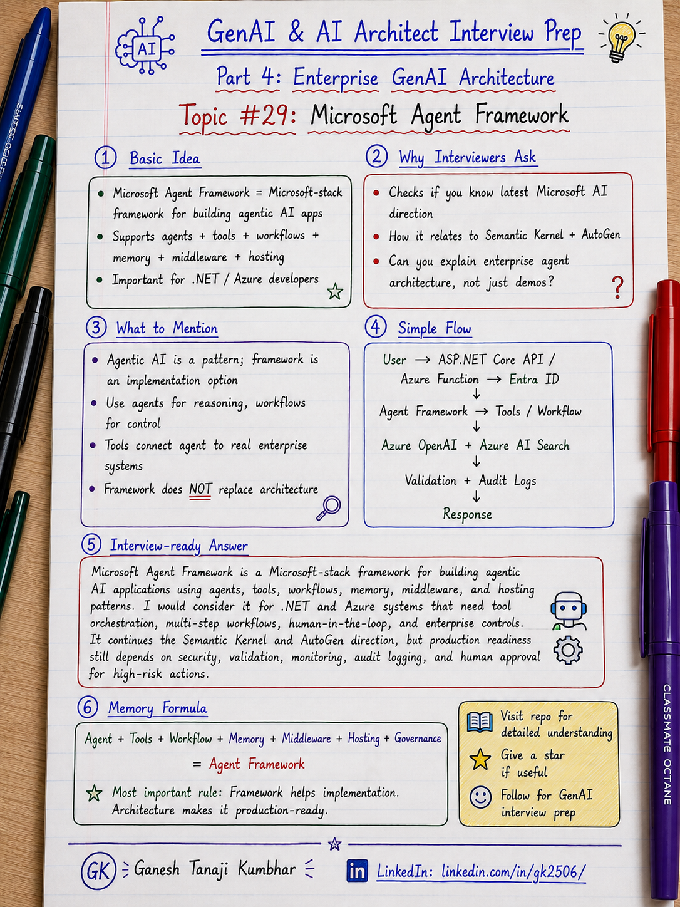

# GenAI & AI Architect Interview Prep

# Topic #29: Microsoft Agent Framework



---

## Important Note: Continuing the Microsoft Stack Direction

In the previous topics, we moved from **GenAI concepts** to a **specific Microsoft technology stack**.

We covered:

* Azure OpenAI
* Azure AI Search
* Semantic Kernel
* LangChain
* LangGraph
* Microsoft Entra ID
* Azure Key Vault
* Application Insights
* Azure Monitor
* ASP.NET Core / Azure Functions / Azure Container Apps

This topic continues that direction.

There is a common misconception that AI Agents, RAG systems, and LLM applications are only built using:

* Python
* LangChain
* LangGraph
* Open-source agent frameworks

That is not correct.

If you come from a **.NET / Azure / Microsoft stack background**, you should also understand **Microsoft Agent Framework**.

Microsoft Agent Framework is important because Microsoft is bringing together ideas from:

* Semantic Kernel
* AutoGen
* Agent orchestration
* Tools
* Workflows
* Memory
* Human-in-the-loop
* Middleware
* Hosting
* Enterprise AI application patterns

This does not mean Microsoft Agent Framework is always better than LangChain, LangGraph, or custom orchestration.

It means:

> Choose the framework based on your technology stack, team skills, enterprise environment, orchestration needs, security needs, and production requirements.

---

## Question

In an interview, you may be asked:

> What is Microsoft Agent Framework?

Or:

> How is Microsoft Agent Framework related to Semantic Kernel and AutoGen?

Or:

> When would you use Microsoft Agent Framework?

Or:

> How would you build an enterprise AI Agent using Microsoft Agent Framework?

Or:

> Does Microsoft Agent Framework automatically make an AI Agent production-ready?

---

## Why interviewer asks this

The interviewer is checking whether you understand the current Microsoft direction for building agentic AI applications.

Many candidates know these names separately:

```text
Semantic Kernel
AutoGen
LangChain
LangGraph
Azure OpenAI
Azure AI Foundry
```

But a stronger candidate should understand the bigger picture.

A senior or architect-level answer should explain:

> Microsoft Agent Framework is a Microsoft-stack approach for building agentic AI applications with agents, tools, workflows, memory, middleware, hosting, and enterprise controls.

This question also checks whether you understand the difference between:

* AI Agent as a concept
* Framework as an implementation option
* Workflow as a controlled execution path
* Tool calling as external system integration
* Human-in-the-loop as risk control
* Enterprise architecture as production readiness

This question tests your understanding of:

* Microsoft Agent Framework
* Semantic Kernel
* AutoGen
* Agents
* Workflows
* Multi-agent systems
* Tools
* MCP
* Memory
* Middleware
* Human-in-the-loop
* Azure OpenAI integration
* Azure AI Foundry direction
* .NET / Python support
* Enterprise agent architecture
* Security and governance
* Production readiness

---

## Basic answer

Microsoft Agent Framework is a Microsoft framework for building agentic AI applications.

Simple answer:

> Microsoft Agent Framework helps developers build AI agents and workflows using Microsoft-stack patterns. It supports agents, tools, workflows, memory, middleware, hosting, and enterprise application integration. It is especially relevant for .NET, Azure, and Microsoft ecosystem developers.

Simple formula:

```text
LLM
+ Tools
+ Memory
+ Workflow
+ Middleware
+ Hosting
+ Enterprise Controls
= Microsoft Agent Framework
```

Another simple way to say it:

```text
Semantic Kernel gave enterprise orchestration patterns.
AutoGen popularized multi-agent conversation patterns.
Microsoft Agent Framework brings these ideas closer together for modern agentic AI applications.
```

---

## Architect-level answer

A strong architect-level answer would be:

> Microsoft Agent Framework is a Microsoft-stack framework for building agentic AI applications using agents, tools, workflows, memory, middleware, and hosting patterns. I would consider it when I need more than a simple LLM call, such as multi-step tasks, tool orchestration, human-in-the-loop, durable workflows, memory, observability, or integration with Azure services. It is relevant for .NET and Azure teams because it aligns with Microsoft’s AI ecosystem and helps structure agents and workflows in a production-friendly way. However, I would still design authentication, authorization, tenant isolation, validation, monitoring, audit logging, fallback, and human approval because the framework alone does not make the system enterprise-ready.

---

## Must mention in interview

When answering this question, try to mention these points:

---

### 1. AI Agent is a pattern, Agent Framework is an implementation option

An AI Agent is not defined by one framework.

An AI Agent usually includes:

```text
Goal
+ LLM reasoning
+ Tools
+ Context
+ Memory
+ Planning or routing
+ Validation
+ Human approval if needed
```

Microsoft Agent Framework is one way to implement this pattern in the Microsoft ecosystem.

Important line:

> Agentic AI is an architecture pattern. Microsoft Agent Framework is one Microsoft-stack implementation option.

---

### 2. It continues the Semantic Kernel and AutoGen direction

Semantic Kernel and AutoGen had different strengths.

Semantic Kernel was strong for:

* Enterprise application integration
* Plugins
* .NET / C# usage
* Azure OpenAI integration
* Microsoft-stack patterns
* Tool and function orchestration

AutoGen was known for:

* Multi-agent conversations
* Agents collaborating with each other
* Agent-to-agent interaction
* Research and experimentation around agentic patterns
* Flexible conversation patterns

Microsoft Agent Framework brings these ideas closer together.

Important line:

> Microsoft Agent Framework combines the enterprise direction of Semantic Kernel with the multi-agent direction of AutoGen.

---

### 3. Understand agents vs workflows

This is very important.

Do not use agents for everything.

Use an agent when:

* Task is open-ended
* User conversation is dynamic
* Tool choice is dynamic
* The model needs to decide the next step
* The task may require reasoning
* The system may need multi-turn interaction

Use a workflow when:

* Steps are known
* Order is fixed
* Business rules are strict
* Approval process is defined
* You need explicit control
* Auditing and predictable execution are important

Example:

```text
Open-ended user request
        → Agent

Fixed approval process
        → Workflow
```

Important line:

> Use agents for flexible reasoning. Use workflows for controlled business processes.

---

### 4. Tools are central to agents

An AI Agent becomes useful when it can interact with external systems.

Tools may include:

* Search policy
* Fetch claim
* Get expense status
* Create approval request
* Send notification
* Query database
* Call CRM API
* Create support ticket
* Retrieve document
* Call payment system

In Microsoft-stack applications, these tools may wrap:

* C# services
* ASP.NET Core APIs
* Azure Functions
* Azure Logic Apps
* Internal business APIs
* Azure AI Search
* Microsoft Graph
* Databases

Important line:

> Tools connect the agent to real enterprise systems. Without tools, the agent mostly talks. With tools, the agent can act.

---

### 5. Workflows help control complex processes

Workflows are useful when multiple steps must happen in a controlled sequence.

Example:

```text
Validate request
        ↓
Check permission
        ↓
Fetch data
        ↓
Retrieve policy
        ↓
Generate recommendation
        ↓
Human approval
        ↓
Execute action
        ↓
Audit log
```

This is useful for:

* Human-in-the-loop
* Long-running tasks
* Approval processes
* Retry and fallback
* Branching
* Checkpoints
* Multi-step automation
* Compliance-heavy flows

Important line:

> Workflows give architects more control over multi-step agentic systems.

---

### 6. Memory and state matter

Real enterprise agents need state.

Examples:

* Conversation state
* User session
* Task progress
* Approval status
* Tool-call results
* Long-running process checkpoint
* User preference where allowed
* Retrieved context summary

Memory should be designed carefully.

Do not store everything.

Consider:

* What should be remembered?
* For how long?
* Is it tenant-specific?
* Does it contain PII?
* Who can access it?
* Can it be deleted?
* Is it auditable?

Important line:

> Memory is useful, but unmanaged memory can become a privacy and compliance risk.

---

### 7. Middleware can enforce enterprise controls

Middleware is useful for cross-cutting controls.

Examples:

* Logging
* Telemetry
* Safety checks
* Tool-call approval
* PII masking
* Rate limiting
* Cost tracking
* Prompt/version tracking
* Policy enforcement
* Request/response inspection

In enterprise architecture, this matters because every tool call and model call should be controlled.

Important line:

> Middleware helps enforce governance around agent actions.

---

### 8. Human-in-the-loop is still important

AI agents should not directly execute high-risk business actions without controls.

Examples of high-risk actions:

* Approve payment
* Reject claim
* Change policy
* Send legal communication
* Update customer record
* Trigger refund
* Delete data
* Create financial transaction

Better approach:

```text
Agent recommends
        ↓
Human reviews
        ↓
Workflow executes
        ↓
Audit logs prove what happened
```

Important line:

> AI can recommend. Humans should approve high-risk actions.

---

### 9. Microsoft Agent Framework fits Microsoft-stack teams

It is especially relevant for teams already using:

* .NET
* C#
* ASP.NET Core
* Azure OpenAI
* Azure AI Foundry
* Azure Functions
* Azure Container Apps
* Microsoft Entra ID
* Azure Key Vault
* Application Insights
* Azure Monitor
* Azure AI Search
* Microsoft Graph
* Existing enterprise APIs

Important line:

> For Microsoft-stack enterprise teams, Microsoft Agent Framework is a natural topic to evaluate for agentic AI architecture.

---

### 10. It does not remove the need for architecture

A framework helps implementation, but production readiness still needs architecture.

You still need:

* Authentication
* Authorization
* Tenant isolation
* RBAC
* PII handling
* Prompt validation
* Output validation
* Tool-call control
* Audit logging
* Monitoring
* Cost tracking
* Fallback
* Human approval
* Security review
* Evaluation

Important line:

> Framework does not replace architecture. Framework supports architecture.

---

## Real-world example: Expense Management AI Agent

Let us use the common scenario from this series.

### Business context

We are building an **Expense Management AI Agent**.

A user asks:

```text
Why was my hotel expense rejected, and can I resubmit it?
```

The system may need to:

* Authenticate user
* Check tenant and role
* Fetch expense details
* Retrieve policy
* Explain rejection reason
* Suggest next action
* Create approval request if allowed
* Ask for human approval where needed
* Log the full trace

---

## Microsoft Agent Framework style design

A possible design can look like this:

```text
User
  ↓
ASP.NET Core API / Azure Function
  ↓
Microsoft Entra ID Authentication
  ↓
Microsoft Agent Framework
  ↓
Agent:
    Expense Assistant Agent
  ↓
Tools:
    GetExpenseDetails
    SearchExpensePolicy
    CheckUserPermission
    CreateApprovalRequest
    NotifyManager
  ↓
Workflow:
    Validate request
    Retrieve data
    Generate explanation
    Ask human approval if needed
    Execute safe action
    Log audit trail
  ↓
Azure OpenAI
  ↓
Azure AI Search
  ↓
Application Insights + Audit Logs
```

---

## Example tools

```text
ExpenseTool.GetExpenseDetails(expenseId)

PolicyTool.SearchPolicy(query, tenantId, region)

PermissionTool.CheckAccess(userId, expenseId)

ApprovalTool.CreateManagerApprovalRequest(expenseId)

NotificationTool.SendManagerNotification(managerId)
```

The agent should not call tools freely without control.

Tool calls should check:

* User permission
* Tenant boundary
* Input validation
* Business rules
* Risk level
* Audit logging requirement

---

## Example workflow

```text
User asks question
        ↓
Authenticate user
        ↓
Check tenant and role
        ↓
Fetch expense details
        ↓
Retrieve policy using Azure AI Search
        ↓
Generate explanation using Azure OpenAI
        ↓
Validate response
        ↓
If action requested:
        check permission
        route to approval workflow
        log audit trail
        ↓
Return answer with next step
```

---

## Example response

```text
Your hotel expense was rejected because the amount is above the allowed hotel limit and the receipt is missing.

You can resubmit it after uploading the receipt.

Since the amount is above the limit, manager exception approval will be required.
```

The system should also log:

```text
correlationId
userId
tenantId
expenseId
retrievedPolicyId
toolCalls
modelName
workflowStatus
validationResult
finalAction
```

---

## When to use Microsoft Agent Framework

Use it when:

* You are building agentic AI applications on Microsoft stack
* You need tool calling
* You need multi-step orchestration
* You need workflows
* You need memory or state
* You need human-in-the-loop
* You need middleware
* You need enterprise hosting
* You want a structured approach for agentic applications
* Your team is comfortable with .NET / Azure / Microsoft ecosystem

---

## When not to use it

Do not use it only because it is new.

You may not need it when:

* The use case is a simple LLM call
* A deterministic API can solve the problem
* Simple RAG flow is enough
* No tool orchestration is needed
* No multi-step workflow is needed
* Team does not have Microsoft-stack experience
* Existing LangChain or LangGraph solution is already stable
* Custom orchestration is simpler and maintainable

Important line:

> Do not add a framework unless it solves a real orchestration, maintainability, or enterprise integration problem.

---

## Microsoft Agent Framework vs Semantic Kernel vs AutoGen

| Area               | Semantic Kernel                         | AutoGen                                      | Microsoft Agent Framework                                |
| ------------------ | --------------------------------------- | -------------------------------------------- | -------------------------------------------------------- |
| Main strength      | Enterprise orchestration and plugins    | Multi-agent conversation patterns            | Unified Microsoft direction for agents and workflows     |
| Common association | .NET / Azure / plugins                  | Multi-agent collaboration                    | Agents, workflows, tools, memory, middleware             |
| Good for           | Existing Microsoft-stack apps           | Agent experiments and collaboration patterns | Production-style Microsoft-stack agentic apps            |
| Focus              | Kernel, plugins, functions              | Conversable agents                           | Agents + workflows + enterprise controls                 |
| Enterprise fit     | Strong                                  | More research / experimentation oriented     | Strong Microsoft-stack direction                         |
| Interview framing  | Good for .NET/Azure agent orchestration | Good to understand multi-agent patterns      | Important next topic for Microsoft-stack AI architecture |

---

## Microsoft Agent Framework vs LangChain / LangGraph

| Area | Microsoft Agent Framework | LangChain / LangGraph |
|---|---|
| Ecosystem | Microsoft / Azure / .NET direction | Python-first AI ecosystem |
| Enterprise Microsoft fit | Strong | Possible, but less Microsoft-native |
| Workflow style | Agents and workflows | Chains, agents, graph workflows |
| Good for | Microsoft-stack enterprise apps | Python-first and broad open-source integrations |
| Team fit | .NET / Azure teams | Python / data science / AI-first teams |
| Key decision | Fits Microsoft architecture | Fits Python ecosystem and graph-heavy orchestration |

Important note:

> This is not about which framework is universally better. It is about which framework fits your architecture.

---

## What can go wrong?

### 1. Thinking framework means architecture

```text
Wrong:
We use Microsoft Agent Framework, so the system is production-ready.
```

Better:

```text
Framework helps implementation.
Architecture makes it secure, reliable, observable, and maintainable.
```

---

### 2. Using agents for deterministic workflows

```text
Wrong:
Use an AI Agent for every process.
```

Better:

```text
If the process is fixed and deterministic, use normal workflow or code.
Use agents when reasoning and dynamic tool choice are needed.
```

---

### 3. Ignoring authorization before tool calls

```text
Wrong:
Agent decides and calls business tools directly.
```

Better:

```text
Check user permission, tenant boundary, and business rules before tool execution.
```

---

### 4. No human approval for high-risk actions

```text
Wrong:
Agent approves payment automatically.
```

Better:

```text
Agent recommends.
Human approves.
Workflow executes.
Audit logs prove.
```

---

### 5. Logging only final answer

```text
Wrong:
Only log the final response.
```

Better:

```text
Log correlation ID, tool calls, retrieved context, model used, workflow status, validation result, and final action.
```

---

### 6. Storing too much memory

```text
Wrong:
Store all user conversation forever.
```

Better:

```text
Store only useful and allowed memory with retention, masking, access control, and deletion strategy.
```

---

### 7. Choosing framework because it is latest

```text
Wrong:
Use Microsoft Agent Framework because it is new.
```

Better:

```text
Choose it only when it fits stack, team skill, workflow complexity, security, hosting, and maintainability.
```

---

## Common mistake

Many candidates say:

> Microsoft Agent Framework is used to build AI Agents.

This is correct, but too basic.

Better answer:

> Microsoft Agent Framework helps build agentic applications using agents, tools, workflows, memory, middleware, and hosting patterns. But enterprise readiness still depends on security, validation, observability, audit logging, human approval, and proper architecture.

Another common mistake:

> Microsoft Agent Framework replaces all other frameworks.

Better answer:

> It is an important Microsoft-stack direction, especially for teams using .NET and Azure. But framework choice should still depend on architecture fit, team skills, ecosystem, and existing production investment.

Another common mistake:

> Agent means autonomous execution.

Better answer:

> Enterprise agents should work within permission boundaries, validation rules, workflow controls, and human approval where needed.

---

## Better interview answer

A strong answer can be:

> Microsoft Agent Framework is a Microsoft-stack framework for building agentic AI applications using agents, tools, workflows, memory, middleware, and enterprise hosting patterns. I would consider it when building AI agents on .NET and Azure, especially when the application needs tool orchestration, multi-step workflows, human-in-the-loop, memory, observability, and integration with Azure services. It continues the direction of Semantic Kernel and AutoGen by bringing enterprise orchestration and multi-agent concepts closer together. However, I would not rely on the framework alone. I would still design authentication, authorization, tenant isolation, PII protection, validation, monitoring, fallback, audit logging, and human approval for high-risk actions.

---

## One-line answer

> Microsoft Agent Framework is a Microsoft-stack option for building agentic AI applications with agents, tools, workflows, memory, middleware, and enterprise controls.

---

## Memory formula

Use this formula:

```text
Agent
+ Tools
+ Workflow
+ Memory
+ Middleware
+ Hosting
+ Governance
= Microsoft Agent Framework
```

Another version:

```text
Semantic Kernel
+ AutoGen
+ Enterprise Workflows
+ Microsoft Stack
= Agent Framework Direction
```

Or:

```text
Use agents for reasoning.
Use workflows for control.
Use tools for action.
Use governance for safety.
```

Most important rule:

```text
Framework helps implementation.
Architecture makes it production-ready.
```

---

## Interview closing line

You can close your answer like this:

> I would treat Microsoft Agent Framework as an implementation option for Microsoft-stack agentic AI systems. It can help structure agents, tools, workflows, memory, and middleware, but the production architecture must still enforce security, validation, observability, auditability, and human approval for high-risk actions.

---

## Related upcoming topics

* AI Architecture Meets Regular Enterprise Architecture
* How AI Fits with Microservices Architecture
* Event-driven Architecture for AI Systems
* Containers and Kubernetes for AI Applications
* MLOps vs LLMOps
* How would you design an Agentic AI system?

---

## Reference Scenario

This topic can be understood using the common **Expense Management AI Agent** scenario used across this series.

You can refer to the scenario here:

```text
00-common-examples/expense-management-ai-agent-scenario.md
```

---

## About the Author

These notes are created and maintained by **Ganesh Tanaji Kumbhar**, an **AI Architect** with experience in **.NET, Azure, cloud architecture, infrastructure, enterprise application modernization, and GenAI solution design**.

I bring practical experience across:

* **.NET / C# / ASP.NET / Web API**
* **Azure App Services, Azure Functions, WebJobs, Azure SQL, Storage, Redis**
* **Cloud architecture and infrastructure modernization**
* **Application architecture and enterprise system design**
* **CI/CD, DevOps, monitoring, and production support**
* **GenAI, RAG, Agentic AI, and AI architecture patterns**

These notes are based on my real experience as both:

* An **interviewee**, facing AI, architecture, cloud, .NET, Azure, and system design rounds
* An **interviewer**, evaluating how candidates explain concepts, tradeoffs, project experience, and real-world design decisions

I write about:

* GenAI Architecture
* RAG System Design
* Agentic AI
* AI Architect Interview Preparation
* .NET and Azure Architecture
* Cloud and Enterprise AI Patterns

If you are preparing for **GenAI / AI Architect / Staff Engineer / Solution Architect / .NET Architect / Azure Architect** interviews, feel free to connect with me on LinkedIn.

🔗 **LinkedIn:** [Connect with me on LinkedIn](https://www.linkedin.com/in/gk2506/)

💬 You can also DM me on LinkedIn if you want to discuss AI architecture, interview preparation, .NET/Azure architecture, or practical GenAI learning.
