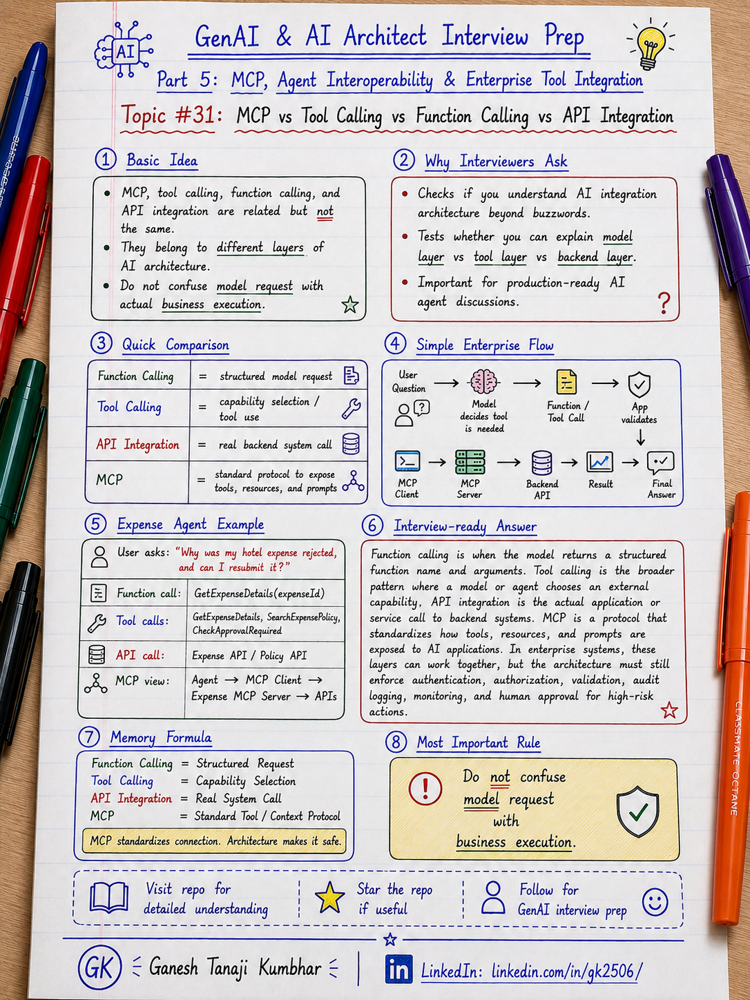

# GenAI & AI Architect Interview Prep

# Topic #31: MCP vs Tool Calling vs Function Calling vs API Integration



---

## Important Note: Continuing Part 5

In the previous topic, we started **Part 5: Model Context Protocol, Agent Interoperability, and Enterprise Tool Integration**.

We covered:

* What MCP is
* Why AI Architects should know MCP
* How MCP helps AI applications connect to tools, resources, prompts, and systems
* Why MCP needs security, governance, and architecture controls

Now we need to clarify one very common confusion:

```text
MCP
Tool Calling
Function Calling
API Integration
```

Many people use these terms as if they mean the same thing.

They are related, but they are **not the same**.

Important learning point:

> Tool calling is how the model asks to use a capability.
> Function calling is a structured way for the model to request a function.
> API integration is how application code talks to external systems.
> MCP is a protocol for exposing tools, resources, and prompts to AI applications.

---

## Question

In an interview, you may be asked:

> What is the difference between MCP and tool calling?

Or:

> Is MCP the same as function calling?

Or:

> How is MCP different from normal API integration?

Or:

> If you already have APIs, why do you need MCP?

Or:

> How would MCP, function calling, and APIs work together in an enterprise AI Agent?

---

## Why interviewer asks this

The interviewer is checking whether you understand AI integration architecture beyond buzzwords.

A weak candidate may say:

```text
MCP is tool calling.
```

Or:

```text
Function calling means the model calls the API.
```

Or:

```text
MCP replaces APIs.
```

These answers are incomplete.

A stronger candidate should explain the layers clearly:

```text
Model decides a tool is needed
        ↓
Framework / application handles the tool request
        ↓
MCP may expose the tool in a standard way
        ↓
Application or MCP server calls the actual API
        ↓
Result is returned back to the model/application
```

This question tests your understanding of:

* Tool calling
* Function calling
* MCP
* API integration
* AI Agents
* Model output
* Structured arguments
* Application orchestration
* Enterprise APIs
* Security boundaries
* Tool governance
* Audit logging
* Human approval
* Production readiness

---

## Basic answer

Simple answer:

> MCP, tool calling, function calling, and API integration are related, but they sit at different layers of the architecture.

Simple comparison:

| Concept          | Simple meaning                                                         |
| ---------------- | ---------------------------------------------------------------------- |
| Function calling | Model returns structured function name and arguments                   |
| Tool calling     | Model or agent decides to use an external capability                   |
| API integration  | Application code calls an external system or endpoint                  |
| MCP              | Protocol for exposing tools, resources, and prompts to AI applications |

Simple formula:

```text
Function Calling = Structured model request

Tool Calling = Model wants to use a capability

API Integration = Application calls real system

MCP = Standard protocol to expose capabilities to AI apps
```

---

## Architect-level answer

A strong architect-level answer would be:

> I would not treat MCP, tool calling, function calling, and API integration as the same thing. Function calling is usually the model producing a structured request with function name and arguments. Tool calling is a broader pattern where the model or agent decides to use an external capability. API integration is the actual application or service call to a backend system. MCP is a protocol that can expose tools, resources, and prompts to AI applications in a standard way. In enterprise architecture, these layers may work together, but security, authorization, validation, audit logging, and human approval still need to be designed separately.

---

## Must mention in interview

When answering this question, try to mention these points:

---

### 1. Function calling is structured model output

Function calling means the model produces a structured request.

Example:

```text
Function name:
GetExpenseDetails

Arguments:
{
  "expenseId": "EXP-7890"
}
```

The important point is:

```text
The model does not directly execute the function.
```

The model returns the function name and arguments.

Then the application, framework, or tool runtime executes the function.

Important line:

> Function calling is structured output from the model. Execution still happens in your application or tool layer.

---

### 2. Tool calling is broader than function calling

Tool calling is a broader concept.

A tool can be:

* Function
* API wrapper
* Search service
* Database query
* File search
* Calculator
* Workflow action
* Ticket creation
* Policy lookup
* Document retrieval
* MCP tool

Example:

```text
User asks:
"Why was my hotel expense rejected?"

Model decides:
I need expense details and policy information.

Tool calls:
GetExpenseDetails
SearchExpensePolicy
```

Important line:

> Function calling is one way to implement tool calling, but tool calling is a broader pattern.

---

### 3. API integration is the real backend call

API integration is normal software engineering.

Example:

```text
GET /api/expenses/EXP-7890

POST /api/approval-requests

GET /api/policies/hotel-limit
```

The AI model usually should not directly call these APIs.

Instead:

```text
Model requests tool
        ↓
Application validates request
        ↓
Application calls API
        ↓
API returns result
        ↓
Application gives result back to model
```

Important line:

> APIs are still the real enterprise system boundary. AI frameworks and MCP do not remove the need for APIs.

---

### 4. MCP is a protocol layer

MCP is different.

MCP provides a standard way for AI applications to connect with:

* Tools
* Resources
* Prompts
* External systems
* Business capabilities

Simple MCP view:

```text
AI Application / Agent
        ↓
MCP Client
        ↓
MCP Server
        ↓
Tools / Resources / Prompts
        ↓
External Systems
```

Important line:

> MCP is not the tool itself. MCP is a protocol layer that helps expose tools, resources, and prompts to AI applications.

---

### 5. MCP does not replace APIs

This is a common confusion.

Wrong understanding:

```text
MCP replaces backend APIs.
```

Better understanding:

```text
MCP servers often wrap backend APIs, databases, search services, or workflow systems.
```

Example:

```text
Expense MCP Server
        ↓
Expense API
        ↓
Expense Database
```

MCP exposes a standard AI-facing interface.

The API still owns the business logic and data access.

Important line:

> MCP does not replace APIs. MCP can expose APIs to AI applications in a standardized way.

---

### 6. Function calling does not automatically mean secure action

A model may produce this function call:

```text
CreateRefundRequest(
  claimId = "CLM-123",
  amount = 5000
)
```

But the system must still check:

* Is the user authenticated?
* Is the user authorized?
* Is this tenant correct?
* Is refund allowed?
* Is approval required?
* Is the amount valid?
* Should a human approve?
* Should this be audited?

Important line:

> A valid function call is not the same as an authorized business action.

---

### 7. MCP tools also need governance

MCP can expose powerful tools.

Examples:

```text
SearchPolicy
GetCustomerDetails
CreateTicket
UpdateClaimStatus
CreateApprovalRequest
```

But every tool should be controlled.

You still need:

* Authentication
* Authorization
* Tenant isolation
* Least privilege
* Tool allowlist
* Input validation
* Output filtering
* Audit logging
* Rate limiting
* Human approval for risky actions

Important line:

> MCP makes tools easier to expose. Architecture must make tools safe to use.

---

### 8. These layers can work together

A real AI Agent can use all four concepts together.

Example:

```text
User asks a question
        ↓
Model decides tool is needed
        ↓
Function/tool call is generated
        ↓
Application uses MCP client
        ↓
MCP server exposes business tool
        ↓
MCP server calls backend API
        ↓
Result returns to agent
        ↓
Agent generates final answer
```

Important line:

> MCP, tool calling, function calling, and APIs are not competitors. They can be layers in the same architecture.

---

### 9. Microsoft-stack view

In a Microsoft / .NET / Azure system, this could look like:

```text
ASP.NET Core API / Azure Function
        ↓
Microsoft Agent Framework / Semantic Kernel
        ↓
Tool calling / function calling
        ↓
MCP client
        ↓
Enterprise MCP server
        ↓
Internal ASP.NET Core API / Azure Function / Azure AI Search
        ↓
Azure OpenAI response generation
        ↓
Application Insights + Audit Logs
```

This is important for Microsoft-stack developers.

You can explain MCP without leaving your familiar architecture world.

Important line:

> For .NET and Azure teams, MCP can become a clean integration layer between AI Agents and existing enterprise APIs.

---

### 10. Choose the simplest useful approach

Do not use MCP everywhere just because it is trending.

For a simple use case:

```text
User question
        ↓
Call Azure AI Search
        ↓
Call Azure OpenAI
        ↓
Return answer
```

You may not need MCP.

Use MCP when:

* Multiple AI apps need the same tools
* Tool integration is growing
* You want standardization
* You need reusable tool servers
* You need tool discovery
* You want cleaner separation between AI app and backend systems

Important line:

> Use direct API calls for simple integration. Use MCP when reusable AI tool integration becomes important.

---

## Real-world example: Expense Management AI Agent

Let us use the common scenario from this series.

### Business context

We are building an **Expense Management AI Agent**.

A user asks:

```text
Why was my hotel expense rejected, and can I resubmit it?
```

The agent may need to:

* Fetch expense details
* Search expense policy
* Check approval requirement
* Verify user permission
* Create approval request if allowed
* Return explanation
* Log the full trace

---

## Without tool calling

Without tool calling, the model can only answer from its existing context.

```text
User:
Why was my hotel expense rejected?

Model:
I do not know your actual expense details unless they are provided.
```

This is limited.

The model needs external information.

---

## With function calling

The model can produce a structured request:

```text
Function:
GetExpenseDetails

Arguments:
{
  "expenseId": "EXP-7890"
}
```

Then the application executes the function.

The model does not directly access the database.

The application controls execution.

---

## With tool calling

The agent may use multiple tools:

```text
GetExpenseDetails(EXP-7890)
SearchExpensePolicy("hotel receipt and limit")
CheckApprovalRequired(EXP-7890)
```

Tool calling is broader because the agent may decide which capability to use next.

---

## With API integration

The actual application may call backend APIs:

```text
GET /expenses/EXP-7890

GET /policies?type=hotel&region=IN

POST /approval-requests
```

These APIs still enforce business rules.

---

## With MCP

An enterprise MCP server may expose tools:

```text
Expense MCP Server

Tools:
- GetExpenseDetails
- SearchExpensePolicy
- CheckApprovalRequired
- CreateApprovalRequest
```

The AI application connects through MCP:

```text
AI Agent
        ↓
MCP Client
        ↓
Expense MCP Server
        ↓
Expense API / Policy API / Approval API
```

This makes the tools more reusable for other AI applications.

---

## Full enterprise flow

```text
User asks:
"Why was my hotel expense rejected?"

        ↓

Agent decides it needs expense and policy data

        ↓

Tool/function call is generated

        ↓

Application validates user identity and permission

        ↓

MCP client calls Expense MCP Server

        ↓

MCP server calls internal Expense API and Policy API

        ↓

Result returns to agent

        ↓

Agent generates grounded answer

        ↓

Application validates response

        ↓

Audit logs capture tool calls and final answer
```

---

## Example final response

```text
Your hotel expense was rejected because the receipt is missing and the amount is above the allowed hotel limit.

You can resubmit it after uploading the receipt.

Because the amount is above the standard limit, manager exception approval will be required.
```

---

## What should be logged?

In production, log important events such as:

```text
correlationId
userId
tenantId
requestId
modelName
toolName
functionName
mcpServerName
inputSummary
outputSummary
authorizationResult
validationResult
finalAnswer
approvalRequired
timestamp
```

Important rule:

> Log enough to trace the decision, but avoid logging unnecessary raw PII.

---

## Simple comparison table

| Area             | Function Calling          | Tool Calling                    | API Integration              | MCP                                 |
| ---------------- | ------------------------- | ------------------------------- | ---------------------------- | ----------------------------------- |
| Main role        | Structured model request  | External capability usage       | Backend system communication | Standard AI tool protocol           |
| Who uses it?     | Model / LLM runtime       | Agent / framework / app         | Application / service        | AI app through MCP client           |
| Executes action? | No, app executes          | Usually app/tool layer executes | Yes, app calls API           | MCP server calls underlying systems |
| Example          | `GetExpenseDetails(args)` | Search policy, create ticket    | REST API call                | Expense MCP server                  |
| Best for         | Structured arguments      | Agent actions                   | Business system access       | Reusable AI tool exposure           |
| Risk             | Wrong arguments           | Wrong tool choice               | Unauthorized backend access  | Tool misuse if not governed         |

---

## Common mistake

Many candidates say:

> MCP and tool calling are the same.

Better answer:

> Tool calling is the pattern where a model or agent requests an external capability. MCP is a protocol that can expose those capabilities to AI applications in a standard way.

Another common mistake:

> Function calling means the model executes the function.

Better answer:

> Function calling means the model returns a structured function request. The application or framework executes the function.

Another common mistake:

> MCP replaces APIs.

Better answer:

> MCP servers often wrap existing APIs. APIs still own business logic, data access, validation, and system boundaries.

---

## What can go wrong?

### 1. Letting the model directly control backend actions

```text
Wrong:
Model decides refund and backend executes immediately.
```

Better:

```text
Model suggests action.
Application validates.
Human approves if risky.
Workflow executes.
Audit logs prove what happened.
```

---

### 2. No argument validation

```text
Wrong:
Trust model-generated arguments blindly.
```

Better:

```text
Validate schema, values, ranges, user permission, and business rules.
```

---

### 3. Exposing low-level APIs as tools

```text
Wrong:
ExecuteSqlQuery(query)
```

Better:

```text
SearchExpensePolicy(query, tenantId, region)
```

Expose business-level tools, not dangerous low-level operations.

---

### 4. Confusing tool success with answer correctness

A tool may return data successfully, but the final AI answer can still be wrong.

You still need:

* Grounding
* Validation
* Citations where applicable
* Business rule checks
* Output review for sensitive actions

---

### 5. No observability

Bad design:

```text
Only final AI answer is logged.
```

Better design:

```text
Log request, selected tool, arguments summary, authorization result, tool response summary, validation result, and final answer.
```

---

## Better interview answer

A strong answer can be:

> I would separate these concepts clearly. Function calling is when the model returns a structured function name and arguments. Tool calling is the broader agent pattern where the model or framework decides to use an external capability. API integration is the actual application or service call to backend systems. MCP is a protocol that can expose tools, resources, and prompts to AI applications in a standard way. In enterprise systems, these layers may work together, but the architecture must still enforce authentication, authorization, tenant isolation, input validation, output validation, audit logging, monitoring, fallback, and human approval for high-risk actions.

---

## One-line answer

> Function calling structures the model request, tool calling chooses the external capability, API integration executes real system access, and MCP standardizes how tools and context are exposed to AI applications.

---

## Memory formula

Use this formula:

```text
Function Calling = Structured request

Tool Calling = Capability selection

API Integration = Real system call

MCP = Standard tool/context protocol
```

Another version:

```text
Model asks
App validates
Tool executes
API responds
MCP standardizes
Architecture secures
```

Most important rule:

```text
Do not confuse model request with business execution.
```

---

## Interview closing line

You can close your answer like this:

> I would not say MCP, tool calling, function calling, and API integration are the same. They are different layers. A strong AI architecture uses them carefully: the model can request a tool, the application validates the request, MCP can expose reusable tools, APIs execute business operations, and enterprise controls keep everything secure, observable, and auditable.

---

## Related upcoming topics

* MCP Architecture: Host, Client, Server, Tools, Resources, and Prompts
* Designing MCP Servers for Enterprise APIs and Data Sources
* MCP Security, Identity, Permissions, and Tool Governance
* MCP with Microsoft Agent Framework, Semantic Kernel, and Azure
* MCP Observability, Errors, Timeouts, and Production Readiness
* MCP vs A2A: Tool Integration vs Agent-to-Agent Communication

---

## Reference Scenario

This topic can be understood using the common **Expense Management AI Agent** scenario used across this series.

You can refer to the scenario here:

```text
00-common-examples/expense-management-ai-agent-scenario.md
```

---

## About the Author

These notes are created and maintained by **Ganesh Tanaji Kumbhar**, an **AI Architect** with experience in **.NET, Azure, cloud architecture, infrastructure, enterprise application modernization, and GenAI solution design**.

I bring practical experience across:

* **.NET / C# / ASP.NET / Web API**
* **Azure App Services, Azure Functions, WebJobs, Azure SQL, Storage, Redis**
* **Cloud architecture and infrastructure modernization**
* **Application architecture and enterprise system design**
* **CI/CD, DevOps, monitoring, and production support**
* **GenAI, RAG, Agentic AI, and AI architecture patterns**

These notes are based on my real experience as both:

* An **interviewee**, facing AI, architecture, cloud, .NET, Azure, and system design rounds
* An **interviewer**, evaluating how candidates explain concepts, tradeoffs, project experience, and real-world design decisions

I write about:

* GenAI Architecture
* RAG System Design
* Agentic AI
* AI Architect Interview Preparation
* .NET and Azure Architecture
* Cloud and Enterprise AI Patterns

If you are preparing for **GenAI / AI Architect / Staff Engineer / Solution Architect / .NET Architect / Azure Architect** interviews, feel free to connect with me on LinkedIn.

🔗 **LinkedIn:** [Connect with me on LinkedIn](https://www.linkedin.com/in/gk2506/)

💬 You can also DM me on LinkedIn if you want to discuss AI architecture, interview preparation, .NET/Azure architecture, or practical GenAI learning.
