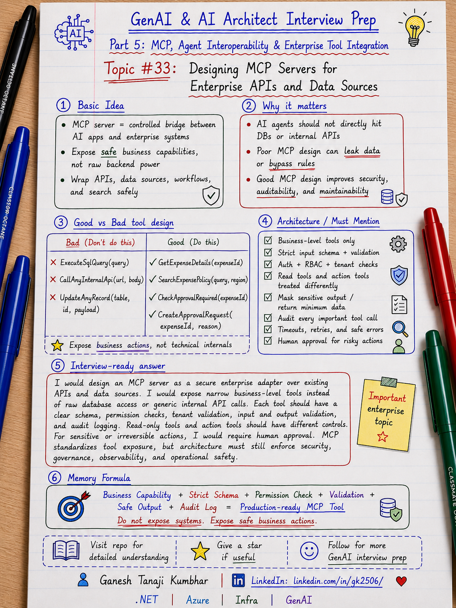

# GenAI & AI Architect Interview Prep

# Topic #33: Designing MCP Servers for Enterprise APIs and Data Sources



---

## Important Note: Continuing Part 5

In the previous topics, we covered:

* What MCP is
* MCP vs Tool Calling vs Function Calling vs API Integration
* MCP Architecture: Host, Client, Server, Tools, Resources, and Prompts

Now we move to a more practical architecture question:

> How do you design an MCP server for real enterprise APIs and data sources?

This is important because in enterprise systems, we do not want AI Agents to directly access databases, internal APIs, files, or workflow systems without control.

A badly designed MCP server can expose too much power.

A well-designed MCP server exposes **safe business capabilities**.

Important learning point:

> MCP servers should expose controlled business-level capabilities, not unrestricted backend access.

---

## Question

In an interview, you may be asked:

> How would you design an MCP server for enterprise APIs?

Or:

> How should an MCP server expose tools safely?

Or:

> Should an MCP server directly expose database queries?

Or:

> How would you design an MCP server for claims, expense, policy, document, or ticketing systems?

Or:

> What should architects consider before exposing internal APIs through MCP?

---

## Why interviewer asks this

The interviewer wants to know whether you can move from concept to production design.

A weak answer is:

```text
I will create an MCP server and expose all APIs as tools.
```

That is risky.

A stronger answer is:

```text
I will expose only approved business capabilities through narrow, safe, auditable tools. The MCP server will validate identity, permissions, tenant, inputs, outputs, rate limits, and risky actions before calling backend APIs.
```

This question tests your understanding of:

* MCP server design
* Enterprise API wrapping
* Business capability modeling
* Tool design
* Resource design
* Prompt design
* Authentication
* Authorization
* Tenant isolation
* Input validation
* Output filtering
* Audit logging
* Rate limiting
* Human approval
* Production safety

---

## Basic answer

An MCP server should act as a controlled bridge between AI applications and enterprise systems.

Simple view:

```text
AI Agent / Host
        ↓
MCP Client
        ↓
Enterprise MCP Server
        ↓
Approved Tools / Resources / Prompts
        ↓
Internal APIs / Databases / Search / Workflows
```

Simple explanation:

> An enterprise MCP server should not expose everything. It should expose selected business capabilities such as search policy, fetch claim details, get expense status, retrieve documents, create tickets, or start approval workflows.

---

## Architect-level answer

A strong architect-level answer would be:

> I would design an enterprise MCP server as a secure adapter layer over existing business systems. It should expose business-level tools, resources, and prompts instead of raw backend APIs or database access. Each tool should have a clear purpose, strict input schema, permission checks, tenant validation, output filtering, audit logging, timeout handling, and error handling. For risky actions such as updating claims, approving payments, creating refunds, or submitting workflow actions, I would add human approval and policy validation. MCP standardizes tool exposure, but enterprise architecture must still enforce security, governance, observability, and operational controls.

---

## Must mention in interview

When answering this question, try to mention these points:

---

### 1. MCP server is not the backend system

An MCP server should not become the main business system.

It usually sits in front of existing systems.

Example:

```text
Expense MCP Server
        ↓
Expense API
        ↓
Expense Database
```

The backend API still owns:

* Business rules
* Data ownership
* Transactions
* Validation
* Authorization
* System integrity

Important line:

> MCP server should expose enterprise systems safely, not replace enterprise systems.

---

### 2. Expose business capabilities, not raw APIs

Bad design:

```text
CallAnyApi(url, payload)

ExecuteSqlQuery(query)

UpdateAnyRecord(table, id, payload)
```

These tools are too dangerous.

Better design:

```text
GetExpenseDetails(expenseId)

SearchExpensePolicy(query, region)

CheckApprovalRequired(expenseId)

CreateApprovalRequest(expenseId, reason)

GetClaimSummary(claimId)

SearchClaimDocuments(claimId, query)
```

Important line:

> MCP tools should be narrow, business-focused, and safe by design.

---

### 3. Design tools around user intent

Do not simply map every API endpoint to one MCP tool.

Instead, design tools around business tasks.

Example user intent:

```text
Why was my hotel expense rejected?
```

Useful tools:

```text
GetExpenseDetails
SearchExpensePolicy
CheckReceiptStatus
CheckApprovalRequired
```

Not useful:

```text
GetTableRows
ExecuteQuery
PostToInternalService
```

Important line:

> Good MCP tools match business intent, not database structure.

---

### 4. Use strict input schemas

Every tool should define clear input requirements.

Example:

```text
Tool:
GetExpenseDetails

Input:
expenseId: string
tenantId: string
requestingUserId: string
```

Validate:

* Required fields
* Data type
* Length
* Allowed values
* Tenant access
* User permission
* Business rule constraints

Important line:

> Never trust model-generated arguments without validation.

---

### 5. Apply authentication and authorization

The MCP server should know who is calling and what they are allowed to access.

Check:

* Is the user authenticated?
* Which tenant does the user belong to?
* What role does the user have?
* Can the user access this record?
* Can the user perform this action?
* Is approval required?

Important line:

> The AI Agent should act within the logged-in user’s permission boundary.

---

### 6. Separate read tools and action tools

Read tools fetch information.

Action tools change something.

Read tools:

```text
GetExpenseDetails
SearchPolicy
GetClaimSummary
RetrieveDocument
```

Action tools:

```text
CreateApprovalRequest
UpdateClaimStatus
CreateTicket
SendNotification
```

Action tools need stricter controls.

For risky actions, add:

* Confirmation
* Human approval
* Policy validation
* Audit logging
* Idempotency
* Rollback or compensation strategy

Important line:

> Reading data and changing business state are not the same risk level.

---

### 7. Avoid exposing sensitive data unnecessarily

The MCP server should minimize and filter output.

Bad response:

```text
Full customer profile with PAN, Aadhaar, bank details, phone, email, address, full claim history.
```

Better response:

```text
Only the fields needed to answer the user’s question.
```

Use:

* Data minimization
* PII masking
* Output filtering
* Role-based response shaping
* Secure logging

Important line:

> Return only the data required for the task.

---

### 8. Design resources carefully

Resources provide readable context.

Examples:

```text
Expense policy document

Claim summary

Policy rule document

Receipt metadata

Support knowledge article

Document metadata
```

Resources should be filtered by:

* Tenant
* User
* Role
* Region
* Business unit
* Data classification
* Access permission

Important line:

> MCP resources should follow the same access rules as the original system.

---

### 9. Use prompts for repeatable workflows

Prompts can standardize common tasks.

Examples:

```text
ExplainExpenseRejection

SummarizeClaimStatus

DraftCustomerSupportReply

PrepareManagerApprovalSummary

ReviewPolicyException
```

But prompts are not security.

Important line:

> Prompts guide the model, but architecture enforces rules.

---

### 10. Add observability from day one

Production MCP servers need strong observability.

Log:

```text
correlationId
userId
tenantId
mcpServerName
toolName
resourceName
promptName
inputSummary
outputSummary
authorizationResult
validationResult
backendApiCalled
latency
errorCode
finalStatus
timestamp
```

Important line:

> If you cannot trace the MCP tool call, you cannot trust the AI action.

---

## Real-world example: Expense Management MCP Server

Let us use the common scenario from this series.

### Business context

We are building an **Expense Management AI Agent**.

A user asks:

```text
Why was my hotel expense rejected, and can I resubmit it?
```

The AI Agent needs access to:

* Expense status
* Receipt information
* Hotel policy
* Approval rules
* Manager approval workflow

---

## Bad MCP server design

A risky design would expose tools like:

```text
ExecuteSqlQuery(query)

CallExpenseApi(endpoint, payload)

UpdateExpenseRecord(expenseId, fields)

GetAllEmployeeExpenses(userId)
```

This is dangerous because:

* The model may request wrong data
* It may expose too much information
* It may bypass business rules
* It may update records incorrectly
* It is hard to audit business intent

Important line:

> Do not expose technical power directly to the model.

---

## Better MCP server design

A better server exposes business-level tools:

```text
GetExpenseDetails(expenseId)

CheckReceiptStatus(expenseId)

SearchExpensePolicy(query, region)

CheckApprovalRequired(expenseId)

CreateApprovalRequest(expenseId, justification)
```

These tools are:

* Narrow
* Understandable
* Business-focused
* Validated
* Auditable
* Easier to secure

---

## Example architecture

```text
User
  ↓
Expense AI Assistant
  ↓
MCP Client
  ↓
Expense MCP Server
  ↓
Tools:
  - GetExpenseDetails
  - CheckReceiptStatus
  - SearchExpensePolicy
  - CheckApprovalRequired
  - CreateApprovalRequest
  ↓
Internal APIs:
  - Expense API
  - Policy API
  - Document API
  - Approval Workflow API
  ↓
Data Sources:
  - Azure SQL
  - Blob Storage
  - Azure AI Search
  - Audit Store
```

---

## Example flow

```text
User asks:
"Why was my hotel expense rejected?"

        ↓

Agent decides it needs expense details

        ↓

Tool call:
GetExpenseDetails(EXP-7890)

        ↓

MCP server validates:
user, tenant, role, expense access

        ↓

MCP server calls Expense API

        ↓

Agent decides it needs policy

        ↓

Tool call:
SearchExpensePolicy("hotel limit and receipt")

        ↓

MCP server returns policy summary

        ↓

Agent generates grounded answer

        ↓

Application validates final response

        ↓

Audit log records tool usage
```

---

## Example final response

```text
Your hotel expense was rejected because the receipt is missing and the amount is above the allowed hotel limit.

You can resubmit it after uploading the receipt.

Because the amount is above the standard limit, manager exception approval will be required.
```

---

## Tool design checklist

Before exposing a tool through MCP, ask:

```text
What business capability does this tool expose?

Who is allowed to call it?

Which tenant does it apply to?

What input is required?

What validation is needed?

Can it change business state?

Does it need approval?

What data should it return?

What should be masked?

What should be logged?

What happens if it fails?
```

Important line:

> If you cannot answer these questions, the tool is not ready for production.

---

## Good tool examples

### Good read tool

```text
GetExpenseDetails(expenseId)
```

Why it is good:

* Clear purpose
* Narrow scope
* Easy to authorize
* Easy to audit
* Easy to test

---

### Good search tool

```text
SearchExpensePolicy(query, region, tenantId)
```

Why it is good:

* Business-specific
* Allows controlled retrieval
* Supports tenant filtering
* Avoids unrestricted document access

---

### Good action tool

```text
CreateApprovalRequest(expenseId, justification)
```

Why it is good:

* Business-level action
* Can require confirmation
* Can apply workflow rules
* Can be audited

---

## Bad tool examples

### Bad database tool

```text
ExecuteSqlQuery(query)
```

Why it is risky:

* Too powerful
* Hard to validate
* Can expose sensitive data
* Can bypass business rules

---

### Bad generic API tool

```text
CallInternalApi(url, method, body)
```

Why it is risky:

* Too generic
* Difficult to govern
* Can call unintended endpoints
* Hard to audit business meaning

---

### Bad update tool

```text
UpdateAnyExpenseField(expenseId, fieldName, value)
```

Why it is risky:

* Too broad
* Can corrupt business data
* Hard to apply approval rules
* Hard to explain later

---

## Microsoft-stack view

For .NET / Azure teams, the design could look like this:

```text
ASP.NET Core / Azure Function AI Host
        ↓
Microsoft Entra ID
        ↓
Microsoft Agent Framework / Semantic Kernel
        ↓
MCP Client
        ↓
Expense MCP Server
        ↓
ASP.NET Core APIs / Azure Functions
        ↓
Azure SQL / Azure AI Search / Blob Storage
        ↓
Application Insights + Audit Logs
```

The MCP server can be implemented as:

* ASP.NET Core service
* Azure Function
* Containerized service
* Internal platform service
* API wrapper layer

Important line:

> For Microsoft-stack teams, MCP server design should still follow normal enterprise API, security, and observability patterns.

---

## Security controls

An enterprise MCP server should include:

* Authentication
* Authorization
* Tenant validation
* RBAC
* Least privilege
* Input validation
* Output filtering
* PII masking
* Tool allowlist
* Rate limiting
* Timeout handling
* Audit logging
* Human approval for risky actions

Important line:

> MCP standardizes integration, but it does not remove security responsibility.

---

## Error handling

MCP tools should return clear and safe errors.

Bad error:

```text
SQL connection failed at server xyz with username abc.
```

Better error:

```text
Unable to fetch expense details at the moment. Please try again later or contact support.
```

Internally log the technical details, but do not expose them to the model or user unnecessarily.

Important line:

> User-facing errors should be safe. Internal logs should be detailed.

---

## Timeout and retry design

MCP servers call real systems.

Real systems can fail.

Plan for:

* Timeout
* Retry
* Circuit breaker
* Fallback
* Partial response
* Graceful failure
* Dead-letter handling for async actions

Important line:

> Treat MCP server dependencies like normal distributed-system dependencies.

---

## Common mistake

Many candidates say:

> I will expose all existing APIs through MCP.

Better answer:

> I will expose only selected business capabilities through MCP, with strict permission checks, validation, logging, and governance.

Another common mistake:

> MCP server can directly query production databases.

Better answer:

> MCP server should normally go through approved APIs or controlled data-access services so business rules and access controls are preserved.

Another common mistake:

> Tool description is enough to make it safe.

Better answer:

> Tool descriptions help the model choose tools, but security must be enforced in code and architecture.

---

## What can go wrong?

### 1. Too much access

The MCP server exposes tools that return more data than needed.

Fix:

```text
Apply least privilege and data minimization.
```

---

### 2. Weak authorization

The server trusts the AI Agent without checking user permission.

Fix:

```text
Validate user, tenant, role, and resource access inside the MCP server or backend API.
```

---

### 3. Dangerous tools

The server exposes low-level tools like SQL execution or generic API caller.

Fix:

```text
Expose business-specific tools with strict schemas.
```

---

### 4. No audit logging

The system cannot explain what tool was called or why.

Fix:

```text
Log tool name, input summary, output summary, user, tenant, authorization result, and correlation ID.
```

---

### 5. No human approval

The AI Agent performs risky actions automatically.

Fix:

```text
Use human approval for high-impact business actions.
```

---

## Better interview answer

A strong answer can be:

> I would design MCP servers as secure enterprise adapters over existing APIs and data sources. I would not expose raw database access or generic internal API calls. Instead, I would expose narrow business-level tools such as GetExpenseDetails, SearchPolicy, CreateTicket, or CheckApprovalRequired. Each tool would have a clear schema, permission checks, tenant filtering, validation, output filtering, timeout handling, and audit logging. Read-only tools and action tools would have different risk controls. For sensitive or irreversible actions, I would require human approval. MCP helps standardize access to tools and context, but enterprise architecture must make that access safe, governed, observable, and auditable.

---

## One-line answer

> Design MCP servers as secure business-capability adapters, not as unrestricted gateways to enterprise APIs and databases.

---

## Memory formula

Use this formula:

```text
Business Capability
+ Strict Schema
+ Permission Check
+ Validation
+ Safe Output
+ Audit Log
= Production-ready MCP Tool
```

Another version:

```text
Do not expose systems.
Expose safe business actions.
```

Most important rule:

```text
MCP server design is not about maximum access.
It is about controlled access.
```

---

## Interview closing line

You can close your answer like this:

> I would design an MCP server as a controlled enterprise integration layer. It should expose only approved business-level capabilities, validate every request, enforce user and tenant permissions, protect sensitive data, log every important action, and require human approval for risky operations. That is how MCP becomes useful in production instead of becoming another security risk.

---

## Related upcoming topics

* MCP Security, Identity, Permissions, and Tool Governance
* MCP with Microsoft Agent Framework, Semantic Kernel, and Azure
* MCP Observability, Errors, Timeouts, and Production Readiness
* MCP vs A2A: Tool Integration vs Agent-to-Agent Communication

---

## Reference Scenario

This topic can be understood using the common **Expense Management AI Agent** scenario used across this series.

You can refer to the scenario here:

```text
00-common-examples/expense-management-ai-agent-scenario.md
```

---

## About the Author

These notes are created and maintained by **Ganesh Tanaji Kumbhar**, an **AI Architect** with experience in **.NET, Azure, cloud architecture, infrastructure, enterprise application modernization, and GenAI solution design**.

I bring practical experience across:

* **.NET / C# / ASP.NET / Web API**
* **Azure App Services, Azure Functions, WebJobs, Azure SQL, Storage, Redis**
* **Cloud architecture and infrastructure modernization**
* **Application architecture and enterprise system design**
* **CI/CD, DevOps, monitoring, and production support**
* **GenAI, RAG, Agentic AI, and AI architecture patterns**

These notes are based on my real experience as both:

* An **interviewee**, facing AI, architecture, cloud, .NET, Azure, and system design rounds
* An **interviewer**, evaluating how candidates explain concepts, tradeoffs, project experience, and real-world design decisions

I write about:

* GenAI Architecture
* RAG System Design
* Agentic AI
* AI Architect Interview Preparation
* .NET and Azure Architecture
* Cloud and Enterprise AI Patterns

If you are preparing for **GenAI / AI Architect / Staff Engineer / Solution Architect / .NET Architect / Azure Architect** interviews, feel free to connect with me on LinkedIn.

🔗 **LinkedIn:** [Connect with me on LinkedIn](https://www.linkedin.com/in/gk2506/)

💬 You can also DM me on LinkedIn if you want to discuss AI architecture, interview preparation, .NET/Azure architecture, or practical GenAI learning.
