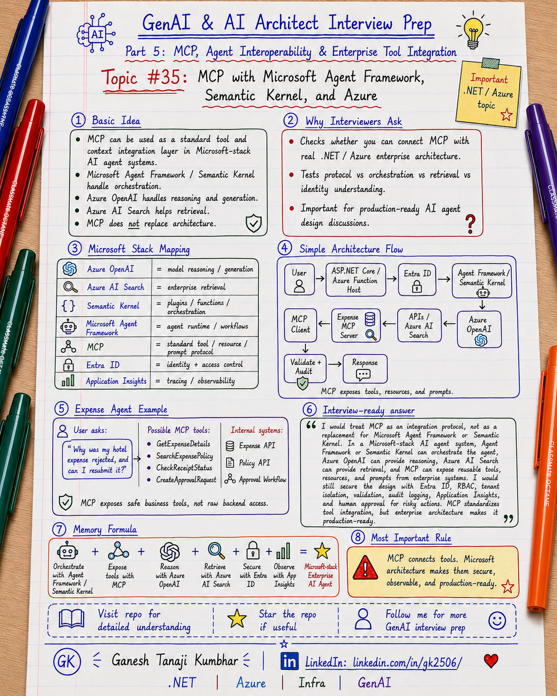

# GenAI & AI Architect Interview Prep

# Topic #35: MCP with Microsoft Agent Framework, Semantic Kernel, and Azure



---

## Important Note: Continuing Part 5

In the previous topics, we covered:

- What MCP is
- MCP vs Tool Calling vs Function Calling vs API Integration
- MCP Architecture: Host, Client, Server, Tools, Resources, and Prompts
- Designing MCP Servers for Enterprise APIs and Data Sources
- MCP Security, Identity, Permissions, and Tool Governance

Now we connect MCP with the **Microsoft / .NET / Azure stack**.

This topic is especially important for engineers coming from:

- .NET
- C#
- ASP.NET Core
- Azure Functions
- Azure OpenAI
- Azure AI Search
- Semantic Kernel
- Microsoft Agent Framework
- Entra ID
- Application Insights
- Enterprise APIs

Important learning point:

> MCP is not only a Python or open-source ecosystem topic. Microsoft-stack teams can also use MCP concepts with Microsoft Agent Framework, Semantic Kernel, Azure OpenAI, Azure AI Search, Azure Functions, ASP.NET Core APIs, Entra ID, and enterprise services.

---

## Question

In an interview, you may be asked:

> How does MCP fit with Microsoft Agent Framework, Semantic Kernel, and Azure?

Or:

> Can .NET and Azure teams use MCP in enterprise AI Agent systems?

Or:

> How would you design an MCP-based AI Agent using Microsoft technologies?

Or:

> Where do Azure OpenAI, Azure AI Search, Semantic Kernel, Microsoft Agent Framework, and MCP fit in the same architecture?

Or:

> Should MCP replace Semantic Kernel or Microsoft Agent Framework?

---

## Why interviewer asks this

The interviewer is checking whether you can connect a new AI integration concept with real enterprise architecture.

A weak answer is:

```text
MCP is used to connect tools.
```

That is too generic.

A stronger answer explains how MCP fits into a Microsoft-stack architecture:

```text
User
  ↓
ASP.NET Core / Azure Function Host
  ↓
Microsoft Agent Framework / Semantic Kernel
  ↓
MCP Client
  ↓
Enterprise MCP Server
  ↓
Internal APIs / Azure AI Search / Workflows / Data Sources
  ↓
Azure OpenAI response generation
  ↓
Application Insights + Audit Logs
```

This question tests your understanding of:

- MCP
- Microsoft Agent Framework
- Semantic Kernel
- Azure OpenAI
- Azure AI Search
- ASP.NET Core APIs
- Azure Functions
- Entra ID
- Key Vault
- Application Insights
- Enterprise APIs
- Tool governance
- RBAC
- Tenant isolation
- Observability
- Production readiness

---

## Basic answer

Simple answer:

> MCP can be used as a standard tool and context integration layer inside Microsoft-stack AI Agent systems.

In a Microsoft architecture:

| Component | Role |
|---|---|
| Azure OpenAI | Model reasoning and response generation |
| Azure AI Search | Enterprise search and retrieval |
| Semantic Kernel | AI orchestration, plugins, functions, memory, and planning patterns |
| Microsoft Agent Framework | Agent runtime, tools, workflows, middleware, and orchestration |
| MCP | Standard protocol for exposing tools, resources, and prompts |
| ASP.NET Core / Azure Functions | APIs, backend services, and MCP server implementation |
| Entra ID | Identity and access control |
| Application Insights | Observability and tracing |

Simple formula:

```text
Microsoft Agent Framework / Semantic Kernel
+ MCP
+ Azure OpenAI
+ Azure AI Search
+ Entra ID
+ Application Insights
= Microsoft-stack Enterprise AI Agent Architecture
```

---

## Architect-level answer

A strong architect-level answer would be:

> I would treat MCP as an integration protocol, not as a replacement for Microsoft Agent Framework or Semantic Kernel. Microsoft Agent Framework or Semantic Kernel can act as the agent orchestration layer. MCP can expose reusable tools, resources, and prompts from enterprise systems. Azure OpenAI can provide the model capability, Azure AI Search can provide retrieval, Entra ID can enforce identity, and Application Insights can provide observability. In a production design, I would still enforce RBAC, tenant isolation, least privilege, input validation, output filtering, audit logging, tool approval, and human approval for risky actions.

---

## Must mention in interview

When answering this question, try to mention these points:

---

### 1. MCP is not a replacement for Microsoft Agent Framework

Microsoft Agent Framework helps build and orchestrate AI Agents.

It can help with:

- Agent definition
- Tool integration
- Workflows
- Middleware
- Agent composition
- Hosting patterns
- Production agent development

MCP plays a different role.

MCP helps standardize how tools, resources, and prompts are exposed to AI applications.

Important line:

> Microsoft Agent Framework can orchestrate the agent. MCP can expose external capabilities to that agent.

---

### 2. MCP is not a replacement for Semantic Kernel

Semantic Kernel helps connect AI models with functions, plugins, prompts, memory, and orchestration patterns.

It is useful for:

- Plugin-based AI application design
- Function calling
- Prompt management
- AI orchestration
- .NET-friendly AI development
- Connecting models with application capabilities

MCP can provide another way to bring external tools into the AI application.

Important line:

> Semantic Kernel can orchestrate functions and plugins. MCP can expose external tools and resources in a standard way.

---

### 3. Azure OpenAI provides model capability

Azure OpenAI is usually responsible for:

- Understanding user intent
- Reasoning over context
- Deciding whether tools are needed
- Generating responses
- Summarizing retrieved information
- Producing structured tool requests

But the model should not directly control business systems.

Important line:

> Azure OpenAI can reason and generate, but application architecture must validate and control business actions.

---

### 4. Azure AI Search provides retrieval

Azure AI Search can be used for enterprise RAG scenarios.

It can help retrieve:

- Policy documents
- Knowledge articles
- Product information
- Claim documents
- Expense rules
- Support articles
- Indexed business data

MCP can expose search-related capabilities as controlled tools or resources.

Example:

```text
SearchExpensePolicy(query, tenantId, region)

SearchClaimDocuments(claimId, query)

RetrieveKnowledgeArticle(articleId)
```

Important line:

> Azure AI Search retrieves enterprise context. MCP can expose that retrieval as a controlled AI capability.

---

### 5. ASP.NET Core or Azure Functions can implement MCP servers

For Microsoft-stack teams, MCP servers can be implemented using familiar backend patterns.

Possible implementation options:

- ASP.NET Core service
- Azure Function
- Container App
- AKS workload
- Internal platform service
- API wrapper service

Example:

```text
Expense MCP Server
  ↓
ASP.NET Core / Azure Function
  ↓
Expense API + Policy API + Approval Workflow API
```

Important line:

> MCP server implementation should follow normal enterprise API engineering practices.

---

### 6. Entra ID should control identity

Enterprise MCP systems need strong identity.

Use identity controls such as:

- User authentication
- Service identity
- Token validation
- Managed identity
- OAuth / OIDC
- RBAC / ABAC
- Tenant-aware authorization

Important line:

> MCP tool access should respect the logged-in user, tenant, role, and permission boundary.

---

### 7. Key Vault should protect secrets

If the MCP server or AI host needs secrets, certificates, or connection strings, they should not be hardcoded.

Use:

- Azure Key Vault
- Managed identities
- Secret rotation
- Least privilege access
- Environment separation

Important line:

> MCP servers should not become a place where secrets are copied into configuration files.

---

### 8. Application Insights should trace tool usage

Production AI systems need observability.

For MCP-based systems, log:

```text
correlationId
userId
tenantId
agentName
mcpClientName
mcpServerName
toolName
resourceName
promptName
inputSummary
outputSummary
authorizationResult
validationResult
latency
errorCode
modelName
tokenUsage
finalStatus
```

Important line:

> If you cannot trace the MCP tool call, you cannot trust the AI Agent in production.

---

### 9. MCP should expose business-level tools, not raw technical access

Bad MCP tools:

```text
ExecuteSqlQuery(query)
CallAnyInternalApi(url, body)
UpdateAnyRecord(table, id, payload)
```

Better MCP tools:

```text
GetExpenseDetails(expenseId)
SearchExpensePolicy(query, region)
CheckApprovalRequired(expenseId)
CreateApprovalRequest(expenseId, reason)
RetrieveClaimDocument(claimId, documentId)
CreateSupportTicket(summary, priority)
```

Important line:

> MCP should expose safe business capabilities, not unrestricted backend power.

---

### 10. Human approval is still needed for risky actions

Some AI Agent actions may change business state.

Examples:

- Approve payment
- Reject claim
- Update customer record
- Create refund
- Submit approval workflow
- Send external notification
- Close support ticket

These actions should not be blindly executed just because the model requested them.

Use:

- User confirmation
- Manager approval
- Policy check
- Workflow approval
- Audit logging
- Idempotency
- Rollback or compensation strategy

Important line:

> AI can recommend. Humans approve. Workflow executes. Audit logs prove.

---

## Real-world example: Expense Management AI Agent

Let us use the common scenario from this series.

### Business context

We are building an **Expense Management AI Agent** using Microsoft-stack architecture.

A user asks:

```text
Why was my hotel expense rejected, and can I resubmit it?
```

The agent needs to:

- Understand the question
- Fetch expense details
- Search expense policy
- Check receipt status
- Check approval requirement
- Generate a grounded answer
- Create approval request if allowed
- Log the full trace

---

## Microsoft-stack architecture

```text
User
  ↓
ASP.NET Core / Azure Function AI Host
  ↓
Entra ID authentication
  ↓
Microsoft Agent Framework / Semantic Kernel
  ↓
Azure OpenAI
  ↓
MCP Client
  ↓
Expense MCP Server
  ↓
Tools:
  - GetExpenseDetails
  - SearchExpensePolicy
  - CheckReceiptStatus
  - CheckApprovalRequired
  - CreateApprovalRequest
  ↓
Internal APIs:
  - Expense API
  - Policy API
  - Document API
  - Approval Workflow API
  ↓
Data / Search:
  - Azure SQL
  - Blob Storage
  - Azure AI Search
  ↓
Observability:
  - Application Insights
  - Audit Logs
```

---

## Example flow

```text
User asks:
"Why was my hotel expense rejected?"

        ↓

AI host authenticates user using Entra ID

        ↓

Agent runtime receives the request

        ↓

Model decides expense details and policy context are needed

        ↓

MCP client calls Expense MCP Server

        ↓

MCP server validates user, tenant, role, and permission

        ↓

Tool call:
GetExpenseDetails(EXP-7890)

        ↓

Tool call:
SearchExpensePolicy("hotel limit and receipt")

        ↓

Azure AI Search retrieves policy context

        ↓

Azure OpenAI generates grounded answer

        ↓

Application validates response

        ↓

Audit logs capture tool usage and final response
```

---

## Example final response

```text
Your hotel expense was rejected because the receipt is missing and the amount is above the allowed hotel limit.

You can resubmit it after uploading the receipt.

Because the amount is above the standard limit, manager exception approval will be required.
```

---

## Where each component fits

| Component | Responsibility |
|---|---|
| ASP.NET Core / Azure Function | Host application and API layer |
| Microsoft Agent Framework | Agent orchestration and tool workflow |
| Semantic Kernel | Plugins, functions, prompts, and AI orchestration patterns |
| Azure OpenAI | Reasoning and response generation |
| Azure AI Search | Retrieval over enterprise documents and indexed content |
| MCP Client | Connects the host/agent to MCP servers |
| MCP Server | Exposes tools, resources, and prompts |
| Entra ID | Authentication and authorization |
| Key Vault | Secrets and certificate protection |
| Application Insights | Tracing, metrics, and diagnostics |
| Audit Store | Compliance and traceability |

---

## Common mistake

Many candidates say:

> MCP replaces Semantic Kernel.

Better answer:

> MCP does not replace Semantic Kernel. Semantic Kernel can help orchestrate AI functions and plugins, while MCP can expose external tools and resources through a standard protocol.

Another common mistake:

> MCP replaces Microsoft Agent Framework.

Better answer:

> Microsoft Agent Framework can be the agent orchestration layer. MCP can be one way to connect that agent to external capabilities.

Another common mistake:

> Azure OpenAI can directly call enterprise systems.

Better answer:

> Azure OpenAI can request or reason about tool usage, but the application, MCP server, and backend APIs must validate and execute actions safely.

Another common mistake:

> If MCP is used, security is handled automatically.

Better answer:

> MCP standardizes integration, but security still needs to be implemented through identity, permission checks, tenant isolation, validation, audit logging, and governance.

---

## What can go wrong?

### 1. Tool sprawl

Too many tools are exposed without governance.

Fix:

```text
Maintain an approved tool catalog.
```

---

### 2. Weak identity propagation

The MCP server does not know the real user context.

Fix:

```text
Pass identity and permission context securely from host to MCP server.
```

---

### 3. Tenant leakage

A tool returns data from the wrong tenant.

Fix:

```text
Apply tenant filtering before retrieval and before tool execution.
```

---

### 4. Over-trusting model output

The system blindly accepts model-generated tool arguments.

Fix:

```text
Validate every argument before tool execution.
```

---

### 5. No monitoring

The system cannot trace which MCP tool was called.

Fix:

```text
Use correlation IDs, Application Insights, audit logs, and tool-level telemetry.
```

---

## Better interview answer

A strong answer can be:

> In a Microsoft-stack AI Agent architecture, I would use Microsoft Agent Framework or Semantic Kernel as the orchestration layer, Azure OpenAI for model reasoning, Azure AI Search for retrieval, and MCP as a standard protocol to expose tools, resources, and prompts from enterprise systems. MCP servers can be implemented using ASP.NET Core, Azure Functions, Container Apps, or other internal services. I would secure the design using Entra ID, RBAC, tenant isolation, Key Vault, input validation, output filtering, audit logging, Application Insights, and human approval for risky actions. MCP helps standardize tool integration, but production readiness still depends on enterprise security, governance, observability, and safe tool design.

---

## One-line answer

> MCP can work with Microsoft Agent Framework, Semantic Kernel, and Azure by acting as a standard enterprise tool and context integration layer, while Microsoft services provide orchestration, identity, retrieval, model reasoning, hosting, and observability.

---

## Memory formula

Use this formula:

```text
Agent Framework / Semantic Kernel
+ MCP
+ Azure OpenAI
+ Azure AI Search
+ Entra ID
+ Application Insights
= Microsoft-stack Enterprise AI Agent
```

Another version:

```text
Orchestrate with Agent Framework or Semantic Kernel.
Reason with Azure OpenAI.
Retrieve with Azure AI Search.
Expose tools with MCP.
Secure with Entra ID.
Observe with Application Insights.
```

Most important rule:

```text
MCP connects tools.
Microsoft architecture makes them secure, observable, and production-ready.
```

---

## Interview closing line

You can close your answer like this:

> I would not position MCP as a replacement for Microsoft Agent Framework, Semantic Kernel, or Azure services. I would position MCP as the standard integration protocol for external tools and context. The Microsoft stack can provide the agent orchestration, model access, identity, retrieval, hosting, secrets, monitoring, and audit controls needed to make MCP-based AI systems production-ready.

---

## Related upcoming topics

- MCP Observability, Errors, Timeouts, and Production Readiness
- MCP vs A2A: Tool Integration vs Agent-to-Agent Communication
- How GenAI Fits into Existing Enterprise Architecture
- GenAI with Microservices Architecture
- Event-Driven AI Architecture

---

## Reference Scenario

This topic can be understood using the common **Expense Management AI Agent** scenario used across this series.

You can refer to the scenario here:

```text
00-common-examples/expense-management-ai-agent-scenario.md
```

---

## About the Author

These notes are created and maintained by **Ganesh Tanaji Kumbhar**, an **AI Architect** with experience in **.NET, Azure, cloud architecture, infrastructure, enterprise application modernization, and GenAI solution design**.

I bring practical experience across:

- **.NET / C# / ASP.NET / Web API**
- **Azure App Services, Azure Functions, WebJobs, Azure SQL, Storage, Redis**
- **Cloud architecture and infrastructure modernization**
- **Application architecture and enterprise system design**
- **CI/CD, DevOps, monitoring, and production support**
- **GenAI, RAG, Agentic AI, and AI architecture patterns**

These notes are based on my real experience as both:

- An **interviewee**, facing AI, architecture, cloud, .NET, Azure, and system design rounds
- An **interviewer**, evaluating how candidates explain concepts, tradeoffs, project experience, and real-world design decisions

I write about:

- GenAI Architecture
- RAG System Design
- Agentic AI
- AI Architect Interview Preparation
- .NET and Azure Architecture
- Cloud and Enterprise AI Patterns

If you are preparing for **GenAI / AI Architect / Staff Engineer / Solution Architect / .NET Architect / Azure Architect** interviews, feel free to connect with me on LinkedIn.

🔗 **LinkedIn:** [Connect with me on LinkedIn](https://www.linkedin.com/in/gk2506/)

💬 You can also DM me on LinkedIn if you want to discuss AI architecture, interview preparation, .NET/Azure architecture, or practical GenAI learning.
