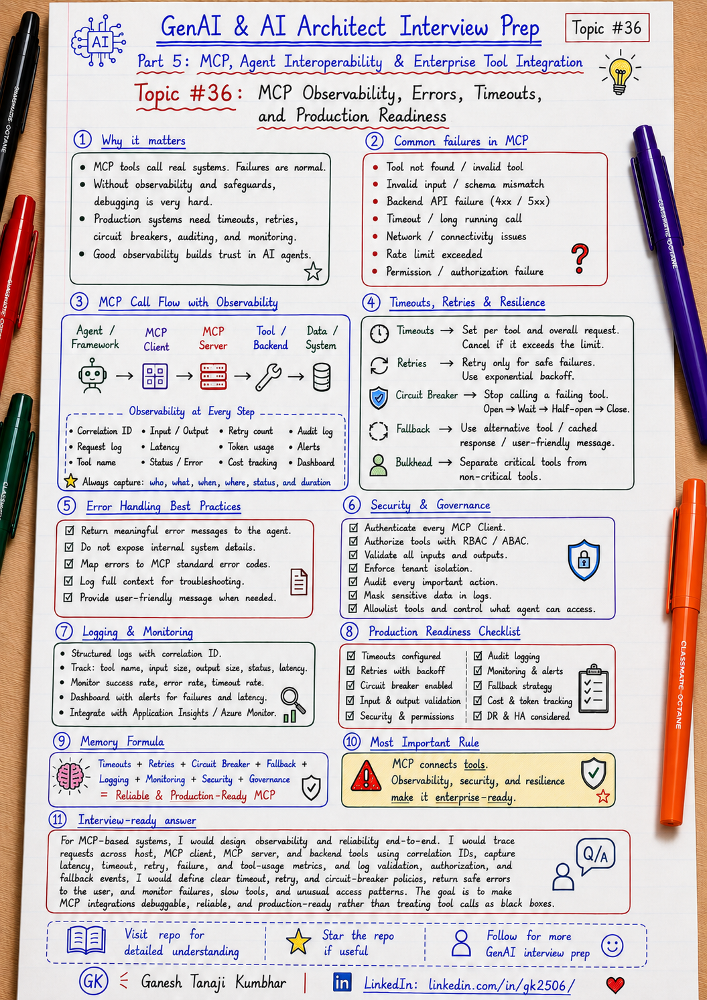

# GenAI & AI Architect Interview Prep

# Topic #36: MCP Observability, Errors, Timeouts, and Production Readiness



---

## Important Note: Continuing Part 5

In the previous topics, we covered:

- What MCP is
- MCP vs Tool Calling vs Function Calling vs API Integration
- MCP Architecture: Host, Client, Server, Tools, Resources, and Prompts
- Designing MCP Servers for Enterprise APIs and Data Sources
- MCP Security, Identity, Permissions, and Tool Governance
- MCP with Microsoft Agent Framework, Semantic Kernel, and Azure

Now we move to a production engineering question:

> How do you make MCP-based systems observable, resilient, and production-ready?

This topic is important because a working MCP demo is not the same as a production-ready MCP system.

In real enterprise systems, MCP tools may call:

- APIs
- Databases
- Search indexes
- File stores
- Workflow systems
- Ticketing systems
- Payment systems
- Claim systems
- Approval systems
- External services

All these dependencies can fail, become slow, return partial data, or produce unsafe outputs.

Important learning point:

> Production MCP systems need observability, error handling, timeout control, retry strategy, audit logging, monitoring, and fallback design.

---

## Question

In an interview, you may be asked:

> How would you make an MCP-based AI Agent production-ready?

Or:

> How do you handle errors and timeouts in MCP tool calls?

Or:

> What should you log when an AI Agent uses MCP tools?

Or:

> How do you monitor MCP servers in production?

Or:

> What can go wrong when an MCP server calls enterprise APIs?

---

## Why interviewer asks this

The interviewer wants to know whether you understand production AI architecture beyond tool integration.

A weak answer is:

```text
I will call the MCP tool and return the result.
```

That is too simple.

A stronger answer is:

```text
I will trace every MCP request, apply timeouts, classify errors, retry only safe operations, use circuit breakers, log tool inputs and outputs safely, monitor latency and failures, protect sensitive data, and provide fallback or human escalation when needed.
```

This question tests your understanding of:

- Observability
- Error handling
- Timeout design
- Retry strategy
- Circuit breaker
- Tool-call tracing
- Audit logging
- Safe error messages
- Dependency failures
- Correlation IDs
- Monitoring dashboards
- Alerting
- Production readiness
- Human escalation
- Microsoft-stack observability

---

## Basic answer

Simple answer:

> MCP-based systems should be treated like distributed systems. Every MCP tool call should have tracing, timeout control, error handling, retry rules, audit logging, monitoring, and fallback behavior.

Simple production flow:

```text
User request
   ↓
AI Host / Agent Runtime
   ↓
MCP Client
   ↓
MCP Server
   ↓
Tool / Resource / Prompt
   ↓
Backend API / Search / Workflow
   ↓
Logs + Metrics + Traces + Audit
```

Simple formula:

```text
MCP Tool Call
+ Timeout
+ Error Handling
+ Trace ID
+ Audit Log
+ Monitoring
+ Fallback
= Production-ready MCP Flow
```

---

## Architect-level answer

A strong architect-level answer would be:

> I would treat MCP as a production integration layer, not just a tool-calling mechanism. Every MCP request should carry a correlation ID and user context. The system should log the host, MCP client, MCP server, tool name, input summary, output summary, authorization result, latency, error type, and final status. I would define per-tool timeout budgets, retry only safe idempotent operations, use circuit breakers for failing dependencies, return safe user-facing errors, and keep detailed internal diagnostics. For high-risk actions, I would require confirmation or human approval. I would also monitor success rate, latency percentiles, timeout rate, tool error rate, backend dependency failures, token cost, and audit completeness.

---

## Must mention in interview

When answering this question, try to mention these points:

---

### 1. MCP calls are distributed-system calls

An MCP tool call may look simple, but behind it there may be multiple network calls.

Example:

```text
AI Agent
   ↓
MCP Client
   ↓
Expense MCP Server
   ↓
Expense API
   ↓
Azure SQL
```

Any layer can fail.

Failures can happen due to:

- Network timeout
- Server unavailable
- API error
- Invalid input
- Authorization failure
- Backend slow response
- Rate limit
- Data not found
- Tool execution failure
- Model misunderstanding

Important line:

> Treat MCP servers like production services, not like simple helper functions.

---

### 2. Use correlation IDs end-to-end

Every request should have a correlation ID.

Example:

```text
correlationId = REQ-2026-000123
```

Use the same ID across:

- User request
- AI host logs
- Model call
- MCP client logs
- MCP server logs
- Backend API logs
- Database/search dependency logs
- Audit logs

Important line:

> If you cannot follow one MCP request across systems, debugging production issues becomes guesswork.

---

### 3. Log every important MCP event

For each MCP tool call, log:

```text
correlationId
userId
tenantId
sessionId
agentName
hostApplication
mcpClientName
mcpServerName
toolName
resourceName
promptName
inputSummary
outputSummary
authorizationResult
validationResult
backendDependency
latencyMs
errorType
errorCode
retryCount
finalStatus
timestamp
```

Do not log unnecessary raw PII.

Important line:

> Log enough to explain the decision, but not so much that logs become a data-leak risk.

---

### 4. Separate protocol errors and tool execution errors

Not all errors are the same.

A protocol-level error means something went wrong in MCP communication.

Examples:

```text
Unknown tool
Invalid arguments
Unsupported protocol version
Capability negotiation failed
Invalid resource URI
```

A tool execution error means the tool was called, but the underlying work failed.

Examples:

```text
Expense API unavailable
Policy API returned timeout
Record not found
User not authorized
Business rule failed
Rate limit exceeded
```

Important line:

> Classify errors correctly. Protocol failure and business execution failure need different handling.

---

### 5. Define timeout budgets

Every MCP call should have a timeout.

Do not allow tools to wait forever.

Example timeout budget:

```text
Total user request budget: 10 seconds
Model decision budget: 3 seconds
MCP tool call budget: 4 seconds
Backend API budget: 2 seconds
Final response budget: 1 second
```

Timeouts should vary by tool type.

Examples:

| Tool type | Timeout approach |
|---|---|
| Search policy | Short timeout |
| Fetch record | Short to medium timeout |
| Generate report | Async or long-running flow |
| Create approval request | Controlled timeout + idempotency |
| External API call | Timeout + retry + fallback |

Important line:

> No production MCP tool should run without a timeout.

---

### 6. Retry only safe operations

Retrying every failed MCP tool call is dangerous.

Safe to retry:

```text
Read-only query
Search request
Temporary network failure
Timeout before backend execution started
```

Risky to retry automatically:

```text
Create payment
Submit approval
Update claim status
Send email
Create ticket
Start workflow
```

For action tools, use:

- Idempotency key
- Duplicate check
- Confirmation
- Workflow state check
- Audit logging

Important line:

> Retry read operations carefully. Retry write operations only with idempotency and business safeguards.

---

### 7. Use circuit breaker for failing dependencies

If an MCP server repeatedly fails while calling a backend system, stop sending more traffic temporarily.

Example:

```text
Policy API failure rate > threshold
        ↓
Open circuit breaker
        ↓
Stop calling Policy API for short period
        ↓
Return fallback message
        ↓
Try again after cooldown
```

This prevents cascading failures.

Important line:

> A failing MCP dependency should not bring down the full AI Agent experience.

---

### 8. Return safe user-facing errors

Do not expose internal technical details to the user or model unnecessarily.

Bad error:

```text
SQL timeout on server prod-db-03 using connection string xyz.
```

Better user-facing error:

```text
I could not fetch the expense details at the moment. Please try again later or contact support.
```

Internal logs can store technical details securely.

Important line:

> User-facing errors should be safe. Internal logs should be useful.

---

### 9. Monitor MCP health and usage

Production dashboards should track:

```text
MCP request count
Tool call count
Tool success rate
Tool failure rate
Timeout rate
Retry count
P50 latency
P95 latency
P99 latency
Backend dependency latency
Authorization failures
Validation failures
Prompt injection attempts
Token usage
Cost per request
Human escalation rate
Audit log completeness
```

Important line:

> Successful API response is not enough. You must know whether the AI workflow was correct, safe, and useful.

---

### 10. Use fallback and human escalation

When MCP tools fail, the AI system should not hallucinate.

Bad behavior:

```text
Tool failed, but model still gives confident answer.
```

Better behavior:

```text
Tool failed.
System explains limitation.
Offers retry or escalation.
Does not invent missing data.
```

Fallback options:

- Retry later
- Use cached non-sensitive data
- Ask user for missing details
- Provide partial answer with caveat
- Route to human support
- Create support ticket
- Show safe error message

Important line:

> When MCP fails, the system should fail safely, not confidently hallucinate.

---

## Real-world example: Expense Management AI Agent

Let us use the common scenario from this series.

### Business context

We are building an **Expense Management AI Agent**.

A user asks:

```text
Why was my hotel expense rejected, and can I resubmit it?
```

The agent needs to:

- Fetch expense details
- Search expense policy
- Check receipt status
- Check approval requirement
- Generate a grounded answer
- Create approval request if allowed
- Log the full trace

---

## Production MCP flow

```text
User request
   ↓
AI Host creates correlation ID
   ↓
Authenticate user using Entra ID
   ↓
Agent decides tools are needed
   ↓
MCP Client calls Expense MCP Server
   ↓
MCP Server validates user, tenant, role, and tool access
   ↓
Tool call: GetExpenseDetails(EXP-7890)
   ↓
Backend call: Expense API
   ↓
Tool call: SearchExpensePolicy("hotel limit and receipt")
   ↓
Backend call: Azure AI Search / Policy API
   ↓
Azure OpenAI generates grounded answer
   ↓
Application validates response
   ↓
Audit logs capture full flow
   ↓
User receives answer
```

---

## What if GetExpenseDetails fails?

Possible failures:

```text
Expense not found
User not authorized
Expense API timeout
Expense API unavailable
Tenant mismatch
Invalid expense ID
```

Better handling:

```text
If invalid input:
  Return validation error

If unauthorized:
  Return safe access-denied message

If timeout:
  Retry only if safe
  Otherwise return graceful failure

If API unavailable:
  Use circuit breaker and fallback

If tenant mismatch:
  Block request and audit as security event
```

Important line:

> Each error type should have a defined handling path.

---

## Example safe response when tool fails

```text
I could not retrieve the latest expense details right now, so I cannot confirm the rejection reason.

Please try again later, or I can help you raise a support request.
```

This is better than inventing an answer.

---

## Example observability trace

```text
correlationId: REQ-2026-000123
userId: U-1024
tenantId: T-IN-01
agentName: ExpenseAI
mcpServerName: ExpenseMcpServer
toolName: GetExpenseDetails
inputSummary: expenseId=EXP-7890
backendDependency: Expense API
latencyMs: 1450
authorizationResult: Allowed
validationResult: Passed
resultStatus: Success
finalAnswerGenerated: Yes
auditLogged: Yes
```

For failure:

```text
correlationId: REQ-2026-000124
toolName: SearchExpensePolicy
backendDependency: Policy API
latencyMs: 5000
resultStatus: Timeout
retryCount: 1
fallbackUsed: Yes
finalAnswerGenerated: Partial
humanEscalationOffered: Yes
```

---

## Microsoft-stack view

For .NET / Azure teams, the design could look like this:

```text
ASP.NET Core / Azure Function Host
   ↓
Microsoft Agent Framework / Semantic Kernel
   ↓
MCP Client
   ↓
Enterprise MCP Server
   ↓
Internal APIs / Azure AI Search / Workflows
   ↓
Azure OpenAI
   ↓
Application Insights + Azure Monitor + Audit Store
```

Use:

- **Application Insights** for traces, exceptions, dependencies, and custom events
- **Azure Monitor** for dashboards and alerts
- **Log Analytics** for querying traces
- **Key Vault** for secrets
- **Entra ID** for identity and access control
- **Audit Store** for compliance evidence

Important line:

> In Microsoft-stack systems, MCP observability should connect with existing Azure monitoring and audit practices.

---

## What should be measured?

Measure both technical and AI-specific signals.

Technical signals:

```text
Availability
Latency
Error rate
Timeout rate
Retry rate
Dependency failures
CPU / memory
Request volume
```

AI-specific signals:

```text
Tool selection accuracy
Tool execution success
Groundedness
Hallucination rate
User correction rate
Escalation rate
Prompt injection attempts
Token usage
Cost per request
```

Governance signals:

```text
Unauthorized tool attempts
Tenant isolation failures
Sensitive data exposure attempts
Human approval events
Audit log completeness
Tool catalog changes
```

Important line:

> Production AI monitoring must cover system health, AI quality, and governance risk.

---

## Common mistake

Many candidates say:

> We will log errors.

Better answer:

> We will log the full MCP tool-call lifecycle with correlation ID, user context, tool name, input summary, output summary, authorization result, validation result, latency, error classification, and final status.

Another common mistake:

> Retry all failed MCP calls.

Better answer:

> Retry only safe and idempotent operations. Write operations need idempotency keys, duplicate checks, and business safeguards.

Another common mistake:

> Tool failed, but model can still answer.

Better answer:

> If the tool is required and fails, the model should not invent an answer. It should provide a safe fallback or escalation path.

---

## What can go wrong?

### 1. No timeout

```text
Wrong:
MCP tool waits forever.
```

Better:

```text
Set per-tool timeout and maximum request budget.
```

---

### 2. No correlation ID

```text
Wrong:
Host, MCP server, and API logs cannot be linked.
```

Better:

```text
Use the same correlation ID across all layers.
```

---

### 3. Retrying unsafe actions

```text
Wrong:
Retry CreateApprovalRequest multiple times.
```

Better:

```text
Use idempotency key and duplicate detection.
```

---

### 4. Unsafe error messages

```text
Wrong:
Expose internal database or secret details.
```

Better:

```text
Return safe user-facing messages and keep technical details in secure logs.
```

---

### 5. Missing audit trail

```text
Wrong:
Only final answer is saved.
```

Better:

```text
Log tool calls, permissions, validation, backend calls, and final response.
```

---

### 6. Hallucination after tool failure

```text
Wrong:
Tool failed, but model gives confident answer.
```

Better:

```text
Tell the user that the system could not verify the data and offer retry or escalation.
```

---

## Better interview answer

A strong answer can be:

> I would make an MCP-based system production-ready by treating MCP tool calls as distributed-system operations. Every call should have a correlation ID, user context, tenant context, input validation, permission checks, timeout budget, error classification, safe retry policy, and audit logging. I would separate protocol errors from tool execution errors, retry only safe idempotent operations, use circuit breakers for failing dependencies, and return safe user-facing errors. I would monitor latency, failure rate, timeout rate, tool usage, authorization failures, token cost, and audit completeness. If a required tool fails, the system should not hallucinate. It should provide a safe fallback or human escalation path.

---

## One-line answer

> Production-ready MCP systems need tracing, timeouts, error handling, safe retries, circuit breakers, monitoring, audit logging, and fallback design around every tool call.

---

## Memory formula

Use this formula:

```text
Trace
+ Timeout
+ Error Handling
+ Retry Control
+ Circuit Breaker
+ Audit Log
+ Fallback
= Production-ready MCP
```

Another version:

```text
Observe every call.
Limit every wait.
Classify every error.
Audit every action.
Fallback when tools fail.
```

Most important rule:

```text
If the MCP tool fails, the AI system should fail safely, not hallucinate confidently.
```

---

## Interview closing line

You can close your answer like this:

> I would not consider an MCP integration production-ready just because the tool call works. A production MCP system must be observable, time-bound, secure, auditable, resilient, and safe under failure. Every MCP tool call should be traced, validated, monitored, and backed by fallback or escalation behavior.

---

## Related upcoming topics

- MCP vs A2A: Tool Integration vs Agent-to-Agent Communication
- How GenAI Fits into Existing Enterprise Architecture
- GenAI with Microservices Architecture
- Event-Driven AI Architecture
- Data Architecture for GenAI Systems

---

## Reference Scenario

This topic can be understood using the common **Expense Management AI Agent** scenario used across this series.

You can refer to the scenario here:

```text
00-common-examples/expense-management-ai-agent-scenario.md
```

---

## About the Author

These notes are created and maintained by **Ganesh Tanaji Kumbhar**, an **AI Architect** with experience in **.NET, Azure, cloud architecture, infrastructure, enterprise application modernization, and GenAI solution design**.

I bring practical experience across:

- **.NET / C# / ASP.NET / Web API**
- **Azure App Services, Azure Functions, WebJobs, Azure SQL, Storage, Redis**
- **Cloud architecture and infrastructure modernization**
- **Application architecture and enterprise system design**
- **CI/CD, DevOps, monitoring, and production support**
- **GenAI, RAG, Agentic AI, and AI architecture patterns**

These notes are based on my real experience as both:

- An **interviewee**, facing AI, architecture, cloud, .NET, Azure, and system design rounds
- An **interviewer**, evaluating how candidates explain concepts, tradeoffs, project experience, and real-world design decisions

I write about:

- GenAI Architecture
- RAG System Design
- Agentic AI
- AI Architect Interview Preparation
- .NET and Azure Architecture
- Cloud and Enterprise AI Patterns

If you are preparing for **GenAI / AI Architect / Staff Engineer / Solution Architect / .NET Architect / Azure Architect** interviews, feel free to connect with me on LinkedIn.

🔗 **LinkedIn:** [Connect with me on LinkedIn](https://www.linkedin.com/in/gk2506/)

💬 You can also DM me on LinkedIn if you want to discuss AI architecture, interview preparation, .NET/Azure architecture, or practical GenAI learning.
