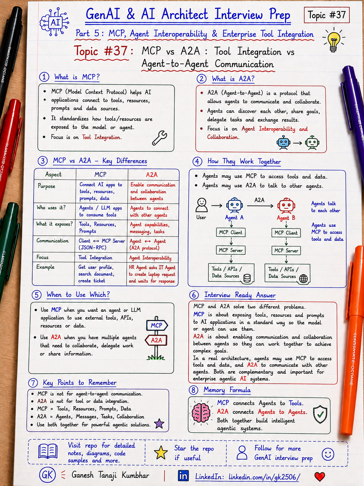

# GenAI & AI Architect Interview Prep

# Topic #37: MCP vs A2A: Tool Integration vs Agent-to-Agent Communication



---

## Important Note: Continuing Part 5

In the previous topics, we covered:

- What MCP is
- MCP vs Tool Calling vs Function Calling vs API Integration
- MCP Architecture: Host, Client, Server, Tools, Resources, and Prompts
- Designing MCP Servers for Enterprise APIs and Data Sources
- MCP Security, Identity, Permissions, and Tool Governance
- MCP Observability, Errors, Timeouts, and Production Readiness

Now we close this part with another important interoperability topic:

```text
MCP vs A2A
```

Many people hear both terms and assume they solve the same problem.

They do not.

Important learning point:

> MCP is mainly about connecting AI applications or agents to tools, resources, prompts, data sources, and systems. A2A is mainly about communication and collaboration between agents.

Simple way to remember:

```text
MCP = Agent to Tools
A2A = Agent to Agent
```

---

## Question

In an interview, you may be asked:

> What is the difference between MCP and A2A?

Or:

> Is A2A a replacement for MCP?

Or:

> When would you use MCP and when would you use A2A?

Or:

> How do MCP and A2A fit in a multi-agent enterprise architecture?

Or:

> How would you explain MCP vs A2A to a .NET / Azure architecture team?

---

## Why interviewer asks this

The interviewer is checking whether you understand modern AI interoperability patterns.

A weak answer is:

```text
MCP and A2A are both used by AI Agents.
```

That is too generic.

Another weak answer is:

```text
A2A replaces MCP.
```

That is wrong.

A stronger answer is:

```text
MCP standardizes how AI applications connect to external tools, resources, prompts, and systems.
A2A standardizes how agents communicate and collaborate with other agents.
Both can exist in the same architecture.
```

This question tests your understanding of:

- MCP
- A2A
- Agent interoperability
- Tool integration
- Multi-agent systems
- Enterprise APIs
- Remote agents
- Agent discovery
- Security boundaries
- Authorization
- Governance
- Audit logging
- Observability
- Production architecture

---

## Basic answer

Simple answer:

> MCP and A2A solve different integration problems. MCP connects AI applications to tools and data. A2A connects agents to other agents.

Simple comparison:

| Concept | Main purpose |
|---|---|
| MCP | Connect AI apps/agents to tools, resources, prompts, and systems |
| A2A | Enable communication and collaboration between agents |

Simple formula:

```text
MCP = Tool and context integration
A2A = Agent-to-agent communication
```

Another simple way:

```text
Need to call enterprise tools? Think MCP.
Need one agent to talk to another agent? Think A2A.
```

---

## Architect-level answer

A strong architect-level answer would be:

> I would treat MCP and A2A as complementary protocols, not competitors. MCP is useful when an AI application or agent needs controlled access to tools, resources, prompts, APIs, databases, search indexes, files, or workflow systems. A2A is useful when one agent needs to communicate with another agent, delegate work, request a capability from a remote agent, or collaborate across frameworks, teams, or vendors. In enterprise architecture, an agent may use MCP to access tools and A2A to communicate with other agents. Both patterns still need identity, authorization, tenant isolation, validation, audit logging, observability, rate limits, and governance.

---

## Must mention in interview

When answering this question, try to mention these points:

---

### 1. MCP is mainly agent-to-tool integration

MCP helps AI applications connect to external capabilities.

Examples:

- Search policy
- Fetch claim details
- Get expense status
- Retrieve document
- Create support ticket
- Call approval workflow
- Read knowledge article
- Access enterprise search

Simple MCP flow:

```text
AI Agent / Host
        ↓
MCP Client
        ↓
MCP Server
        ↓
Tools / Resources / Prompts
        ↓
Enterprise Systems
```

Important line:

> MCP is about exposing tools, resources, and prompts to AI applications in a standard way.

---

### 2. A2A is mainly agent-to-agent communication

A2A helps one agent communicate with another agent.

Examples:

- Support Agent asks Billing Agent for invoice status
- Travel Agent asks Calendar Agent for availability
- Claims Agent asks Document Review Agent to summarize files
- Orchestrator Agent delegates work to Specialist Agent
- Company agent communicates with partner/vendor agent

Simple A2A flow:

```text
Agent A
  ↓
A2A Protocol
  ↓
Agent B
```

Important line:

> A2A is about agents collaborating with other agents, especially across frameworks, teams, or vendors.

---

### 3. MCP and A2A are not replacements for each other

Wrong understanding:

```text
A2A replaces MCP.
```

Better understanding:

```text
A2A and MCP solve different problems.
```

MCP answers:

```text
How does my agent access tools and data?
```

A2A answers:

```text
How does my agent communicate with another agent?
```

Important line:

> MCP and A2A are complementary. MCP connects agents to tools. A2A connects agents to agents.

---

### 4. A single architecture can use both MCP and A2A

In real systems, both can exist together.

Example:

```text
User
  ↓
Support Agent
  ↓ A2A
Billing Agent
  ↓ MCP
Billing MCP Server
  ↓
Billing API
```

Here:

- Support Agent uses A2A to talk to Billing Agent
- Billing Agent uses MCP to access Billing API

Important line:

> A2A can connect agents, and each agent may internally use MCP to access its tools.

---

### 5. MCP exposes capabilities; A2A exposes agents

This is an important distinction.

MCP server exposes:

```text
Tools
Resources
Prompts
```

A2A endpoint exposes:

```text
Agent capabilities
Agent skills
Agent interaction model
Task handling
Messages
Artifacts or results
```

Simple comparison:

| Area | MCP | A2A |
|---|---|---|
| Exposes | Tools, resources, prompts | Agents and agent capabilities |
| Main interaction | Tool/resource access | Agent communication |
| Typical caller | AI host or agent runtime | Another agent or orchestrator |
| Best for | Controlled system integration | Multi-agent collaboration |

Important line:

> MCP exposes what an agent can use. A2A exposes another agent that can work with you.

---

### 6. MCP is usually closer to backend systems

MCP often sits close to enterprise systems.

Example:

```text
Expense MCP Server
  ↓
Expense API
  ↓
Expense Database
```

It wraps backend capabilities safely.

It should protect:

- APIs
- Databases
- Files
- Search indexes
- Workflows
- Enterprise applications

Important line:

> MCP is often the controlled bridge between AI applications and backend systems.

---

### 7. A2A is usually closer to agent collaboration

A2A often sits between agents.

Example:

```text
Customer Support Agent
        ↓
A2A
        ↓
Claims Investigation Agent
```

The remote agent may have its own tools, memory, workflow, and policy controls.

Important line:

> A2A allows agents to collaborate without exposing every internal tool directly.

---

### 8. Security is required in both

Do not assume protocol means secure by default.

Both MCP and A2A need:

- Authentication
- Authorization
- Tenant isolation
- RBAC / ABAC
- Least privilege
- Input validation
- Output filtering
- Prompt injection protection
- Audit logging
- Rate limiting
- Monitoring
- Human approval for risky actions

Important line:

> Protocol standardization does not remove enterprise security responsibility.

---

### 9. A2A can reduce tight coupling between agents

Without A2A, teams may create custom agent-to-agent integrations.

Bad approach:

```text
Agent A directly knows Agent B's internal implementation.
```

Better approach:

```text
Agent A communicates with Agent B through a standard agent protocol.
```

This helps when agents are built by:

- Different teams
- Different frameworks
- Different languages
- Different vendors
- Different platforms

Important line:

> A2A helps agents collaborate without requiring all agents to share the same internal framework.

---

### 10. Use the right protocol for the right problem

Use MCP when:

- Your agent needs tools
- Your agent needs enterprise data
- Your agent needs reusable integration with APIs
- Your agent needs resources or prompts
- You want controlled tool exposure

Use A2A when:

- One agent needs to talk to another agent
- You need agent collaboration
- You need task delegation between agents
- You have agents owned by different teams
- You need cross-framework or cross-vendor agent communication

Important line:

> Do not use A2A for simple tool calls. Do not use MCP as a fake agent-to-agent protocol.

---

## Real-world example: Expense Management and Support Agents

Let us use a simple enterprise scenario.

### Business context

A user asks a Support AI Agent:

```text
Why was my hotel expense rejected, and can I resubmit it?
```

The support agent may not own expense rules directly.

It may need help from a specialist Expense Agent.

---

## Architecture using A2A and MCP together

```text
User
  ↓
Support AI Agent
  ↓
A2A
  ↓
Expense AI Agent
  ↓
MCP Client
  ↓
Expense MCP Server
  ↓
Tools:
  - GetExpenseDetails
  - SearchExpensePolicy
  - CheckReceiptStatus
  - CheckApprovalRequired
  - CreateApprovalRequest
  ↓
Internal Systems:
  - Expense API
  - Policy API
  - Document API
  - Approval Workflow API
```

In this design:

- Support Agent communicates with Expense Agent using A2A
- Expense Agent accesses enterprise tools using MCP
- MCP server calls internal APIs safely
- Audit logs capture both agent communication and tool usage

---

## Example flow

```text
User asks Support Agent:
"Why was my hotel expense rejected?"

        ↓

Support Agent understands this needs expense expertise

        ↓

Support Agent contacts Expense Agent using A2A

        ↓

Expense Agent receives the task

        ↓

Expense Agent uses MCP tool:
GetExpenseDetails(EXP-7890)

        ↓

Expense Agent uses MCP tool:
SearchExpensePolicy("hotel receipt and limit")

        ↓

Expense Agent returns result to Support Agent using A2A

        ↓

Support Agent explains answer to user

        ↓

Audit logs capture A2A interaction and MCP tool calls
```

---

## Example final response

```text
Your hotel expense was rejected because the receipt is missing and the amount is above the allowed hotel limit.

You can resubmit it after uploading the receipt.

Because the amount is above the standard limit, manager exception approval will be required.
```

---

## Microsoft-stack view

For .NET / Azure teams, a possible architecture is:

```text
User
  ↓
ASP.NET Core / Azure Function Host
  ↓
Microsoft Agent Framework / Semantic Kernel
  ↓
Support Agent
  ↓ A2A
Expense Agent
  ↓
MCP Client
  ↓
Expense MCP Server
  ↓
Azure Functions / ASP.NET Core APIs
  ↓
Azure SQL / Azure AI Search / Blob Storage
  ↓
Azure OpenAI
  ↓
Application Insights + Audit Logs
```

This helps Microsoft-stack teams explain both protocols using familiar components.

Important line:

> In a Microsoft-stack design, A2A can support agent collaboration, while MCP can expose enterprise tools and data behind each agent.

---

## Where each component fits

| Component | Responsibility |
|---|---|
| Microsoft Agent Framework | Agent orchestration, workflows, and remote agent interaction patterns |
| Semantic Kernel | Plugins, functions, prompts, orchestration, and AI integration patterns |
| Azure OpenAI | Reasoning and response generation |
| Azure AI Search | Retrieval over enterprise content |
| MCP | Standard tool/resource/prompt integration |
| A2A | Standard agent-to-agent communication |
| Entra ID | Identity and authorization |
| Key Vault | Secrets and certificates |
| Application Insights | Observability and tracing |
| Audit Store | Compliance and traceability |

---

## Simple decision table

| Situation | Better fit |
|---|---|
| Agent needs to search enterprise policy | MCP |
| Agent needs to fetch expense details from API | MCP |
| Agent needs to call workflow action | MCP |
| Support Agent needs help from Billing Agent | A2A |
| Orchestrator delegates work to specialist agent | A2A |
| Agent from one vendor collaborates with another vendor's agent | A2A |
| One agent needs both tools and another specialist agent | MCP + A2A |

---

## Common mistake

Many candidates say:

> MCP and A2A are the same because both are for agents.

Better answer:

> MCP is for connecting AI applications to tools, resources, prompts, and systems. A2A is for connecting agents to other agents.

Another common mistake:

> A2A replaces MCP.

Better answer:

> A2A does not replace MCP. A remote agent may itself use MCP behind the scenes to access enterprise systems.

Another common mistake:

> MCP is only for tools and A2A is always better for enterprise.

Better answer:

> The right choice depends on the integration boundary. For backend capability access, MCP is usually better. For agent collaboration, A2A is usually better.

---

## What can go wrong?

### 1. Using A2A for simple tool access

Bad design:

```text
Create a separate agent just to call one API.
```

Better:

```text
Expose the API as a controlled MCP tool.
```

---

### 2. Using MCP for agent collaboration

Bad design:

```text
Expose a whole agent as a tool without clear contract or communication model.
```

Better:

```text
Use A2A when the interaction is truly agent-to-agent.
```

---

### 3. No identity propagation

Bad design:

```text
Remote agent or MCP server does not know the real user context.
```

Better:

```text
Propagate identity, tenant, role, and permission context securely.
```

---

### 4. No audit trail

Bad design:

```text
Only the final answer is logged.
```

Better:

```text
Log A2A message flow, MCP tool calls, authorization results, validation results, and final answer.
```

---

### 5. Too many agents

Bad design:

```text
Create many agents without clear ownership or responsibility.
```

Better:

```text
Use separate agents only when responsibilities, data ownership, skills, or team boundaries are clearly different.
```

---

## Enterprise design checklist

Before choosing MCP, ask:

```text
Is this mainly a tool, data, prompt, API, file, search, or workflow integration?
```

If yes, MCP may fit.

Before choosing A2A, ask:

```text
Is this mainly communication or task delegation between independent agents?
```

If yes, A2A may fit.

Before using both, ask:

```text
Which agent owns the task?
Which tools does each agent need?
Which data can each agent access?
How is identity passed?
How is authorization enforced?
How are actions audited?
How are failures handled?
```

Important line:

> Protocol choice should follow architecture boundaries, not hype.

---

## Better interview answer

A strong answer can be:

> MCP and A2A are complementary protocols. MCP is mainly for connecting AI applications or agents to tools, resources, prompts, APIs, data sources, and workflow systems. A2A is mainly for communication and collaboration between agents. I would use MCP when an agent needs controlled access to enterprise capabilities such as search policy, fetch expense details, retrieve documents, or create a ticket. I would use A2A when one agent needs to delegate work to another agent or collaborate with a remote specialist agent. In a production architecture, both require identity, authorization, tenant isolation, validation, audit logging, observability, rate limits, and governance.

---

## One-line answer

> MCP connects agents to tools and enterprise context, while A2A connects agents to other agents for collaboration and delegation.

---

## Memory formula

Use this formula:

```text
MCP = Agent → Tools / Resources / Prompts / Systems

A2A = Agent → Agent
```

Another version:

```text
MCP gives agents capabilities.
A2A lets agents collaborate.
Architecture keeps both safe.
```

Most important rule:

```text
Use MCP for tool integration.
Use A2A for agent collaboration.
Use governance for both.
```

---

## Interview closing line

You can close your answer like this:

> I would not treat MCP and A2A as competing options. MCP is the right pattern when an agent needs safe access to tools, resources, prompts, APIs, and data sources. A2A is the right pattern when agents need to communicate, delegate, or collaborate across boundaries. In enterprise architecture, a mature agent may use A2A to talk to another agent, and that agent may use MCP to access its own tools and systems safely.

---

## Related upcoming topics

- How GenAI Fits into Existing Enterprise Architecture
- GenAI with Microservices Architecture
- Event-Driven AI Architecture
- Data Architecture for GenAI Systems
- AI Gateway and Model Router Pattern

---

## Reference Scenario

This topic can be understood using the common **Expense Management AI Agent** scenario used across this series.

You can refer to the scenario here:

```text
00-common-examples/expense-management-ai-agent-scenario.md
```

---

## About the Author

These notes are created and maintained by **Ganesh Tanaji Kumbhar**, an **AI Architect** with experience in **.NET, Azure, cloud architecture, infrastructure, enterprise application modernization, and GenAI solution design**.

I bring practical experience across:

- **.NET / C# / ASP.NET / Web API**
- **Azure App Services, Azure Functions, WebJobs, Azure SQL, Storage, Redis**
- **Cloud architecture and infrastructure modernization**
- **Application architecture and enterprise system design**
- **CI/CD, DevOps, monitoring, and production support**
- **GenAI, RAG, Agentic AI, and AI architecture patterns**

These notes are based on my real experience as both:

- An **interviewee**, facing AI, architecture, cloud, .NET, Azure, and system design rounds
- An **interviewer**, evaluating how candidates explain concepts, tradeoffs, project experience, and real-world design decisions

I write about:

- GenAI Architecture
- RAG System Design
- Agentic AI
- AI Architect Interview Preparation
- .NET and Azure Architecture
- Cloud and Enterprise AI Patterns

If you are preparing for **GenAI / AI Architect / Staff Engineer / Solution Architect / .NET Architect / Azure Architect** interviews, feel free to connect with me on LinkedIn.

🔗 **LinkedIn:** [Connect with me on LinkedIn](https://www.linkedin.com/in/gk2506/)

💬 You can also DM me on LinkedIn if you want to discuss AI architecture, interview preparation, .NET/Azure architecture, or practical GenAI learning.
