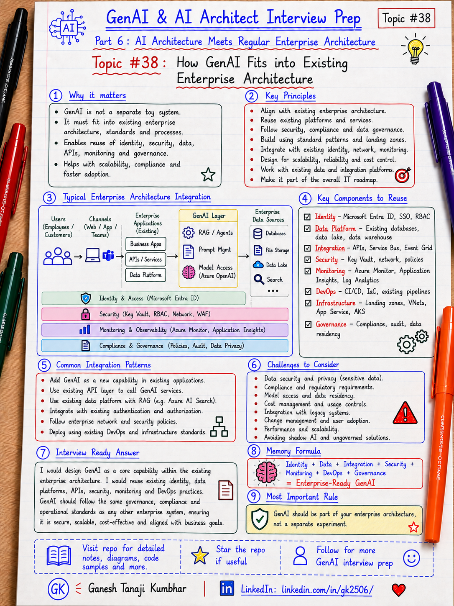

# GenAI & AI Architect Interview Prep

# Topic #38: How GenAI Fits into Existing Enterprise Architecture



---

## Important Note: Starting Part 6

In the previous part, we completed **Part 5: Model Context Protocol, Agent Interoperability, and Enterprise Tool Integration**.

We covered:

- What MCP is
- MCP vs Tool Calling vs Function Calling vs API Integration
- MCP Architecture
- Designing MCP Servers for Enterprise APIs and Data Sources
- MCP Security, Identity, Permissions, and Tool Governance
- MCP with Microsoft Agent Framework, Semantic Kernel, and Azure
- MCP Observability, Errors, Timeouts, and Production Readiness
- MCP vs A2A

Now we start a new part:

```text
Part 6: AI Architecture Meets Regular Enterprise Architecture
```

This part is very important for architects and senior engineers because GenAI is not a separate toy system.

In real companies, GenAI must fit into the existing enterprise architecture.

That means it must work with:

- Identity
- APIs
- Databases
- Search
- Storage
- Message queues
- Microservices
- Events
- Monitoring
- Security
- Compliance
- DevOps
- Cloud hosting
- Existing business workflows

Important learning point:

> GenAI should not sit outside enterprise architecture. It should become one controlled capability inside the existing architecture.

---

## Question

In an interview, you may be asked:

> How does GenAI fit into existing enterprise architecture?

Or:

> How would you add GenAI capability to an existing enterprise application?

Or:

> Where do LLMs, RAG, agents, APIs, data platforms, security, and monitoring fit together?

Or:

> How do you avoid building GenAI as a separate proof-of-concept system?

Or:

> How would you explain GenAI architecture to a traditional enterprise architect?

---

## Why interviewer asks this

The interviewer wants to know whether you can connect GenAI concepts with real enterprise systems.

A weak answer is:

```text
We will call an LLM API from the application.
```

That is too narrow.

A stronger answer is:

```text
I would treat GenAI as a capability within enterprise architecture. It should integrate with existing identity, APIs, data sources, search, storage, workflows, monitoring, security, compliance, and deployment pipelines.
```

This question tests your understanding of:

- Enterprise architecture
- GenAI architecture
- RAG
- Agentic AI
- APIs
- Microservices
- Data architecture
- Identity and access control
- Observability
- Security and compliance
- DevOps and release controls
- Production-readiness
- System boundaries
- Business workflows

---

## Basic answer

Simple answer:

> GenAI should be integrated as a controlled capability inside the existing enterprise architecture, not as a separate isolated chatbot.

A basic enterprise GenAI flow may look like this:

```text
User / Business Application
        ↓
API Gateway / Application Layer
        ↓
AI Orchestration Layer
        ↓
LLM + RAG + Tools / Agents
        ↓
Enterprise APIs / Data Sources / Workflows
        ↓
Monitoring + Audit + Governance
```

Simple formula:

```text
Enterprise Architecture
+ GenAI Capability
+ Security
+ Data Governance
+ Observability
= Production-ready AI System
```

---

## Architect-level answer

A strong architect-level answer would be:

> I would not design GenAI as a separate side system. I would fit it into the existing enterprise architecture by placing it behind normal application and API boundaries. The AI layer should use existing identity, authorization, APIs, data platforms, search indexes, storage, workflows, monitoring, CI/CD, and governance controls. LLMs provide reasoning and generation, RAG provides grounded enterprise knowledge, tools and agents connect to business capabilities, and the application layer controls security, validation, auditing, fallback, and human approval. The goal is to make GenAI a governed enterprise capability, not an uncontrolled experiment.

---

## Must mention in interview

When answering this question, try to mention these points:

---

### 1. GenAI is a capability, not the whole architecture

A common mistake is to think:

```text
GenAI architecture = LLM call
```

That is not correct.

The LLM is only one component.

A real architecture includes:

- User application
- API layer
- AI orchestration layer
- Model access layer
- Retrieval layer
- Tool or agent layer
- Enterprise APIs
- Data sources
- Security controls
- Monitoring
- Audit logging
- Deployment pipeline

Important line:

> The LLM is a component. It is not the full enterprise architecture.

---

### 2. Fit GenAI behind existing application boundaries

GenAI should normally be accessed through application or API boundaries.

Example:

```text
Claims Manager UI
        ↓
Claims API
        ↓
AI Orchestration Service
        ↓
Azure OpenAI / RAG / Tools
```

The UI should not directly call everything.

The AI layer should be controlled by backend services.

Important line:

> Put GenAI behind controlled application and API boundaries.

---

### 3. Use existing identity and authorization

Enterprise AI systems should respect existing identity.

Examples:

- Microsoft Entra ID
- OAuth / OIDC
- SSO
- RBAC
- ABAC
- Tenant isolation
- User permissions
- Service identities
- Managed identities

The AI system should not get admin-level access just because it needs context.

Important line:

> The AI system should act within the logged-in user’s permission boundary.

---

### 4. Use existing APIs instead of bypassing business logic

The AI layer should not directly bypass core business systems.

Bad design:

```text
AI Agent → Direct database write
```

Better design:

```text
AI Agent → Approved Tool → Business API → Database
```

Backend APIs still own:

- Business rules
- Validation
- Transactions
- Authorization
- Data ownership
- Audit records

Important line:

> GenAI should use business APIs, not bypass business systems.

---

### 5. Connect to enterprise data through controlled retrieval

Enterprise GenAI often needs company-specific knowledge.

That may include:

- Policy documents
- Product manuals
- Claims documents
- Support articles
- Invoices
- Contracts
- Emails
- Case notes
- Database records

Use controlled retrieval through:

- RAG
- Search indexes
- Metadata filtering
- Tenant filtering
- Document-level security
- Data classification

Important line:

> Retrieval must follow the same access rules as the source system.

---

### 6. Keep deterministic business logic outside the LLM

Do not ask the LLM to calculate or enforce everything.

Examples that should usually stay deterministic:

- Tax calculation
- Eligibility rule
- Approval limit
- Fraud threshold
- SLA calculation
- Payment validation
- Policy rule enforcement

The LLM can explain or assist, but deterministic logic should remain in code or rule engines.

Important line:

> Use the LLM for language and reasoning support, not as a replacement for business rules.

---

### 7. Add orchestration layer

The orchestration layer coordinates AI behavior.

It may handle:

- Prompt selection
- Model selection
- RAG retrieval
- Tool calling
- Agent workflow
- Conversation state
- Validation
- Safety checks
- Response formatting
- Fallback handling

Examples:

- Custom orchestration service
- Semantic Kernel
- Microsoft Agent Framework
- LangChain
- LangGraph
- Durable workflows

Important line:

> The orchestration layer connects user intent, model calls, retrieval, tools, validation, and final response.

---

### 8. Add observability from the beginning

Production AI systems need more than normal application logs.

Track:

```text
correlationId
userId
tenantId
requestType
modelName
promptVersion
retrievalQuery
retrievedDocuments
toolCalls
latency
tokenUsage
cost
validationResult
fallbackUsed
finalStatus
userFeedback
```

Important line:

> If you cannot observe the AI flow, you cannot operate it safely in production.

---

### 9. Add security and compliance controls

Enterprise GenAI must handle security carefully.

Consider:

- Authentication
- Authorization
- Tenant isolation
- Data privacy
- PII masking
- Secrets management
- Prompt injection protection
- Output validation
- Audit logging
- Data retention
- Compliance reporting

Important line:

> GenAI does not remove enterprise security requirements. It increases the need for them.

---

### 10. Use normal DevOps and release controls

GenAI systems still need software engineering discipline.

Version and deploy:

- Application code
- Prompts
- AI orchestration logic
- Evaluation datasets
- Infrastructure
- Model configuration
- Retrieval indexes
- Guardrails
- Tool definitions

Use:

- CI/CD
- Environment separation
- Automated tests
- Evaluation gates
- Canary releases
- Rollback strategy
- Monitoring after release

Important line:

> GenAI deployment should follow normal enterprise release discipline, plus AI-specific evaluation.

---

## Real-world example: Adding GenAI to an Expense Management System

Let us use the common scenario from this series.

### Business context

A company already has an **Expense Management System**.

It includes:

- Web application
- Expense API
- Policy API
- Approval workflow
- Document storage
- User identity
- Audit logs
- Reporting

Now the business wants an AI assistant.

The user asks:

```text
Why was my hotel expense rejected, and can I resubmit it?
```

---

## Bad architecture

A weak design may look like this:

```text
User
  ↓
Chat UI
  ↓
LLM
  ↓
Direct database access
```

Problems:

- No proper authorization
- No tenant isolation
- No business API boundary
- No audit trail
- No deterministic validation
- Risk of exposing sensitive data
- Hard to debug
- Hard to govern

Important line:

> A GenAI shortcut can become an enterprise risk.

---

## Better architecture

A better design:

```text
User
  ↓
Expense Web App / Chat UI
  ↓
API Gateway / Backend API
  ↓
AI Orchestration Service
  ↓
RAG Retrieval + Tool Calling
  ↓
Expense API / Policy API / Approval API / Document API
  ↓
Azure SQL / Blob Storage / Azure AI Search
  ↓
Azure OpenAI
  ↓
Validation + Audit Logging + Monitoring
```

This keeps AI inside enterprise control boundaries.

---

## Example flow

```text
User asks:
"Why was my hotel expense rejected?"

        ↓

Application authenticates user

        ↓

Backend validates tenant and permissions

        ↓

AI orchestration service receives request

        ↓

Tool call fetches expense details through Expense API

        ↓

RAG retrieves hotel policy from search index

        ↓

Business rule checks receipt and amount

        ↓

LLM generates explanation

        ↓

Application validates response

        ↓

Audit log records data used, tools called, and final answer
```

---

## Microsoft-stack example

For .NET / Azure teams, this may look like:

```text
ASP.NET Core / Blazor / React UI
        ↓
ASP.NET Core Web API / Azure API Management
        ↓
Microsoft Entra ID
        ↓
AI Orchestration Service
        ↓
Semantic Kernel / Microsoft Agent Framework
        ↓
Azure OpenAI
        ↓
Azure AI Search
        ↓
Azure SQL / Blob Storage / Cosmos DB
        ↓
Azure Functions / Logic Apps / Service Bus
        ↓
Key Vault + App Configuration
        ↓
Application Insights + Azure Monitor + Audit Store
```

Important line:

> Microsoft-stack engineers can explain GenAI using familiar enterprise services and architecture patterns.

---

## Where each layer fits

| Layer | Responsibility |
|---|---|
| UI / App | User experience and interaction |
| API Gateway | Routing, throttling, security boundary |
| Application API | Business workflow and request handling |
| Identity | Authentication, authorization, RBAC, tenant context |
| AI Orchestration | Prompting, RAG, tools, agents, validation, fallback |
| LLM | Reasoning, generation, summarization |
| RAG / Search | Retrieve grounded enterprise knowledge |
| Tools / APIs | Execute controlled business capabilities |
| Data Layer | Systems of record and document stores |
| Monitoring | Logs, traces, metrics, alerts, dashboards |
| Governance | Audit, compliance, review, risk controls |

---

## Common mistake

Many candidates say:

> We will add GenAI by calling ChatGPT from the application.

Better answer:

> I would add GenAI through a controlled AI service integrated with existing identity, APIs, data sources, monitoring, and governance.

Another common mistake:

> The LLM will decide the business rule.

Better answer:

> Business rules should remain deterministic. The LLM can explain, summarize, and assist, but critical decisions should be validated by business logic.

Another common mistake:

> RAG solves all enterprise integration needs.

Better answer:

> RAG helps with knowledge retrieval, but enterprise GenAI also needs APIs, tools, workflows, security, observability, and governance.

---

## What can go wrong?

### 1. Building GenAI outside enterprise control

Bad design:

```text
Standalone chatbot with copied data and no governance.
```

Fix:

```text
Integrate with enterprise identity, APIs, retrieval, monitoring, and audit controls.
```

---

### 2. Bypassing business APIs

Bad design:

```text
AI reads and writes directly to production database.
```

Fix:

```text
Use approved business APIs or controlled tools.
```

---

### 3. Overusing LLMs for deterministic logic

Bad design:

```text
LLM decides payment eligibility without rule validation.
```

Fix:

```text
Use deterministic rules for decisions and LLM for explanation or assistance.
```

---

### 4. No observability

Bad design:

```text
Only final response is logged.
```

Fix:

```text
Log prompt version, retrieval, tools, model, latency, cost, validation, and final status.
```

---

### 5. No release controls

Bad design:

```text
Prompt changes directly in production.
```

Fix:

```text
Version prompts, evaluate changes, deploy through CI/CD, and monitor after release.
```

---

## Better interview answer

A strong answer can be:

> I would fit GenAI into existing enterprise architecture as a controlled capability. The AI system should sit behind the application and API layers, use existing identity and authorization, retrieve enterprise knowledge through secure RAG, call business capabilities through approved APIs or tools, and keep deterministic rules outside the LLM. I would add observability, audit logging, validation, fallback, security controls, CI/CD, and governance. The goal is not to build an isolated chatbot, but to make GenAI part of the enterprise platform safely and maintainably.

---

## One-line answer

> GenAI should be integrated as a governed enterprise capability that works with existing identity, APIs, data, workflows, monitoring, security, and release controls.

---

## Memory formula

Use this formula:

```text
Identity
+ APIs
+ Data
+ RAG
+ Tools
+ Observability
+ Governance
= Enterprise GenAI Architecture
```

Another version:

```text
LLM is not the architecture.
Enterprise controls make GenAI production-ready.
```

Most important rule:

```text
Do not build GenAI beside enterprise architecture.
Build GenAI inside enterprise architecture.
```

---

## Interview closing line

You can close your answer like this:

> I would treat GenAI as one capability inside the enterprise architecture. It should reuse existing identity, APIs, data platforms, search, workflows, monitoring, DevOps, and governance controls. That is how GenAI moves from demo to production safely.

---

## Related upcoming topics

- GenAI with Microservices Architecture
- Event-Driven AI Architecture
- Data Architecture for GenAI Systems
- AI Gateway and Model Router Pattern
- Containers for AI Applications
- Kubernetes and AKS for AI Workloads
- API Gateway, Security, and Service Boundaries in AI Apps

---

## Reference Scenario

This topic can be understood using the common **Expense Management AI Agent** scenario used across this series.

You can refer to the scenario here:

```text
00-common-examples/expense-management-ai-agent-scenario.md
```

---

## About the Author

These notes are created and maintained by **Ganesh Tanaji Kumbhar**, an **AI Architect** with experience in **.NET, Azure, cloud architecture, infrastructure, enterprise application modernization, and GenAI solution design**.

I bring practical experience across:

- **.NET / C# / ASP.NET / Web API**
- **Azure App Services, Azure Functions, WebJobs, Azure SQL, Storage, Redis**
- **Cloud architecture and infrastructure modernization**
- **Application architecture and enterprise system design**
- **CI/CD, DevOps, monitoring, and production support**
- **GenAI, RAG, Agentic AI, and AI architecture patterns**

These notes are based on my real experience as both:

- An **interviewee**, facing AI, architecture, cloud, .NET, Azure, and system design rounds
- An **interviewer**, evaluating how candidates explain concepts, tradeoffs, project experience, and real-world design decisions

I write about:

- GenAI Architecture
- RAG System Design
- Agentic AI
- AI Architect Interview Preparation
- .NET and Azure Architecture
- Cloud and Enterprise AI Patterns

If you are preparing for **GenAI / AI Architect / Staff Engineer / Solution Architect / .NET Architect / Azure Architect** interviews, feel free to connect with me on LinkedIn.

🔗 **LinkedIn:** [Connect with me on LinkedIn](https://www.linkedin.com/in/gk2506/)

💬 You can also DM me on LinkedIn if you want to discuss AI architecture, interview preparation, .NET/Azure architecture, or practical GenAI learning.
