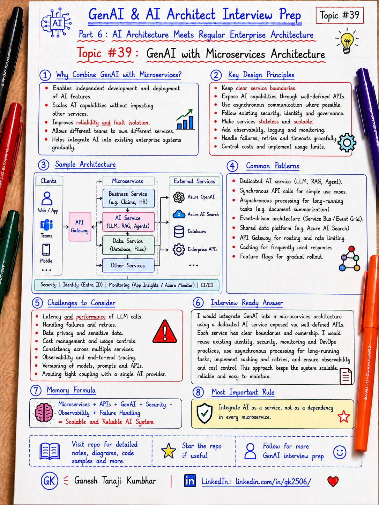

# GenAI & AI Architect Interview Prep

# Topic #39: GenAI with Microservices Architecture



---

## Important Note: Continuing Part 6

In the previous topic, we started **Part 6: AI Architecture Meets Regular Enterprise Architecture**.

We covered an important idea:

> GenAI should not be designed as a separate toy system. It should fit into existing identity, APIs, data platforms, monitoring, security, compliance, and deployment architecture.

Now we go one level deeper.

Many enterprise systems are already built using:

- APIs
- Microservices
- Databases
- Events
- Queues
- Workers
- API gateways
- CI/CD pipelines
- Observability platforms
- Security and compliance controls

So the next interview question becomes:

> How does GenAI fit into microservices architecture?

Important learning point:

> GenAI should be added as a controlled capability inside microservices architecture, not as an uncontrolled AI layer that bypasses service boundaries, APIs, ownership, security, and observability.

---

## Question

In an interview, you may be asked:

> How would you integrate GenAI into a microservices-based enterprise system?

Or:

> Should GenAI be a separate microservice?

Or:

> How do microservices communicate with an AI service?

Or:

> How do you design RAG or AI Agents in a microservices architecture?

Or:

> What are the risks of adding GenAI to an existing microservices platform?

---

## Why interviewer asks this

The interviewer is checking whether you can connect GenAI architecture with normal distributed-system architecture.

A weak answer is:

```text
I will create one AI service and all microservices will call it.
```

That may work for a demo, but it can become risky in production.

A stronger answer explains:

```text
AI capability should respect existing service boundaries, API contracts, data ownership, identity, monitoring, and failure-handling patterns.
```

This question tests your understanding of:

- Microservice boundaries
- API contracts
- Service ownership
- Data ownership
- RAG integration
- AI Agent tool design
- Synchronous vs asynchronous processing
- Events and queues
- Reliability patterns
- Observability
- Security
- Cost control
- Governance
- Deployment and versioning

---

## Basic answer

Simple answer:

> GenAI can be integrated into microservices architecture as a separate AI capability, a domain-specific AI service, or a feature inside an existing service. The important point is that GenAI should respect service boundaries, APIs, data ownership, security, monitoring, and resilience patterns.

Simple architecture view:

```text
User / App
   ↓
API Gateway
   ↓
Domain Microservices
   ↓
AI Capability Layer
   ↓
LLM / RAG / Agent Tools
   ↓
Enterprise Data Sources and APIs
```

Simple formula:

```text
Microservices
+ AI Service
+ RAG
+ Agents
+ API Contracts
+ Security
+ Observability
= Enterprise-ready GenAI Microservices Architecture
```

---

## Architect-level answer

A strong architect-level answer would be:

> I would integrate GenAI into a microservices architecture by treating AI as a controlled platform or domain capability, not as a shortcut around existing services. The AI layer should use well-defined APIs, events, queues, and tool contracts to interact with domain services. RAG should retrieve only authorized and relevant context, and AI Agents should call business-level tools rather than directly querying databases. For production readiness, I would design identity, tenant isolation, validation, fallback, timeout, retry, circuit breaker, observability, audit logging, cost tracking, and human approval for risky actions.

---

## Must mention in interview

When answering this question, try to mention these points:

---

### 1. GenAI should respect service boundaries

Microservices are designed around clear business capabilities.

Examples:

```text
Expense Service
Policy Service
Approval Service
Notification Service
Document Service
Search Service
```

GenAI should not ignore these boundaries.

Wrong approach:

```text
AI Service directly reads all databases and updates records.
```

Better approach:

```text
AI Service calls approved APIs or tools exposed by domain services.
```

Important line:

> GenAI should use service contracts, not bypass service ownership.

---

### 2. Avoid creating one AI god service

A common mistake is creating one large AI service that knows everything.

Bad design:

```text
One AI Service
  ↓
Reads every database
Calls every API
Owns every prompt
Executes every workflow
Logs everything differently
```

This creates problems:

- Too much coupling
- Unclear ownership
- Security risk
- Difficult testing
- Hard deployment
- Weak auditability
- Poor scalability

Important line:

> Do not create an AI god service that becomes a hidden monolith inside microservices architecture.

---

### 3. Choose the right GenAI integration pattern

There is no single pattern for every use case.

Common options:

| Pattern | When to use |
|---|---|
| AI inside existing service | Small AI feature owned by one domain |
| Dedicated AI service | Reusable AI capability used by multiple services |
| RAG service | Shared retrieval and grounding capability |
| Agent service | Tool-using AI workflow across services |
| Event-driven AI worker | Async processing such as document extraction or summarization |
| AI gateway / model router | Centralized model access, policy, logging, and cost control |

Important line:

> Choose the pattern based on ownership, reuse, latency, risk, and operational complexity.

---

### 4. Use APIs and events intentionally

In microservices architecture, communication is usually synchronous or asynchronous.

Synchronous examples:

```text
GET /expenses/{id}
GET /policies/search
POST /approval-requests
```

Asynchronous examples:

```text
ExpenseSubmitted event
DocumentUploaded event
ClaimCreated event
ApprovalRequested event
```

Use synchronous calls when the user is waiting for an immediate answer.

Use asynchronous events when work is long-running, heavy, or retryable.

Important line:

> Not every AI task should block the user request.

---

### 5. RAG should not bypass domain security

RAG systems often retrieve information from indexes.

But retrieval must respect:

- User identity
- Tenant
- Role
- Permission
- Data classification
- Document access
- Region
- Compliance rules

Bad design:

```text
Vector DB has all documents, and AI retrieves whatever is similar.
```

Better design:

```text
Retrieval applies metadata filtering, access checks, and tenant isolation before context reaches the model.
```

Important line:

> Similarity search is not a security boundary.

---

### 6. AI Agents should call business-level tools

An AI Agent in a microservices system should use approved business tools.

Good tools:

```text
GetExpenseDetails(expenseId)
SearchExpensePolicy(query, region)
CheckApprovalRequired(expenseId)
CreateApprovalRequest(expenseId, reason)
```

Bad tools:

```text
ExecuteSqlQuery(query)
CallAnyApi(url, payload)
UpdateAnyTable(table, id, value)
```

Important line:

> Agent tools should represent business capabilities, not unrestricted technical access.

---

### 7. Separate read operations and write operations

Read operations fetch information.

Write operations change business state.

Read examples:

```text
GetClaimSummary
SearchPolicy
RetrieveDocumentMetadata
GetExpenseStatus
```

Write examples:

```text
CreateTicket
UpdateClaimStatus
SubmitApprovalRequest
SendNotification
```

Write operations need stronger controls:

- Confirmation
- Authorization
- Business validation
- Idempotency
- Audit logging
- Human approval for risky actions

Important line:

> A tool that changes business state should not be treated like a simple read tool.

---

### 8. Design for failure and fallback

GenAI microservices call many dependencies.

Possible failures:

- Model timeout
- Token limit
- Rate limit
- Search failure
- Bad retrieval
- Tool failure
- API error
- Network issue
- Invalid model output
- Hallucinated answer

Use resilience patterns:

- Timeout
- Retry
- Circuit breaker
- Fallback
- Bulkhead
- Queue-based processing
- Dead-letter queue
- Graceful degradation

Important line:

> LLM calls, search calls, and tool calls are distributed-system dependencies.

---

### 9. Observability must cross service boundaries

A GenAI request may move across many services.

Example:

```text
Web App
  ↓
API Gateway
  ↓
AI Service
  ↓
RAG Service
  ↓
Vector Index
  ↓
Policy Service
  ↓
LLM Provider
```

You need end-to-end tracing.

Track:

```text
correlationId
userId
tenantId
serviceName
modelName
promptVersion
retrievalQuery
topK documents
toolName
latency
tokenUsage
cost
errorCode
finalAnswerStatus
```

Important line:

> If you cannot trace the full AI flow, you cannot debug or trust it in production.

---

### 10. Governance and release controls still matter

GenAI changes should be governed like software changes.

Version and control:

- Prompts
- Tools
- Models
- Retrieval configuration
- Chunking strategy
- Evaluation datasets
- Guardrails
- Feature flags
- Deployment pipelines
- Rollback plans

Important line:

> In GenAI systems, prompts and retrieval settings are also production artifacts.

---

## Real-world example: Expense Management AI Agent

Let us use the common scenario from this series.

### Business context

We have an enterprise expense platform built with microservices.

Existing services:

```text
Expense Service
Policy Service
Approval Service
Document Service
Notification Service
Audit Service
```

Now we add an **Expense Management AI Agent**.

The user asks:

```text
Why was my hotel expense rejected, and can I resubmit it?
```

---

## Bad architecture

A poor design would be:

```text
User
  ↓
AI Service
  ↓
Direct DB access
  ↓
All expense, policy, approval, document tables
  ↓
LLM response
```

Why this is risky:

- Bypasses domain services
- Breaks ownership boundaries
- Can expose sensitive data
- Can ignore business rules
- Hard to audit
- Hard to secure
- Hard to test

Important line:

> Direct database access from AI is usually a red flag in enterprise architecture.

---

## Better architecture

A better design is:

```text
User
  ↓
Web / Mobile / Teams App
  ↓
API Gateway
  ↓
Expense AI Agent Service
  ↓
Approved tools / APIs
  ↓
Expense Service
Policy Service
Approval Service
Document Service
Notification Service
Audit Service
  ↓
Azure OpenAI + Azure AI Search
```

The AI Agent does not own all business logic.

It coordinates across existing services using approved contracts.

---

## Example flow

```text
User asks:
"Why was my hotel expense rejected?"

        ↓

AI Agent receives request

        ↓

Agent calls Expense Service:
GetExpenseDetails(EXP-7890)

        ↓

Agent calls Document Service:
CheckReceiptStatus(EXP-7890)

        ↓

Agent calls Policy Service or RAG Service:
SearchHotelExpensePolicy(region, tenantId)

        ↓

Agent calls Approval Service:
CheckApprovalRequired(EXP-7890)

        ↓

Azure OpenAI generates grounded response

        ↓

Application validates final answer

        ↓

Audit Service logs the full trace
```

---

## Example final response

```text
Your hotel expense was rejected because the receipt is missing and the amount is above the allowed hotel limit.

You can resubmit it after uploading the receipt.

Because the amount is above the standard limit, manager exception approval will be required.
```

---

## Microservices integration patterns for GenAI

### Pattern 1: AI feature inside an existing service

Use when the AI feature belongs clearly to one domain.

Example:

```text
Support Service adds AI reply suggestion.
```

Good for:

- Small features
- Clear ownership
- Low reuse
- Simple deployment

Risk:

- AI logic may spread across many services if not governed.

---

### Pattern 2: Dedicated AI service

Use when many services need common AI functionality.

Example:

```text
AI Assistant Service
  ↓
Used by Expense, Claims, Support, HR apps
```

Good for:

- Reuse
- Centralized prompt management
- Centralized model access
- Centralized observability

Risk:

- Can become an AI god service if boundaries are not clear.

---

### Pattern 3: RAG service

Use when multiple applications need controlled enterprise retrieval.

Example:

```text
RAG Service
  ↓
Azure AI Search
  ↓
Policy documents, knowledge base, product docs
```

Good for:

- Reusable retrieval
- Metadata filtering
- Citations
- Document grounding

Risk:

- Retrieval may bypass document-level permissions if security is weak.

---

### Pattern 4: Event-driven AI worker

Use for long-running or async tasks.

Example:

```text
DocumentUploaded event
  ↓
AI Worker extracts summary
  ↓
Stores result
  ↓
Publishes DocumentProcessed event
```

Good for:

- Document processing
- Summarization
- Classification
- Extraction
- Background enrichment

Risk:

- Requires idempotency, retries, dead-letter handling, and monitoring.

---

### Pattern 5: AI gateway or model router

Use when the enterprise wants central control over model access.

The gateway may handle:

- Model routing
- Rate limits
- Cost tracking
- Policy enforcement
- Logging
- Prompt filtering
- Fallback model selection

Risk:

- Adds another critical dependency if not designed well.

---

## Microsoft-stack view

For .NET / Azure teams, this architecture can use familiar components:

```text
ASP.NET Core APIs
Azure Functions
Azure App Service
Azure Container Apps
AKS
Azure API Management
Azure Service Bus
Azure Event Grid
Azure OpenAI
Azure AI Search
Azure SQL / Cosmos DB
Blob Storage
Microsoft Entra ID
Azure Key Vault
Application Insights
Azure Monitor
Azure DevOps / GitHub Actions
```

Example view:

```text
User / Teams / Web App
        ↓
Azure API Management
        ↓
ASP.NET Core Microservices
        ↓
AI Agent Service / RAG Service
        ↓
Azure OpenAI + Azure AI Search
        ↓
Domain APIs + Data Stores
        ↓
Application Insights + Audit Logs
```

Important line:

> For Microsoft-stack engineers, GenAI microservices architecture is an extension of existing .NET, Azure, API, security, and DevOps skills.

---

## Common mistake

Many candidates say:

> I will create one AI microservice and connect it to everything.

Better answer:

> I will decide whether AI belongs inside a domain service, a dedicated AI service, a RAG service, an agent service, or an event-driven worker based on ownership, reuse, latency, risk, and operational needs.

Another common mistake:

> AI Agent can directly query the database.

Better answer:

> AI Agents should call approved business APIs or tools. Backend services should own business rules and data access.

Another common mistake:

> RAG security is handled by the vector database.

Better answer:

> RAG must enforce identity, tenant filtering, document permissions, and data classification before sending context to the model.

---

## What can go wrong?

### 1. AI bypasses domain services

Problem:

```text
AI reads or updates database tables directly.
```

Fix:

```text
Use domain APIs and approved tools.
```

---

### 2. One AI service becomes a monolith

Problem:

```text
All prompts, tools, workflows, and data access live in one service.
```

Fix:

```text
Define ownership, split by capability, and use clear contracts.
```

---

### 3. Weak observability

Problem:

```text
Only final AI answer is logged.
```

Fix:

```text
Trace prompt, model, retrieval, tool calls, latency, cost, and final response.
```

---

### 4. Synchronous calls for long-running work

Problem:

```text
User waits while AI processes large documents.
```

Fix:

```text
Use events, queues, background workers, and status tracking.
```

---

### 5. No versioning

Problem:

```text
Prompt or model changes break production behavior.
```

Fix:

```text
Version prompts, models, tools, retrieval configs, and evaluation datasets.
```

---

## Better interview answer

A strong answer can be:

> I would integrate GenAI into microservices architecture by treating AI as a controlled capability within the existing distributed system. I would not allow AI to bypass domain services or directly query databases. Depending on the use case, I may use a dedicated AI service, RAG service, agent service, event-driven AI worker, or AI gateway. The AI service would interact with other microservices through well-defined APIs, events, queues, or approved tools. I would enforce identity, tenant isolation, RBAC, validation, observability, audit logging, timeout, retry, circuit breaker, fallback, cost tracking, and human approval for high-risk actions.

---

## One-line answer

> GenAI with microservices means adding AI as a controlled capability that respects service boundaries, APIs, data ownership, security, observability, and resilience patterns.

---

## Memory formula

Use this formula:

```text
Microservices
+ AI Capability
+ APIs / Events
+ RAG / Agents
+ Security
+ Observability
+ Resilience
= Enterprise-ready GenAI Microservices
```

Another version:

```text
Do not bypass services.
Do not create AI monoliths.
Use contracts, events, security, and observability.
```

Most important rule:

```text
GenAI should extend microservices architecture, not break it.
```

---

## Interview closing line

You can close your answer like this:

> I would design GenAI as part of the microservices ecosystem, not as a separate uncontrolled layer. The AI components should use existing APIs, events, identity, monitoring, deployment pipelines, and governance controls. That is how GenAI becomes production-ready instead of becoming another hidden monolith.

---

## Related upcoming topics

- Event-Driven AI Architecture
- Data Architecture for GenAI Systems
- AI Gateway and Model Router Pattern
- Containers for AI Applications
- Kubernetes and AKS for AI Workloads
- API Gateway, Security, and Service Boundaries in AI Apps
- Resilience Patterns for AI Microservices

---

## Reference Scenario

This topic can be understood using the common **Expense Management AI Agent** scenario used across this series.

You can refer to the scenario here:

```text
00-common-examples/expense-management-ai-agent-scenario.md
```

---

## About the Author

These notes are created and maintained by **Ganesh Tanaji Kumbhar**, an **AI Architect** with experience in **.NET, Azure, cloud architecture, infrastructure, enterprise application modernization, and GenAI solution design**.

I bring practical experience across:

- **.NET / C# / ASP.NET / Web API**
- **Azure App Services, Azure Functions, WebJobs, Azure SQL, Storage, Redis**
- **Cloud architecture and infrastructure modernization**
- **Application architecture and enterprise system design**
- **CI/CD, DevOps, monitoring, and production support**
- **GenAI, RAG, Agentic AI, and AI architecture patterns**

These notes are based on my real experience as both:

- An **interviewee**, facing AI, architecture, cloud, .NET, Azure, and system design rounds
- An **interviewer**, evaluating how candidates explain concepts, tradeoffs, project experience, and real-world design decisions

I write about:

- GenAI Architecture
- RAG System Design
- Agentic AI
- AI Architect Interview Preparation
- .NET and Azure Architecture
- Cloud and Enterprise AI Patterns

If you are preparing for **GenAI / AI Architect / Staff Engineer / Solution Architect / .NET Architect / Azure Architect** interviews, feel free to connect with me on LinkedIn.

🔗 **LinkedIn:** [Connect with me on LinkedIn](https://www.linkedin.com/in/gk2506/)

💬 You can also DM me on LinkedIn if you want to discuss AI architecture, interview preparation, .NET/Azure architecture, or practical GenAI learning.
