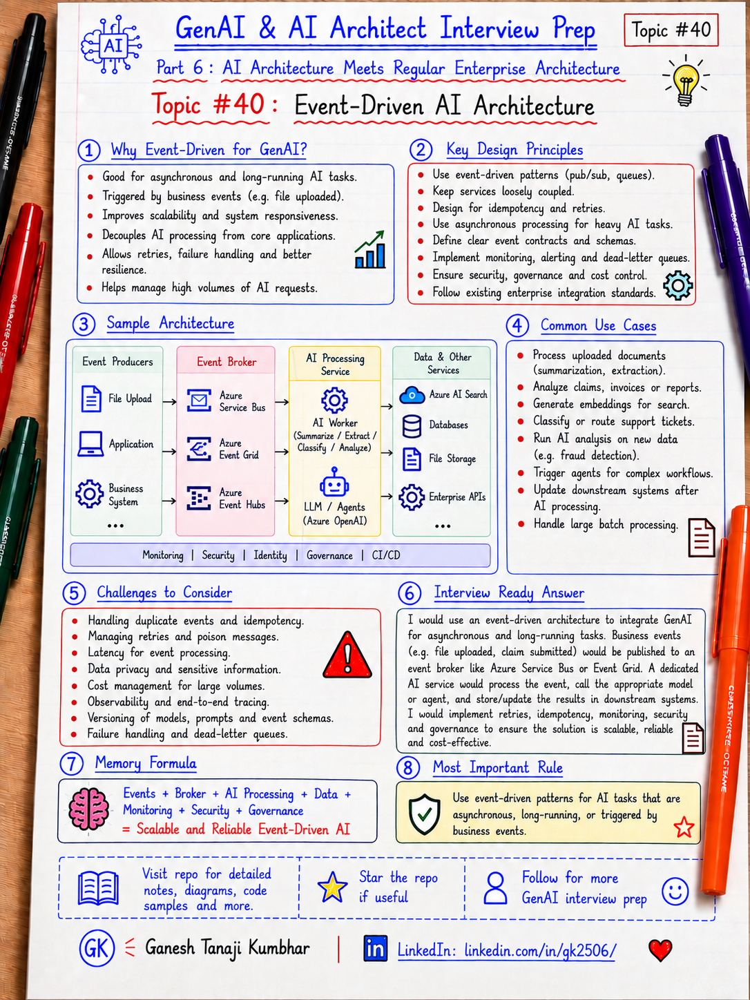

# GenAI & AI Architect Interview Prep

# Topic #40: Event-Driven AI Architecture



---

## Important Note: Continuing Part 6

In the previous topics, we started **Part 6: AI Architecture Meets Regular Enterprise Architecture**.

We covered:

- How GenAI fits into existing enterprise architecture
- GenAI with microservices architecture

Now we continue with a very important enterprise architecture pattern:

```text
Event-Driven AI Architecture
```

This topic is important because many GenAI tasks are not simple request-response operations.

Some AI tasks are:

- Long-running
- Asynchronous
- Retriable
- Triggered by business events
- Dependent on document processing
- Dependent on workflow completion
- Better handled in background jobs
- Safer when separated from user-facing APIs

Important learning point:

> Event-driven AI architecture helps GenAI systems handle long-running, asynchronous, retriable, and business-event-triggered workloads without tightly coupling everything to the user request.

---

## Question

In an interview, you may be asked:

> How would you design an event-driven GenAI system?

Or:

> When would you use events in an AI architecture?

Or:

> How would you process documents, invoices, claims, or tickets asynchronously using AI?

Or:

> How would you design GenAI workflows using queues, topics, workers, and events?

Or:

> How do you make AI processing reliable when LLM calls or downstream services fail?

---

## Why interviewer asks this

The interviewer wants to check whether you understand that production AI systems are not only chat screens and API calls.

A weak answer is:

```text
User calls API.
API calls LLM.
LLM returns answer.
```

That may work for simple use cases.

But many enterprise AI workflows need a better design.

Examples:

- Invoice uploaded
- Claim submitted
- Expense receipt uploaded
- Support ticket created
- Customer email received
- Document added to storage
- Policy document updated
- Approval workflow completed

These are business events.

A strong candidate should explain how AI processing can be triggered by such events and handled asynchronously.

This question tests your understanding of:

- Event-driven architecture
- Queues and topics
- Producers and consumers
- Background workers
- Azure Service Bus
- Azure Event Grid
- Azure Functions
- Durable processing
- Retry and dead-letter handling
- Idempotency
- Correlation IDs
- AI task orchestration
- RAG ingestion pipelines
- Workflow integration
- Monitoring and audit logging

---

## Basic answer

Simple answer:

> Event-driven AI architecture means AI processing is triggered by business or system events instead of only direct synchronous API calls.

Simple example:

```text
Receipt Uploaded Event
        ↓
Queue / Topic
        ↓
AI Processing Worker
        ↓
Extract data + validate policy
        ↓
Store result
        ↓
Notify user or workflow
```

Simple formula:

```text
Business Event
+ Queue / Topic
+ AI Worker
+ Retry / Monitoring
+ Result Store
= Event-Driven AI Architecture
```

---

## Architect-level answer

A strong architect-level answer would be:

> I would use event-driven AI architecture when AI work is long-running, asynchronous, retriable, or triggered by business events. Instead of making the user-facing API wait for every LLM, RAG, extraction, or validation step, I would publish an event or message and process it using workers or serverless functions. The design should include clear event contracts, idempotent consumers, retry policies, dead-letter queues, correlation IDs, audit logging, monitoring, and fallback handling. This keeps the system scalable, reliable, loosely coupled, and easier to operate.

---

## Must mention in interview

When answering this question, try to mention these points:

---

### 1. Event-driven AI is useful for asynchronous workloads

Not every AI task should block the user request.

Examples of asynchronous AI tasks:

- Document summarization
- Invoice extraction
- Receipt validation
- Claim classification
- Support ticket triage
- Email intent detection
- Policy compliance check
- Knowledge base indexing
- Embedding generation
- RAG ingestion pipeline

Important line:

> Use event-driven design when AI processing can happen in the background.

---

### 2. Events help decouple systems

In a tightly coupled design:

```text
Application
  ↓
Directly calls AI service
  ↓
Directly calls every downstream system
```

The application becomes slow and fragile.

In an event-driven design:

```text
Application publishes event
        ↓
AI worker processes event
        ↓
Other systems react independently
```

This reduces coupling.

Important line:

> Event-driven AI helps decouple business applications from long-running AI processing.

---

### 3. Events are not the same as commands

This is an important interview distinction.

| Concept | Meaning | Example |
|---|---|---|
| Command | Request to do something | `ProcessExpenseReceipt` |
| Event | Something already happened | `ExpenseReceiptUploaded` |

A command says:

```text
Do this.
```

An event says:

```text
This happened.
```

Important line:

> Events describe facts that happened. Commands request actions.

---

### 4. Use queues for work distribution

A queue is useful when one worker should process one message.

Example:

```text
ExpenseReceiptUploaded
        ↓
Queue
        ↓
ReceiptProcessingWorker
```

Use queues for:

- Background processing
- Load leveling
- Retry handling
- Worker scaling
- Decoupling user requests from processing

Important line:

> Queues are useful when work needs to be processed reliably by one consumer.

---

### 5. Use topics for fan-out

A topic is useful when multiple consumers need the same event.

Example:

```text
ExpenseSubmitted Event
        ↓
Topic
        ├── AI Policy Validation
        ├── Fraud Detection
        ├── Notification Service
        └── Audit Service
```

Use topics when multiple systems need to react independently.

Important line:

> Topics help multiple consumers react to the same business event.

---

### 6. Use event bus for enterprise integration

In enterprise architecture, events may move across many systems.

Examples:

- CRM
- ERP
- Claims system
- Expense system
- HR system
- Ticketing system
- Data platform
- AI services

The event bus helps connect these systems without direct point-to-point coupling.

Important line:

> Event-driven AI should integrate with enterprise eventing and messaging standards, not create another isolated AI pipeline.

---

### 7. AI workers should be idempotent

Event messages can be retried.

The same event may be processed more than once.

So AI consumers should be idempotent.

Meaning:

```text
Processing the same message twice should not create duplicate or incorrect results.
```

Example:

Bad design:

```text
Every retry creates a new approval request.
```

Better design:

```text
Use eventId, requestId, or business key to detect duplicate processing.
```

Important line:

> In event-driven AI, assume messages can be retried or duplicated.

---

### 8. Add retry and dead-letter handling

AI systems can fail because of:

- LLM timeout
- Rate limit
- Search service failure
- API failure
- Invalid input
- Network issue
- Permission issue
- Bad document format

Use:

- Retry with backoff
- Dead-letter queue
- Poison message handling
- Manual reprocessing
- Alerting
- Failure dashboard

Important line:

> Retry safely, but do not retry blindly forever.

---

### 9. Use correlation IDs across the full flow

A single business request may create many events.

Example:

```text
Expense submitted
  ↓
Receipt extracted
  ↓
Policy checked
  ↓
Manager approval requested
  ↓
Notification sent
```

Use a correlation ID to trace the full journey.

Log:

```text
correlationId
eventId
eventType
producer
consumer
tenantId
userId
businessEntityId
status
latency
retryCount
errorCode
```

Important line:

> If you cannot trace the event flow, you cannot operate the AI system in production.

---

### 10. Event-driven AI does not remove security

Even background AI processing must enforce security.

Check:

- User identity
- Tenant boundary
- Data access permission
- Tool permission
- Data classification
- PII handling
- Audit requirement
- Approval requirement

Important line:

> Background processing is not a shortcut around authentication, authorization, and data governance.

---

## Real-world example: Expense Management AI Agent

Let us use the common scenario from this series.

### Business context

An employee uploads a hotel receipt and submits an expense.

The system needs to:

- Extract receipt data
- Validate amount
- Check policy
- Check missing receipt or required documents
- Identify if manager approval is required
- Generate explanation
- Notify user
- Create approval workflow if needed
- Log everything

This is a good fit for event-driven AI.

---

## Synchronous design problem

Bad design:

```text
User submits expense
        ↓
API waits for OCR
        ↓
API waits for LLM extraction
        ↓
API waits for policy check
        ↓
API waits for approval decision
        ↓
API waits for notification
        ↓
User waits too long
```

Problems:

- Slow user experience
- Higher timeout risk
- Harder retry
- Tight coupling
- Expensive request path
- Poor failure isolation

Important line:

> Do not put every AI task inside the user-facing request path.

---

## Better event-driven design

Better design:

```text
User uploads receipt
        ↓
Expense API stores file and metadata
        ↓
Publishes ReceiptUploaded event
        ↓
AI Receipt Processor consumes event
        ↓
Extracts receipt details
        ↓
Publishes ReceiptExtracted event
        ↓
Policy Checker consumes event
        ↓
Checks expense policy
        ↓
Publishes PolicyValidationCompleted event
        ↓
Workflow service creates approval if required
        ↓
Notification service informs user
```

This is more reliable and scalable.

---

## Example event flow

```text
ExpenseSubmitted
        ↓
ReceiptExtractionRequested
        ↓
ReceiptExtracted
        ↓
PolicyValidationRequested
        ↓
PolicyValidationCompleted
        ↓
ApprovalRequired
        ↓
UserNotified
```

Each step can be monitored, retried, and audited.

---

## Example Azure architecture

A Microsoft-stack architecture could look like this:

```text
User / App / Teams
        ↓
ASP.NET Core API / Azure Function
        ↓
Azure Service Bus Queue / Topic
        ↓
AI Processing Worker / Azure Function
        ↓
Azure OpenAI
        ↓
Azure AI Search
        ↓
Enterprise APIs / Azure SQL / Blob Storage
        ↓
Result Store
        ↓
Notification / Workflow / Audit
        ↓
Application Insights + Azure Monitor
```

Possible Azure services:

- Azure Service Bus for reliable queues and topics
- Azure Event Grid for event routing
- Azure Functions for event-triggered processing
- Durable Functions for long-running workflows
- Azure OpenAI for model reasoning and generation
- Azure AI Search for retrieval
- Azure SQL or Cosmos DB for state
- Blob Storage for documents
- Application Insights and Azure Monitor for observability

Important line:

> Use the right Azure messaging service based on reliability, fan-out, throughput, and workflow needs.

---

## Common event-driven AI patterns

### 1. Document processing pipeline

```text
DocumentUploaded
        ↓
ExtractText
        ↓
GenerateEmbedding
        ↓
IndexInSearch
        ↓
ReadyForRAG
```

Useful for:

- Enterprise knowledge base
- Claims documents
- Policy documents
- Contracts
- Invoices
- Receipts

---

### 2. Support ticket triage

```text
TicketCreated
        ↓
ClassifyIntent
        ↓
DetectPriority
        ↓
SuggestResponse
        ↓
RouteToTeam
```

Useful for:

- Helpdesk
- IT support
- Customer support
- Operations support

---

### 3. Invoice or expense validation

```text
InvoiceReceived
        ↓
ExtractFields
        ↓
ValidateVendor
        ↓
CheckPolicy
        ↓
FlagException
        ↓
ApprovalWorkflow
```

Useful for:

- Finance automation
- Expense management
- Procurement
- Audit support

---

### 4. Knowledge base refresh

```text
PolicyDocumentUpdated
        ↓
RechunkDocument
        ↓
GenerateEmbeddings
        ↓
UpdateVectorIndex
        ↓
NotifySearchReady
```

Useful for:

- RAG systems
- Internal knowledge assistants
- Compliance assistants

---

### 5. Agent workflow automation

```text
CustomerEmailReceived
        ↓
AgentClassifiesRequest
        ↓
AgentRetrievesPolicy
        ↓
AgentDraftsResponse
        ↓
HumanApproves
        ↓
ResponseSent
```

Useful for:

- Agentic AI workflows
- Human-in-the-loop systems
- Regulated workflows

---

## When to use event-driven AI

Use event-driven AI when:

- AI work is long-running
- Processing can happen in the background
- Multiple systems need to react
- You need retry and failure handling
- You need fan-out
- You need workflow orchestration
- You need batch or stream processing
- You need decoupling
- User does not need instant final result
- AI output should be reviewed before action

Important line:

> Event-driven AI is useful when reliability and decoupling matter more than immediate response.

---

## When not to use event-driven AI

Do not use event-driven AI for every use case.

Avoid it when:

- User needs immediate response
- The flow is simple request-response
- Strong consistency is required immediately
- The team cannot operate async systems
- Event contracts are unclear
- Observability is missing
- Retry and duplicate handling are not designed

Important line:

> Event-driven design adds power, but also adds operational complexity.

---

## What should be logged?

For production event-driven AI, log:

```text
correlationId
eventId
eventType
messageId
producer
consumer
tenantId
userId
entityId
modelName
promptVersion
toolName
retrievalQuery
status
latency
retryCount
errorCode
deadLetterReason
finalOutcome
timestamp
```

Important rule:

> Log enough to trace the full event journey, but avoid logging unnecessary sensitive data.

---

## Common mistake

Many candidates say:

> I will call the LLM directly from each microservice.

Better answer:

> I would use a dedicated AI service or event-driven worker for long-running AI tasks, with queues, retries, monitoring, and clear service boundaries.

Another common mistake:

> Events guarantee exactly-once processing.

Better answer:

> In real systems, messages can be retried or duplicated. Consumers must be idempotent.

Another common mistake:

> Event-driven means real-time.

Better answer:

> Event-driven can be near real-time, but it is not always immediate. It depends on queue delay, processing time, retries, and system load.

Another common mistake:

> If processing fails, the user can just try again.

Better answer:

> Failed events should be retried safely, dead-lettered when needed, monitored, and reprocessed with support visibility.

---

## What can go wrong?

### 1. No idempotency

Problem:

```text
Same event processed twice creates duplicate records.
```

Fix:

```text
Use eventId, messageId, business key, and processed-event store.
```

---

### 2. No dead-letter handling

Problem:

```text
Poison messages keep failing forever.
```

Fix:

```text
Move failed messages to dead-letter queue and alert support team.
```

---

### 3. No correlation ID

Problem:

```text
You cannot trace why the AI output was generated.
```

Fix:

```text
Pass correlationId through API, event, worker, model call, and final response.
```

---

### 4. Too much logic in one consumer

Problem:

```text
One worker handles extraction, policy, approval, notification, and audit.
```

Fix:

```text
Split responsibilities into clear steps or services.
```

---

### 5. Weak event contracts

Problem:

```text
Consumers break when event shape changes.
```

Fix:

```text
Version event contracts and maintain backward compatibility.
```

---

### 6. Uncontrolled cost

Problem:

```text
Every event triggers expensive LLM calls.
```

Fix:

```text
Use filtering, batching, caching, smaller models, token limits, and cost monitoring.
```

---

## Better interview answer

A strong answer can be:

> I would use event-driven AI architecture when AI tasks are long-running, asynchronous, retriable, or triggered by business events. For example, when an invoice, receipt, claim, or support ticket is created, the application can publish an event or message. A background AI worker or Azure Function can process the event, call Azure OpenAI or Azure AI Search if required, store the result, and publish a follow-up event. I would design this with clear event contracts, queues or topics, idempotent consumers, retry policies, dead-letter handling, correlation IDs, audit logging, monitoring, and human approval for risky actions. This keeps the user-facing application responsive and makes the AI workflow scalable, reliable, and easier to operate.

---

## One-line answer

> Event-driven AI architecture uses business events, queues, topics, and background workers to process AI tasks asynchronously, reliably, and independently from the user-facing request path.

---

## Memory formula

Use this formula:

```text
Business Event
+ Queue / Topic
+ AI Worker
+ Idempotency
+ Retry
+ Dead Letter
+ Observability
= Event-Driven AI Architecture
```

Another version:

```text
Event happens.
Message is published.
AI worker processes.
Result is stored.
Workflow continues.
Everything is traced.
```

Most important rule:

```text
Do not block the user request with long-running AI work.
Use events when AI processing should be decoupled, reliable, and retriable.
```

---

## Interview closing line

You can close your answer like this:

> I would not put every GenAI task inside a synchronous API call. For enterprise systems, I would use event-driven architecture when AI processing is asynchronous, long-running, or triggered by business events. The key is to design clear event contracts, reliable messaging, idempotent consumers, retries, dead-letter handling, observability, auditability, and governance from day one.

---

## Related upcoming topics

- Data Architecture for GenAI Systems
- AI Gateway and Model Router Pattern
- Containers for AI Applications
- Kubernetes and AKS for AI Workloads
- API Gateway, Security, and Service Boundaries in AI Apps
- Choosing Azure App Service vs Azure Functions vs Container Apps vs AKS for AI Systems
- Resilience Patterns for AI Microservices

---

## Reference Scenario

This topic can be understood using the common **Expense Management AI Agent** scenario used across this series.

You can refer to the scenario here:

```text
00-common-examples/expense-management-ai-agent-scenario.md
```

---

## About the Author

These notes are created and maintained by **Ganesh Tanaji Kumbhar**, an **AI Architect** with experience in **.NET, Azure, cloud architecture, infrastructure, enterprise application modernization, and GenAI solution design**.

I bring practical experience across:

- **.NET / C# / ASP.NET / Web API**
- **Azure App Services, Azure Functions, WebJobs, Azure SQL, Storage, Redis**
- **Cloud architecture and infrastructure modernization**
- **Application architecture and enterprise system design**
- **CI/CD, DevOps, monitoring, and production support**
- **GenAI, RAG, Agentic AI, and AI architecture patterns**

These notes are based on my real experience as both:

- An **interviewee**, facing AI, architecture, cloud, .NET, Azure, and system design rounds
- An **interviewer**, evaluating how candidates explain concepts, tradeoffs, project experience, and real-world design decisions

I write about:

- GenAI Architecture
- RAG System Design
- Agentic AI
- AI Architect Interview Preparation
- .NET and Azure Architecture
- Cloud and Enterprise AI Patterns

If you are preparing for **GenAI / AI Architect / Staff Engineer / Solution Architect / .NET Architect / Azure Architect** interviews, feel free to connect with me on LinkedIn.

🔗 **LinkedIn:** [Connect with me on LinkedIn](https://www.linkedin.com/in/gk2506/)

💬 You can also DM me on LinkedIn if you want to discuss AI architecture, interview preparation, .NET/Azure architecture, or practical GenAI learning.
