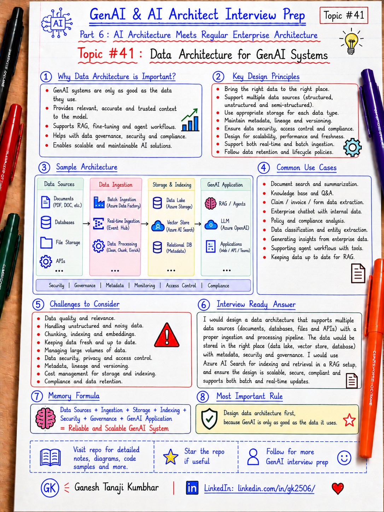

# GenAI & AI Architect Interview Prep

# Topic #41: Data Architecture for GenAI Systems



---

## Important Note: Continuing Part 6

In the previous topics, we started connecting GenAI architecture with regular enterprise architecture.

We covered:

- How GenAI fits into existing enterprise architecture
- GenAI with microservices architecture
- Event-driven AI architecture

Now we move to one of the most important foundations of any GenAI system:

```text
Data Architecture
```

Many people focus only on:

```text
Model
Prompt
Vector DB
Agent
```

But in real enterprise systems, GenAI quality depends heavily on the data architecture behind it.

Important learning point:

> GenAI architecture is only as strong as the data architecture that supplies, secures, filters, governs, and refreshes enterprise context.

---

## Question

In an interview, you may be asked:

> How would you design data architecture for a GenAI system?

Or:

> What data architecture is needed for RAG and AI Agents?

Or:

> How do documents, relational data, blob storage, vector indexes, metadata, and access control fit together in GenAI architecture?

Or:

> Why is data architecture important in GenAI applications?

Or:

> How would you make sure a GenAI system uses fresh, secure, and authorized enterprise data?

---

## Why interviewer asks this

The interviewer wants to check whether you understand that GenAI is not only about calling an LLM.

A weak answer is:

```text
We will put documents into a vector database and use RAG.
```

That is incomplete.

A stronger answer explains the complete data flow:

```text
Enterprise data sources
        ↓
Ingestion
        ↓
Cleaning / normalization
        ↓
Chunking / enrichment
        ↓
Metadata and access control
        ↓
Embeddings and indexes
        ↓
Retrieval
        ↓
Grounded response
        ↓
Feedback, monitoring, governance
```

This question tests your understanding of:

- Enterprise data sources
- Structured and unstructured data
- Document ingestion
- Data cleaning
- Chunking
- Embeddings
- Vector indexes
- Hybrid search
- Metadata filtering
- Tenant isolation
- RBAC
- Data freshness
- Data lineage
- Data retention
- Privacy and compliance
- Monitoring and evaluation
- RAG and agentic retrieval
- Production data governance

---

## Basic answer

Simple answer:

> Data architecture for GenAI defines how enterprise data is collected, cleaned, secured, indexed, retrieved, governed, monitored, and used by AI applications.

A GenAI system may use data from:

- Documents
- PDFs
- Web pages
- Databases
- Data lakes
- Blob storage
- APIs
- Search indexes
- Knowledge bases
- Event streams
- Business applications

Simple architecture:

```text
Data Sources
  ↓
Ingestion Pipeline
  ↓
Processing / Cleaning / Chunking
  ↓
Metadata + Access Control
  ↓
Embeddings + Search Index
  ↓
RAG / Agent Retrieval
  ↓
LLM Response
  ↓
Monitoring + Feedback + Governance
```

Simple formula:

```text
Right Data
+ Right Metadata
+ Right Access Control
+ Right Retrieval
+ Right Governance
= Reliable GenAI System
```

---

## Architect-level answer

A strong architect-level answer would be:

> I would design GenAI data architecture as a controlled data flow from enterprise sources to AI consumption. The architecture should handle ingestion, cleaning, chunking, enrichment, embeddings, indexing, metadata filtering, access control, retrieval, monitoring, and governance. I would support both structured data such as relational databases and unstructured data such as documents, PDFs, files, and knowledge articles. For RAG, I would store chunks with metadata such as tenant, user access, document type, version, region, sensitivity, and source. Retrieval should enforce the same security rules as the source system. I would also design for data freshness, lineage, retention, evaluation, and auditability so the GenAI system is secure, reliable, and production-ready.

---

## Must mention in interview

When answering this question, try to mention these points:

---

### 1. GenAI needs both structured and unstructured data

Enterprise data is not in one place.

Structured data examples:

- Customer records
- Claims
- Expenses
- Orders
- Invoices
- Transactions
- Product catalog
- Employee information

Unstructured data examples:

- PDFs
- Policies
- Contracts
- Emails
- Reports
- Knowledge articles
- Support tickets
- Scanned documents
- Meeting notes

Important line:

> GenAI data architecture must handle both structured business data and unstructured knowledge content.

---

### 2. Data sources should not be accessed randomly

Bad design:

```text
AI Agent directly queries any database, any file share, or any internal API.
```

Better design:

```text
AI application uses approved data access paths, APIs, search indexes, and controlled retrieval services.
```

This protects:

- Security
- Ownership
- Business rules
- Performance
- Compliance
- Auditability

Important line:

> AI systems should use governed data access paths, not uncontrolled direct access to enterprise data.

---

### 3. Ingestion pipeline is critical

For documents and knowledge sources, ingestion is the first important stage.

Ingestion may include:

- Reading documents
- Extracting text
- Extracting tables
- Running OCR when needed
- Removing duplicates
- Normalizing content
- Extracting metadata
- Detecting document type
- Handling versions
- Storing source references

Important line:

> Bad ingestion creates bad retrieval, and bad retrieval creates bad answers.

---

### 4. Chunking should preserve meaning

For RAG systems, documents are usually split into chunks.

Bad chunking:

```text
Split every 500 characters blindly.
```

Better chunking:

```text
Split by headings, sections, paragraphs, semantic boundaries, and business meaning.
```

Chunking should consider:

- Section boundaries
- Tables
- Lists
- Page numbers
- Document hierarchy
- Token limits
- Overlap
- Source citations
- Business meaning

Important line:

> Chunks should preserve meaning, not just fit token limits.

---

### 5. Metadata is not optional

Metadata makes retrieval safer and more accurate.

Useful metadata:

```text
tenantId
userAccess
role
region
documentType
sourceSystem
documentVersion
createdDate
updatedDate
sensitivityLevel
retentionPolicy
businessUnit
language
status
```

Metadata helps with:

- Filtering
- Ranking
- Tenant isolation
- RBAC
- Freshness
- Compliance
- Auditability
- Citations

Important line:

> In enterprise RAG, metadata is as important as embeddings.

---

### 6. Vector search alone is not enough

Many candidates say:

```text
We will use a vector database.
```

That is not enough.

Production retrieval may need:

- Vector search
- Keyword search
- Hybrid search
- Semantic ranking
- Metadata filtering
- Access filtering
- Re-ranking
- Query rewriting
- Freshness boosting
- Citation tracking

Important line:

> Vector search finds similarity. Enterprise retrieval also needs filtering, ranking, freshness, and permission checks.

---

### 7. Access control must be applied before retrieval results reach the model

The LLM should not receive data the user is not allowed to see.

Check:

- User identity
- Tenant
- Role
- Permission
- Document access
- Record access
- Sensitivity level
- Region or business unit

Wrong design:

```text
Retrieve first, filter later in the prompt.
```

Better design:

```text
Apply security filters before data is returned to the model.
```

Important line:

> Prompt instructions are not access control.

---

### 8. Data freshness should be designed

GenAI answers can become stale if data is not refreshed.

Freshness design should define:

- How often indexes are updated
- Whether ingestion is batch or event-driven
- How deleted content is removed
- How updated documents are re-indexed
- How outdated chunks are expired
- How source versions are tracked
- What freshness SLA is required

Important line:

> A GenAI system must know whether it is answering from fresh data or stale data.

---

### 9. Data lineage and citations build trust

Users should be able to understand where the answer came from.

Capture:

```text
sourceSystem
documentId
documentName
sectionHeading
pageNumber
chunkId
version
retrievalScore
timestamp
```

This helps with:

- Citations
- Debugging
- Compliance
- Audit
- Evaluation
- Root-cause analysis

Important line:

> If you cannot trace the answer back to source data, you cannot fully trust it.

---

### 10. Feedback and evaluation should be part of data architecture

Data architecture should support continuous improvement.

Capture feedback such as:

- Was the answer useful?
- Was the cited source correct?
- Was the answer grounded?
- Was information missing?
- Was the wrong document retrieved?
- Was the result stale?
- Was access denied incorrectly?

Evaluation should measure:

- Retrieval precision
- Retrieval recall
- Groundedness
- Citation correctness
- Hallucination rate
- Latency
- Cost
- User satisfaction

Important line:

> Data architecture should support not only retrieval, but also evaluation and improvement.

---

## Real-world example: Expense Management AI Agent

Let us use the common scenario from this series.

### Business context

We are building an **Expense Management AI Agent**.

A user asks:

```text
Why was my hotel expense rejected, and can I resubmit it?
```

To answer correctly, the agent needs data from multiple places.

---

## Required data sources

Possible data sources:

```text
Expense API
Policy documents
Receipt metadata
Approval workflow system
Employee profile
Manager hierarchy
Audit logs
Email or notification history
```

The AI Agent should not randomly access all systems.

It should use controlled data architecture.

---

## Example data architecture

```text
Source Systems
  ├── Expense API
  ├── Policy Documents
  ├── Receipt Store
  ├── Approval Workflow
  └── Employee Directory

        ↓

Ingestion / Integration Layer
  ├── API connectors
  ├── Document ingestion
  ├── Event-driven updates
  └── Data validation

        ↓

Processing Layer
  ├── Text extraction
  ├── Chunking
  ├── Metadata enrichment
  ├── PII detection
  └── Access tagging

        ↓

Storage and Index Layer
  ├── Azure SQL / operational data
  ├── Blob Storage / documents
  ├── Azure AI Search / search index
  └── Vector embeddings

        ↓

AI Application Layer
  ├── RAG retrieval
  ├── Agent tools
  ├── Prompt construction
  ├── Validation
  └── Final answer

        ↓

Governance Layer
  ├── RBAC
  ├── Tenant isolation
  ├── Audit logs
  ├── Monitoring
  └── Feedback loop
```

---

## Example retrieval flow

```text
User asks:
"Why was my hotel expense rejected?"

        ↓

Application authenticates user

        ↓

System identifies tenant, role, and permissions

        ↓

Agent calls GetExpenseDetails(expenseId)

        ↓

System retrieves only authorized expense data

        ↓

RAG searches policy index with tenant and region metadata filters

        ↓

Relevant policy chunks are returned with citations

        ↓

Model generates answer using only approved context

        ↓

Application validates response and logs trace
```

---

## Example final response

```text
Your hotel expense was rejected because the receipt is missing and the amount is above the allowed hotel limit.

You can resubmit it after uploading the receipt.

Because the amount is above the standard limit, manager exception approval will be required.
```

---

## Good vs bad data architecture

| Bad design | Better design |
|---|---|
| Put all documents into one vector index | Separate or filter by tenant, role, region, and sensitivity |
| Store chunks without metadata | Store rich metadata with every chunk |
| Retrieve first, check permission later | Apply access filters before retrieval results reach the model |
| Use only vector similarity | Use hybrid search, filters, re-ranking, and evaluation |
| Ignore deleted or updated files | Track versions, updates, and deletions |
| No citation tracking | Store source references and chunk lineage |
| No feedback loop | Capture user feedback and retrieval quality metrics |

---

## Microsoft-stack view

For a .NET / Azure team, data architecture may look like this:

```text
ASP.NET Core / Azure Function App
        ↓
Enterprise APIs / Event Grid / Service Bus
        ↓
Azure Data Factory / Functions / Workers
        ↓
Blob Storage / Data Lake / Azure SQL / Cosmos DB
        ↓
Text extraction / enrichment / chunking
        ↓
Azure AI Search index with metadata and vectors
        ↓
Azure OpenAI / Agent / RAG Orchestrator
        ↓
Application Insights + Audit Logs + Governance
```

Important Microsoft-stack mapping:

| Need | Possible Azure component |
|---|---|
| Operational data | Azure SQL / Cosmos DB |
| Document storage | Blob Storage / Data Lake |
| Ingestion | Azure Functions / Data Factory / Logic Apps |
| Events | Event Grid / Service Bus |
| Search and retrieval | Azure AI Search |
| Model reasoning | Azure OpenAI |
| Secrets | Key Vault |
| Identity | Microsoft Entra ID |
| Monitoring | Application Insights / Azure Monitor |
| Governance | RBAC, policies, audit logs, data classification |

---

## Data architecture checklist

Before designing a GenAI system, ask:

```text
Which data sources are needed?

Who owns the data?

Is the data structured or unstructured?

How will data be ingested?

How will documents be chunked?

What metadata is required?

How will access control be enforced?

How will tenant isolation work?

How fresh must the data be?

How will updates and deletes be handled?

How will citations be generated?

How will retrieval quality be measured?

What data should not be sent to the model?

What should be logged?

What retention policy applies?
```

Important line:

> If data ownership, access, freshness, and lineage are unclear, the GenAI design is not production-ready.

---

## Common mistake

Many candidates say:

> Data architecture means using a vector database.

Better answer:

> Vector indexes are only one part of GenAI data architecture. You also need ingestion, cleaning, metadata, access control, retrieval strategy, freshness, lineage, governance, evaluation, and monitoring.

Another common mistake:

> The LLM can decide which data is safe to use.

Better answer:

> The application and data layer must enforce data access before context reaches the model.

Another common mistake:

> Once documents are indexed, the system is done.

Better answer:

> Production systems must handle updates, deletes, versioning, stale data, feedback, and retrieval quality monitoring.

---

## What can go wrong?

### 1. Tenant data leakage

A user receives content from another tenant.

Fix:

```text
Use tenant-aware indexing, metadata filters, authorization checks, and audit logging.
```

---

### 2. Stale answers

The model answers from outdated policy documents.

Fix:

```text
Track document versions, update indexes, expire old chunks, and show source timestamps when needed.
```

---

### 3. Wrong retrieval

The correct answer exists, but the system retrieves the wrong chunks.

Fix:

```text
Improve chunking, metadata, hybrid search, query rewriting, re-ranking, and evaluation datasets.
```

---

### 4. Sensitive data exposure

The model receives unnecessary PII or confidential information.

Fix:

```text
Use data minimization, PII masking, sensitivity labels, access filters, and secure logging.
```

---

### 5. No source traceability

The answer cannot be traced back to source documents.

Fix:

```text
Store source references, document IDs, chunk IDs, page numbers, versions, and retrieval metadata.
```

---

## Better interview answer

A strong answer can be:

> I would design data architecture for GenAI as an end-to-end flow from enterprise data sources to governed AI consumption. The architecture should support structured data, unstructured documents, APIs, files, and search indexes. For RAG, I would ingest documents, clean and normalize them, split them into meaningful chunks, enrich chunks with metadata, create embeddings, and store them in a search index. Retrieval should enforce tenant, user, role, sensitivity, and document-level permissions before any context reaches the model. I would also design for data freshness, update and delete handling, lineage, citations, retention, monitoring, feedback, and evaluation. This ensures the GenAI system is accurate, secure, explainable, and production-ready.

---

## One-line answer

> GenAI data architecture is the controlled flow that turns enterprise data into secure, fresh, governed, retrievable, and traceable context for AI applications.

---

## Memory formula

Use this formula:

```text
Sources
+ Ingestion
+ Cleaning
+ Chunking
+ Metadata
+ Access Control
+ Retrieval
+ Governance
= GenAI Data Architecture
```

Another version:

```text
Right Data
+ Right User
+ Right Context
+ Right Time
+ Right Governance
= Reliable GenAI Answer
```

Most important rule:

```text
Do not treat vector DB as the full data architecture.
```

---

## Interview closing line

You can close your answer like this:

> I would not start GenAI data architecture with only a vector database. I would start with enterprise data ownership, ingestion, security, metadata, retrieval quality, freshness, lineage, and governance. The goal is not just to retrieve similar chunks, but to provide the right authorized context to the model at the right time with full traceability.

---

## Related upcoming topics

- AI Gateway and Model Router Pattern
- Containers for AI Applications
- Kubernetes and AKS for AI Workloads
- API Gateway, Security, and Service Boundaries in AI Apps
- Choosing Azure App Service vs Azure Functions vs Container Apps vs AKS for AI Systems
- Resilience Patterns for AI Microservices

---

## Reference Scenario

This topic can be understood using the common **Expense Management AI Agent** scenario used across this series.

You can refer to the scenario here:

```text
00-common-examples/expense-management-ai-agent-scenario.md
```

---

## About the Author

These notes are created and maintained by **Ganesh Tanaji Kumbhar**, an **AI Architect** with experience in **.NET, Azure, cloud architecture, infrastructure, enterprise application modernization, and GenAI solution design**.

I bring practical experience across:

- **.NET / C# / ASP.NET / Web API**
- **Azure App Services, Azure Functions, WebJobs, Azure SQL, Storage, Redis**
- **Cloud architecture and infrastructure modernization**
- **Application architecture and enterprise system design**
- **CI/CD, DevOps, monitoring, and production support**
- **GenAI, RAG, Agentic AI, and AI architecture patterns**

These notes are based on my real experience as both:

- An **interviewee**, facing AI, architecture, cloud, .NET, Azure, and system design rounds
- An **interviewer**, evaluating how candidates explain concepts, tradeoffs, project experience, and real-world design decisions

I write about:

- GenAI Architecture
- RAG System Design
- Agentic AI
- AI Architect Interview Preparation
- .NET and Azure Architecture
- Cloud and Enterprise AI Patterns

If you are preparing for **GenAI / AI Architect / Staff Engineer / Solution Architect / .NET Architect / Azure Architect** interviews, feel free to connect with me on LinkedIn.

🔗 **LinkedIn:** [Connect with me on LinkedIn](https://www.linkedin.com/in/gk2506/)

💬 You can also DM me on LinkedIn if you want to discuss AI architecture, interview preparation, .NET/Azure architecture, or practical GenAI learning.
