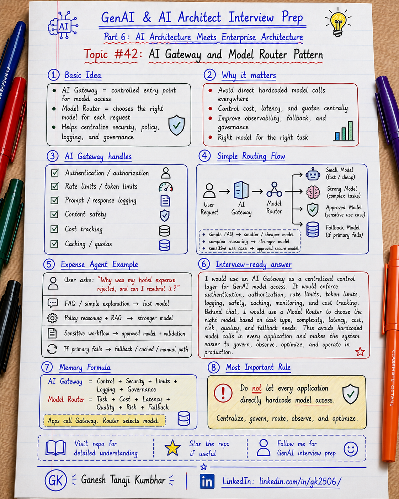

# GenAI & AI Architect Interview Prep

# Topic #42: AI Gateway and Model Router Pattern



---

## Important Note: Continuing Part 6

In the previous topics, we covered:

- How GenAI fits into existing enterprise architecture
- GenAI with microservices architecture
- Event-driven AI architecture
- Data architecture for GenAI systems

Now we move to another important enterprise architecture pattern:

```text
AI Gateway and Model Router
```

Many beginners directly call one model from every application.

That may work for a demo.

But in enterprise systems, model access usually needs centralized control.

Important learning point:

> AI Gateway centralizes model access, security, policy, logging, rate limits, and governance. Model Router decides which model should handle which request based on task, cost, latency, quality, risk, and fallback rules.

---

## Question

In an interview, you may be asked:

> What is an AI Gateway?

Or:

> What is a Model Router pattern?

Or:

> Why should GenAI applications not directly call models everywhere?

Or:

> How would you control model access, cost, latency, and fallback in enterprise GenAI systems?

Or:

> How would you choose the right model for each request?

---

## Why interviewer asks this

The interviewer wants to know whether you can design GenAI systems beyond a simple API call.

A weak answer is:

```text
I will call Azure OpenAI directly from the application.
```

That may be okay for a small demo.

But in enterprise systems, you often need:

- Centralized model access
- Authentication and authorization
- Rate limits
- Token limits
- Cost tracking
- Prompt and response logging
- Model routing
- Fallback
- Observability
- Content filtering
- Auditability
- Tenant-level controls
- Provider abstraction

A strong candidate should explain how an AI Gateway and Model Router help manage these concerns.

---

## Basic answer

Simple answer:

> An AI Gateway is a controlled entry point for GenAI model access. A Model Router decides which model or deployment should handle a request.

Simple view:

```text
Application
   ↓
AI Gateway
   ↓
Model Router
   ↓
Model A / Model B / Model C
```

Simple explanation:

> Instead of every application directly calling different models, the application calls an AI Gateway. The gateway applies policies, logging, rate limits, security, and routing rules. The Model Router then selects the best model based on task requirements.

---

## Architect-level answer

A strong architect-level answer would be:

> I would use an AI Gateway as a centralized control layer for model access across enterprise GenAI applications. It would handle authentication, authorization, rate limits, token limits, content safety, logging, caching, cost tracking, and observability. A Model Router can sit behind or inside the gateway to select the right model based on task type, complexity, latency, cost, risk, availability, and fallback rules. This prevents every application from hardcoding model access and makes the system easier to govern, monitor, optimize, and evolve.

---

## Must mention in interview

When answering this question, try to mention these points:

---

### 1. AI Gateway is not just a normal API Gateway

A normal API Gateway manages application APIs.

An AI Gateway is focused on GenAI-specific concerns.

It may handle:

- Model access control
- Token limits
- Model quotas
- Prompt logging
- Response logging
- Content safety
- Semantic caching
- Cost tracking
- Model fallback
- Provider abstraction
- Tool and agent traffic governance

Important line:

> API Gateway controls APIs. AI Gateway controls GenAI model and tool traffic.

---

### 2. Centralize model access

Without a gateway, each application may directly call models.

Bad pattern:

```text
App 1 → Model A
App 2 → Model B
App 3 → Model C
App 4 → Different provider
```

This becomes hard to manage.

Better pattern:

```text
Apps
 ↓
AI Gateway
 ↓
Approved model deployments
```

Benefits:

- Central policy
- Central logging
- Easier monitoring
- Better cost control
- Consistent security
- Faster model changes

Important line:

> Do not scatter model access across every application without governance.

---

### 3. Model Router chooses the right model

Not every request needs the most powerful model.

Example:

| Request type | Possible model strategy |
|---|---|
| Simple FAQ | Small / cheaper model |
| Complex reasoning | Strong reasoning model |
| Summarization | Fast model |
| Code analysis | Code-capable model |
| Sensitive workflow | Approved enterprise model |
| High-risk action | Model + validation + human approval |

Important line:

> Right model for the right task is better than biggest model for every task.

---

### 4. Routing can be rule-based or dynamic

Model routing can be simple or advanced.

Rule-based routing:

```text
If task = classification → small model
If task = legal summary → approved high-quality model
If request is high risk → safe model + human review
```

Dynamic routing:

```text
Analyze prompt complexity
Estimate cost and latency
Select best model
Fallback if unavailable
Track quality and outcome
```

Important line:

> Start with simple routing rules. Make routing smarter only when needed.

---

### 5. AI Gateway helps with cost control

GenAI cost can grow quickly.

AI Gateway can help by applying:

- Token limits
- Request quotas
- Tenant quotas
- User quotas
- Rate limits
- Model restrictions
- Caching
- Cost dashboards
- Budget alerts

Important line:

> Cost control should be designed into GenAI architecture, not checked only after the bill arrives.

---

### 6. AI Gateway improves observability

Production GenAI systems need strong observability.

Track:

```text
correlationId
userId
tenantId
applicationName
modelName
deploymentName
promptTokens
completionTokens
totalTokens
latency
costEstimate
requestStatus
errorCode
cacheHit
routingDecision
fallbackUsed
safetyResult
```

Important line:

> If you cannot see which model was used, why it was used, and how much it cost, you cannot govern GenAI in production.

---

### 7. Gateway enables fallback

Models can fail.

Providers can be unavailable.

Rate limits can be hit.

Latency can increase.

A gateway/router can support fallback:

```text
Primary model fails
   ↓
Retry if safe
   ↓
Fallback to alternate model
   ↓
Fallback to cached answer
   ↓
Fallback to human/manual workflow
```

Important line:

> Model failure should not automatically become application failure.

---

### 8. Gateway supports governance and security

An AI Gateway can enforce governance policies such as:

- Which app can call which model
- Which tenant can use which deployment
- Which model is approved for sensitive data
- Which prompts must be blocked
- Which responses need filtering
- Which requests require audit logging
- Which tools are allowed

Important line:

> AI Gateway gives architects a place to enforce enterprise GenAI policies consistently.

---

### 9. AI Gateway can support caching

Some requests are repeated or semantically similar.

Examples:

- Policy FAQ
- Product description
- Standard explanation
- Documentation summary
- Common support answer

Caching can reduce:

- Cost
- Latency
- Model load
- Rate-limit pressure

But caching must respect:

- User permission
- Tenant isolation
- Data freshness
- PII handling
- Cache invalidation
- Prompt sensitivity

Important line:

> Cache only when it is safe, fresh, and permission-aware.

---

### 10. Do not bypass application security

AI Gateway is not a replacement for application security.

The application still needs:

- User authentication
- Business authorization
- Input validation
- Output validation
- Tenant isolation
- Audit logging
- Human approval for risky actions

Important line:

> AI Gateway controls model traffic. Application architecture still controls business logic.

---

## Real-world example: Expense Management AI Agent

Let us use the common scenario from this series.

### Business context

We are building an **Expense Management AI Agent**.

A user asks:

```text
Why was my hotel expense rejected, and can I resubmit it?
```

The system may need to:

- Understand the user request
- Retrieve expense details
- Search expense policy
- Call the right model
- Generate explanation
- Check whether action is required
- Control cost and latency
- Log everything for audit

---

## Without AI Gateway

A weak design may look like this:

```text
Expense App
   ↓
Direct call to Model A

Claims App
   ↓
Direct call to Model B

Support App
   ↓
Direct call to Model C
```

Problems:

- Hardcoded model choices
- No central cost visibility
- Different logging styles
- Inconsistent safety controls
- No shared fallback strategy
- Difficult governance
- Hard to change providers/models later

Important line:

> Direct model calls may work in demos, but they become difficult to govern at enterprise scale.

---

## With AI Gateway and Model Router

A better design:

```text
Expense App
Claims App
Support App
Internal Tools
        ↓
AI Gateway
        ↓
Model Router
        ↓
Small Model / Large Model / Reasoning Model / Approved Enterprise Model
        ↓
Logging + Monitoring + Cost Tracking + Governance
```

The application sends the request to the AI Gateway.

The gateway applies:

- Authentication
- Authorization
- Quotas
- Token limits
- Safety checks
- Logging
- Cost tracking

The Model Router chooses:

- Fast model for simple tasks
- Stronger model for reasoning
- Approved model for sensitive data
- Fallback model if primary fails

---

## Example routing rules

```text
If task = simple classification
→ use smaller, cheaper model

If task = policy explanation
→ use standard enterprise model with RAG

If task = complex reasoning
→ use stronger reasoning model

If request contains sensitive data
→ use approved secure deployment only

If primary model fails
→ use fallback model or manual workflow

If user exceeds quota
→ block or degrade gracefully
```

Important line:

> Model routing should be driven by task, risk, cost, latency, and quality.

---

## Example architecture

```text
User
  ↓
Web App / Teams / API
  ↓
Application Layer
  ↓
RAG / Agent Orchestrator
  ↓
AI Gateway
  ↓
Model Router
  ↓
Azure OpenAI / Foundry Models / Approved Model Deployments
  ↓
Response Validation
  ↓
Application Response
  ↓
Application Insights + Audit Logs + Cost Dashboard
```

---

## Microsoft-stack view

For .NET / Azure teams, this can be implemented using familiar services:

```text
ASP.NET Core / Azure Function
        ↓
API Management / AI Gateway Layer
        ↓
Routing Policy / Model Router
        ↓
Azure OpenAI / Foundry Models
        ↓
Azure AI Search / Enterprise APIs
        ↓
Application Insights / Azure Monitor
        ↓
Key Vault / Entra ID / Policy
```

Possible Azure components:

- Azure API Management
- Azure OpenAI
- Azure AI Foundry
- Azure AI Search
- Microsoft Entra ID
- Azure Key Vault
- Azure Monitor
- Application Insights
- Log Analytics
- Azure Managed Redis for caching
- Event Grid / Service Bus for async processing

Important line:

> For Microsoft-stack architecture, AI Gateway and Model Router are natural extensions of existing API, security, and monitoring patterns.

---

## What should be logged?

For production readiness, log:

```text
correlationId
tenantId
userId
applicationName
requestType
riskLevel
selectedModel
routingReason
fallbackUsed
promptTokens
completionTokens
latency
costEstimate
safetyDecision
cacheHit
status
errorCode
timestamp
```

Avoid logging unnecessary raw prompts, raw responses, or sensitive data unless there is a clear governance policy.

Important line:

> Log enough to govern and troubleshoot, but avoid leaking sensitive data through logs.

---

## Common mistake

Many candidates say:

> We will use one powerful model for all requests.

Better answer:

> I would route requests based on task complexity, risk, latency, cost, quality, and fallback needs.

Another common mistake:

> Every application can directly call the model.

Better answer:

> In enterprise systems, model access should usually be centralized through a governed gateway or platform layer.

Another common mistake:

> AI Gateway replaces business APIs.

Better answer:

> AI Gateway controls model traffic. Business APIs still own business logic, validation, and transactions.

Another common mistake:

> Caching is always good.

Better answer:

> Caching is useful only when permission, freshness, privacy, and tenant isolation are handled correctly.

---

## What can go wrong?

### 1. Gateway becomes a bottleneck

If all model traffic goes through one gateway, it must be scalable and highly available.

Fix:

```text
Design for scale, redundancy, monitoring, and fallback.
```

---

### 2. Wrong model routing

A weak model may be selected for a complex or sensitive task.

Fix:

```text
Define routing rules, evaluate quality, and monitor outcomes.
```

---

### 3. Cost hidden from teams

Teams may not know how much their AI features cost.

Fix:

```text
Track cost by app, tenant, user, model, and use case.
```

---

### 4. Unsafe caching

Cached responses may leak data or become stale.

Fix:

```text
Use tenant-aware, permission-aware, freshness-aware caching.
```

---

### 5. No fallback

If one model fails, the whole feature fails.

Fix:

```text
Use fallback model, cached response, degraded mode, or human workflow.
```

---

## Better interview answer

A strong answer can be:

> I would use an AI Gateway as a centralized control layer for GenAI model access. It would enforce authentication, authorization, rate limits, token limits, logging, content safety, caching, monitoring, and cost tracking. Behind that, I would use a Model Router to choose the right model based on task type, complexity, risk, latency, cost, quality, and availability. Simple tasks can use smaller models, complex reasoning can use stronger models, and sensitive workflows can use approved secure deployments. I would also design fallback, observability, tenant-level controls, and audit logging so the system is governable and production-ready.

---

## One-line answer

> AI Gateway centralizes and governs model access, while Model Router selects the right model for each request based on cost, latency, quality, risk, and availability.

---

## Memory formula

Use this formula:

```text
AI Gateway
= Control + Security + Limits + Logging + Governance

Model Router
= Task + Cost + Latency + Quality + Risk + Fallback
```

Another version:

```text
Apps call Gateway.
Gateway applies policy.
Router selects model.
Observability proves what happened.
```

Most important rule:

```text
Do not let every application directly hardcode model access.
Centralize, govern, route, observe, and optimize.
```

---

## Interview closing line

You can close your answer like this:

> I would not let every GenAI application directly hardcode model access. I would use an AI Gateway to centralize policy, security, logging, limits, and governance, and a Model Router to choose the right model for each request. This keeps the architecture flexible, cost-aware, observable, secure, and easier to operate at enterprise scale.

---

## Related upcoming topics

- Containers for AI Applications
- Kubernetes and AKS for AI Workloads
- API Gateway, Security, and Service Boundaries in AI Apps
- Choosing Azure App Service vs Azure Functions vs Container Apps vs AKS for AI Systems
- Resilience Patterns for AI Microservices

---

## Reference Scenario

This topic can be understood using the common **Expense Management AI Agent** scenario used across this series.

You can refer to the scenario here:

```text
00-common-examples/expense-management-ai-agent-scenario.md
```

---

## About the Author

These notes are created and maintained by **Ganesh Tanaji Kumbhar**, an **AI Architect** with experience in **.NET, Azure, cloud architecture, infrastructure, enterprise application modernization, and GenAI solution design**.

I bring practical experience across:

- **.NET / C# / ASP.NET / Web API**
- **Azure App Services, Azure Functions, WebJobs, Azure SQL, Storage, Redis**
- **Cloud architecture and infrastructure modernization**
- **Application architecture and enterprise system design**
- **CI/CD, DevOps, monitoring, and production support**
- **GenAI, RAG, Agentic AI, and AI architecture patterns**

These notes are based on my real experience as both:

- An **interviewee**, facing AI, architecture, cloud, .NET, Azure, and system design rounds
- An **interviewer**, evaluating how candidates explain concepts, tradeoffs, project experience, and real-world design decisions

I write about:

- GenAI Architecture
- RAG System Design
- Agentic AI
- AI Architect Interview Preparation
- .NET and Azure Architecture
- Cloud and Enterprise AI Patterns

If you are preparing for **GenAI / AI Architect / Staff Engineer / Solution Architect / .NET Architect / Azure Architect** interviews, feel free to connect with me on LinkedIn.

🔗 **LinkedIn:** [Connect with me on LinkedIn](https://www.linkedin.com/in/gk2506/)

💬 You can also DM me on LinkedIn if you want to discuss AI architecture, interview preparation, .NET/Azure architecture, or practical GenAI learning.
