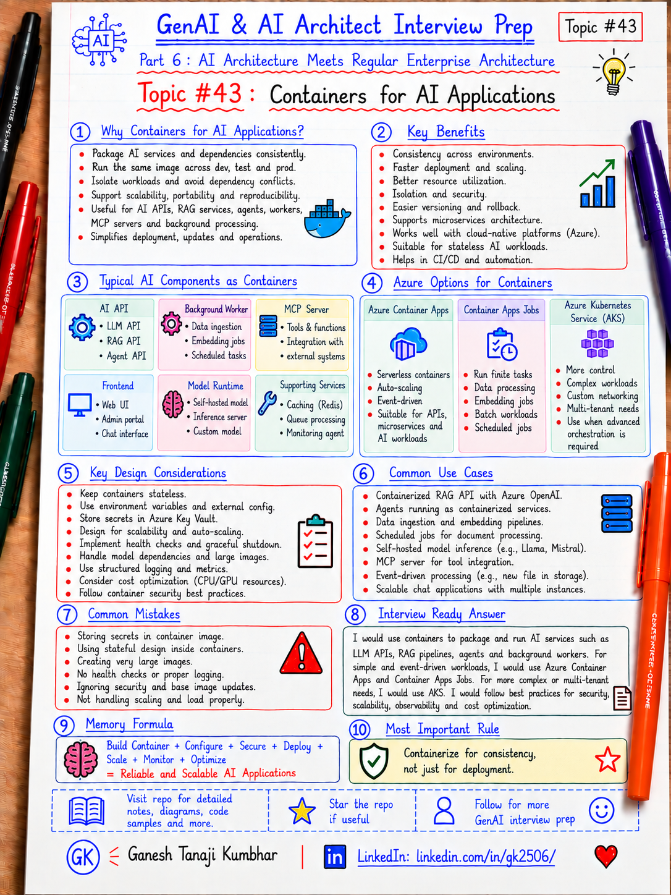

# GenAI & AI Architect Interview Prep

# Topic #43: Containers for AI Applications



---

## Important Note: Continuing Part 6

In the previous topics, we covered:

- How GenAI fits into existing enterprise architecture
- GenAI with microservices architecture
- Event-driven AI architecture
- Data architecture for GenAI systems
- AI Gateway and Model Router pattern

Now we move to another practical enterprise architecture topic:

```text
Containers for AI Applications
```

Containers are not an AI-specific concept.

They are a normal cloud-native packaging and deployment pattern that becomes very useful for AI APIs, workers, MCP servers, background processors, ingestion services, agent runtimes, and other GenAI components.

Important learning point:

> Containers package application code, runtime, libraries, and dependencies into a consistent deployable unit. For AI systems, they help keep APIs, workers, agents, and processing services portable, repeatable, scalable, and easier to operate across environments.

---

## Question

In an interview, you may be asked:

> Why would you use containers for AI applications?

Or:

> Which GenAI components are good candidates for containerization?

Or:

> Should every AI application run in Kubernetes?

Or:

> How would you deploy an AI API, RAG service, agent worker, or MCP server using containers?

Or:

> What are the benefits and tradeoffs of containers for GenAI workloads?

---

## Why interviewer asks this

The interviewer wants to know whether you understand that GenAI systems still need normal deployment and operational architecture.

A weak answer is:

```text
Containers are used because Docker is popular.
```

That is too generic.

A stronger answer explains:

- Why containers help with packaging and repeatability
- Which AI components should be containerized
- How containers fit microservices and event-driven AI
- How to manage configuration and secrets
- How to scale stateless workloads
- How to monitor containerized AI services
- When containers are unnecessary
- When to use Container Apps, App Service, Functions, or AKS

---

## Basic answer

Simple answer:

> Containers package an AI application with its runtime and dependencies so that the same build can run consistently across development, test, and production environments.

Simple view:

```text
Application Code
+ Runtime
+ Libraries
+ Dependencies
+ Configuration Contract
        ↓
Container Image
        ↓
Container Runtime / Cloud Platform
```

For GenAI systems, containerized components may include:

- AI API
- RAG orchestration service
- MCP server
- Agent runtime
- Background worker
- Document ingestion processor
- Embedding worker
- Evaluation service
- Model-adjacent processing service

---

## Architect-level answer

A strong architect-level answer would be:

> I would use containers when an AI component needs repeatable packaging, dependency isolation, independent deployment, portability, or horizontal scaling. I would typically containerize stateless AI APIs, agent services, MCP servers, ingestion workers, and event-driven processors. I would keep secrets and environment-specific settings outside the image, use managed identity where possible, push images to a trusted registry, scan them for vulnerabilities, and deploy them using a platform such as Azure Container Apps or AKS depending on operational complexity. I would not choose Kubernetes automatically; the hosting platform should match the workload, scaling needs, networking requirements, and team maturity.

---

## Must mention in interview

### 1. Container is a packaging unit

A container image packages:

- Application code
- Runtime
- Framework dependencies
- Native libraries
- Startup command
- Required binaries

Example:

```text
ASP.NET Core AI API
+ .NET runtime
+ Semantic Kernel / Agent libraries
+ Azure SDK dependencies
+ Application binaries
= Container Image
```

Important line:

> Containers solve packaging and runtime consistency. They do not automatically solve architecture, security, scaling, or governance.

---

### 2. Containers help reduce environment drift

Without containers:

```text
Works on developer machine
        ↓
Fails in Test
        ↓
Different runtime / package / OS dependency
```

With containers:

```text
Build image once
        ↓
Dev
        ↓
Test
        ↓
Production
```

The same immutable image can move across environments while configuration remains external.

Important line:

> Build once, promote the same image, change configuration—not binaries—between environments.

---

### 3. Good AI candidates for containers

Containers work well for:

```text
AI API
RAG orchestration service
Agent service
MCP server
Document processor
Embedding worker
Queue consumer
Evaluation worker
Batch processor
Model proxy / AI Gateway component
```

These services often need:

- Independent deployment
- Dependency isolation
- Horizontal scaling
- Versioning
- CI/CD
- Observability

---

### 4. Not every AI workload needs a container

Containers add deployment and operational complexity.

A simple application may be better hosted directly using:

- Azure App Service
- Azure Functions
- Managed SaaS AI services
- Existing enterprise application hosting

Important line:

> Use containers when they solve a real packaging, scaling, portability, or operational problem—not because containerization is fashionable.

---

### 5. Container image should be environment-neutral

Bad pattern:

```text
Container image contains:
- Production connection string
- API keys
- Environment URLs
- Tenant secrets
```

Better pattern:

```text
Container image
        +
Environment configuration
        +
Managed identity / Key Vault
        =
Runtime instance
```

Important line:

> Secrets and environment-specific settings should not be baked into container images.

---

### 6. Stateless design improves scalability

AI APIs and workers should preferably be stateless when possible.

Instead of storing state inside the container:

```text
Container local memory / local disk
```

Use external services:

- Azure SQL
- Blob Storage
- Redis
- Cosmos DB
- Azure AI Search
- Durable workflow state
- External conversation store

Why?

Because containers can restart, scale out, or move between hosts.

Important line:

> Treat containers as disposable compute. Keep durable state outside the container.

---

### 7. Containers fit event-driven AI very well

Example:

```text
Document Uploaded
        ↓
Service Bus
        ↓
Containerized AI Worker
        ↓
Extract / Summarize / Classify
        ↓
Store Result
```

Workers can scale based on queue depth or workload demand.

This works especially well for:

- Document processing
- Embedding generation
- Batch summarization
- Classification
- Evaluation jobs
- Background agent workflows

---

### 8. Containers fit microservices architecture

Example:

```text
API Gateway
   ↓
Business API
   ↓
AI Orchestration Service
   ↓
RAG Service
   ↓
MCP Server
   ↓
Background Worker
```

Each component can be:

- Independently deployed
- Independently versioned
- Independently scaled
- Owned by a separate team

Important line:

> Container boundaries should follow service boundaries, not arbitrary technical layers.

---

### 9. Container security is critical

Containerized AI services should include normal enterprise security controls.

Consider:

- Minimal base images
- Vulnerability scanning
- Patch management
- Non-root execution where practical
- Read-only file systems where possible
- Secret management
- Managed identity
- Network restrictions
- Image signing / trusted registries
- Runtime monitoring
- Dependency scanning

Important line:

> A container image is a software supply-chain artifact and must be governed like application code.

---

### 10. Observability must survive container restarts

Do not rely only on local container logs.

Send telemetry to centralized services.

Track:

```text
correlationId
requestId
containerRevision
serviceName
modelName
latency
errorRate
tokenUsage
costEstimate
queueLag
retryCount
healthStatus
```

For Azure environments, typical options include:

- Application Insights
- Azure Monitor
- Log Analytics
- OpenTelemetry

Important line:

> Containers are disposable. Logs and traces must not be.

---

## Real-world example: Expense Management AI Agent

Let us use the common scenario from this series.

### Business context

We are building an **Expense Management AI Agent**.

The solution contains:

- Web/API application
- Agent orchestration service
- RAG service
- Expense MCP server
- Document processing worker
- Approval integration

A possible containerized architecture is:

```text
User
  ↓
ASP.NET Core API Container
  ↓
Agent Service Container
  ↓
RAG / Policy Search Service Container
  ↓
Expense MCP Server Container
  ↓
Enterprise APIs / Azure AI Search / Azure OpenAI

Async path:
Receipt Uploaded
  ↓
Service Bus
  ↓
Document Processing Worker Container
  ↓
Extract / Validate / Store Result
```

---

## Why containerize these components?

Because each has a different responsibility.

Example:

```text
API Service
→ scales with HTTP traffic

Document Worker
→ scales with queue depth

MCP Server
→ scales with tool requests

RAG Service
→ scales with retrieval workload
```

This allows each component to scale independently.

Important line:

> Different AI components often have different scaling signals. Containers help separate those operational boundaries.

---

## Example deployment flow

```text
Developer pushes code
        ↓
CI Pipeline
        ↓
Build container image
        ↓
Run unit / security tests
        ↓
Scan image
        ↓
Push to container registry
        ↓
Deploy same image to environment
        ↓
Inject environment configuration
        ↓
Run health checks
        ↓
Monitor logs, traces, latency, cost
```

---

## Azure hosting options

For Microsoft-stack teams, common choices include:

### Azure Container Apps

Useful for:

- Containerized APIs
- Microservices
- Background processors
- Event-driven services
- Jobs
- Workloads that need autoscaling without managing Kubernetes directly

Microsoft describes Azure Container Apps as a managed/serverless platform for containerized applications and microservices, with scaling based on HTTP traffic, events, CPU/memory, and KEDA-supported triggers. citeturn924876search0turn924876search5

---

### Azure Container Apps Jobs

Useful for finite-duration tasks such as:

- Data processing
- Batch AI jobs
- Scheduled evaluation
- Embedding refresh
- One-time migrations
- Event-triggered processing

Container Apps Jobs can run manually, on a schedule, or in response to events. citeturn924876search2turn924876search3

---

### AKS

Useful when you need more control over:

- Kubernetes networking
- Advanced scheduling
- Sidecars
- Service mesh
- Custom ingress
- Complex multi-service platforms
- Specialized operational requirements

But AKS also requires greater platform maturity and operational responsibility.

Important line:

> Do not choose AKS simply because the workload uses AI. Choose it when Kubernetes capabilities are actually required.

---

## Common mistake

Many candidates say:

> AI applications should run in Kubernetes.

Better answer:

> Kubernetes is one hosting option. The platform should be selected based on scale, networking, operational complexity, portability, team capability, and workload characteristics.

Another common mistake:

> Put the entire AI application into one large container.

Better answer:

> Container boundaries should follow meaningful service and scaling boundaries.

Another common mistake:

> Store secrets in environment files inside the image.

Better answer:

> Keep secrets outside the image and use managed identity or a secure secret store.

Another common mistake:

> Containers are automatically scalable.

Better answer:

> The hosting platform provides scaling. You still need appropriate scale rules, stateless design, quotas, resilience, and observability.

---

## What can go wrong?

### 1. Huge container images

Large images slow down deployment and scale-out.

Fix:

```text
Use minimal base images and multi-stage builds.
```

---

### 2. State stored locally

A container restart causes state loss.

Fix:

```text
Store durable state externally.
```

---

### 3. Secrets baked into the image

Secrets may leak through registries or image layers.

Fix:

```text
Use Key Vault, managed identity, and runtime configuration.
```

---

### 4. No resource limits

AI services may consume excessive CPU or memory.

Fix:

```text
Define resource requests/limits and monitor usage.
```

---

### 5. Scaling without downstream protection

Container count increases but model quota or database capacity does not.

Fix:

```text
Scale with downstream limits, rate limits, backpressure, and queue controls in mind.
```

Important line:

> Scaling containers does not automatically scale Azure OpenAI quotas, databases, or external APIs.

---

## Better interview answer

A strong answer can be:

> I would use containers for AI components that need repeatable packaging, dependency isolation, independent deployment, and horizontal scaling. Typical candidates include AI APIs, agent services, MCP servers, RAG orchestration services, ingestion workers, and event-driven processors. I would keep the containers stateless where possible, externalize configuration and secrets, use managed identity, scan images for vulnerabilities, centralize logs and traces, and deploy through CI/CD. For Azure, I might use Container Apps for managed container hosting and event-driven scaling, while choosing AKS only when I need deeper Kubernetes control. The key is to use containers as a deployment boundary, not as a substitute for good architecture.

---

## One-line answer

> Containers give AI services consistent packaging, isolation, portability, and scalable deployment, while the hosting platform provides the runtime, networking, security, and scaling capabilities around them.

---

## Memory formula

Use this formula:

```text
Code
+ Runtime
+ Dependencies
= Container Image

Container
+ External Config
+ External State
+ Security
+ Observability
+ Scaling
= Production-ready AI Service
```

Another version:

```text
Package consistently.
Keep state external.
Keep secrets external.
Scale independently.
Observe centrally.
```

Most important rule:

```text
Containerize for consistency and operational boundaries.
Do not containerize just because AI is involved.
```

---

## Interview closing line

You can close your answer like this:

> I would treat containers as a standard cloud-native deployment option for AI services, not as an AI-specific requirement. I would use them where independent deployment, consistent runtime dependencies, scaling, portability, or worker isolation are valuable. I would keep state and secrets external, automate image build and scanning, centralize observability, and select Container Apps or AKS based on actual operational requirements rather than automatically choosing Kubernetes.

---

## Related upcoming topics

- Kubernetes and AKS for AI Workloads
- API Gateway, Security, and Service Boundaries in AI Apps
- Choosing Azure App Service vs Azure Functions vs Container Apps vs AKS for AI Systems
- Resilience Patterns for AI Microservices

---

## Reference Scenario

This topic can be understood using the common **Expense Management AI Agent** scenario used across this series.

You can refer to the scenario here:

```text
00-common-examples/expense-management-ai-agent-scenario.md
```

---

## About the Author

These notes are created and maintained by **Ganesh Tanaji Kumbhar**, an **AI Architect** with experience in **.NET, Azure, cloud architecture, infrastructure, enterprise application modernization, and GenAI solution design**.

I bring practical experience across:

- **.NET / C# / ASP.NET / Web API**
- **Azure App Services, Azure Functions, WebJobs, Azure SQL, Storage, Redis**
- **Cloud architecture and infrastructure modernization**
- **Application architecture and enterprise system design**
- **CI/CD, DevOps, monitoring, and production support**
- **GenAI, RAG, Agentic AI, and AI architecture patterns**

These notes are based on my real experience as both:

- An **interviewee**, facing AI, architecture, cloud, .NET, Azure, and system design rounds
- An **interviewer**, evaluating how candidates explain concepts, tradeoffs, project experience, and real-world design decisions

I write about:

- GenAI Architecture
- RAG System Design
- Agentic AI
- AI Architect Interview Preparation
- .NET and Azure Architecture
- Cloud and Enterprise AI Patterns

If you are preparing for **GenAI / AI Architect / Staff Engineer / Solution Architect / .NET Architect / Azure Architect** interviews, feel free to connect with me on LinkedIn.

🔗 **LinkedIn:** [Connect with me on LinkedIn](https://www.linkedin.com/in/gk2506/)

💬 You can also DM me on LinkedIn if you want to discuss AI architecture, interview preparation, .NET/Azure architecture, or practical GenAI learning.
