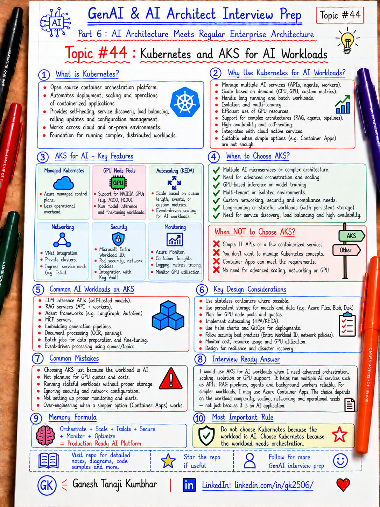

# GenAI & AI Architect Interview Prep

# Topic #44: Kubernetes and AKS for AI Workloads



---

## Important Note: Continuing Part 6

In the previous topics, we covered:

- How GenAI fits into existing enterprise architecture
- GenAI with microservices architecture
- Event-driven AI architecture
- Data architecture for GenAI systems
- AI Gateway and Model Router pattern
- Containers for AI applications

Now we move from **containers** to **container orchestration**:

```text
Kubernetes and AKS for AI Workloads
```

Containers package an application.

Kubernetes helps operate many containerized workloads at scale.

For Microsoft-stack teams, **Azure Kubernetes Service (AKS)** provides managed Kubernetes on Azure.

Important learning point:

> Kubernetes is useful when AI workloads need advanced orchestration, scaling, isolation, networking, scheduling, availability, or GPU management. It should not be the default choice for every AI application.

---

## Question

In an interview, you may be asked:

> Why would you use Kubernetes or AKS for AI workloads?

Or:

> When should an AI application run on AKS instead of Azure Container Apps or App Service?

Or:

> How would you deploy and scale AI APIs, RAG services, agents, workers, or self-hosted models on AKS?

Or:

> How would you handle GPU workloads in Kubernetes?

Or:

> What are the major production concerns when running GenAI workloads on AKS?

---

## Why interviewer asks this

The interviewer wants to know whether you can connect AI architecture with normal cloud-native platform architecture.

A weak answer is:

```text
AI applications should use Kubernetes because Kubernetes scales.
```

That is incomplete.

A stronger answer explains:

- When Kubernetes is actually needed
- Difference between containers and orchestration
- Pod and node scaling
- CPU vs GPU workloads
- Event-driven scaling
- Workload identity
- Secrets and configuration
- Networking and ingress
- Observability
- High availability
- Cost control
- Why simpler platforms may be better for simpler workloads

---

## Basic answer

Simple answer:

> Kubernetes orchestrates containerized applications. AKS is Azure's managed Kubernetes service and can run AI APIs, RAG services, agents, workers, MCP servers, and model inference workloads that need advanced scaling, scheduling, networking, availability, or platform control.

Simple view:

```text
Container Images
      ↓
Kubernetes / AKS
      ↓
Pods + Services + Deployments + Jobs
      ↓
Autoscaling + Networking + Identity + Monitoring
      ↓
AI APIs / RAG / Agents / Workers / Model Serving
```

---

## Architect-level answer

A strong architect-level answer would be:

> I would use AKS when the AI platform has enough operational complexity to justify Kubernetes—for example many independently deployed services, custom networking, event-driven workers, GPU workloads, self-hosted inference, advanced scaling, strict isolation, or high availability requirements. I would separate CPU and GPU workloads using appropriate node pools, use Horizontal Pod Autoscaler or KEDA for workload scaling, use Microsoft Entra Workload ID for Azure resource access, externalize secrets and configuration, and implement end-to-end observability. I would not choose AKS automatically; for simpler AI APIs or jobs, Azure Container Apps, App Service, or Functions may be operationally simpler.

---

## Must mention in interview

### 1. Containers and Kubernetes solve different problems

Container:

```text
Packages application + runtime + dependencies
```

Kubernetes:

```text
Runs and coordinates many containers
```

Kubernetes helps with:

- Scheduling
- Service discovery
- Scaling
- Health management
- Rolling deployment
- Resource allocation
- Workload isolation
- Configuration
- Networking

Important line:

> Docker packages the workload. Kubernetes orchestrates the workload.

---

### 2. AKS is managed Kubernetes on Azure

For Azure environments, AKS can integrate with services such as:

- Azure Container Registry
- Microsoft Entra ID
- Azure Key Vault
- Azure Monitor
- Application Insights
- Azure Managed Prometheus
- Azure OpenAI
- Azure AI Search
- Azure Storage
- Service Bus / Event Hubs

Important line:

> AKS provides Kubernetes orchestration while Azure services provide identity, monitoring, storage, networking, AI services, and governance around it.

---

### 3. Good AI workloads for AKS

AKS can be useful for:

```text
AI APIs
RAG orchestration services
Agent runtimes
MCP servers
Background workers
Event consumers
Embedding pipelines
Document-processing services
Evaluation workers
AI Gateway components
Self-hosted inference servers
GPU-based model serving
```

AKS becomes more attractive when these workloads need:

- Independent scaling
- Multiple services
- Custom networking
- Advanced scheduling
- GPU resources
- Platform-level controls
- High availability

---

### 4. Not every AI workload needs Kubernetes

A common mistake is:

```text
AI workload → Docker → Kubernetes
```

That is not always necessary.

Simpler workloads may fit better on:

- Azure App Service
- Azure Functions
- Azure Container Apps
- Container Apps Jobs
- Managed AI services

Important line:

> Use AKS when Kubernetes solves a real orchestration problem—not because Kubernetes is popular.

---

### 5. Separate CPU and GPU workloads

Many AI applications call managed model APIs such as Azure OpenAI.

Those application services may need only CPU nodes.

Example:

```text
RAG API
Agent API
MCP Server
Background Worker
        ↓
CPU Node Pool
```

Self-hosted inference or some ML workloads may require GPU nodes:

```text
Model Inference Server
        ↓
GPU Node Pool
```

Kubernetes scheduling controls such as node selectors, affinity, taints, and tolerations can keep workloads on the correct node types.

Important line:

> Do not pay for GPU infrastructure when the workload only needs to call an external model API.

---

### 6. Scale applications and infrastructure separately

There are two scaling layers:

```text
Application scaling
        ↓
More / fewer Pods
```

and:

```text
Infrastructure scaling
        ↓
More / fewer Nodes
```

For AI systems, scaling signals might include:

- CPU
- Memory
- Request rate
- Queue length
- Event backlog
- Token-processing workload
- Custom metrics
- GPU utilization

Important line:

> Pod scaling and node scaling are related, but they solve different capacity problems.

---

### 7. KEDA is useful for event-driven AI workloads

AI workloads are often asynchronous.

Examples:

```text
Document uploaded
→ queue message
→ AI worker
→ extraction / summarization
```

KEDA can scale workloads based on external event sources such as queues or event streams and can support scale-to-zero patterns where appropriate.

Example:

```text
Azure Service Bus Queue
        ↓
KEDA
        ↓
0 → N AI Worker Pods
```

Important line:

> Event-driven AI workers should scale based on workload demand, not only CPU usage.

---

### 8. Use workload identity instead of embedded credentials

Bad pattern:

```text
Pod
  ↓
Connection string / client secret inside config
```

Better pattern:

```text
Pod
  ↓
Kubernetes Service Account
  ↓
Microsoft Entra Workload ID
  ↓
Key Vault / Storage / Service Bus / Other Azure Services
```

Important line:

> Kubernetes workloads should use managed identity patterns where possible instead of storing long-lived Azure credentials inside containers.

---

### 9. Build for failure

Kubernetes can restart unhealthy workloads, but the application must still be designed for distributed-system failures.

AI services need:

- Health probes
- Readiness probes
- Timeouts
- Retries
- Circuit breakers
- Idempotency
- Graceful shutdown
- Dead-letter handling
- Fallback

Important line:

> Kubernetes can restart a Pod. It cannot fix bad application resilience design.

---

### 10. Observability is essential

For AI workloads on AKS, monitor both platform and AI behavior.

Platform signals:

```text
Pod status
CPU / memory
Node capacity
Restarts
Network errors
Scaling events
Request latency
```

AI signals:

```text
Model latency
Token usage
Tool calls
Retrieval latency
Failure rate
Cost estimate
Fallback usage
Evaluation metrics
```

Important line:

> Monitor both Kubernetes health and AI application quality.

---

## Sample enterprise architecture

```text
Users / Applications
        ↓
Ingress / API Gateway
        ↓
AKS Cluster
   ├── AI API Pods
   ├── RAG Service Pods
   ├── Agent Pods
   ├── MCP Server Pods
   ├── Event Worker Pods
   └── Optional Model Inference Pods
        ↓
Azure Services
   ├── Azure OpenAI
   ├── Azure AI Search
   ├── Service Bus / Event Hubs
   ├── Azure SQL / Storage
   └── Key Vault
        ↓
Observability
   ├── Azure Monitor
   ├── Application Insights
   ├── Managed Prometheus
   └── Audit Logs
```

Cross-cutting controls:

```text
Entra ID
Workload Identity
RBAC
Network Policies
Secrets Management
CI/CD
Governance
Cost Monitoring
```

---

## Real-world example: Expense Management AI Platform

Suppose an enterprise has several AI capabilities:

```text
Expense Chat API
Policy RAG Service
Receipt Processing Worker
Approval Agent
MCP Server
Evaluation Worker
```

Possible AKS architecture:

```text
Users
  ↓
API Gateway / Ingress
  ↓
AKS
  ├── Expense AI API
  ├── Policy RAG Service
  ├── Approval Agent
  ├── MCP Server
  └── Receipt Worker
          ↓
       Service Bus
          ↓
   Event-driven processing
```

External services:

```text
Azure OpenAI
Azure AI Search
Expense API
Policy API
Document Storage
Application Insights
```

The chat API may scale based on HTTP traffic.

The receipt worker may scale based on queue depth.

If a self-hosted model is introduced later, it may run on a dedicated GPU node pool.

Important line:

> Different AI workloads should scale and operate independently even when they share the same platform.

---

## AKS Automatic vs AKS Standard

At a high level:

### AKS Automatic

Useful when you want:

- More production-ready defaults
- Less cluster-management overhead
- Preconfigured platform capabilities
- Faster setup

### AKS Standard

Useful when you need deeper control over:

- Networking
- Node pool topology
- Identity configuration
- Upgrade behavior
- Add-ons
- Platform customization

Important line:

> Choose the AKS operating model based on how much platform control your organization actually needs.

---

## When AKS is a good fit

Consider AKS when you have several of these requirements:

- Many containerized AI services
- Complex microservices architecture
- GPU workloads
- Self-hosted models
- Custom networking
- Advanced autoscaling
- Multiple node types
- Strong isolation requirements
- Event-driven workers
- High availability requirements
- Existing Kubernetes platform team
- Need for detailed workload scheduling control

---

## When AKS may be unnecessary

AKS may be overkill when:

- You have one simple AI API
- You only call Azure OpenAI
- Traffic is modest
- Networking is straightforward
- No GPU workload exists
- You do not need Kubernetes-specific scheduling
- The team has little Kubernetes operational experience

In those cases, consider:

```text
App Service
Azure Functions
Azure Container Apps
Container Apps Jobs
```

Important line:

> Choose the simplest platform that meets the workload requirements.

---

## Security considerations

For production AI workloads on AKS, consider:

- Microsoft Entra integration
- Workload Identity
- Kubernetes RBAC
- Network policies
- Private networking where required
- Key Vault
- Container image scanning
- Trusted registries
- Pod security controls
- Least privilege
- Tenant isolation
- Secrets management
- Audit logging

Important line:

> Kubernetes provides powerful controls, but secure defaults and platform governance still need intentional design.

---

## Cost considerations

AKS can provide strong control, but it can also introduce cost if resources are poorly managed.

Watch for:

- Idle nodes
- Idle GPU nodes
- Oversized requests and limits
- Too many node pools
- Minimum replica settings
- Overprovisioned clusters
- Unused environments

Use:

- Autoscaling
- Right-sized node pools
- Scale-to-zero where appropriate
- Separate CPU and GPU pools
- Cost allocation by namespace/team/workload
- Usage dashboards

Important line:

> Kubernetes gives you control over infrastructure cost, but it also gives you responsibility for managing it.

---

## Common mistakes

### Mistake 1: Choosing AKS for every AI application

Better:

> Choose AKS only when orchestration complexity justifies it.

---

### Mistake 2: Running everything on GPU nodes

Better:

> Keep normal APIs and orchestration services on CPU nodes and reserve GPU nodes for workloads that actually need GPUs.

---

### Mistake 3: Storing secrets in Kubernetes manifests

Better:

> Use Workload Identity and Key Vault-based secret management.

---

### Mistake 4: Scaling only on CPU

Better:

> Use the signal that represents actual workload demand—HTTP traffic, queue backlog, events, or workload-specific metrics.

---

### Mistake 5: Ignoring platform observability

Better:

> Monitor Pods, nodes, scaling, network, application traces, AI latency, token use, errors, and cost together.

---

## Better interview answer

A strong answer can be:

> I would use Kubernetes or AKS when an AI platform requires advanced orchestration rather than simply because the application is AI-based. Good candidates include multi-service RAG platforms, agent systems, MCP servers, event-driven workers, GPU inference, or self-hosted models. I would separate CPU and GPU workloads into appropriate node pools, use pod and node autoscaling, KEDA for event-driven workers, Microsoft Entra Workload ID for Azure access, and strong monitoring across both Kubernetes and AI metrics. For simpler workloads, I would prefer a lower-operations platform such as Azure Container Apps, App Service, or Functions. The hosting choice should follow workload complexity, not technology popularity.

---

## One-line answer

> AKS is useful for AI workloads that need advanced container orchestration, scaling, scheduling, isolation, networking, GPU support, or platform control—but it should not be the default hosting choice for every AI application.

---

## Memory formula

Use this formula:

```text
Containers
+ Kubernetes Orchestration
+ Autoscaling
+ Identity
+ Security
+ Observability
+ Cost Control
= Production-ready AKS AI Platform
```

Another version:

```text
Container packages.
Kubernetes orchestrates.
AKS manages Kubernetes on Azure.
Architecture decides whether you actually need it.
```

Most important rule:

```text
Do not choose Kubernetes because the workload is AI.
Choose Kubernetes because the workload needs orchestration.
```

---

## Interview closing line

You can close your answer like this:

> I would treat AKS as an orchestration platform, not as a mandatory AI technology. If the solution has complex containerized services, advanced scaling, GPU requirements, custom networking, or platform-level isolation needs, AKS can be a strong fit. If those requirements do not exist, I would choose a simpler Azure hosting option and reduce operational complexity.

---

## Related upcoming topics

- API Gateway, Security, and Service Boundaries in AI Apps
- Choosing Azure App Service vs Azure Functions vs Container Apps vs AKS for AI Systems
- Resilience Patterns for AI Microservices
- What is MLOps and Why AI Architects Should Know It?

---

## Reference Scenario

This topic can be understood using the common **Expense Management AI Agent** scenario used across this series.

You can refer to the scenario here:

```text
00-common-examples/expense-management-ai-agent-scenario.md
```

---

## About the Author

These notes are created and maintained by **Ganesh Tanaji Kumbhar**, an **AI Architect** with experience in **.NET, Azure, cloud architecture, infrastructure, enterprise application modernization, and GenAI solution design**.

I bring practical experience across:

- **.NET / C# / ASP.NET / Web API**
- **Azure App Services, Azure Functions, WebJobs, Azure SQL, Storage, Redis**
- **Cloud architecture and infrastructure modernization**
- **Application architecture and enterprise system design**
- **CI/CD, DevOps, monitoring, and production support**
- **GenAI, RAG, Agentic AI, and AI architecture patterns**

These notes are based on my real experience as both:

- An **interviewee**, facing AI, architecture, cloud, .NET, Azure, and system design rounds
- An **interviewer**, evaluating how candidates explain concepts, tradeoffs, project experience, and real-world design decisions

I write about:

- GenAI Architecture
- RAG System Design
- Agentic AI
- AI Architect Interview Preparation
- .NET and Azure Architecture
- Cloud and Enterprise AI Patterns

If you are preparing for **GenAI / AI Architect / Staff Engineer / Solution Architect / .NET Architect / Azure Architect** interviews, feel free to connect with me on LinkedIn.

🔗 **LinkedIn:** [Connect with me on LinkedIn](https://www.linkedin.com/in/gk2506/)

💬 You can also DM me on LinkedIn if you want to discuss AI architecture, interview preparation, .NET/Azure architecture, or practical GenAI learning.
