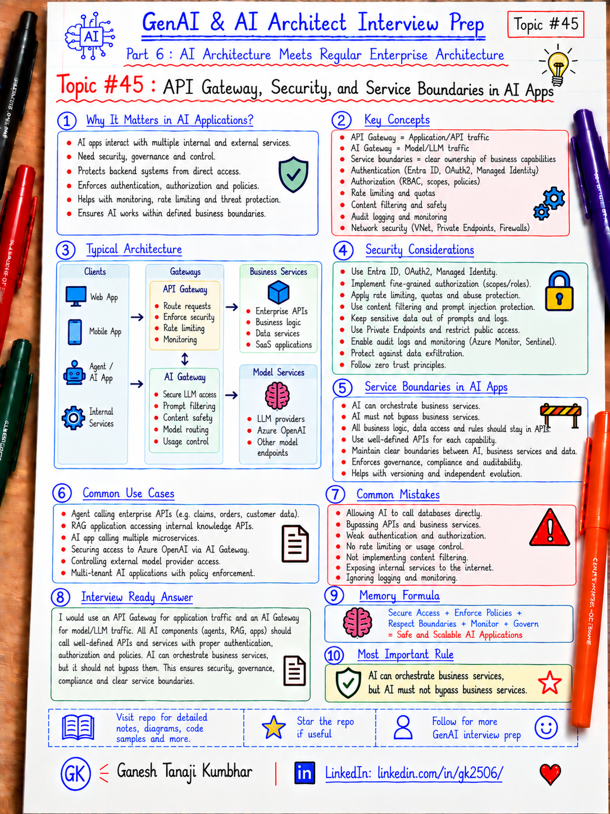

# GenAI & AI Architect Interview Prep

# Topic #45: API Gateway, Security, and Service Boundaries in AI Apps



---

## Important Note: Continuing Part 6

In the previous topics, we covered:

- How GenAI fits into existing enterprise architecture
- GenAI with microservices architecture
- Event-driven AI architecture
- Data architecture for GenAI systems
- AI Gateway and Model Router pattern
- Containers for AI applications
- Kubernetes and AKS for AI workloads

Now we move to another important architecture topic:

```text
API Gateway, Security, and Service Boundaries in AI Apps
```

AI applications still need the same enterprise security boundaries that normal applications need.

The presence of an LLM, RAG pipeline, or AI Agent does **not** remove:

- Authentication
- Authorization
- API boundaries
- Service ownership
- Network boundaries
- Validation
- Audit logging
- Least privilege
- Tenant isolation

Important learning point:

> AI should operate through well-defined service boundaries. The model or agent should not become a shortcut around existing application security and business APIs.

---

## Question

In an interview, you may be asked:

> Where should an AI Agent sit in an enterprise architecture?

Or:

> Should an AI Agent directly access databases and internal services?

Or:

> How would you secure APIs used by an AI Agent?

Or:

> What is the difference between an API Gateway and an AI Gateway?

Or:

> How do you prevent an LLM from bypassing business authorization?

---

## Why interviewer asks this

Many AI demos are built like this:

```text
User
  ↓
LLM
  ↓
Database / Internal API / Tool
```

That can be dangerous in enterprise systems.

A production design needs to answer:

- Who is the user?
- What is the user allowed to do?
- Which backend service owns the operation?
- Which tool can the agent call?
- Which data can the user access?
- How are requests validated?
- Where are secrets stored?
- How are internal APIs protected?
- What gets logged?
- What happens if the model asks for an unauthorized action?

A strong architect should explain that:

> AI adds a new decision-making layer, but it should still respect existing service and security boundaries.

---

## Basic answer

Simple answer:

> I would place the AI orchestration layer behind authenticated application APIs and make it call backend services through controlled interfaces. The model should never be trusted to authorize an action by itself.

Simple view:

```text
User
  ↓
API Gateway
  ↓
Application / AI Orchestrator
  ↓
Approved Tools / Business APIs
  ↓
Domain Services
  ↓
Data
```

For model access:

```text
AI Orchestrator
  ↓
AI Gateway / Model Router
  ↓
Approved Models
```

Important distinction:

```text
API Gateway → governs application/API traffic
AI Gateway  → governs model/LLM traffic
```

---

## Architect-level answer

A strong architect-level answer would be:

> I would keep AI components inside the same security and service boundaries as other enterprise workloads. Users authenticate through the application boundary, APIs are protected through an API Gateway, and the AI orchestration layer receives only the identity and permissions it needs. Tool calls should go through existing business APIs instead of directly accessing databases. Each backend service should re-check authorization for the specific operation. Model access can be centralized through an AI Gateway or Model Router. I would use least privilege, managed identity, private networking where appropriate, secret management, audit logging, tenant isolation, and explicit validation of every tool call.

---

## Must mention in interview

### 1. AI does not replace normal API security

An AI application still needs:

- Authentication
- Authorization
- API rate limits
- Input validation
- Output validation
- Network controls
- Logging
- Monitoring
- Secrets management
- Tenant isolation

Important line:

> AI is another application component, not a trusted security boundary.

---

### 2. Keep clear service boundaries

Each business capability should still have a clear owner.

Example:

```text
Expense Service
Policy Service
Payment Service
Employee Service
Document Service
```

The AI Agent may orchestrate these services.

But it should not absorb their business logic.

Bad pattern:

```text
AI Agent
  ↓
Direct database queries
  ↓
Updates business data directly
```

Better pattern:

```text
AI Agent
  ↓
Approved Tool
  ↓
Business API
  ↓
Business validation
  ↓
Database
```

Important line:

> AI should orchestrate business capabilities, not bypass them.

---

### 3. Authentication and authorization are different

Authentication answers:

```text
Who are you?
```

Authorization answers:

```text
What are you allowed to do?
```

For AI systems, this matters at multiple layers:

```text
User → Application
Application → Agent
Agent → Tool
Tool → Business API
Business API → Data
```

Do not authenticate once and then assume everything downstream is automatically allowed.

Important line:

> Authorization should be enforced where the protected action actually happens.

---

### 4. Never let the model decide authorization

A model may produce:

```text
User should be allowed to approve this expense.
```

That is not authorization.

The backend service must check:

```text
Does this authenticated user actually have approval permission?
```

Important line:

> Model output is a suggestion or decision input, not a security decision.

---

### 5. Tool calls should be explicit and validated

When an AI Agent calls a tool, validate:

- Tool name
- Allowed operation
- User identity
- Tenant
- Parameters
- Resource ownership
- Risk level
- Required approval
- Request limits

Example:

```text
ApproveExpense(expenseId)
```

Before executing:

```text
Is this tool allowed?
Is the user an approver?
Does the expense belong to the same tenant?
Is the amount within the user's approval limit?
Does this action require human confirmation?
```

Important line:

> Treat every tool call like an API request from an untrusted client.

---

### 6. Use least privilege

Do not give the AI application:

```text
Full database access
Global admin permission
Shared master credentials
Access to every API
```

Prefer:

```text
Managed Identity
Scoped roles
Specific API permissions
Specific storage permissions
Per-environment identities
```

Important line:

> Give the AI workload only the permissions required for its specific job.

---

### 7. API Gateway and AI Gateway solve different problems

A normal API Gateway can handle:

- API authentication
- Routing
- Rate limits
- API versions
- Request policies
- Backend protection
- API analytics

An AI Gateway may handle:

- Model access
- Token limits
- Model quotas
- Prompt/response policies
- Cost tracking
- Model routing
- Model fallback
- Semantic caching
- AI-specific observability

Simple view:

```text
User
  ↓
API Gateway
  ↓
AI Application
  ↓
AI Gateway
  ↓
Model
```

Important line:

> API Gateway protects application interfaces. AI Gateway governs model access.

---

### 8. Protect internal services

Internal APIs should not become automatically trusted just because they are inside a VNet or cluster.

Protect them with:

- Service identity
- Managed identity
- Network rules
- Private endpoints
- API authorization
- Service-to-service authentication
- Short-lived credentials

Important line:

> Internal does not mean trusted.

---

### 9. Keep secrets outside code and containers

Do not store:

```text
API keys in source code
Secrets in prompts
Secrets in Docker images
Secrets in appsettings.json committed to Git
```

Prefer:

```text
Azure Key Vault
Managed Identity
Environment-specific configuration
Secret references
Short-lived tokens
```

Important line:

> The safest secret is the secret the application never needs to store.

---

### 10. Separate public, application, AI, and data boundaries

A useful architecture view:

```text
Public Boundary
    ↓
API Gateway / WAF
    ↓
Application Boundary
    ↓
AI Orchestration Boundary
    ↓
Tool / Business API Boundary
    ↓
Data Boundary
```

Each boundary should have:

- Identity
- Authorization
- Validation
- Logging
- Monitoring
- Failure handling

Important line:

> Good AI architecture makes trust boundaries visible.

---

## Real-world example: Expense Management AI Agent

User asks:

```text
Why was my hotel expense rejected, and can I resubmit it?
```

The agent may need to:

- Read expense details
- Read policy
- Explain rejection
- Check resubmission rules
- Possibly trigger a resubmission workflow

Bad design:

```text
User
  ↓
LLM
  ↓
Expense Database
```

Problems:

- Direct DB access
- Weak authorization
- Hard to audit
- Business rules bypassed
- Tenant risk
- Model may construct unsafe queries

Better design:

```text
User
  ↓
API Gateway
  ↓
Expense AI Application
  ↓
Agent / Orchestrator
  ↓
Approved Tools
  ↓
Expense API / Policy API
  ↓
Business Rules + Authorization
  ↓
Database
```

For the LLM:

```text
Agent
  ↓
AI Gateway
  ↓
Approved Model
```

---

## Example: resubmit expense

The model may decide:

```text
The user wants to resubmit EXP-7890.
```

But the model should **not** directly update the expense.

Instead:

```text
Agent
  ↓
ResubmitExpense tool
  ↓
Expense API
  ↓
Validate user
  ↓
Validate expense ownership
  ↓
Validate current status
  ↓
Validate receipt requirement
  ↓
Execute transaction
```

Important line:

> The Agent decides what capability may be needed. The business API decides whether the operation is actually allowed.

---

## Microsoft-stack view

For a .NET / Azure architecture:

```text
User / Web / Teams
        ↓
Azure Front Door / WAF
        ↓
Azure API Management
        ↓
ASP.NET Core / Azure Functions / Container Apps / AKS
        ↓
AI Orchestrator / Agent Layer
        ↓
Approved Business APIs
        ↓
Azure SQL / Storage / Search / Internal Systems
```

For model traffic:

```text
AI Orchestrator
      ↓
AI Gateway / Model Router
      ↓
Azure OpenAI / Approved Models
```

Security services may include:

- Microsoft Entra ID
- Managed Identity
- Azure Key Vault
- Azure API Management
- Private Endpoints
- VNet integration
- Azure Monitor
- Application Insights
- Log Analytics
- Defender / security monitoring

---

## What should be logged?

At minimum, consider:

```text
correlationId
userId
tenantId
applicationName
agentName
toolName
operationName
targetService
resourceId
authorizationResult
approvalRequired
approvalResult
modelName
requestStatus
errorCode
latency
timestamp
```

For sensitive systems, also capture:

- Who initiated the action
- Which agent/tool executed it
- Which backend service authorized it
- What resource was changed
- Whether human approval was involved

Avoid unnecessarily logging:

- Passwords
- Access tokens
- API keys
- Raw secrets
- Sensitive prompt content
- Sensitive model responses

---

## Common mistakes

### Mistake 1: AI Agent directly accesses the database

Why it is risky:

- Bypasses business logic
- Bypasses authorization
- Harder to audit
- Tight coupling
- Larger blast radius

Better:

```text
Agent → Tool → Business API → Data
```

---

### Mistake 2: Authentication only at the UI

Bad assumption:

```text
User logged in, therefore every backend action is allowed.
```

Better:

```text
Re-check authorization at the protected service.
```

---

### Mistake 3: Model decides whether an action is allowed

Bad:

```text
LLM says user is allowed → execute
```

Better:

```text
LLM proposes action → backend authorization checks → execute
```

---

### Mistake 4: One shared credential for every tool

This creates a large blast radius.

Better:

- Scoped identities
- Managed identities
- Least privilege
- Separate permissions by service

---

### Mistake 5: AI Gateway used as replacement for business security

AI Gateway may govern model traffic.

It does not own:

- Expense approval rules
- Payment authorization
- User ownership checks
- Business transactions

Important line:

> Security belongs at every relevant boundary, not only at the gateway.

---

## What can go wrong?

### 1. Prompt injection triggers dangerous tool call

Mitigation:

```text
Tool allowlist
Parameter validation
Authorization
Human approval for risky actions
```

### 2. Agent accesses another tenant's data

Mitigation:

```text
Tenant context
Authorization at API/data layer
Tenant-aware retrieval
Scoped identity
```

### 3. Internal API is exposed too broadly

Mitigation:

```text
Private networking
Service identity
API authentication
Network policies
```

### 4. Credentials leak through logs or prompts

Mitigation:

```text
Managed Identity
Key Vault
Secret redaction
Logging policy
```

### 5. AI service becomes a "god service"

Mitigation:

```text
Keep domain logic in domain services.
Let AI orchestrate instead of owning everything.
```

---

## Better interview answer

A strong answer can be:

> I would keep the AI layer behind normal enterprise security boundaries rather than letting the model directly access databases or internal systems. Users authenticate through the application boundary, APIs are protected by an API Gateway, and the agent only receives approved tools. Every tool call should be treated like an API request and validated for identity, tenant, permission, parameters, and risk. Backend services must enforce their own business authorization. For service-to-service access, I would use managed identities and least privilege, store secrets in Key Vault, use private networking where appropriate, and centralize model access through an AI Gateway. The key principle is that AI can orchestrate business capabilities, but it should not bypass the services that own security and business rules.

---

## One-line answer

> AI should operate through authenticated, authorized, and well-defined service boundaries; the model should never become a shortcut around business APIs or security controls.

---

## Memory formula

Use this formula:

```text
Authenticate
+ Authorize
+ Isolate
+ Validate
+ Audit
= Secure AI Service Boundary
```

For tool execution:

```text
Agent suggests
→ Tool validates
→ API authorizes
→ Service executes
→ Audit records
```

For gateway responsibility:

```text
API Gateway = Application/API traffic
AI Gateway  = Model/LLM traffic
```

Most important rule:

```text
AI can orchestrate business services.
AI must not bypass business services.
```

---

## Interview closing line

You can close your answer like this:

> I treat AI as another enterprise workload with additional risk, not as a trusted shortcut. I keep strong API and service boundaries, enforce authorization at the service that owns the action, use least privilege for tools and identities, and make every important AI-driven action traceable.

---

## Related upcoming topics

- Choosing Azure App Service vs Azure Functions vs Container Apps vs AKS for AI Systems
- Resilience Patterns for AI Microservices
- What is MLOps and Why AI Architects Should Know It?
- ML Lifecycle: Data, Training, Evaluation, Deployment, Monitoring
- CI/CD for ML and GenAI Applications

---

## Reference Scenario

This topic can be understood using the common **Expense Management AI Agent** scenario used across this series.

You can refer to the scenario here:

```text
00-common-examples/expense-management-ai-agent-scenario.md
```

---

## About the Author

These notes are created and maintained by **Ganesh Tanaji Kumbhar**, an **AI Architect** with experience in **.NET, Azure, cloud architecture, infrastructure, enterprise application modernization, and GenAI solution design**.

I bring practical experience across:

- **.NET / C# / ASP.NET / Web API**
- **Azure App Services, Azure Functions, WebJobs, Azure SQL, Storage, Redis**
- **Cloud architecture and infrastructure modernization**
- **Application architecture and enterprise system design**
- **CI/CD, DevOps, monitoring, and production support**
- **GenAI, RAG, Agentic AI, and AI architecture patterns**

These notes are based on my real experience as both:

- An **interviewee**, facing AI, architecture, cloud, .NET, Azure, and system design rounds
- An **interviewer**, evaluating how candidates explain concepts, tradeoffs, project experience, and real-world design decisions

I write about:

- GenAI Architecture
- RAG System Design
- Agentic AI
- AI Architect Interview Preparation
- .NET and Azure Architecture
- Cloud and Enterprise AI Patterns

If you are preparing for **GenAI / AI Architect / Staff Engineer / Solution Architect / .NET Architect / Azure Architect** interviews, feel free to connect with me on LinkedIn.

🔗 **LinkedIn:** [Connect with me on LinkedIn](https://www.linkedin.com/in/gk2506/)

💬 You can also DM me on LinkedIn if you want to discuss AI architecture, interview preparation, .NET/Azure architecture, or practical GenAI learning.
