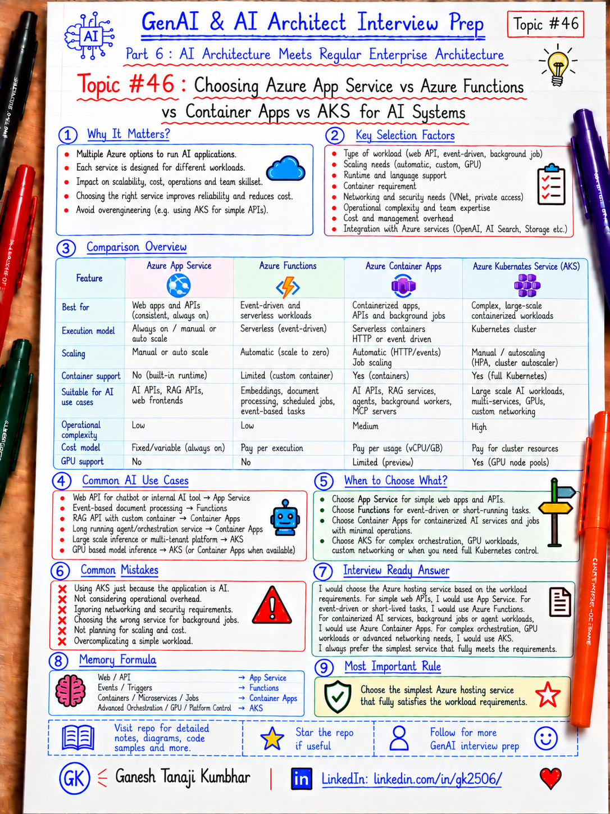

# GenAI & AI Architect Interview Prep

# Topic #46: Choosing Azure App Service vs Azure Functions vs Container Apps vs AKS for AI Systems



---

## Important Note: Continuing Part 6

In the previous topics, we covered:

- How GenAI fits into existing enterprise architecture
- GenAI with microservices architecture
- Event-driven AI architecture
- Data architecture for GenAI systems
- AI Gateway and Model Router pattern
- Containers for AI applications
- Kubernetes and AKS for AI workloads
- API Gateway, security, and service boundaries in AI apps

Now we move to one of the most practical architecture questions for Microsoft-stack engineers:

```text
Where should I host my AI workload in Azure?
```

The common choices are:

- Azure App Service
- Azure Functions
- Azure Container Apps
- Azure Kubernetes Service (AKS)

Important learning point:

> Do not choose a hosting service because it is fashionable or because the application uses AI. Choose it based on workload shape, execution model, scaling needs, operational complexity, networking, runtime control, and team capability.

---

## Question

In an interview, you may be asked:

> How would you choose between App Service, Functions, Container Apps, and AKS for an AI application?

Or:

> Where would you host a RAG API in Azure?

Or:

> When would you use Azure Functions instead of Container Apps?

Or:

> When is AKS justified?

Or:

> Would you use App Service for an AI Agent API?

---

## Why interviewer asks this

The interviewer wants to know whether you can translate workload requirements into a practical hosting decision.

A weak answer is:

```text
AI workload → AKS
```

or:

```text
Serverless → Functions
```

or:

```text
Containerized → AKS
```

Those answers are too simplistic.

A strong architect should evaluate:

- Request/response vs event-driven execution
- Long-running vs short-lived processing
- HTTP APIs vs background jobs
- Container requirement
- Scale-to-zero requirement
- Runtime customization
- GPU requirement
- Networking
- Deployment model
- Cost profile
- Operational complexity
- Team Kubernetes maturity
- High availability
- Multi-service orchestration

Important line:

> The right Azure hosting choice starts with workload characteristics, not product preference.

---

## Basic answer

A simple decision guide:

```text
Simple web/API workload
→ Azure App Service

Event-driven functions / triggers
→ Azure Functions

Containerized APIs, workers, jobs, microservices
→ Azure Container Apps

Advanced orchestration, deep Kubernetes control, complex multi-service or GPU-heavy workloads
→ AKS
```

This is not an absolute rule.

It is a starting point.

---

## Quick Comparison

| Service | Best fit | Main strength | Main tradeoff |
|---|---|---|---|
| Azure App Service | Web apps and REST APIs | Simple managed PaaS | Less flexible for complex container orchestration |
| Azure Functions | Event-driven functions and triggers | Serverless execution model | Not ideal for every long-running or multi-service workload |
| Azure Container Apps | Containerized APIs, jobs, workers, microservices | Serverless containers with autoscaling | Less low-level control than Kubernetes |
| AKS | Complex container platforms and advanced AI/ML workloads | Maximum orchestration control | Highest operational complexity |

---

## 1. Azure App Service

Azure App Service is a fully managed PaaS for:

- Web applications
- REST APIs
- Backend applications
- .NET, Java, Node.js, Python, PHP
- Custom containers

For AI systems, App Service can be a very good fit for:

- ASP.NET Core RAG API
- AI chat backend
- Internal GenAI portal
- Agent API
- Prompt orchestration API
- Admin application
- Existing .NET web application adding GenAI features

Example:

```text
User
  ↓
ASP.NET Core App Service
  ↓
Azure OpenAI
  ↓
Azure AI Search
  ↓
Enterprise APIs / Data
```

### When App Service is a good choice

Choose it when:

- The workload is primarily HTTP
- You have a conventional web/API application
- You want low operational overhead
- Your team already knows App Service
- You want built-in deployment and scaling features
- You do not need complex container orchestration

Important line:

> If your AI application is fundamentally a normal web API with AI capabilities, App Service may still be the simplest and best option.

---

## 2. Azure Functions

Azure Functions is a serverless compute model built around triggers and bindings.

It is especially useful for:

- Event-driven processing
- Queue consumers
- Blob/file processing
- Scheduled jobs
- Webhooks
- Lightweight APIs
- Asynchronous AI workflows

Example:

```text
File uploaded
  ↓
Blob/Event trigger
  ↓
Azure Function
  ↓
Extract text
  ↓
Generate embeddings
  ↓
Store in AI Search
```

Another example:

```text
Service Bus message
  ↓
Azure Function
  ↓
Call model
  ↓
Process result
  ↓
Publish next event
```

### When Functions is a good choice

Choose it when:

- Execution is trigger-based
- Workload is event-driven
- You want serverless scaling
- Work is naturally broken into functions
- You want queue/blob/timer integration
- You do not need a complex always-running application host

For new serverless Function apps, Microsoft currently recommends **Flex Consumption** for many new workloads, while other hosting plans remain available depending on requirements.

Important line:

> Functions is a programming model and execution pattern, not just “cheap hosting.”

---

## 3. Azure Container Apps

Azure Container Apps is a managed serverless container platform.

It is a strong fit when you want:

```text
Containers
+ autoscaling
+ microservices
+ jobs
+ event-driven processing
```

without taking on full Kubernetes operations.

Good AI use cases include:

- RAG API
- Agent service
- MCP server
- Background worker
- Embedding service
- Document processor
- Event-driven AI consumer
- Containerized Functions
- Container Apps Jobs
- Custom runtime or dependency-heavy workload

Example:

```text
Web App
  ↓
Containerized RAG API
  ↓
Azure Container Apps
  ↓
Azure OpenAI + AI Search
```

Background processing:

```text
Queue
  ↓
KEDA scaling
  ↓
Container Apps Worker
  ↓
AI processing
```

### When Container Apps is a good choice

Choose it when:

- You need containers
- You want scale-to-zero
- You need HTTP or event-driven scaling
- You have APIs + workers + jobs
- You want microservices
- You want less operational complexity than AKS
- You need custom container images
- You want KEDA-driven autoscaling

Important line:

> Container Apps is often the middle ground between managed PaaS and full Kubernetes.

---

## 4. Azure Kubernetes Service (AKS)

AKS is Azure's managed Kubernetes platform.

It becomes valuable when you need deeper orchestration and platform control.

Typical AI use cases:

- Many containerized AI services
- Complex multi-service architectures
- Advanced networking
- Multi-tenant isolation
- Custom ingress/service mesh
- GPU-backed workloads
- Self-hosted model inference
- ML/AI platforms
- Custom scheduling
- Advanced deployment strategies
- Platform engineering scenarios

Example:

```text
Ingress
  ↓
AKS
  ├── RAG API
  ├── Agent Service
  ├── MCP Server
  ├── Worker
  ├── Model Runtime
  └── Observability Components
```

### When AKS is a good choice

Choose it when:

- Kubernetes features are genuinely required
- You need advanced orchestration
- You need deeper networking control
- You need custom node pools
- You need GPU workloads
- You need strong workload isolation
- You are operating a platform with many services
- Your team has Kubernetes operational maturity

AKS currently offers both **Automatic** and **Standard** cluster modes. Automatic reduces operational overhead with more preconfigured defaults; Standard provides deeper control.

Important line:

> AKS should solve a real orchestration problem, not create one.

---

## Decision by Workload Type

### Scenario 1: ASP.NET Core AI API

Requirements:

- HTTP API
- Azure OpenAI
- Azure AI Search
- Standard web scaling
- No special runtime

Likely starting choice:

```text
Azure App Service
```

Why?

- Simple
- Familiar
- Managed
- Good fit for conventional web/API workload

---

### Scenario 2: Document ingestion when file arrives

Requirements:

- Trigger when file uploaded
- Extract content
- Generate embeddings
- Push to vector index
- Variable workload

Likely starting choice:

```text
Azure Functions
```

Why?

- Event-driven
- Trigger-based
- Scales with workload

---

### Scenario 3: Containerized RAG + Agent + MCP services

Requirements:

- Multiple containerized services
- Custom libraries
- HTTP + workers
- Event scaling
- Scale to zero
- Minimal Kubernetes management

Likely starting choice:

```text
Azure Container Apps
```

Why?

- Containers
- Microservices
- Jobs
- KEDA-based scaling
- Lower operations than AKS

---

### Scenario 4: Enterprise AI platform with GPUs

Requirements:

- Multiple services
- GPU node pools
- Self-hosted models
- Advanced networking
- Custom scheduling
- Complex scaling
- Platform-level governance

Likely starting choice:

```text
AKS
```

Why?

- Advanced orchestration
- GPU support
- Kubernetes ecosystem
- Deep control

---

## Expense Management AI Agent Example

Suppose we are building an AI-powered Expense Management system.

Possible components:

```text
Employee Portal
Expense API
AI Agent
Policy RAG Service
Document Processor
Embedding Worker
Notification Worker
MCP Server
```

A sensible mixed architecture could be:

```text
Employee Portal / API
→ Azure App Service

Receipt upload event
→ Azure Functions

Agent / RAG / MCP container services
→ Azure Container Apps

Only if advanced platform requirements appear
→ AKS
```

Important point:

> One application does not have to use only one hosting service.

A well-designed enterprise system can use multiple services based on workload characteristics.

---

## Architect Decision Framework

Ask these questions in order.

### 1. Is it primarily a normal web/API application?

If yes:

```text
Start with App Service.
```

### 2. Is it naturally event-driven?

If yes:

```text
Consider Azure Functions.
```

### 3. Do you need a custom container or multiple containerized services?

If yes:

```text
Consider Azure Container Apps.
```

### 4. Do you need Kubernetes-level orchestration or control?

If yes:

```text
Consider AKS.
```

### 5. Do you need GPU or specialized compute?

Then evaluate:

```text
Container Apps specialized compute / GPU options
or
AKS GPU node pools
```

based on orchestration requirements.

### 6. Can the simpler service meet the requirement?

If yes:

```text
Prefer the simpler service.
```

Important line:

> Operational simplicity is an architecture feature.

---

## What About Long-Running AI Requests?

Many AI operations can take time:

- Large document extraction
- Multi-step Agent workflows
- Batch summarization
- OCR
- Embedding generation
- Complex report generation

Do not automatically keep an HTTP request open.

A better pattern may be:

```text
Client
  ↓
API
  ↓
Queue / Event
  ↓
Function / Worker / Container
  ↓
AI processing
  ↓
Store result
  ↓
Notify client
```

Important line:

> Hosting choice and execution pattern are separate decisions.

---

## Security Considerations

Regardless of hosting choice, use:

- Microsoft Entra ID
- Managed Identity
- Azure Key Vault
- Private networking where required
- Least privilege
- API authorization
- Secure configuration
- Audit logging
- Tenant isolation
- Application Insights / Azure Monitor

Do not say:

```text
AKS is more secure.
```

or:

```text
Functions is automatically secure.
```

Security depends on architecture and configuration.

Important line:

> Managed service reduces infrastructure responsibility, but it does not remove security responsibility.

---

## Observability

For any hosting choice, monitor:

```text
request rate
latency
error rate
CPU
memory
instance count
queue depth
scale events
cold starts
model latency
token usage
cost
dependency failures
retries
timeouts
```

For AI workloads also track:

```text
model
deployment
promptTokens
completionTokens
routingDecision
fallbackUsed
retrievalLatency
toolLatency
quality/evaluation signals
```

---

## Cost Considerations

Do not compare services only by list price.

Consider:

- Idle cost
- Scale-to-zero capability
- Minimum replicas/instances
- App Service plan sharing
- Function execution pattern
- Container CPU/memory requirements
- Dedicated workload profiles
- AKS node cost
- GPU cost
- Operational effort
- Engineering support cost

Important line:

> A technically cheaper compute service can become more expensive if it creates unnecessary operational complexity.

---

## Common Mistakes

### Mistake 1: Choosing AKS for every AI application

Bad reasoning:

```text
AI is complex → Kubernetes
```

Better:

```text
Use AKS only when orchestration requirements justify it.
```

### Mistake 2: Using Functions for everything

Functions is excellent for event-driven workloads.

But a large, always-on, stateful, or complex service may fit better elsewhere.

### Mistake 3: Ignoring containers when runtime control is needed

If the workload depends on:

- Native libraries
- Custom system packages
- Specific runtime dependencies
- Portable image packaging

Container Apps or AKS may be a better fit.

### Mistake 4: Assuming App Service is "old architecture"

App Service remains a strong managed platform for web and API workloads.

An AI-enabled ASP.NET Core API is still an API.

### Mistake 5: Selecting hosting before understanding workload shape

Always start with:

```text
Workload
→ Requirements
→ Constraints
→ Hosting decision
```

Not:

```text
Favorite Azure service
→ Force workload into it
```

---

## What Can Go Wrong?

### 1. Over-engineering

Using AKS for two simple APIs adds unnecessary operational burden.

Fix:

```text
Start with the simplest service that meets the requirements.
```

### 2. Under-engineering

Running a complex multi-service AI platform on a hosting model that cannot meet required scaling, isolation, or networking needs.

Fix:

```text
Re-evaluate based on workload growth and platform requirements.
```

### 3. Wrong execution model

Keeping long AI processing inside synchronous HTTP requests.

Fix:

```text
Use async queue/event-driven processing where appropriate.
```

### 4. Ignoring team capability

A technically valid Kubernetes design may fail operationally if nobody can run it safely.

Fix:

```text
Architecture must account for team maturity and support model.
```

---

## Better Interview Answer

A strong answer can be:

> I would not select the Azure hosting service simply because the workload uses AI. I would start by understanding the execution model. For a normal web or REST API, I would first consider Azure App Service. For trigger-based or event-driven work such as file ingestion or queue processing, Azure Functions is a natural option. If I need custom containers, multiple services, workers, jobs, or KEDA-based scaling without managing Kubernetes, I would consider Azure Container Apps. I would use AKS when I genuinely need Kubernetes-level orchestration, advanced networking, custom node pools, deeper platform control, or complex GPU workloads. I would also consider security, scale, latency, cost, observability, and the team's operational maturity before making the final decision.

---

## One-Line Answer

> App Service for conventional web/API workloads, Functions for event-driven execution, Container Apps for serverless containerized services and jobs, and AKS when the workload genuinely needs Kubernetes-level orchestration and control.

---

## Memory Formula

Use this:

```text
Web/API
→ App Service

Events/Triggers
→ Functions

Containers/Microservices/Jobs
→ Container Apps

Advanced Orchestration/GPU/Platform Control
→ AKS
```

And remember:

```text
Workload Shape
+ Scale
+ Runtime
+ Networking
+ Operations
+ Cost
= Hosting Decision
```

Most important rule:

```text
Choose the simplest Azure hosting service
that fully satisfies the workload requirements.
```

---

## Interview Closing Line

You can close your answer like this:

> My default approach is to avoid unnecessary platform complexity. I start with the workload shape, choose the simplest managed service that meets the requirement, and move toward containers or Kubernetes only when runtime, scaling, networking, isolation, or orchestration requirements justify it.

---

## Related Upcoming Topics

- Resilience Patterns for AI Microservices
- What is MLOps and Why AI Architects Should Know It?
- ML Lifecycle: Data, Training, Evaluation, Deployment, Monitoring
- Experiment Tracking and Model Registry
- CI/CD for ML and GenAI Applications

---

## Reference Scenario

This topic can be understood using the common **Expense Management AI Agent** scenario used across this series.

You can refer to the scenario here:

```text
00-common-examples/expense-management-ai-agent-scenario.md
```

---

## About the Author

These notes are created and maintained by **Ganesh Tanaji Kumbhar**, an **AI Architect** with experience in **.NET, Azure, cloud architecture, infrastructure, enterprise application modernization, and GenAI solution design**.

I bring practical experience across:

- **.NET / C# / ASP.NET / Web API**
- **Azure App Services, Azure Functions, WebJobs, Azure SQL, Storage, Redis**
- **Cloud architecture and infrastructure modernization**
- **Application architecture and enterprise system design**
- **CI/CD, DevOps, monitoring, and production support**
- **GenAI, RAG, Agentic AI, and AI architecture patterns**

These notes are based on my real experience as both:

- An **interviewee**, facing AI, architecture, cloud, .NET, Azure, and system design rounds
- An **interviewer**, evaluating how candidates explain concepts, tradeoffs, project experience, and real-world design decisions

I write about:

- GenAI Architecture
- RAG System Design
- Agentic AI
- AI Architect Interview Preparation
- .NET and Azure Architecture
- Cloud and Enterprise AI Patterns

If you are preparing for **GenAI / AI Architect / Staff Engineer / Solution Architect / .NET Architect / Azure Architect** interviews, feel free to connect with me on LinkedIn.

🔗 **LinkedIn:** [Connect with me on LinkedIn](https://www.linkedin.com/in/gk2506/)

💬 You can also DM me on LinkedIn if you want to discuss AI architecture, interview preparation, .NET/Azure architecture, or practical GenAI learning.
