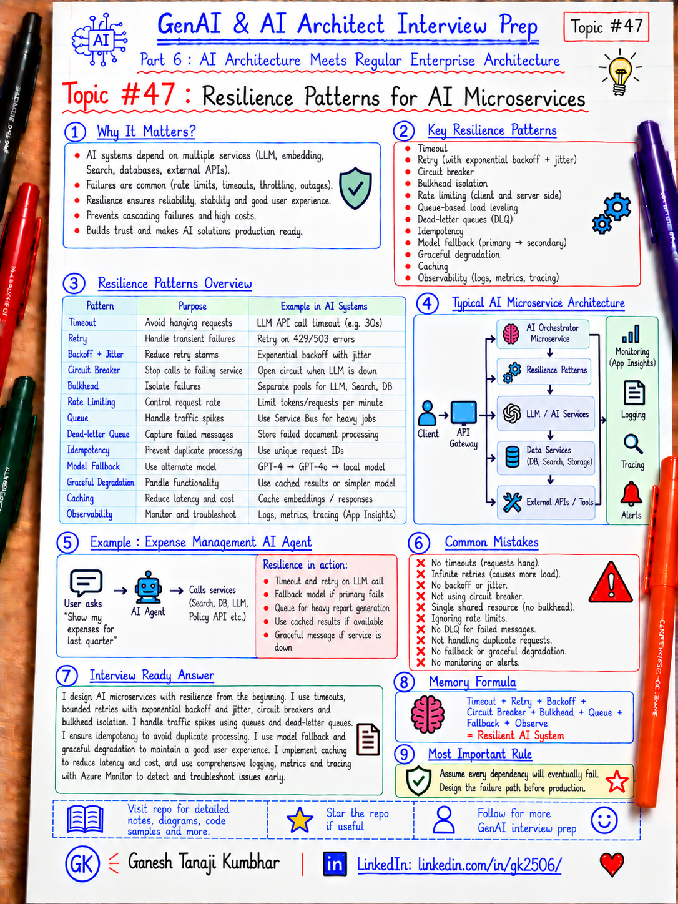

# GenAI & AI Architect Interview Prep

# Topic #47: Resilience Patterns for AI Microservices



---

## Important Note: Completing Part 6

In the previous topics, we covered:

- How GenAI fits into existing enterprise architecture
- GenAI with microservices architecture
- Event-driven AI architecture
- Data architecture for GenAI systems
- AI Gateway and Model Router pattern
- Containers for AI applications
- Kubernetes and AKS for AI workloads
- API Gateway, security, and service boundaries in AI apps
- Choosing Azure App Service vs Azure Functions vs Container Apps vs AKS for AI systems

Now we complete Part 6 with one of the most important production architecture topics:

```text
Resilience Patterns for AI Microservices
```

AI systems usually depend on many moving parts:

- LLM providers
- Model deployments
- Vector databases
- Search services
- Business APIs
- MCP servers
- Agent tools
- Queues
- Databases
- External SaaS APIs

Any dependency can become slow, unavailable, throttled, or partially degraded.

Important learning point:

> A production AI system should assume that models, tools, APIs, search, networks, and downstream services will eventually fail.

---

## Question

In an interview, you may be asked:

> How would you make an AI microservices architecture resilient?

Or:

> What happens if the model provider returns 429 or becomes unavailable?

Or:

> When should you use Retry vs Circuit Breaker?

Or:

> How would you prevent one failed AI dependency from bringing down the whole application?

Or:

> How would you design graceful degradation for an AI Agent?

---

## Why Interviewer Asks This

A demo often assumes:

```text
Call model
→ Get response
→ Done
```

Production systems face:

```text
429 Too Many Requests
Timeout
503 Service Unavailable
Slow model response
Vector search failure
Tool failure
Queue backlog
Database transient fault
Partial Agent workflow failure
External API outage
```

A strong AI Architect should know how to combine:

- Timeouts
- Retries
- Exponential backoff
- Jitter
- Circuit breakers
- Bulkhead isolation
- Rate limiting
- Queue-based load leveling
- Fallback
- Graceful degradation
- Idempotency
- Dead-letter queues
- Health checks
- Caching
- Multi-model fallback
- Observability

Important line:

> Resilience is not one pattern. It is a coordinated failure-handling strategy.

---

## Basic Answer

A simple answer:

> I would use timeouts to stop calls from hanging, bounded retries with exponential backoff for transient failures, circuit breakers for persistent failures, bulkheads to isolate resources, queues to absorb spikes, and fallback or graceful degradation when dependencies are unavailable.

Simple flow:

```text
Request
  ↓
Timeout
  ↓
Retry with Backoff
  ↓
Circuit Breaker
  ↓
Fallback / Queue / Cached Response
  ↓
Observability
```

For AI-specific systems:

```text
Primary Model
  ↓ failure
Alternate Deployment / Model
  ↓ failure
Cached / Reduced Capability Response
  ↓
Human or Async Workflow
```

---

## Architect-Level Answer

A strong architect-level answer would be:

> I would design resilience per dependency rather than applying the same retry policy everywhere. For transient failures such as temporary throttling, timeouts, or selected 5xx responses, I would use bounded retries with exponential backoff and jitter and honor Retry-After where available. Every remote call should have an explicit timeout. For repeated or persistent failures, I would use circuit breakers so the system stops hammering an unhealthy dependency. I would use bulkhead isolation and concurrency limits so one expensive model, tenant, or tool cannot exhaust shared resources. For bursty asynchronous workloads, I would use queues and dead-letter handling. I would also design fallbacks such as alternate model deployments, cached responses, reduced functionality, or human review. Finally, I would make the flow observable using correlation IDs, dependency metrics, retry counts, circuit state, queue depth, fallback usage, and SLOs.

---

## Must Mention in Interview

### 1. Timeouts Come First

Never allow a remote dependency call to wait indefinitely.

Every external call should have a clear timeout.

Examples:

```text
Model API call
Vector search
Business API
MCP tool
Database call
External SaaS API
```

Without timeouts:

```text
Slow dependency
  ↓
Connections remain occupied
  ↓
Requests accumulate
  ↓
Resource exhaustion
  ↓
Cascading failure
```

Important line:

> A timeout defines how long your service is willing to wait for a dependency.

---

### 2. Retry Only Transient Failures

Retry is useful when the failure may disappear shortly.

Examples:

- Temporary network issue
- HTTP 429
- HTTP 408
- Selected HTTP 5xx responses
- Temporary service throttling

Do not blindly retry:

- Authentication failure
- Authorization failure
- Invalid input
- Permanent validation failure
- Unsafe non-idempotent operations

Bad:

```text
Fail
→ Retry immediately
→ Retry immediately
→ Retry immediately
```

Better:

```text
Fail
→ Wait
→ Retry
→ Wait longer
→ Retry
```

Important line:

> Retry only when another attempt has a reasonable chance of succeeding.

---

### 3. Use Exponential Backoff + Jitter

If thousands of requests fail together and all retry at the same time:

```text
Failure
  ↓
All clients retry together
  ↓
Dependency is overloaded again
```

Better:

```text
Retry 1 → small delay
Retry 2 → longer delay
Retry 3 → longer delay
+ random jitter
```

Jitter prevents synchronized retry storms.

Important line:

> Backoff reduces pressure. Jitter prevents coordinated retry spikes.

---

### 4. Retry Must Have a Budget

Imagine:

```text
1,000 requests
×
3 retries
=
3,000 extra dependency calls
```

A struggling dependency may become worse.

Use:

- Maximum retry count
- Maximum total retry duration
- Retry budget
- Concurrency limits
- Cancellation

Important line:

> Unlimited retry is not resilience. It amplifies failure.

---

### 5. Circuit Breaker Protects a Failing Dependency

Retry assumes the dependency may recover quickly.

Circuit Breaker handles cases where repeated calls are likely to fail.

States:

```text
CLOSED
Requests flow normally
        ↓ failures exceed threshold

OPEN
Requests fail fast
        ↓ recovery period

HALF-OPEN
Allow limited test requests
        ↓ success

CLOSED
```

Without a circuit breaker:

```text
Service unhealthy
→ every request calls it
→ timeouts
→ retries
→ more pressure
→ cascading failure
```

With a circuit breaker:

```text
Failure threshold reached
→ stop calls temporarily
→ allow dependency to recover
```

Important line:

> Retry tries again. Circuit Breaker knows when to stop trying.

---

### 6. Use Bulkhead Isolation

A bulkhead prevents one workload from consuming all shared resources.

Example:

```text
Tenant A sends thousands of AI requests.
```

Without isolation:

```text
Tenant A consumes all concurrency / model quota
→ Tenant B and C also fail
```

With bulkheads:

```text
Tenant A → limited quota/concurrency
Tenant B → limited quota/concurrency
Tenant C → limited quota/concurrency
```

Bulkheads can be implemented using:

- Separate model deployments
- Separate worker pools
- Concurrency limits
- Queue partitions
- Container resource limits
- Per-tenant quotas
- Separate service instances

Important line:

> One noisy tenant or workload should not sink the whole system.

---

### 7. Apply Rate Limiting and Throttling

AI calls can be expensive and quota-limited.

Rate limiting can protect:

- Model deployments
- Tool APIs
- Search services
- Expensive workflows
- Tenant budgets
- Shared infrastructure

Possible policies:

```text
Requests per minute
Tokens per minute
Concurrent requests
Per-user quota
Per-tenant quota
Per-application quota
```

Important line:

> Throttling is often better than allowing the whole dependency to collapse.

---

### 8. Queue-Based Load Leveling

Some AI tasks do not need an immediate response.

Examples:

- Document processing
- Embedding generation
- OCR
- Large summarization
- Batch classification
- Report generation

Instead of:

```text
1,000 requests
→ 1,000 simultaneous model calls
```

Use:

```text
Requests
  ↓
Queue
  ↓
Workers process at controlled rate
  ↓
AI service
```

Benefits:

- Absorbs spikes
- Protects downstream services
- Smooths model usage
- Enables retry
- Supports backpressure
- Improves cost control

Important line:

> Queue when arrival rate can exceed processing capacity.

---

### 9. Use Dead-Letter Queues

Messages can continue failing after retries.

Do not retry forever.

Pattern:

```text
Queue
  ↓
Worker
  ↓ failure
Retry
  ↓ failure
Retry
  ↓ failure
Dead-Letter Queue
```

DLQ helps with:

- Investigation
- Manual correction
- Replay
- Poison message analysis

Important line:

> Failed messages need an exit path.

---

### 10. Design Fallbacks

Fallback does not always mean switching models.

Possible fallbacks:

```text
Primary model → Secondary deployment
Strong model → Smaller model
Live retrieval → Cached data
Agent workflow → Simpler response
Real-time processing → Async processing
Automated action → Human review
Full result → Partial result
```

Important line:

> Graceful degradation keeps the useful part of the system available.

---

### 11. Model Fallback Must Be Intentional

Do not assume models are interchangeable.

Check:

- Capability
- Context window
- Tool-calling support
- Structured output support
- Safety requirements
- Cost
- Latency
- Data residency
- Approval status

Important line:

> A fallback model must still satisfy the use case, security, and quality requirements.

---

### 12. Make Commands Idempotent

Retries can accidentally execute a command more than once.

Example:

```text
Agent
→ SubmitExpense()
→ Timeout occurs
```

The caller may not know whether it succeeded.

Retrying may cause:

```text
Duplicate expense
Duplicate payment
Duplicate notification
```

Use:

- Idempotency key
- Operation ID
- Request deduplication
- Database uniqueness
- Message deduplication

Important line:

> If an operation can be retried, design it so a second execution does not create duplicate business effects.

---

### 13. Prefer Async for Long AI Workflows

A multi-step Agent flow may take:

```text
30 seconds
60 seconds
Several minutes
```

Do not keep synchronous HTTP requests open unnecessarily.

Better:

```text
Client
  ↓
Submit request
  ↓
Return operationId
  ↓
Queue / Workflow
  ↓
Agent processing
  ↓
Store result
  ↓
Notify / Poll
```

Important line:

> Long-running AI workflows should usually be treated as jobs, not long HTTP requests.

---

### 14. Cache Carefully

Caching can improve resilience when dependencies are temporarily unavailable.

Example:

```text
Policy service unavailable
→ serve recently cached policy
```

But only if:

- Data is safe to cache
- Tenant boundaries are preserved
- Freshness is acceptable
- Cache invalidation is understood
- Sensitive data is protected

Important line:

> Cache can improve resilience, but stale or cross-tenant data can create correctness and security problems.

---

## Real-World Example: Expense Management AI Agent

Suppose the user asks:

```text
Why was EXP-7890 rejected and can I resubmit it?
```

The architecture may call:

```text
Expense API
Policy Search
Vector Store
LLM
Approval API
Notification Service
```

A resilient flow:

```text
User
  ↓
API Gateway
  ↓
Expense AI Agent
  ↓
Expense API
  ↓
Policy Retrieval
  ↓
AI Gateway
  ↓
Primary Model
  ↓
Response
```

Apply resilience independently around each dependency.

---

### Expense API Failure

```text
Expense API timeout
→ Retry transient failure
→ Circuit opens if failures continue
→ Return temporary unavailable message
```

Do not invent expense details.

---

### Model 429

```text
429
→ Respect Retry-After
→ Exponential backoff + jitter
→ Alternate approved model/deployment if allowed
→ Graceful response if unavailable
```

---

### Policy Search Failure

Possible fallback:

```text
Use approved cached policy
```

If no safe cache exists:

```text
Tell the user policy information is temporarily unavailable.
```

Do not let the LLM fabricate policy.

---

### Resubmit Command Failure

For:

```text
ResubmitExpense(EXP-7890)
```

Use:

- Idempotency key
- Authorization
- Bounded retry
- Audit logging

Do not blindly retry a transaction without knowing whether it completed.

---

## Recommended Architecture

```text
Client
  ↓
API Gateway
  ↓
AI App / Orchestrator
  ↓
Resilience Pipeline
  ├── Timeout
  ├── Retry + Backoff + Jitter
  ├── Circuit Breaker
  ├── Bulkhead / Concurrency Limit
  └── Fallback
  ↓
AI Gateway / Model Router
  ↓
Primary Model / Approved Fallback Model
```

Other dependencies:

```text
Agent
 ├── Business APIs
 ├── AI Search / Vector Store
 ├── MCP Tools
 ├── Cache
 └── Queue / Service Bus
```

Observability should surround the entire flow.

---

## Microsoft-Stack View

For .NET / Azure teams:

```text
ASP.NET Core / Azure Functions / Container Apps / AKS
        ↓
.NET Resilience Pipeline
        ↓
Timeout + Retry + Circuit Breaker + Rate Limiting
        ↓
Azure API Management
        ↓
AI Gateway / Model Router
        ↓
Azure OpenAI / Microsoft Foundry Models
        ↓
Azure AI Search / Business APIs
```

For asynchronous processing:

```text
Azure Service Bus
        ↓
Functions / Container Apps Worker / AKS Worker
        ↓
AI Processing
        ↓
Dead-Letter Queue if retries are exhausted
```

For observability:

```text
Application Insights
Azure Monitor
Log Analytics
Distributed Tracing
```

For caching:

```text
Azure Managed Redis
```

For current .NET applications, resilience policies can be built around the .NET resilience stack and Polly-based strategies.

Important architectural point:

> Avoid stacking independent retry policies in the SDK, HttpClient, application service, gateway, and queue consumer without understanding the total retry effect.

Example:

```text
SDK retries × Service retries × Gateway retries
= Retry amplification
```

---

## What Should Be Logged?

For each dependency call, consider:

```text
correlationId
traceId
userId
tenantId
serviceName
dependencyName
operationName
modelName
deploymentName
attemptNumber
retryCount
timeout
latency
statusCode
errorType
circuitState
fallbackUsed
fallbackTarget
queueDepth
deadLettered
tokenUsage
costEstimate
timestamp
```

Useful AI-specific signals:

```text
429 count
model timeout rate
fallback model usage
tool failure rate
retrieval failure rate
queue backlog
P95 / P99 dependency latency
```

Important line:

> Resilience without observability becomes silent degradation.

---

## Common Mistakes

### Mistake 1: Retry Everything

Bad:

```text
Any error
→ Retry
```

Better:

```text
Classify transient vs permanent failures.
```

---

### Mistake 2: Retry Immediately

Bad:

```text
429
→ Immediate retry
```

Better:

```text
Retry-After
+ Exponential backoff
+ Jitter
```

---

### Mistake 3: Infinite Retry

Bad:

```text
Keep retrying until the service returns.
```

Better:

```text
Bounded retry
→ Fallback / Queue / Fail gracefully
```

---

### Mistake 4: No Timeout

Bad:

```text
Wait indefinitely for model/tool.
```

Better:

```text
Explicit attempt timeout
+ Total workflow timeout
```

---

### Mistake 5: Same Resilience Policy Everywhere

A model API and payment API do not necessarily need the same strategy.

Better:

```text
Define resilience per dependency and operation.
```

---

### Mistake 6: Blind Retry on Commands

Bad:

```text
Payment timeout
→ Retry payment
```

without idempotency.

Better:

```text
Idempotency + operation status check + safe retry
```

---

### Mistake 7: Fallback to Any Model

Bad:

```text
Primary unavailable
→ Use any model
```

Better:

```text
Use only approved fallback models that meet capability,
security, quality, and compliance requirements.
```

---

### Mistake 8: No Bulkhead Isolation

One tenant or workload consumes every model slot.

Better:

```text
Quota + concurrency + isolated capacity
```

---

## What Can Go Wrong?

### 1. Retry Storm

Thousands of clients retry simultaneously.

Fix:

```text
Exponential backoff + jitter + retry budget
```

---

### 2. Cascading Failure

One slow dependency exhausts upstream resources.

Fix:

```text
Timeout + Circuit Breaker + Bulkhead
```

---

### 3. Duplicate Business Action

A retry repeats a command.

Fix:

```text
Idempotency
```

---

### 4. Model Provider Outage

Primary model becomes unavailable.

Fix:

```text
Approved alternate deployment/model
or graceful degradation
```

---

### 5. Queue Backlog Grows

Processing throughput is lower than arrival rate.

Fix:

```text
Autoscale workers
Throttle producers
Prioritize workloads
Monitor queue age and depth
```

---

### 6. Fallback Produces Lower Quality

A smaller model is available but cannot safely perform the task.

Fix:

```text
Degrade functionality instead of returning unsafe output.
```

Important line:

> Availability should not be improved by sacrificing required correctness or safety.

---

## Better Interview Answer

A strong answer can be:

> I would treat every external AI dependency as unreliable and apply resilience based on its failure mode. I would use explicit timeouts, bounded retries with exponential backoff and jitter for transient failures, and honor Retry-After for throttling. If failures become persistent, a circuit breaker should stop requests temporarily so the dependency can recover. I would use bulkheads and concurrency limits to prevent a noisy tenant or expensive model call from exhausting shared resources. For bursty document or embedding workloads, I would use queues with dead-letter handling. For AI-specific failures, I would design approved model or deployment fallback, safe caching, reduced-functionality responses, or human review. Commands would be idempotent so retries cannot create duplicate business effects. Finally, I would monitor retries, circuit state, throttling, fallback usage, queue depth, latency, and SLOs end to end.

---

## One-Line Answer

> Resilient AI microservices combine timeout, bounded retry, backoff, circuit breaker, bulkhead isolation, throttling, queues, idempotency, fallback, graceful degradation, and strong observability.

---

## Memory Formula

Use this formula:

```text
Timeout
+ Retry
+ Backoff
+ Circuit Breaker
+ Bulkhead
+ Queue
+ Fallback
+ Observe
= Resilient AI System
```

Short interview memory:

```text
T R C B Q F O

Timeout
Retry
Circuit Breaker
Bulkhead
Queue
Fallback
Observe
```

For AI-specific resilience:

```text
Primary Model
→ Retry if transient
→ Fallback if approved
→ Degrade safely
→ Human if required
```

Most important rule:

```text
Assume every dependency will eventually fail.
Design the failure path before production.
```

---

## Interview Closing Line

You can close your answer like this:

> In AI systems, resilience is especially important because a single request can depend on models, retrieval, tools, APIs, and external services. I design the happy path and failure path together, keep retries bounded, isolate failures, provide safe fallbacks, and make every resilience decision observable.

---

## Related Upcoming Topics

Part 6 is now complete.

Next we move to:

## Part 7: MLOps, LLMOps, and Production AI Tooling

Upcoming topics:

- What is MLOps and Why AI Architects Should Know It?
- ML Lifecycle: Data, Training, Evaluation, Deployment, Monitoring
- Experiment Tracking and Model Registry
- Data Versioning, Feature Store, and Dataset Governance
- CI/CD for ML and GenAI Applications
- Model Deployment Patterns
- Model Monitoring, Drift, Feedback, and Retraining
- LLMOps for Prompts, RAG, Agents, and Evaluation
- AI Evaluation and Quality Gates
- Actual MLOps and LLMOps Tools Used in Practice
- MLOps vs LLMOps vs DevOps
- Responsible AI, Governance, and Release Controls

---

## Reference Scenario

This topic can be understood using the common **Expense Management AI Agent** scenario used across this series.

You can refer to the scenario here:

```text
00-common-examples/expense-management-ai-agent-scenario.md
```

---

## About the Author

These notes are created and maintained by **Ganesh Tanaji Kumbhar**, an **AI Architect** with experience in **.NET, Azure, cloud architecture, infrastructure, enterprise application modernization, and GenAI solution design**.

I bring practical experience across:

- **.NET / C# / ASP.NET / Web API**
- **Azure App Services, Azure Functions, WebJobs, Azure SQL, Storage, Redis**
- **Cloud architecture and infrastructure modernization**
- **Application architecture and enterprise system design**
- **CI/CD, DevOps, monitoring, and production support**
- **GenAI, RAG, Agentic AI, and AI architecture patterns**

These notes are based on my real experience as both:

- An **interviewee**, facing AI, architecture, cloud, .NET, Azure, and system design rounds
- An **interviewer**, evaluating how candidates explain concepts, tradeoffs, project experience, and real-world design decisions

I write about:

- GenAI Architecture
- RAG System Design
- Agentic AI
- AI Architect Interview Preparation
- .NET and Azure Architecture
- Cloud and Enterprise AI Patterns

If you are preparing for **GenAI / AI Architect / Staff Engineer / Solution Architect / .NET Architect / Azure Architect** interviews, feel free to connect with me on LinkedIn.

🔗 **LinkedIn:** [Connect with me on LinkedIn](https://www.linkedin.com/in/gk2506/)

💬 You can also DM me on LinkedIn if you want to discuss AI architecture, interview preparation, .NET/Azure architecture, or practical GenAI learning.
