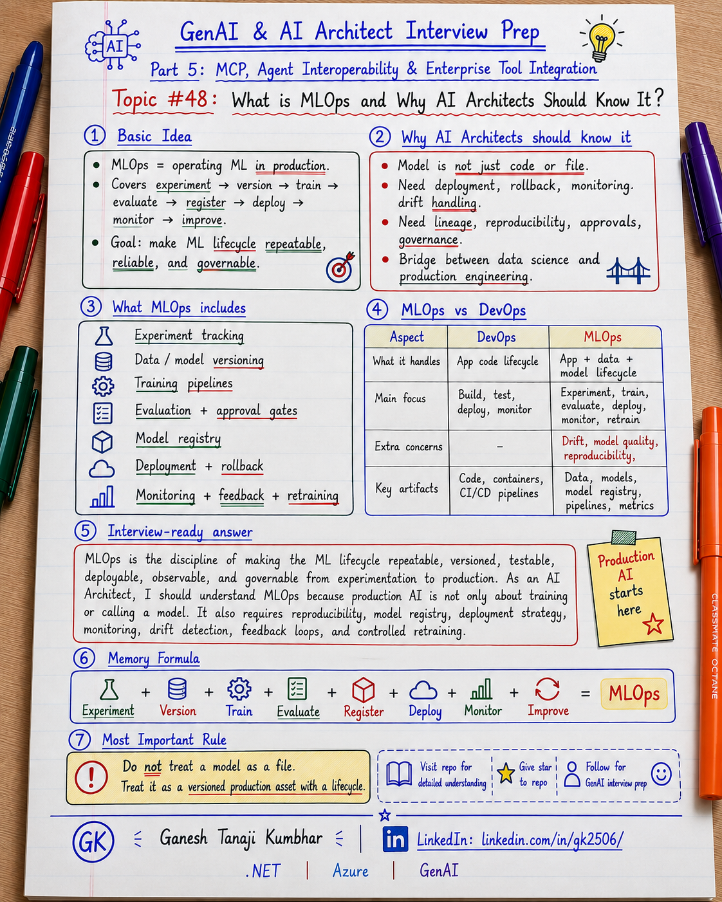

# GenAI & AI Architect Interview Prep

# Topic #48: What is MLOps and Why AI Architects Should Know It?



---

## Important Note: Starting Part 7

We have completed **Part 6: AI Architecture Meets Regular Enterprise Architecture**.

Now we start:

```text
Part 7: MLOps, LLMOps, and Production AI Tooling
```

Many candidates can explain LLMs, RAG, Agents, prompts, vector databases, and architecture diagrams.

But production interviews go deeper:

```text
How do you version it?
How do you test it?
How do you deploy it?
How do you monitor it?
How do you roll it back?
How do you reproduce an old result?
How do you know the new version is better?
```

Important learning point:

> Building a model is only one part of the job. Production AI needs repeatable experimentation, versioning, evaluation, deployment, monitoring, governance, and feedback loops.

---

## Question

In an interview, you may be asked:

> What is MLOps?

Or:

> Why should an AI Architect understand MLOps?

Or:

> How is MLOps different from DevOps?

Or:

> What does a production ML lifecycle look like?

---

## Why Interviewer Asks This

A weak view of ML is:

```text
Prepare data
→ Train model
→ Deploy model
→ Done
```

Production ML is continuous because:

- Data changes
- Business rules change
- Models change
- Quality can degrade
- New datasets arrive
- Better models become available
- Compliance and security requirements evolve

Teams therefore need repeatable processes for:

- Experimentation
- Data/model versioning
- Training pipelines
- Evaluation
- Approval
- Deployment
- Monitoring
- Retraining
- Rollback
- Governance

Important line:

> MLOps turns model development from an ad-hoc experiment into an operational engineering lifecycle.

---

## Basic Answer

> MLOps applies DevOps-style engineering practices to the machine learning lifecycle. It helps teams make data preparation, training, evaluation, model versioning, deployment, monitoring, and retraining repeatable, traceable, and automatable.

Simple lifecycle:

```text
Data
  ↓
Experiment
  ↓
Train
  ↓
Evaluate
  ↓
Register
  ↓
Approve
  ↓
Deploy
  ↓
Monitor
  ↓
Feedback / Retrain
```

Important point:

> MLOps is not only CI/CD for model code. It manages code, data, models, environments, metrics, and production behavior.

---

## Architect-Level Answer

> I view MLOps as the operating model for taking machine learning from experimentation to repeatable production delivery. It combines source control, reproducible data and training pipelines, experiment tracking, model and environment versioning, automated evaluation, approval gates, deployment strategies, monitoring, lineage, and retraining workflows. For an AI Architect, MLOps matters because architecture decisions must support not only inference, but also how models are created, promoted, governed, observed, rolled back, and improved over time. For GenAI, similar principles extend into LLMOps for prompts, RAG, agents, evaluations, safety, cost, and feedback.

---

## Must Mention in Interview

### 1. MLOps Extends DevOps Principles to ML

DevOps often looks like:

```text
Code → Build → Test → Deploy → Monitor
```

ML introduces more moving parts:

```text
Code
+ Data
+ Features
+ Training Configuration
+ Model
+ Metrics
+ Environment
```

Important line:

> In ML, code, data, features, parameters, and model artifacts can all change system behavior.

---

### 2. Reproducibility Is a Core Goal

A mature MLOps system should answer:

```text
Which dataset trained this model?
Which code commit?
Which features?
Which parameters?
Which environment?
Which metrics justified deployment?
```

Track:

- Code version
- Dataset version
- Feature definitions
- Training parameters
- Model version
- Environment
- Experiment/run ID
- Evaluation metrics
- Deployment version

Important line:

> If you cannot reproduce how a model was created, you cannot reliably govern or troubleshoot it.

---

### 3. Experiment Tracking Matters

Model development usually means many runs:

```text
Run 101 → Accuracy 91.2%
Run 102 → Accuracy 93.1%
Run 103 → Accuracy 92.8%
```

Track:

- Parameters
- Metrics
- Artifacts
- Dataset reference
- Code/environment
- Tags and notes

Do not select a model using one metric only. Depending on the problem, also consider precision, recall, F1, latency, cost, fairness, robustness, and business impact.

Important line:

> Experiment tracking tells you what you tried and why one candidate was selected over another.

---

### 4. Model Registry Is More Than File Storage

Bad versioning:

```text
model-final.pkl
model-final-v2.pkl
model-final-really-final.pkl
```

Better:

```text
ExpenseFraudModel v1
ExpenseFraudModel v2
ExpenseFraudModel v3
```

A registry helps track:

- Version
- Metadata
- Metrics
- Lineage
- Approval state
- Deployment relationship

Typical promotion:

```text
Candidate → Validated → Approved → Production
```

Important line:

> Production should deploy a known, versioned, approved artifact.

---

### 5. Pipelines Make ML Repeatable

Instead of manually running notebooks in a specific order:

```text
Ingest Data
→ Validate Data
→ Prepare Features
→ Train
→ Evaluate
→ Register Candidate
```

Benefits:

- Repeatability
- Automation
- Traceability
- Reuse
- Testing
- Scheduled retraining

Important line:

> If a process must happen repeatedly, move it from someone's memory into a pipeline.

---

### 6. CI/CD for ML Has Extra Quality Gates

Traditional CI may validate:

```text
Compile
Unit tests
Security scan
Package
```

ML pipelines may also validate:

```text
Data schema
Feature logic
Model quality
Bias/fairness
Latency
Inference contract
```

A training job succeeding does not automatically mean the model should be deployed.

Example gate:

```text
F1 >= threshold
Latency <= threshold
No unacceptable regression
No critical safety failure
```

Important line:

> A successful training job does not automatically mean the model is good enough for production.

---

### 7. Deployment Needs Promotion and Rollback

Useful deployment strategies include:

- Blue-green
- Canary
- Shadow
- A/B testing
- Champion/challenger
- Online endpoints
- Batch endpoints

Example:

```text
Model v5 → 90% traffic
Model v6 → 10% traffic
        ↓
Compare quality + latency + business outcome
        ↓
Promote or rollback
```

Important line:

> Model release should be reversible.

---

### 8. Monitoring Goes Beyond Infrastructure

Infrastructure monitoring still matters:

```text
CPU
Memory
Latency
Errors
Availability
```

But ML also needs:

```text
Input distribution
Prediction distribution
Model quality
Data drift
Model/concept drift
Feature health
Business outcomes
```

Important line:

> A healthy endpoint does not necessarily mean a healthy model.

---

### 9. Feedback Closes the Loop

Example:

```text
Model flags expense as suspicious
→ Human reviewer checks it
→ Fraud / false positive confirmed
→ Feedback captured
→ Evaluation/retraining dataset improves
```

Important line:

> Production feedback should become evidence for future model improvement.

---

### 10. Retraining Should Be Controlled

Retraining can be triggered by:

- Schedule
- New labeled data
- Drift threshold
- Quality degradation
- Business event
- Manual decision

But the new model should still go through:

```text
Train → Evaluate → Compare → Approve → Deploy
```

Important line:

> Automatic retraining does not have to mean automatic production deployment.

---

### 11. Lineage and Governance Matter

Enterprise teams may need to answer:

```text
Which data produced this model?
Which code created it?
Who approved it?
Where is it deployed?
Which version served this prediction?
```

Important line:

> MLOps makes the ML lifecycle traceable, not just automated.

---

## Why AI Architects Need MLOps

An AI Architect may not train every model personally.

But architecture decisions affect:

- Data flow
- Training infrastructure
- Model registry
- Deployment topology
- Security
- Networking
- Monitoring
- Governance
- Cost
- CI/CD
- Rollback strategy

An architect should be able to answer:

```text
Where is the model trained?
Where is it registered?
How is it promoted?
How is it deployed?
How do we roll back?
How do we know quality degraded?
Who approves production?
```

Important line:

> AI Architects do not need to be data scientists, but they must understand how models live and change in production.

---

## Real-World Example: Expense Fraud Detection

Suppose an expense platform uses ML to detect suspicious claims.

Features may include:

```text
Expense amount
Merchant
Category
Employee history
Location
Time
Duplicate indicators
Policy violations
```

Lifecycle:

```text
Historical Expense Data
        ↓
Data Validation
        ↓
Feature Preparation
        ↓
Train Fraud Model
        ↓
Evaluate
        ↓
Register Model
        ↓
Approval
        ↓
Deploy Endpoint
        ↓
Application Uses Model
        ↓
Monitor Predictions + Outcomes
        ↓
Reviewer Feedback
        ↓
Retrain / Improve
```

Example version information:

```text
Code: commit abc123
Dataset: expenses-2026-08-v4
Features: expense-features-v3
Model: ExpenseFraudModel:12
Environment: fraud-training-env:7
Pipeline: training-pipeline:9
```

This makes the production model traceable and reproducible.

---

## Microsoft-Stack View

For Azure teams, a simplified MLOps flow can look like:

```text
GitHub / Azure Repos
        ↓
GitHub Actions / Azure Pipelines
        ↓
Azure Machine Learning Pipeline
        ↓
Training Compute
        ↓
Experiments / Metrics
        ↓
Azure Machine Learning Model Registry
        ↓
Validation / Approval
        ↓
Online or Batch Endpoint
        ↓
Application
        ↓
Monitoring / Feedback
```

Azure Machine Learning supports MLOps capabilities such as:

- Reproducible ML pipelines
- Reusable environments
- Model registration and versioning
- Registries for sharing assets across environments
- Model deployment
- Lifecycle metadata and lineage
- Monitoring and alerts
- CI/CD integration

An enterprise setup may separate:

```text
Development Workspace
        ↓
Shared Registry
        ↓
Test Workspace
        ↓
Production Workspace
```

Important line:

> Separate experimentation from controlled production promotion.

---

## Where Does GenAI Fit?

Traditional MLOps focuses heavily on:

```text
Data
Training
Model
Evaluation
Deployment
Monitoring
Retraining
```

Many GenAI teams do not train the foundation model themselves.

Instead, they manage:

```text
Model selection
Prompt versions
RAG configuration
Retrieval strategy
Evaluation datasets
Agent tools
Guardrails
Cost
Latency
Safety
User feedback
```

This leads into **LLMOps**.

Simple comparison:

```text
MLOps → ML model lifecycle
LLMOps → LLM application lifecycle
```

They can overlap.

A solution may use:

```text
Foundation model
+ RAG
+ Agent tools
+ Custom ML classifier
```

That system may need both MLOps and LLMOps.

Important line:

> MLOps and LLMOps are related operating disciplines, not competing buzzwords.

---

## MLOps vs DevOps: Interview View

| Area | DevOps | MLOps |
|---|---|---|
| Main artifact | Application/package | Model + code + ML assets |
| Testing | Unit/integration/security | Software tests + data/model evaluation |
| Build | Compile/package | Train/package model and environment |
| Versioning | Application version | Model, data, features, environment, runs |
| Deployment | App/service | Model endpoint/batch workload |
| Monitoring | Availability/performance | Infrastructure + model/data quality |
| Feedback | Incidents/user feedback | Outcomes, labels, drift, quality feedback |

Important line:

> DevOps asks whether software works reliably. MLOps must also ask whether the model still performs correctly on changing data.

---

## What Should Be Tracked?

Consider:

```text
experimentId
runId
codeVersion
datasetVersion
featureVersion
modelName
modelVersion
environmentVersion
trainingParameters
evaluationMetrics
approvalStatus
deploymentName
approvedBy
deploymentTime
```

For production inference:

```text
correlationId
modelVersion
latency
prediction/confidence where appropriate
businessOutcome
feedback
```

Avoid logging unnecessary sensitive raw data.

---

## Common Mistakes

### Mistake 1: MLOps = Model Deployment

Deployment is only one stage.

Better:

```text
Experiment → Version → Train → Evaluate → Register → Approve → Deploy → Monitor → Improve
```

### Mistake 2: MLOps = CI/CD Only

MLOps also includes data, experiments, lineage, monitoring, drift, feedback, retraining, and governance.

### Mistake 3: Deploying the Best Training Metric Automatically

The highest-accuracy model may still have worse latency, cost, recall, fairness, or operational behavior.

### Mistake 4: No Model Version in Production Logs

If predictions fail later, you must know which model served them.

### Mistake 5: Monitoring Only Infrastructure

CPU can look healthy while model quality is poor.

### Mistake 6: Treating GenAI as Completely Separate

GenAI introduces new operational concerns, but versioning, evaluation, promotion, monitoring, governance, and rollback still matter.

---

## What Can Go Wrong?

### 1. Nobody Knows Which Model Is in Production

Fix:

```text
Registry + versioned deployments + release metadata
```

### 2. Model Cannot Be Reproduced

Fix:

```text
Version code + data + environment + parameters + pipeline
```

### 3. New Model Performs Worse

Fix:

```text
Evaluation gates + canary/shadow testing + monitoring
```

### 4. Data Changes After Deployment

Fix:

```text
Data monitoring + drift detection + quality evaluation
```

### 5. Retraining Produces a Bad Candidate

Fix:

```text
Separate retraining from approval and deployment
```

---

## Better Interview Answer

> MLOps applies software engineering and DevOps principles to the machine learning lifecycle. I would use it to make data preparation, training, experimentation, evaluation, model registration, deployment, monitoring, and retraining reproducible and governable. I would version the model together with its code, data references, environment, parameters, and evaluation metrics, then promote approved artifacts through controlled environments. I would use automated quality gates before deployment, reversible rollout strategies, and production monitoring for both system health and model quality. As an AI Architect, I need to understand MLOps because the architecture must support the complete lifecycle of a model, not only the inference API. For GenAI systems, I would extend similar principles into LLMOps for prompts, RAG, agents, evaluation, safety, cost, and feedback.

---

## One-Line Answer

> MLOps makes the machine learning lifecycle repeatable, versioned, testable, deployable, observable, and governable from experimentation through production and continuous improvement.

---

## Memory Formula

```text
Experiment
+ Version
+ Train
+ Evaluate
+ Register
+ Deploy
+ Monitor
+ Improve
= MLOps
```

Another memory line:

```text
Build the model
→ Prove the model
→ Version the model
→ Release the model
→ Watch the model
→ Improve the model
```

Most important rule:

```text
Do not treat a model as a file.
Treat it as a versioned production asset with a lifecycle.
```

---

## Interview Closing Line

> For me, MLOps is not just a data science concern. It is an architecture and production engineering concern because every model needs a controlled path from experimentation to deployment, monitoring, governance, rollback, and continuous improvement.

---

## Related Upcoming Topics

Next in **Part 7: MLOps, LLMOps, and Production AI Tooling**:

- ML Lifecycle: Data, Training, Evaluation, Deployment, Monitoring
- Experiment Tracking and Model Registry
- Data Versioning, Feature Store, and Dataset Governance
- CI/CD for ML and GenAI Applications
- Model Deployment Patterns
- Model Monitoring, Drift, Feedback, and Retraining
- LLMOps for Prompts, RAG, Agents, and Evaluation
- AI Evaluation and Quality Gates for RAG and Agents
- Actual MLOps and LLMOps Tools Used in Practice
- MLOps vs LLMOps vs DevOps
- Responsible AI, Governance, and Release Controls

---

## Reference Scenario

The series continues to use the common **Expense Management AI Agent** scenario where useful:

```text
00-common-examples/expense-management-ai-agent-scenario.md
```

For MLOps examples, we also use an **Expense Fraud Detection Model** because it clearly demonstrates training, evaluation, registry, deployment, monitoring, and feedback.

---

## About the Author

These notes are created and maintained by **Ganesh Tanaji Kumbhar**, an **AI Architect** with experience in **.NET, Azure, cloud architecture, infrastructure, enterprise application modernization, and GenAI solution design**.

I bring practical experience across:

- **.NET / C# / ASP.NET / Web API**
- **Azure App Services, Azure Functions, WebJobs, Azure SQL, Storage, Redis**
- **Cloud architecture and infrastructure modernization**
- **Application architecture and enterprise system design**
- **CI/CD, DevOps, monitoring, and production support**
- **GenAI, RAG, Agentic AI, and AI architecture patterns**

These notes are based on my real experience as both:

- An **interviewee**, facing AI, architecture, cloud, .NET, Azure, and system design rounds
- An **interviewer**, evaluating how candidates explain concepts, tradeoffs, project experience, and real-world design decisions

I write about:

- GenAI Architecture
- RAG System Design
- Agentic AI
- AI Architect Interview Preparation
- .NET and Azure Architecture
- Cloud and Enterprise AI Patterns

If you are preparing for **GenAI / AI Architect / Staff Engineer / Solution Architect / .NET Architect / Azure Architect** interviews, feel free to connect with me on LinkedIn.

🔗 **LinkedIn:** [Connect with me on LinkedIn](https://www.linkedin.com/in/gk2506/)

💬 You can also DM me on LinkedIn if you want to discuss AI architecture, interview preparation, .NET/Azure architecture, or practical GenAI learning.
