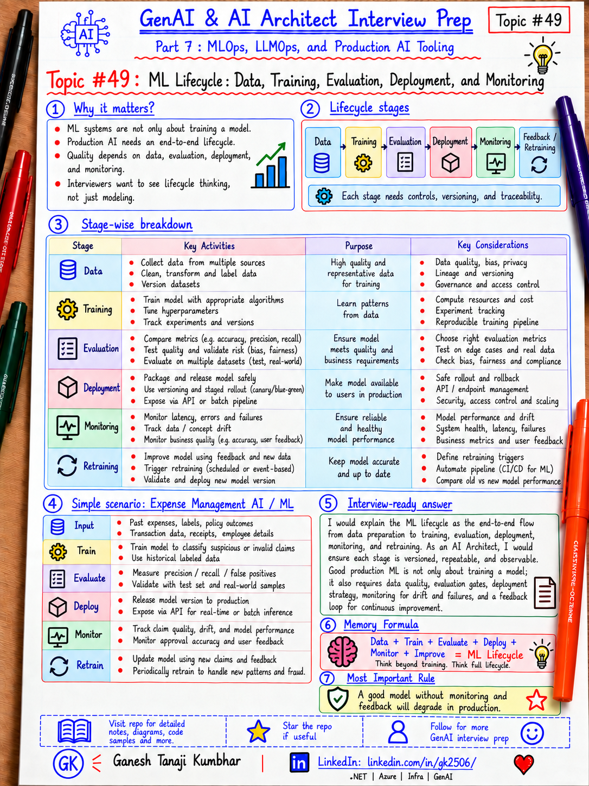

# GenAI & AI Architect Interview Prep

# Topic #49: ML Lifecycle — Data, Training, Evaluation, Deployment, and Monitoring



---

## Important Note: Continuing Part 7

In Topic #48, we introduced **MLOps** and why AI Architects should understand it.

Now we move one level deeper.

Before discussing experiment tracking, model registry, CI/CD, monitoring, or retraining, we need to understand the full **Machine Learning lifecycle**.

A production ML system does not start at deployment.

It starts much earlier:

```text
Business Problem
    ↓
Data
    ↓
Preparation
    ↓
Training
    ↓
Evaluation
    ↓
Registration
    ↓
Deployment
    ↓
Monitoring
    ↓
Feedback / Retraining
```

Important learning point:

> An AI Architect should understand the complete ML lifecycle because architecture decisions affect data, training, evaluation, deployment, monitoring, and retraining — not only the API that serves the model.

---

## Question

In an interview, you may be asked:

> Explain the end-to-end machine learning lifecycle.

Or:

> What happens between raw data and a production ML endpoint?

Or:

> Where do evaluation, model registry, and monitoring fit in the ML lifecycle?

Or:

> How is the ML lifecycle different from a normal application deployment lifecycle?

Or:

> As an AI Architect, which parts of the ML lifecycle should you understand?

---

## Why Interviewer Asks This

Many candidates explain only:

```text
Train model
→ Deploy model
```

That is incomplete.

A real ML lifecycle includes:

- Problem definition
- Data collection
- Data validation
- Data preparation
- Feature engineering
- Experimentation
- Training
- Evaluation
- Approval
- Model registration
- Deployment
- Monitoring
- Feedback
- Retraining
- Governance
- Lineage

The interviewer wants to know whether you understand how a model becomes a **production asset**.

Important line:

> Production ML is a lifecycle, not a one-time training activity.

---

## Basic Answer

A simple ML lifecycle looks like this:

```text
1. Define the business problem
2. Collect and prepare data
3. Train the model
4. Evaluate the model
5. Register and approve the model
6. Deploy the model
7. Monitor production behavior
8. Collect feedback
9. Retrain when needed
```

Simple interview answer:

> The ML lifecycle starts with business and data understanding, continues through preparation, training and evaluation, then moves into model registration, deployment, monitoring, feedback, and retraining.

---

## Architect-Level Answer

A strong architect-level answer would be:

> I see the ML lifecycle as an end-to-end production process rather than only model training. It begins with business objectives and data quality, then moves through dataset preparation, feature engineering, experimentation, training, and evaluation. Models that meet quality and governance thresholds are versioned and registered before deployment. Once deployed, I monitor technical metrics such as latency and errors as well as ML-specific metrics such as prediction quality, data drift, model drift, and business outcomes. Feedback from production is then used to decide whether the model should be retrained, rolled back, or replaced. The entire lifecycle should be reproducible, versioned, observable, and auditable.

---

# Must Mention in Interview

## 1. Start With the Business Problem

Do not start with:

```text
Which algorithm should we use?
```

Start with:

```text
What business problem are we solving?
```

Examples:

- Fraud detection
- Expense classification
- Churn prediction
- Claim severity prediction
- Recommendation
- Demand forecasting
- Document classification

Define:

- Business objective
- Target users
- Prediction target
- Expected outcome
- Acceptable error
- Latency requirement
- Cost constraints
- Risk level

Example:

```text
Problem:
Detect suspicious expense claims before approval.

Business goal:
Reduce fraud while minimizing false positives.
```

Important line:

> Model accuracy is useful only when it supports the business objective.

---

## 2. Data Collection and Data Understanding

The next step is understanding available data.

Possible sources:

```text
Relational databases
Data warehouse
Data lake
Blob storage
Event streams
APIs
Logs
Documents
External datasets
```

Questions to ask:

- Is the data complete?
- Is the data accurate?
- Is the data representative?
- Is it biased?
- Is it recent?
- Is PII present?
- Is consent required?
- Who owns the data?
- Can it legally be used for training?

Important line:

> Model quality is limited by data quality.

---

## 3. Data Validation

Before training, validate the dataset.

Check:

- Schema
- Missing values
- Duplicates
- Outliers
- Invalid values
- Label quality
- Class imbalance
- Distribution changes
- Data leakage
- PII
- Tenant boundaries

Example:

```text
Expense amount < 0
→ invalid

Missing merchant category
→ investigate

Fraud label generated after investigation
→ ensure label is correct
```

Important line:

> Data validation should happen before model training, not after poor model results appear.

---

## 4. Data Preparation

Raw data is usually not ready for training.

Preparation may include:

- Cleaning
- Deduplication
- Normalization
- Encoding
- Feature extraction
- Aggregation
- Label creation
- Train/validation/test split

Example:

```text
Raw expense:
EmployeeId
Amount
Merchant
Timestamp
Receipt

Prepared features:
Amount
MerchantCategory
DayOfWeek
EmployeeHistory
ReceiptPresent
PreviousFraudCount
```

Important line:

> Training data preparation must be repeatable and versioned.

---

## 5. Train / Validation / Test Split

Do not evaluate on the same data used for training.

Typical split:

```text
Training set
Validation set
Test set
```

Purpose:

```text
Training
→ Learn model parameters

Validation
→ Tune model / compare experiments

Test
→ Final unbiased evaluation
```

For time-series or temporal data, random splitting may be inappropriate.

Example:

```text
Train → older data
Validate → newer data
Test → latest unseen period
```

Important line:

> The test dataset should represent unseen production-like data.

---

## 6. Feature Engineering

Traditional ML systems often depend heavily on features.

Examples:

```text
Raw:
Transaction timestamp

Feature:
Hour of day
Weekend flag
Time since previous transaction
```

For expense fraud:

```text
Amount
Merchant category
Employee claim frequency
Policy violation count
Receipt present
Distance from usual location
```

Feature engineering should consider:

- Consistency
- Reusability
- Leakage
- Online/offline parity
- Versioning

Important line:

> A good model with bad features is still a bad production system.

---

## 7. Experimentation

Training is rarely one attempt.

Teams compare:

- Algorithms
- Hyperparameters
- Features
- Datasets
- Training code
- Metrics

Example:

```text
Run 101
Algorithm: XGBoost
Dataset: v5
AUC: 0.91

Run 102
Algorithm: LightGBM
Dataset: v5
AUC: 0.93
```

Track:

```text
Experiment ID
Code version
Dataset version
Parameters
Metrics
Artifacts
Timestamp
Owner
```

Important line:

> If you cannot reproduce an experiment, you cannot reliably promote it to production.

---

## 8. Model Training

Training means learning patterns from data.

Training can happen:

```text
Locally
Managed ML platform
CPU cluster
GPU cluster
Distributed training
Scheduled pipeline
```

Training should be:

- Repeatable
- Automated where possible
- Versioned
- Observable
- Resource-controlled

Capture:

```text
Training code
Dataset version
Environment
Dependencies
Hyperparameters
Compute
Output model
Metrics
```

Important line:

> A model artifact without its training context is incomplete.

---

## 9. Model Evaluation

Do not deploy a model just because training completed successfully.

Evaluation should answer:

```text
Is this model good enough?
```

Possible metrics:

### Classification

- Accuracy
- Precision
- Recall
- F1
- ROC-AUC

### Regression

- MAE
- MSE
- RMSE
- R²

But technical metrics are not enough.

Also consider:

- Business impact
- Fairness
- Robustness
- Explainability
- Latency
- Cost
- Risk
- Safety

Important line:

> The best offline metric is not automatically the best production model.

---

## 10. Evaluation Gates

A production pipeline should define minimum acceptance criteria.

Example:

```text
Recall >= 90%
False positive rate <= 5%
Latency <= 100 ms
No critical fairness issue
No regression against current production model
```

If gates fail:

```text
Do not deploy.
```

Important line:

> Evaluation gates turn model quality from opinion into a release control.

---

## 11. Model Registration

Once a model is approved, register it.

A model registry helps track:

```text
Model name
Version
Owner
Metrics
Training run
Dataset
Approval status
Deployment stage
Artifacts
Lineage
```

Example:

```text
ExpenseFraudModel
v12
Status: Approved
AUC: 0.93
Dataset: expense-data-v5
```

Important line:

> Model registry is the controlled bridge between experimentation and deployment.

---

## 12. Deployment

A model can be deployed in different ways.

### Online / Real-Time

```text
Application
→ Model Endpoint
→ Prediction
```

Used when:

- Immediate prediction needed
- User-facing response
- Real-time scoring

### Batch

```text
Dataset
→ Batch Job
→ Predictions
→ Storage
```

Used when:

- Large volume
- No immediate response required

### Event-Driven

```text
Event
→ Worker
→ Model
→ Result
```

Used for:

- File processing
- Transactions
- Queue-based workflows

Important line:

> Deployment pattern should match the business latency and throughput requirement.

---

## 13. Deployment Strategies

Do not always replace the current model instantly.

Possible strategies:

```text
Blue-Green
Canary
Shadow
A/B Testing
Champion-Challenger
Rolling Deployment
```

### Champion-Challenger

```text
Champion
= current production model

Challenger
= new candidate model
```

Compare before full promotion.

Important line:

> Model deployment should support validation and rollback just like application deployment.

---

## 14. Production Monitoring

After deployment, monitor two categories.

### System / Operational Metrics

```text
Latency
Throughput
CPU
Memory
Errors
Availability
Timeouts
Cost
```

### ML-Specific Metrics

```text
Prediction distribution
Data drift
Model drift
Accuracy
Precision / Recall
Feature drift
Confidence
Business KPI
```

Important line:

> A healthy endpoint does not necessarily mean a healthy model.

An endpoint may return HTTP 200 while prediction quality silently degrades.

---

## 15. Data Drift

Data drift means production input data changes compared with training data.

Example:

Training:

```text
Average hotel expense = ₹4,500
```

Production later:

```text
Average hotel expense = ₹8,000
```

Possible reasons:

- Inflation
- New user behavior
- New market
- New policy
- Seasonal change

Important line:

> The world changes even when the model does not.

---

## 16. Model Drift / Performance Degradation

Model performance can decline over time.

Example:

```text
Fraud recall at deployment = 92%
Fraud recall after 6 months = 78%
```

Possible reasons:

- User behavior changed
- Fraud patterns changed
- Data distribution changed
- Upstream systems changed

Important line:

> A model that was good at deployment may become poor later.

---

## 17. Feedback Loop

Production systems should collect feedback.

Examples:

```text
Was prediction correct?
Did user accept recommendation?
Was transaction later confirmed as fraud?
Did human reviewer override the model?
```

Feedback can support:

- Evaluation
- Monitoring
- Dataset improvement
- Retraining

Important line:

> Without feedback, production model quality is difficult to measure.

---

## 18. Retraining

Retraining should be controlled.

Possible triggers:

```text
Scheduled
Data drift threshold
Performance drop
New labeled data
Business rule change
Major data change
```

Bad:

```text
Drift detected
→ Automatically deploy retrained model
```

Better:

```text
Drift detected
→ Retrain
→ Evaluate
→ Quality gates
→ Approval
→ Register
→ Controlled deployment
```

Important line:

> Retraining is not the same as automatic production promotion.

---

## 19. Rollback

Every production model should have a rollback path.

Example:

```text
v12 deployed
↓
Prediction quality drops
↓
Rollback to v11
```

Rollback requires:

- Previous model version
- Compatible serving environment
- Deployment history
- Monitoring
- Clear approval process

Important line:

> If you cannot roll back a model safely, your deployment process is incomplete.

---

## 20. Governance and Lineage

For regulated or enterprise AI, you may need to answer:

```text
Which data trained this model?
Which code version was used?
Who approved it?
Which metrics were evaluated?
Which model is in production?
When was it deployed?
Which endpoint uses it?
```

This is lineage.

Simple lineage:

```text
Dataset
  ↓
Training Run
  ↓
Model
  ↓
Model Version
  ↓
Endpoint
  ↓
Production Predictions
```

Important line:

> Lineage makes the lifecycle traceable and auditable.

---

# Real-World Example: Expense Fraud Detection

Suppose we are building a fraud detection model for expense claims.

## Step 1: Business Goal

```text
Detect potentially fraudulent expenses before approval.
```

---

## Step 2: Data

Historical expenses:

```text
Amount
Employee
Merchant
Category
Receipt
Date
Location
Approval result
Fraud label
```

---

## Step 3: Prepare

Create features:

```text
Amount deviation
Employee claim frequency
Merchant risk
Receipt missing
Weekend submission
Previous fraud history
```

---

## Step 4: Train

Compare:

```text
Logistic Regression
Random Forest
XGBoost
```

---

## Step 5: Evaluate

Important metric:

```text
Recall
```

Why?

Missing fraud may be expensive.

But also track false positives because:

```text
Too many false positives
→ legitimate users are blocked
```

---

## Step 6: Register

```text
ExpenseFraudModel:v12
```

with:

```text
Dataset version
Training run
Metrics
Approval
```

---

## Step 7: Deploy

```text
Expense API
  ↓
Fraud Model Endpoint
  ↓
Risk Score
```

---

## Step 8: Monitor

Track:

```text
Latency
Errors
Fraud recall
False positives
Input drift
Prediction distribution
```

---

## Step 9: Feedback

Human fraud investigation confirms whether prediction was correct.

---

## Step 10: Retrain

Use newly labeled cases.

Then:

```text
Retrain
→ Evaluate
→ Approve
→ Register
→ Canary
→ Promote
```

---

# Microsoft-Stack View

For Microsoft / Azure teams, a typical lifecycle could include:

```text
Azure Data Lake / Blob / SQL
        ↓
Azure Machine Learning
        ↓
Training Job / Pipeline
        ↓
Experiment Tracking
        ↓
Model Registration
        ↓
Managed Online Endpoint / Batch Endpoint
        ↓
Azure Monitor / Application Insights / ML Monitoring
        ↓
Feedback / Retraining Pipeline
```

Possible supporting services:

- Azure Machine Learning
- Azure Data Lake Storage
- Azure Blob Storage
- Azure SQL
- Microsoft Fabric
- Azure DevOps / GitHub Actions
- Azure Container Registry
- Azure Monitor
- Application Insights
- Log Analytics
- Azure Key Vault
- Microsoft Entra ID

Important line:

> The exact Azure service matters less than understanding the lifecycle and the responsibility of each stage.

---

# ML Lifecycle vs DevOps Lifecycle

Traditional software lifecycle:

```text
Code
→ Build
→ Test
→ Deploy
→ Monitor
```

ML lifecycle:

```text
Data
→ Experiment
→ Train
→ Evaluate
→ Register
→ Deploy
→ Monitor
→ Feedback
→ Retrain
```

Additional ML concerns:

```text
Dataset version
Feature version
Experiment
Model metrics
Drift
Retraining
Lineage
```

Important line:

> DevOps manages software change. MLOps additionally manages data and model change.

---

# What Should Be Versioned?

A good ML lifecycle may version:

```text
Application code
Training code
Dataset
Features
Model
Environment
Dependencies
Pipeline
Evaluation dataset
Deployment configuration
```

Important line:

> Reproducibility requires more than a model version.

---

# What Should Be Logged?

Consider logging:

```text
experimentId
runId
datasetVersion
featureVersion
codeVersion
modelName
modelVersion
hyperparameters
trainingMetrics
evaluationMetrics
approvalStatus
deploymentId
endpoint
latency
errorRate
predictionDistribution
driftMetrics
businessMetric
timestamp
```

---

# Common Mistakes

## Mistake 1: Train Once and Forget

Bad:

```text
Train
→ Deploy
→ Done
```

Better:

```text
Train
→ Evaluate
→ Deploy
→ Monitor
→ Feedback
→ Improve
```

---

## Mistake 2: No Dataset Version

If the model is poor later, you may not know what data created it.

Better:

```text
Model Version
↔ Dataset Version
```

---

## Mistake 3: Deploy Based Only on Accuracy

Accuracy can hide important problems.

Consider:

```text
Precision
Recall
F1
Business impact
Fairness
Latency
Cost
```

---

## Mistake 4: No Quality Gate

Bad:

```text
Training completed
→ Deploy automatically
```

Better:

```text
Training
→ Evaluation
→ Quality Gate
→ Approval
→ Deployment
```

---

## Mistake 5: Monitor Only Infrastructure

Bad:

```text
CPU normal
HTTP 200
Therefore model is healthy
```

Wrong.

Also monitor:

```text
Prediction quality
Data drift
Model drift
Business outcomes
```

---

## Mistake 6: Automatic Retraining Without Governance

Bad:

```text
Drift
→ Retrain
→ Immediately replace production model
```

Better:

```text
Retrain
→ Evaluate
→ Approve
→ Controlled deployment
```

---

## Mistake 7: No Rollback

If the new model performs poorly, there must be a safe path back.

---

# What Can Go Wrong?

## 1. Training Data Leakage

Future information accidentally enters training features.

Result:

```text
Excellent offline performance
Poor production performance
```

---

## 2. Training / Serving Skew

Feature calculation differs between training and production.

Result:

```text
Same model
Different feature values
Wrong predictions
```

---

## 3. Data Drift

Production input changes.

---

## 4. Model Drift

Prediction quality declines.

---

## 5. New Model Regression

New version has better average accuracy but worse performance for an important segment.

---

## 6. Missing Feedback

No reliable way to determine whether predictions are correct.

---

## 7. Broken Lineage

You cannot determine:

```text
Which dataset
Which run
Which code
Which model
Which endpoint
```

---

# Better Interview Answer

A strong answer can be:

> I would explain the ML lifecycle starting with the business problem and data. Data is collected, validated, prepared, and versioned before experimentation and training. Different training runs are tracked and evaluated using both technical and business metrics. A model should pass defined quality and governance gates before being registered and promoted. Deployment can be online, batch, or event-driven depending on latency requirements. Once in production, I would monitor system metrics, prediction quality, data drift, model drift, and business outcomes. Production feedback should feed back into the dataset and retraining process. Retrained models should again go through evaluation, approval, registration, and controlled deployment rather than automatically replacing production. The entire lifecycle should be reproducible, traceable, and auditable.

---

# One-Line Answer

> The ML lifecycle is the continuous process of preparing data, training and evaluating models, registering and deploying approved versions, monitoring production performance, collecting feedback, and retraining safely when needed.

---

# Memory Formula

Use this:

```text
Problem
→ Data
→ Prepare
→ Train
→ Evaluate
→ Register
→ Deploy
→ Monitor
→ Feedback
→ Retrain
```

Short memory formula:

```text
D T E R D M R

Data
Train
Evaluate
Register
Deploy
Monitor
Retrain
```

Most important rule:

```text
Training is only one stage.
Production ML is a continuous lifecycle.
```

---

# Interview Closing Line

You can close your answer like this:

> As an AI Architect, I do not need to be the data scientist building every algorithm, but I should understand the full lifecycle because architecture decisions affect data quality, reproducibility, deployment, monitoring, governance, and the ability to safely improve the model over time.

---

# Related Upcoming Topics

- Experiment Tracking and Model Registry
- Data Versioning, Feature Store, and Dataset Governance
- CI/CD for ML and GenAI Applications
- Model Deployment Patterns
- Model Monitoring, Drift, Feedback, and Retraining
- LLMOps for Prompts, RAG, Agents, and Evaluation
- AI Evaluation and Quality Gates for RAG and Agents
- Actual MLOps and LLMOps Tools Used in Practice
- MLOps vs LLMOps vs DevOps
- Responsible AI, Governance, and Release Controls

---

# Reference Scenario

This topic uses an **Expense Fraud Detection Model** to explain the traditional ML lifecycle.

The broader **Expense Management AI Agent** scenario used across this series can also be referenced here:

```text
00-common-examples/expense-management-ai-agent-scenario.md
```

---

## About the Author

These notes are created and maintained by **Ganesh Tanaji Kumbhar**, an **AI Architect** with experience in **.NET, Azure, cloud architecture, infrastructure, enterprise application modernization, and GenAI solution design**.

I bring practical experience across:

- **.NET / C# / ASP.NET / Web API**
- **Azure App Services, Azure Functions, WebJobs, Azure SQL, Storage, Redis**
- **Cloud architecture and infrastructure modernization**
- **Application architecture and enterprise system design**
- **CI/CD, DevOps, monitoring, and production support**
- **GenAI, RAG, Agentic AI, and AI architecture patterns**

These notes are based on my real experience as both:

- An **interviewee**, facing AI, architecture, cloud, .NET, Azure, and system design rounds
- An **interviewer**, evaluating how candidates explain concepts, tradeoffs, project experience, and real-world design decisions

I write about:

- GenAI Architecture
- RAG System Design
- Agentic AI
- AI Architect Interview Preparation
- .NET and Azure Architecture
- Cloud and Enterprise AI Patterns

If you are preparing for **GenAI / AI Architect / Staff Engineer / Solution Architect / .NET Architect / Azure Architect** interviews, feel free to connect with me on LinkedIn.

🔗 **LinkedIn:** [Connect with me on LinkedIn](https://www.linkedin.com/in/gk2506/)

💬 You can also DM me on LinkedIn if you want to discuss AI architecture, interview preparation, .NET/Azure architecture, or practical GenAI learning.
