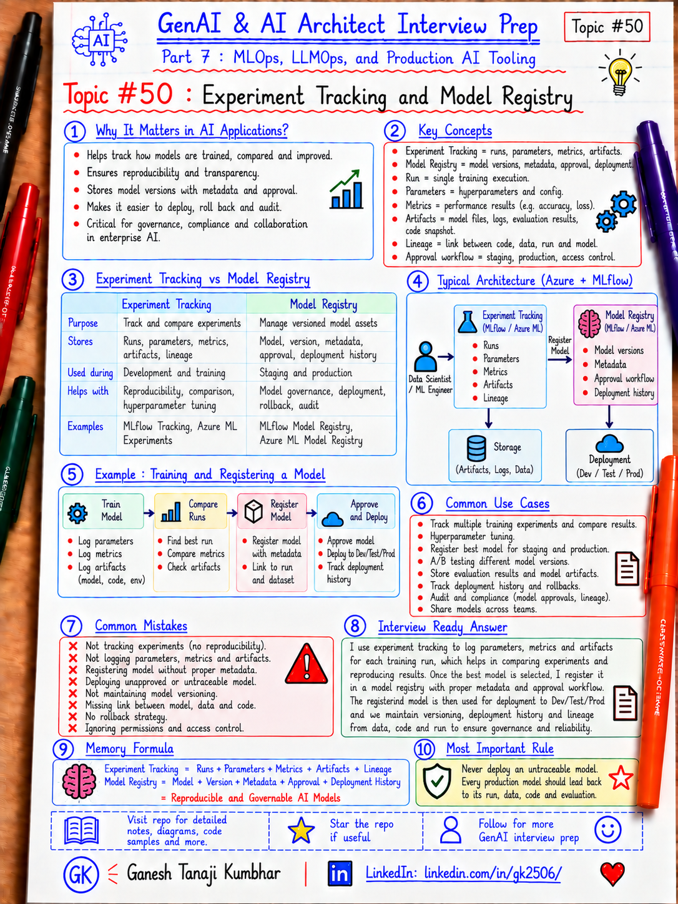

# GenAI & AI Architect Interview Prep

# Topic #50: Experiment Tracking and Model Registry



---

## Important Note: Continuing Part 7

In Topic #48, we introduced **MLOps**.

In Topic #49, we covered the **end-to-end ML lifecycle**:

```text
Problem
→ Data
→ Prepare
→ Train
→ Evaluate
→ Register
→ Deploy
→ Monitor
→ Feedback
→ Retrain
```

Now we focus on two important MLOps capabilities that make this lifecycle reproducible and governable:

```text
Experiment Tracking
+
Model Registry
```

Important learning point:

> Experiment tracking tells us how a model was produced. Model registry tells us which model version is approved, managed, and ready for deployment.

---

## Question

In an interview, you may be asked:

> What is experiment tracking in MLOps?

Or:

> Why do we need a model registry?

Or:

> What is the difference between an experiment run and a registered model?

Or:

> How would you move a model from experimentation to production safely?

Or:

> How do you reproduce a model that was trained three months ago?

---

## Why Interviewer Asks This

A weak ML workflow may look like this:

```text
Train model locally
→ Save model.pkl
→ Send file to deployment team
```

Immediately, many questions appear:

- Which dataset was used?
- Which code version trained it?
- Which hyperparameters were used?
- Which run produced the model?
- What were the evaluation metrics?
- Was it better than the previous model?
- Who approved it?
- Which version is currently in production?
- Can we roll back?

A strong AI Architect should explain how experiment tracking and model registry solve different parts of this problem.

Important line:

> Production ML needs traceability from experiment to deployed model.

---

## Basic Answer

Simple answer:

> Experiment tracking records training runs, parameters, metrics, artifacts, datasets, code references, and outputs so experiments can be compared and reproduced. A model registry stores approved model versions with metadata, lineage, lifecycle state, and deployment information so teams can manage which model should move into production.

Simple flow:

```text
Experiment
  ↓
Run 1 / Run 2 / Run 3
  ↓
Compare Metrics
  ↓
Choose Candidate
  ↓
Register Model
  ↓
Approve Version
  ↓
Deploy
  ↓
Monitor / Rollback
```

---

## Architect-Level Answer

A strong architect-level answer would be:

> I would use experiment tracking during model development to record every training run with its parameters, metrics, code version, dataset version, environment, and artifacts. That makes model development reproducible and lets teams compare experiments objectively. Once a candidate model passes evaluation and governance checks, I would register it in a model registry as a versioned production asset. The registry should preserve lineage back to the training run, store metadata and approval state, and provide a controlled source for deployment and rollback. Together, experiment tracking and model registry create an auditable path from experimentation to production.

---

## Must Mention in Interview

### 1. An Experiment Contains Multiple Runs

An experiment is usually a logical grouping of related model-training attempts.

Example:

```text
Experiment: ExpenseFraudDetection

Run 101
Run 102
Run 103
Run 104
```

Each run may use different:

- Algorithm
- Hyperparameters
- Features
- Dataset version
- Code version
- Compute
- Environment

Important line:

> Experiment is the group. Run is one execution inside that group.

---

### 2. What Should Be Tracked for Each Run?

A useful experiment record may include:

```text
experimentId
runId
startedBy
startTime
endTime
codeVersion
datasetVersion
featureVersion
algorithm
hyperparameters
trainingEnvironment
computeTarget
metrics
artifacts
modelOutput
```

Example:

```text
Experiment: ExpenseFraudDetection
Run: 104
Dataset: expense-data-v7
Algorithm: XGBoost
max_depth: 8
learning_rate: 0.05
AUC: 0.94
Recall: 0.91
FalsePositiveRate: 0.04
```

Important line:

> If an experiment cannot be reproduced, its result is difficult to trust operationally.

---

### 3. Parameters, Metrics, and Artifacts Are Different

Interviewers may expect you to understand this distinction.

#### Parameters

Configuration used to create the model:

```text
learning_rate = 0.05
max_depth = 8
n_estimators = 500
```

#### Metrics

Measured results:

```text
accuracy = 0.93
precision = 0.89
recall = 0.91
AUC = 0.94
```

#### Artifacts

Files created by the run:

```text
model
confusion-matrix.png
feature-importance.csv
requirements.txt
preprocessor.pkl
```

Important line:

> Parameters describe how the run was configured; metrics describe how it performed; artifacts are the outputs it produced.

---

### 4. Track Dataset and Code Versions

Tracking only model metrics is not enough.

Suppose two runs both show:

```text
AUC = 0.94
```

But one used:

```text
Dataset v5
```

and the other:

```text
Dataset v8
```

They are not directly equivalent experiments.

You should be able to trace:

```text
Code Version
+
Dataset Version
+
Environment
+
Parameters
→ Training Run
→ Model
```

Important line:

> Model reproducibility requires code, data, configuration, and environment lineage.

---

### 5. Experiment Tracking Enables Comparison

Without tracking, teams may compare results in:

- Spreadsheets
- Chat messages
- Notebook comments
- Local folders

This becomes unreliable.

A tracking system lets you compare:

| Run | Dataset | Model | Recall | AUC | Latency |
|---|---|---|---:|---:|---:|
| 101 | v6 | Logistic Regression | 0.82 | 0.87 | 10 ms |
| 102 | v6 | Random Forest | 0.88 | 0.91 | 22 ms |
| 103 | v7 | XGBoost | 0.91 | 0.94 | 18 ms |

But do not pick only the highest metric.

Also evaluate:

- Business impact
- Latency
- Cost
- Fairness
- Robustness
- Explainability
- Operational complexity

Important line:

> Best experiment means best fit for the production requirement, not simply the highest offline score.

---

### 6. Model Registry Is Not the Same as Experiment Tracking

This distinction is important.

Experiment tracking answers:

```text
What happened during training?
```

Model registry answers:

```text
Which model versions do we officially manage and deploy?
```

Simple view:

```text
Experiments / Runs
      ↓
Candidate Model
      ↓
Evaluation Gate
      ↓
Model Registry
      ↓
Approved Version
      ↓
Deployment
```

Important line:

> Not every experiment should become a registered production model.

---

### 7. What Should a Model Registry Store?

A registered model may include:

```text
modelName
modelVersion
modelType
sourceRunId
sourceDatasetVersion
metrics
owner
description
tags
approvalStatus
createdAt
framework
runtimeDependencies
artifactLocation
```

Example:

```text
Model: ExpenseFraudModel
Version: 12
Source Run: 104
Dataset: expense-data-v7
AUC: 0.94
Recall: 0.91
Status: Approved
Owner: Fraud Analytics Team
```

Important line:

> Model registry turns a training output into a managed production asset.

---

### 8. Preserve Lineage From Run to Model

A good flow maintains lineage:

```text
Dataset v7
   ↓
Training Run 104
   ↓
Model Artifact
   ↓
ExpenseFraudModel:v12
   ↓
Production Endpoint
```

Later, if a problem occurs, you can trace backwards:

```text
Production Model
→ Registered Version
→ Training Run
→ Dataset
→ Code
→ Parameters
```

Important line:

> Lineage allows troubleshooting, auditing, reproduction, and rollback.

---

### 9. Use Approval and Promotion Controls

Do not automatically deploy every newly registered model.

A controlled process can look like:

```text
Candidate
   ↓
Evaluation
   ↓
Quality Gate
   ↓
Security / Responsible AI Review
   ↓
Approval
   ↓
Production Deployment
```

Possible metadata or states:

```text
Candidate
Validated
Approved
Production
Archived
```

Exact lifecycle mechanisms differ by platform, but the architecture principle is the same.

Important line:

> Registration makes a model available. Approval decides whether it should be deployed.

---

### 10. Model Version Is Different From Deployment Version

Suppose:

```text
ExpenseFraudModel:v12
```

exists in the registry.

You may deploy it to:

```text
Dev Endpoint
Test Endpoint
Production Endpoint
```

Or production may still run:

```text
v11
```

while v12 is being validated.

Important line:

> Registered does not automatically mean deployed, and deployed does not automatically mean production-approved.

---

### 11. Registry Supports Rollback

Suppose v12 is deployed and quality drops.

With proper versioning:

```text
Production v12
  ↓ quality issue
Rollback
  ↓
Production v11
```

Rollback is easier when you retain:

- Previous model versions
- Serving environment
- Dependencies
- Deployment configuration
- Evaluation history

Important line:

> Versioning without a rollback strategy is incomplete production engineering.

---

### 12. Experiment Tracking Is Useful Beyond Classical ML

The same thinking is useful for GenAI experimentation.

You may track:

```text
Model name
Prompt version
Temperature
Chunk size
Top-K
Embedding model
Reranker
Evaluation dataset
Groundedness score
Answer quality
Latency
Token usage
Cost
```

Example:

```text
RAG Experiment 24
Model: GPT-family model A
Prompt: v7
Chunk Size: 700
Top-K: 5
Reranker: Enabled
Groundedness: 0.91
P95 Latency: 2.4s
```

This leads naturally into **LLMOps** later in Part 7.

Important line:

> The artifact being tracked may change, but the need for reproducibility and comparison remains.

---

## Real-World Example: Expense Fraud Detection

Suppose we are developing an expense fraud detection model.

### Experiment

```text
ExpenseFraudDetection
```

We run several experiments.

#### Run 101

```text
Model: Logistic Regression
Dataset: v6
Recall: 0.82
AUC: 0.87
```

#### Run 102

```text
Model: Random Forest
Dataset: v6
Recall: 0.88
AUC: 0.91
```

#### Run 103

```text
Model: XGBoost
Dataset: v7
Recall: 0.91
AUC: 0.94
Latency: 18 ms
```

Run 103 passes the required quality gates.

Then:

```text
Run 103
  ↓
Register model
  ↓
ExpenseFraudModel:v12
  ↓
Approval
  ↓
Canary Deployment
  ↓
Production
```

If v12 later shows unexpected false positives:

```text
Monitor detects issue
→ stop promotion / rollback
→ compare with v11
→ investigate source run 103
```

Important line:

> Experiment tracking helps explain how v12 was created. Model registry helps control how v12 is managed and deployed.

---

## Microsoft-Stack View

For Microsoft / Azure teams, a common approach can use:

```text
Azure Machine Learning
        ↓
Experiment / Training Jobs
        ↓
MLflow Tracking
        ↓
Compare Runs
        ↓
Evaluation Gate
        ↓
Azure ML Model Registry
        ↓
Registered Model Version
        ↓
Managed Online / Batch Endpoint
        ↓
Azure Monitor / Application Insights
```

Useful Azure / Microsoft components can include:

- Azure Machine Learning
- MLflow integration
- Azure ML model assets / registry
- Azure Machine Learning managed online endpoints
- Azure Machine Learning batch endpoints
- Azure DevOps or GitHub Actions
- Azure Container Registry
- Azure Key Vault
- Microsoft Entra ID
- Azure Monitor
- Application Insights

Azure Machine Learning can register and version model assets, and MLflow can be used to log runs and manage registered MLflow models within Azure Machine Learning workflows.

Important line:

> The platform is less important than the architecture principle: experiments must be traceable, candidate models must be evaluated, and production models must be versioned and governed.

---

## Example MLflow Thinking

Conceptually:

```text
Start Run
  ↓
Log Parameters
  ↓
Train
  ↓
Log Metrics
  ↓
Log Artifacts / Model
  ↓
Compare Runs
  ↓
Register Selected Model
```

Typical tracked items:

```text
mlflow.log_param(...)
mlflow.log_metric(...)
mlflow.log_artifact(...)
mlflow.<framework>.log_model(...)
```

Then a selected model can be registered and versioned.

The important interview point is not memorizing SDK syntax.

It is understanding the lifecycle.

---

## What Should Be Logged?

For experiment tracking:

```text
experimentId
runId
owner
codeVersion
datasetVersion
featureVersion
parameters
metrics
artifacts
environment
computeTarget
startTime
endTime
status
```

For model registry:

```text
modelName
modelVersion
sourceRunId
sourceDatasetVersion
metrics
owner
approvalStatus
artifactUri
framework
createdAt
deploymentTarget
```

For production linkage:

```text
endpointName
deploymentName
modelVersion
trafficPercentage
deployedAt
approvalReference
rollbackVersion
```

Important line:

> A production model should be traceable from endpoint all the way back to experiment and data.

---

## Common Mistakes

### Mistake 1: Saving Models With File Names Only

Bad:

```text
model-final.pkl
model-final-2.pkl
model-latest-final.pkl
```

Better:

```text
Registered model + explicit version + metadata + lineage
```

---

### Mistake 2: Tracking Metrics But Not Dataset Version

If data changes, the run may not be reproducible.

Better:

```text
Run
→ Code Version
→ Dataset Version
→ Parameters
→ Environment
→ Metrics
```

---

### Mistake 3: Registering Every Experiment

Not every run deserves to become a production model.

Better:

```text
Experiment
→ Compare
→ Evaluate
→ Quality Gate
→ Register selected candidate
```

---

### Mistake 4: Choosing the Highest Accuracy Model Automatically

The best production model may depend on:

- Recall
- Precision
- Latency
- Cost
- Fairness
- Explainability
- Stability

Important line:

> Model selection is a multi-dimensional architecture decision.

---

### Mistake 5: No Lineage

Bad:

```text
Production is using model v12.
```

But nobody knows:

```text
Which run created v12?
Which dataset?
Which code?
Which parameters?
```

Better:

```text
Endpoint
→ Model Version
→ Run
→ Dataset / Code / Environment
```

---

### Mistake 6: Treating Registration as Approval

A registered model may still be a candidate.

Better:

```text
Register
→ Evaluate / Review
→ Approve
→ Deploy
```

---

### Mistake 7: Deleting Old Versions Too Aggressively

Old model versions can be necessary for:

- Rollback
- Audit
- Investigation
- Reproducibility

Retention should follow governance policy.

---

## What Can Go Wrong?

### 1. Experiment Cannot Be Reproduced

Possible cause:

```text
Dataset changed
Dependencies changed
Code not versioned
Parameters missing
```

Fix:

```text
Track data + code + environment + parameters.
```

---

### 2. Wrong Model Gets Deployed

Fix:

```text
Deploy by explicit registered model version, not by an ambiguous file path.
```

---

### 3. Model Is Registered Without Proper Evaluation

Fix:

```text
Use quality gates before approval and production promotion.
```

---

### 4. Production Issue Cannot Be Traced

Fix:

```text
Preserve endpoint → model → run → data lineage.
```

---

### 5. Rollback Is Impossible

Fix:

```text
Retain previous approved model versions and compatible deployment configuration.
```

---

## Better Interview Answer

A strong answer can be:

> I separate experiment tracking from model registry because they solve different problems. During model development, experiment tracking records every run with its dataset version, code version, hyperparameters, environment, metrics, and artifacts so runs can be compared and reproduced. After evaluation, only suitable candidates should be registered as versioned model assets. The model registry should maintain metadata and lineage back to the source run and provide a controlled source for approval, deployment, and rollback. In an Azure environment, I can use MLflow with Azure Machine Learning for tracking and Azure Machine Learning model assets or registry capabilities for model versioning and lifecycle management. The key is maintaining traceability from production deployment all the way back to the experiment and data that created the model.

---

## One-Line Answer

> Experiment tracking records how models are created and compared; model registry manages the approved model versions that move through deployment and production lifecycle stages.

---

## Memory Formula

Use this:

```text
Experiment Tracking
= Runs + Parameters + Metrics + Artifacts + Lineage

Model Registry
= Model + Version + Metadata + Approval + Deployment History
```

End-to-end memory:

```text
Track
→ Compare
→ Evaluate
→ Register
→ Approve
→ Deploy
→ Monitor
→ Rollback if needed
```

Most important rule:

```text
Never deploy an untraceable model.
Every production model should lead back to its run, data, code, and evaluation.
```

---

## Interview Closing Line

You can close your answer like this:

> Experiment tracking gives me reproducibility during model development, while the model registry gives me controlled versioning and governance after a model becomes a production candidate. Together they create the traceable path from experimentation to production that MLOps requires.

---

## Related Upcoming Topics

- Data Versioning, Feature Store, and Dataset Governance
- CI/CD for ML and GenAI Applications
- Model Deployment Patterns
- Model Monitoring, Drift, Feedback, and Retraining
- LLMOps for Prompts, RAG, Agents, and Evaluation
- AI Evaluation and Quality Gates for RAG and Agents
- Actual MLOps and LLMOps Tools Used in Practice
- MLOps vs LLMOps vs DevOps
- Responsible AI, Governance, and Release Controls

---

## Reference Scenario

This topic uses the **Expense Fraud Detection Model** example to explain experiments, runs, model comparison, registration, approval, deployment, and rollback.

The broader **Expense Management AI Agent** scenario used across this series can also be referenced here:

```text
00-common-examples/expense-management-ai-agent-scenario.md
```

---

## About the Author

These notes are created and maintained by **Ganesh Tanaji Kumbhar**, an **AI Architect** with experience in **.NET, Azure, cloud architecture, infrastructure, enterprise application modernization, and GenAI solution design**.

I bring practical experience across:

- **.NET / C# / ASP.NET / Web API**
- **Azure App Services, Azure Functions, WebJobs, Azure SQL, Storage, Redis**
- **Cloud architecture and infrastructure modernization**
- **Application architecture and enterprise system design**
- **CI/CD, DevOps, monitoring, and production support**
- **GenAI, RAG, Agentic AI, and AI architecture patterns**

These notes are based on my real experience as both:

- An **interviewee**, facing AI, architecture, cloud, .NET, Azure, and system design rounds
- An **interviewer**, evaluating how candidates explain concepts, tradeoffs, project experience, and real-world design decisions

I write about:

- GenAI Architecture
- RAG System Design
- Agentic AI
- AI Architect Interview Preparation
- .NET and Azure Architecture
- Cloud and Enterprise AI Patterns

If you are preparing for **GenAI / AI Architect / Staff Engineer / Solution Architect / .NET Architect / Azure Architect** interviews, feel free to connect with me on LinkedIn.

🔗 **LinkedIn:** [Connect with me on LinkedIn](https://www.linkedin.com/in/gk2506/)

💬 You can also DM me on LinkedIn if you want to discuss AI architecture, interview preparation, .NET/Azure architecture, or practical GenAI learning.
