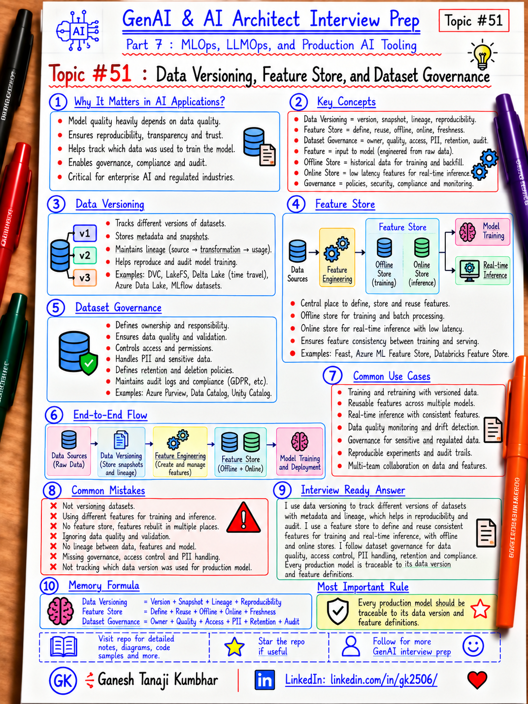

# GenAI & AI Architect Interview Prep

# Topic #51: Data Versioning, Feature Store, and Dataset Governance



---

## Important Note: Continuing Part 7

In the previous topics, we covered:

- What MLOps is and why AI Architects should understand it
- The end-to-end ML lifecycle
- Experiment tracking and model registry

Now we move to another production concern that directly affects model quality and reproducibility:

```text
Data Versioning, Feature Store, and Dataset Governance
```

A model is only as trustworthy as the data behind it.

If teams cannot answer:

```text
Which dataset trained this model?
Which feature definition was used?
Who changed the dataset?
Was sensitive data included?
Can the same training set be reproduced?
```

then the ML lifecycle is not fully controlled.

Important learning point:

> Production ML needs versioned, traceable, governed data and consistent feature definitions across training and inference.

---

## Question

In an interview, you may be asked:

> Why is data versioning important in MLOps?

Or:

> What is a feature store?

Or:

> How do you ensure training and production use the same features?

Or:

> What is dataset governance?

Or:

> How would you trace a production model back to the data used to train it?

---

## Why Interviewer Asks This

Many candidates focus heavily on:

- Model architecture
- Training
- Deployment

But real ML failures often start with data.

Examples:

```text
Wrong dataset
Missing records
Incorrect labels
Feature logic changed
Training-serving skew
Sensitive data used unexpectedly
Old data mixed with new data
Dataset cannot be reproduced
```

A strong AI Architect should understand:

- Dataset versioning
- Data lineage
- Feature definitions
- Feature reuse
- Feature freshness
- Online vs offline features
- Access control
- PII handling
- Retention
- Ownership
- Quality checks
- Auditability

Important line:

> Model governance without data governance is incomplete.

---

## Basic Answer

Simple answer:

> Data versioning tracks the exact dataset used by a model, a feature store provides reusable and consistent feature definitions for training and inference, and dataset governance controls quality, ownership, access, lineage, retention, and compliance.

Simple view:

```text
Raw Data
   ↓
Validated Dataset
   ↓
Versioned Dataset
   ↓
Feature Engineering
   ↓
Feature Store
   ↓
Training / Inference
   ↓
Model + Lineage
```

---

## Architect-Level Answer

A strong architect-level answer would be:

> I would treat datasets and features as versioned production assets, not temporary files. Every training run should reference an immutable or reproducible dataset version, and lineage should connect source data, transformation logic, feature definitions, training run, and model version. For reusable features, I would consider a feature store so the same definitions can be shared between offline training and online inference, which reduces training-serving skew. Governance should cover ownership, schema, data quality, PII, access control, retention, lineage, approvals, and auditability. The goal is to ensure that a model can always be traced back to the exact data and feature logic that produced it.

---

## Must Mention in Interview

### 1. Why Data Versioning Matters

Suppose two models are trained one week apart:

```text
Model v11
→ Dataset?

Model v12
→ Dataset?
```

If the datasets are not versioned, you may not know why performance changed.

Data versioning helps answer:

```text
What data was used?
When was it created?
Which records changed?
Which schema version applied?
Which labels changed?
Can we reproduce it?
```

Important line:

> If the dataset cannot be reproduced, the model cannot be reproduced.

---

### 2. What Should a Dataset Version Include?

A useful dataset version may capture:

```text
Dataset ID
Version
Created timestamp
Source systems
Schema
Row/file count
Date range
Label definition
Owner
Quality checks
Transformation version
PII classification
Access policy
Retention policy
Checksum / snapshot reference
```

The architecture principle is more important than the exact platform:

> The dataset should be uniquely identifiable and traceable.

---

### 3. Snapshot vs Reproducible Query

Two common patterns:

#### Snapshot

```text
Dataset v5
= fixed immutable snapshot
```

Benefits:

- Easy reproducibility
- Stable training input
- Clear audit trail

Tradeoff:

- Storage duplication
- Data can become stale

#### Reproducible Query

```text
Dataset v5
= source + query + timestamp + transformation version
```

Benefits:

- Less duplication
- Can regenerate data

Tradeoff:

- Source data may change
- Reproducibility depends on source history

Important line:

> A dataset version can be a physical snapshot or a reproducible logical definition, but it must be stable enough for lineage.

---

### 4. Data Lineage

Lineage answers:

```text
Where did this data come from?
What transformations happened?
Which model consumed it?
```

Simple lineage:

```text
Source System
   ↓
Raw Data
   ↓
Transformation Pipeline
   ↓
Dataset v5
   ↓
Training Run 102
   ↓
Model v12
   ↓
Production Endpoint
```

Important line:

> Lineage connects data changes to model behavior.

---

### 5. What Is a Feature?

A feature is an input used by a model.

Example raw data:

```text
TransactionAmount
TransactionDate
EmployeeId
Merchant
```

Derived features:

```text
AverageExpenseLast30Days
WeekendTransaction
MerchantRiskScore
ExpenseDeviationFromEmployeeAverage
```

Important line:

> Features turn raw data into model-ready signals.

---

### 6. What Is a Feature Store?

A feature store is a system or platform capability that manages reusable feature definitions and values.

It may support:

- Feature definitions
- Feature metadata
- Offline training access
- Online inference access
- Feature versioning
- Reuse
- Freshness
- Lineage
- Access control

Simple view:

```text
Raw Data
  ↓
Feature Engineering
  ↓
Feature Store
  ├── Offline Features → Training
  └── Online Features  → Real-time Inference
```

Important line:

> A feature store helps teams avoid rebuilding the same feature logic in every model.

---

### 7. Training-Serving Skew

One of the most important reasons feature stores exist is consistency.

Bad pattern:

```text
Training:
Python calculates customerRiskScore

Production:
C# API calculates customerRiskScore differently
```

Result:

```text
Same feature name
Different logic
Wrong production predictions
```

This is training-serving skew.

Better:

```text
One governed feature definition
→ Used for training
→ Used for inference
```

Important line:

> The same feature should mean the same thing in training and production.

---

### 8. Offline vs Online Feature Store

#### Offline Store

Used for:

- Training
- Historical analysis
- Batch scoring

Characteristics:

```text
Large history
High volume
Not necessarily millisecond latency
```

#### Online Store

Used for:

- Real-time inference
- Low-latency lookup

Characteristics:

```text
Recent feature values
Fast retrieval
Low latency
```

Example:

```text
Offline:
Employee expense history for 2 years

Online:
Employee's current 30-day expense average
```

Important line:

> Offline features optimize for history and scale; online features optimize for freshness and latency.

---

### 9. Feature Freshness

Some features change slowly:

```text
Employee department
Customer segment
```

Some change quickly:

```text
Transactions in last 5 minutes
Current account balance
Recent fraud attempts
```

Architecture should define:

- Refresh frequency
- Maximum staleness
- Event-driven vs batch update
- Online availability
- TTL

Important line:

> A correct feature that is too stale may still produce a bad prediction.

---

### 10. Feature Versioning

Feature logic can change.

Example:

```text
merchantRiskScore v1
→ historical disputes

merchantRiskScore v2
→ disputes + fraud reports + geography
```

Do not silently change feature meaning.

Version:

```text
Feature name
Feature version
Definition
Transformation code
Owner
Effective date
```

Important line:

> Feature version changes can change model behavior even if the model code is unchanged.

---

### 11. Dataset Governance

Dataset governance defines how data is:

- Owned
- Classified
- Accessed
- Validated
- Shared
- Retained
- Deleted
- Audited

Governance questions:

```text
Who owns the dataset?
Who can read it?
Can it be used for training?
Does it contain PII?
How long can it be retained?
Where did it come from?
Which model uses it?
```

Important line:

> Governance defines whether data is allowed to be used, not only whether it is technically available.

---

### 12. Data Ownership

Every important dataset should have an owner.

Possible roles:

```text
Business owner
Data owner
Data steward
Platform owner
ML team
Security / compliance
```

Ownership matters because someone must decide:

- Meaning
- Quality expectations
- Access
- Retention
- Corrections
- Approved use

Important line:

> Unowned data eventually becomes unreliable data.

---

### 13. Schema Governance

Dataset schema may evolve.

Example:

```text
v1:
employeeId
amount
merchant

v2:
employeeId
amount
merchant
currency
country
```

Potential problems:

- Training pipeline breaks
- Features become null
- Model receives wrong types
- Old models cannot consume new schema

Use:

- Schema validation
- Compatibility rules
- Versioning
- Contract testing

Important line:

> Data schema changes are production changes.

---

### 14. Data Quality Checks

Quality checks may include:

```text
Null percentage
Duplicate records
Invalid ranges
Unexpected categories
Label distribution
Outlier rate
Row count
Schema mismatch
Freshness
Missing partitions
```

Example:

```text
Expected fraud rate:
1%–4%

Current dataset:
35%
```

That should trigger investigation.

Important line:

> Data quality should be tested like application code.

---

### 15. PII and Sensitive Data

Training datasets may contain:

- Name
- Email
- Address
- Employee ID
- Financial information
- Health data
- Customer identifiers

Ask:

```text
Do we need this field?
Can it be masked?
Can it be tokenized?
Can it be removed?
Who may access it?
Can it be used for training?
```

Use:

- Data minimization
- Masking
- Encryption
- Access control
- Audit logs
- Retention policies

Important line:

> The safest sensitive field is the one the model does not need.

---

### 16. Tenant Isolation

In multi-tenant systems, never casually mix data.

Bad:

```text
Tenant A + Tenant B + Tenant C
→ shared training dataset
```

unless there is an explicit approved design.

Consider:

- Business agreement
- Privacy
- Data residency
- Isolation
- Bias
- Customer expectations
- Regulatory requirements

Possible designs:

```text
Separate datasets
Shared anonymized dataset
Tenant-aware features
Tenant-specific models
```

Important line:

> Multi-tenant ML needs explicit data-isolation decisions.

---

### 17. Retention and Deletion

Governance must consider:

```text
How long should training data remain?
What happens if a user requests deletion?
Can old model versions still contain derived information?
Should snapshots expire?
```

This affects:

- Dataset versions
- Raw storage
- Feature stores
- Model artifacts
- Logs
- Backups

Important line:

> Data lifecycle continues after model training.

---

### 18. Reproducibility

To reproduce a model, ideally you should know:

```text
Code version
Dataset version
Feature version
Environment
Dependencies
Hyperparameters
Training pipeline
Random seed where relevant
```

Simple formula:

```text
Code
+ Data
+ Features
+ Config
+ Environment
= Reproducible Training Run
```

Important line:

> Model version alone is not enough for reproducibility.

---

## Real-World Example: Expense Fraud Detection

Suppose we are building an expense fraud model.

Raw data:

```text
ExpenseId
EmployeeId
Amount
Merchant
Category
Date
Receipt
FraudLabel
```

Derived features:

```text
AverageExpense30Days
ExpenseDeviation
MissingReceipt
WeekendSubmission
MerchantRiskScore
PreviousPolicyViolations
```

### Without Governance

A data scientist downloads:

```text
expenses-final-v2-really-final.csv
```

Then six months later:

```text
Which records were used?
Which labels changed?
Which feature code created MerchantRiskScore?
```

Nobody knows.

That is not production MLOps.

### Better Design

```text
Expense Data Sources
        ↓
Validation + Quality Checks
        ↓
Dataset: expense-fraud-v5
        ↓
Feature Pipeline
        ↓
Feature Definitions v3
        ↓
Training Run 102
        ↓
ExpenseFraudModel v12
```

Lineage:

```text
expense-fraud-v5
+
features-v3
+
training-code commit abc123
→ run-102
→ model-v12
```

Now the model is traceable.

---

## Feature Store Example

Suppose the feature is:

```text
AverageExpense30Days
```

Training:

```text
Historical value at each transaction timestamp
```

Production:

```text
Current 30-day average
```

The feature definition must be consistent.

Otherwise:

```text
Training logic != Production logic
→ Training-serving skew
```

---

## Microsoft-Stack View

For Microsoft / Azure teams, a possible architecture could be:

```text
Azure SQL / Data Lake / Fabric / Blob
        ↓
Data Processing / Feature Engineering
        ↓
Versioned Dataset / Feature Assets
        ↓
Azure Machine Learning Pipeline
        ↓
MLflow Experiment Tracking
        ↓
Model Registry
        ↓
Deployment
```

Governance and catalog capabilities may involve:

```text
Microsoft Purview
Microsoft Fabric governance/catalog features
Azure Machine Learning metadata
Microsoft Entra ID
Azure Key Vault
Azure Storage access controls
```

Observability and audit:

```text
Azure Monitor
Log Analytics
Platform audit logs
```

Important line:

> The architecture should separate data storage, data processing, ML assets, access control, and governance responsibilities.

---

## Feature Store vs Vector Database

Do not confuse them.

### Feature Store

Stores or serves structured model features such as:

```text
CustomerRiskScore
AverageSpend30Days
TransactionCount7Days
```

Used by:

```text
ML models
```

### Vector Database / Vector Index

Stores embeddings such as:

```text
Document embedding
Product embedding
Knowledge chunk embedding
```

Used for:

```text
Similarity search
RAG
Semantic retrieval
```

Important line:

> Feature Store manages predictive features. Vector storage manages embeddings for similarity-based retrieval.

---

## Dataset Version vs Model Version

They are related but different.

Example:

```text
Dataset v5
→ Training Run 102
→ Model v12
```

Later:

```text
Dataset v6
→ Training Run 110
→ Model v13
```

Track both.

Important line:

> A model version should reference its dataset version.

---

## What Should Be Logged / Tracked?

Consider tracking:

```text
datasetId
datasetVersion
sourceSystems
schemaVersion
featureSet
featureVersion
transformationVersion
owner
classification
PIIStatus
qualityStatus
trainingRun
modelVersion
createdAt
retentionPolicy
lineage
```

---

## Common Mistakes

### Mistake 1: File Names as Versioning

Bad:

```text
train-final.csv
train-final2.csv
train-final-new.csv
```

Better:

```text
Dataset ID + Version + Metadata + Lineage
```

### Mistake 2: Feature Logic Duplicated Everywhere

Bad:

```text
Training pipeline calculates feature one way
API calculates it another way
```

Better:

```text
Shared governed feature definition
```

### Mistake 3: No Feature Freshness Strategy

Bad:

```text
RiskScore updated once a week
but prediction expects real-time behavior
```

Better:

```text
Define freshness requirement per feature
```

### Mistake 4: Data Available = Data Allowed

Wrong assumption:

```text
We can access it,
therefore we can train on it.
```

Better:

```text
Check ownership, consent, classification, policy, and approved use.
```

### Mistake 5: No Lineage

If a model behaves badly, you cannot determine which data or feature change caused it.

### Mistake 6: Mix Tenants Without Explicit Design

Tenant data should not be combined casually.

### Mistake 7: Feature Store for Every Project

Not every project needs a dedicated feature store.

For a small model with a few batch features:

```text
Versioned feature pipeline
+ governed dataset
```

may be enough.

Important line:

> Use a feature store when feature reuse, consistency, freshness, and scale justify it.

---

## What Can Go Wrong?

### 1. Training-Serving Skew

Same feature has different logic.

Result:

```text
Good offline metrics
Poor production predictions
```

### 2. Dataset Drift Without Traceability

Data changes, but no clear version history exists.

### 3. Label Leakage

A feature accidentally includes information only known after the outcome.

Result:

```text
Excellent training accuracy
Unrealistic production behavior
```

### 4. Sensitive Data Exposure

PII enters training data or feature store without proper controls.

### 5. Stale Online Features

Prediction uses old customer state.

### 6. Broken Schema

Upstream field changes silently.

### 7. Dataset Cannot Be Reproduced

Old data was overwritten.

Now:

```text
Model v12 cannot be retrained or investigated accurately.
```

---

## Better Interview Answer

A strong answer can be:

> I would treat data and features as versioned production assets. Every training run should reference a specific dataset version, transformation version, and feature set so the model is reproducible and traceable. I would use data quality and schema checks before training and maintain lineage from source data through training run to model version and deployment. If multiple models reuse the same predictive features or require consistent online and offline values, I would consider a feature store to reduce duplicated logic and training-serving skew. Dataset governance should define ownership, access, PII classification, retention, approved usage, tenant isolation, quality expectations, and auditability. The key goal is that for any production model, I can explain exactly which data and feature logic created it.

---

## One-Line Answer

> Data versioning makes training reproducible, a feature store keeps reusable features consistent between training and inference, and dataset governance ensures data is controlled, traceable, secure, and approved for use.

---

## Memory Formula

Use this:

```text
Data Versioning
= Version + Snapshot + Lineage + Reproducibility

Feature Store
= Define + Reuse + Offline + Online + Freshness

Dataset Governance
= Owner + Quality + Access + PII + Retention + Audit
```

Short memory:

```text
Version the DATA
Govern the DATA
Reuse the FEATURES
Trace the MODEL
```

Most important rule:

```text
Every production model should be traceable
to its data version and feature definitions.
```

---

## Interview Closing Line

You can close your answer like this:

> I do not treat data as an invisible input to the model. I treat datasets and features as governed, versioned assets with ownership, quality rules, lineage, and reproducibility because data changes are often the real reason model behavior changes.

---

## Related Upcoming Topics

- CI/CD for ML and GenAI Applications
- Model Deployment Patterns
- Model Monitoring, Drift, Feedback, and Retraining
- LLMOps for Prompts, RAG, Agents, and Evaluation
- AI Evaluation and Quality Gates for RAG and Agents
- Actual MLOps and LLMOps Tools Used in Practice
- MLOps vs LLMOps vs DevOps
- Responsible AI, Governance, and Release Controls

---

## Reference Scenario

This topic uses the **Expense Fraud Detection Model** to explain:

- Dataset versions
- Feature engineering
- Feature reuse
- Lineage
- Governance
- Training-serving consistency

The broader Expense Management AI Agent scenario remains available here:

```text
00-common-examples/expense-management-ai-agent-scenario.md
```

---

## About the Author

These notes are created and maintained by **Ganesh Tanaji Kumbhar**, an **AI Architect** with experience in **.NET, Azure, cloud architecture, infrastructure, enterprise application modernization, and GenAI solution design**.

I bring practical experience across:

- **.NET / C# / ASP.NET / Web API**
- **Azure App Services, Azure Functions, WebJobs, Azure SQL, Storage, Redis**
- **Cloud architecture and infrastructure modernization**
- **Application architecture and enterprise system design**
- **CI/CD, DevOps, monitoring, and production support**
- **GenAI, RAG, Agentic AI, and AI architecture patterns**

These notes are based on my real experience as both:

- An **interviewee**, facing AI, architecture, cloud, .NET, Azure, and system design rounds
- An **interviewer**, evaluating how candidates explain concepts, tradeoffs, project experience, and real-world design decisions

I write about:

- GenAI Architecture
- RAG System Design
- Agentic AI
- AI Architect Interview Preparation
- .NET and Azure Architecture
- Cloud and Enterprise AI Patterns

If you are preparing for **GenAI / AI Architect / Staff Engineer / Solution Architect / .NET Architect / Azure Architect** interviews, feel free to connect with me on LinkedIn.

🔗 **LinkedIn:** [Connect with me on LinkedIn](https://www.linkedin.com/in/gk2506/)

💬 You can also DM me on LinkedIn if you want to discuss AI architecture, interview preparation, .NET/Azure architecture, or practical GenAI learning.
