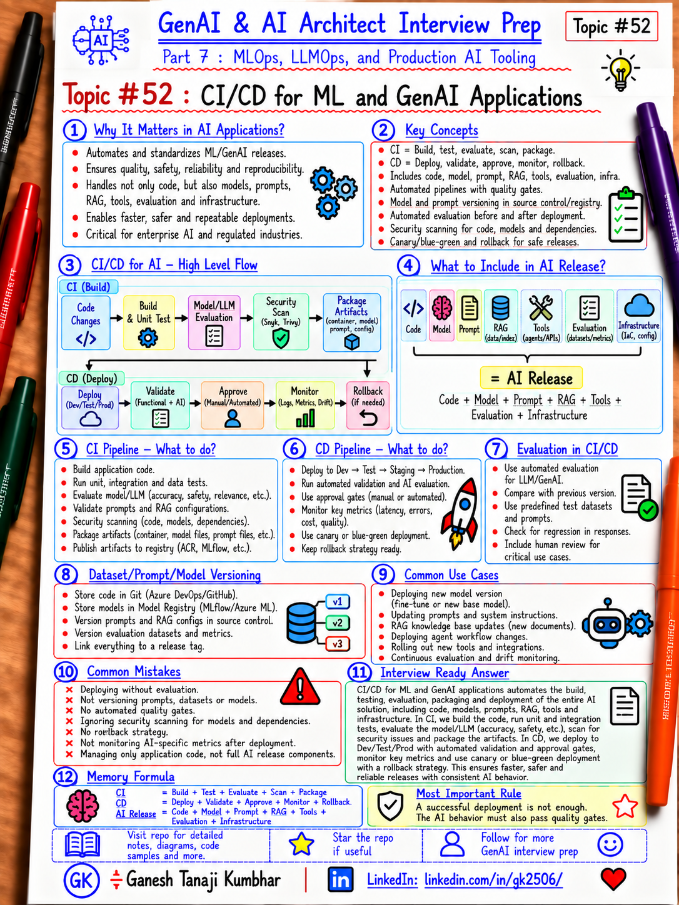

# GenAI & AI Architect Interview Prep

# Topic #52: CI/CD for ML and GenAI Applications



---

## Important Note: Continuing Part 7

In the previous topics, we covered:

- What MLOps is and why AI Architects should understand it
- The ML lifecycle
- Experiment tracking and model registry
- Data versioning, feature store, and dataset governance

Now we move to another practical production topic:

```text
CI/CD for ML and GenAI Applications
```

Traditional CI/CD focuses mainly on application code.

AI systems have more moving parts:

- Application code
- Training code
- Data pipelines
- Model versions
- Prompt versions
- RAG configuration
- Evaluation datasets
- Agent tools
- Infrastructure
- Deployment configuration
- Safety policies

Important learning point:

> CI/CD for AI systems should validate and release more than application code. It should include model, data, prompt, evaluation, infrastructure, and deployment controls.

---

## Question

In an interview, you may be asked:

> How is CI/CD different for ML or GenAI applications?

Or:

> What should be part of a CI/CD pipeline for an AI system?

Or:

> How would you deploy a new model safely?

Or:

> How would you release a prompt or RAG change?

Or:

> What quality gates would you add before deploying an AI application?

---

## Why Interviewer Asks This

A weak answer is:

```text
Build the app
→ Run unit tests
→ Deploy
```

That is not enough for AI systems.

A production AI release may need to validate:

```text
Code
Model
Prompt
Retrieval
Evaluation
Safety
Latency
Cost
Infrastructure
Rollback
```

A strong AI Architect should understand how to make AI releases:

- Repeatable
- Testable
- Versioned
- Governed
- Observable
- Reversible

Important line:

> In AI systems, deployment success is not enough. Quality must also be validated before and after release.

---

## Basic Answer

> CI/CD for AI systems extends normal software delivery with additional validation for models, data, prompts, retrieval, safety, and evaluation. The pipeline should build and test the application, validate AI-specific artifacts, apply quality gates, deploy through controlled environments, and support monitoring and rollback.

Simple flow:

```text
Commit
  ↓
Build
  ↓
Unit / Integration Tests
  ↓
AI Evaluation
  ↓
Security / Safety Checks
  ↓
Package / Register
  ↓
Deploy to Dev/Test
  ↓
Quality Gate
  ↓
Deploy to Production
  ↓
Monitor / Rollback
```

---

## Architect-Level Answer

A strong architect-level answer would be:

> I would keep normal CI/CD practices for application code, infrastructure, APIs, and containers, but extend the pipeline with AI-specific controls. For ML systems, I would version the training code, dataset, environment, and model artifact, evaluate the candidate model, register the approved version, and promote it through environments using controlled deployment strategies. For GenAI systems, I would additionally version prompts, RAG configuration, evaluation datasets, tool definitions, and model configuration. Before production, I would run automated evaluations for answer quality, groundedness, safety, latency, and cost, then require approval where risk is high. The pipeline should also support canary or blue-green deployment, monitoring, and rollback.

---

## Must Mention in Interview

### 1. CI and CD Are Different

**Continuous Integration** validates changes before promotion.

Typical CI steps:

```text
Restore dependencies
Build
Static analysis
Unit tests
Integration tests
Security scan
Package artifact
```

For AI systems, add:

```text
Model evaluation
Prompt evaluation
RAG evaluation
Tool-call tests
Safety tests
Latency checks
Cost checks
```

**Continuous Delivery / Deployment** controls how approved artifacts move through environments:

```text
Dev
→ Test
→ Staging
→ Production
```

Important line:

> CI proves the change is acceptable. CD controls how the approved change reaches production.

---

### 2. Version Everything That Can Change Behavior

AI behavior may change because of:

- Model version
- Dataset version
- Prompt version
- Retrieval configuration
- Chunking strategy
- Embedding model
- Agent tool definition
- Safety policy
- Model parameters

Example release metadata:

```text
Release: 2026.10.04
App: commit abc123
Prompt: v17
Model: deployment v3
Index: policy-index-v8
Eval dataset: v5
Infra: Terraform commit def456
```

Important line:

> If an artifact can change AI behavior, it should be versioned.

---

### 3. ML CI/CD Is More Than App Code

Traditional:

```text
Code
→ Build
→ Test
→ Deploy
```

ML:

```text
Code
+ Data
+ Features
+ Training
+ Evaluation
+ Model
→ Register
→ Deploy
```

GenAI:

```text
Code
+ Prompt
+ Model Config
+ RAG
+ Tools
+ Eval Dataset
+ Safety
→ Evaluate
→ Deploy
```

Important line:

> AI delivery pipelines must test system behavior, not only whether the code compiles.

---

### 4. Use Quality Gates

Examples:

```text
Unit tests = Pass
Security scan = Pass
Groundedness >= threshold
Hallucination rate <= threshold
Tool-call accuracy >= threshold
P95 latency <= threshold
Cost per request <= threshold
No critical safety regression
```

If the gate fails:

```text
Do not promote.
```

Important line:

> Quality gates turn AI evaluation into a release decision.

---

### 5. Compare Against the Current Baseline

Do not evaluate a candidate in isolation.

Example:

```text
Groundedness:
Current = 92%
Candidate = 95%

Latency:
Current = 1.8s
Candidate = 3.5s
```

A candidate may improve quality but worsen latency or cost.

Important line:

> Compare quality, latency, cost, and safety against the current production baseline.

---

### 6. Build Once, Promote the Same Artifact

Prefer:

```text
Build once
→ Dev
→ Test
→ Prod
```

Avoid rebuilding separately for every environment.

Use environment-specific configuration for:

- Endpoints
- Secrets
- Model deployment names
- Feature flags
- Quotas

Important line:

> Promote the same tested artifact across environments.

---

### 7. Keep Secrets Outside Pipelines

Do not store secrets in:

```text
YAML
Source code
Dockerfile
Prompt files
Committed config
```

Use:

- Key Vault
- Managed Identity
- Workload identity
- Secret references
- Secure pipeline variables

Important line:

> Pipelines should use identity, not hardcoded credentials.

---

### 8. Infrastructure as Code

AI deployments depend on infrastructure:

- Model endpoints
- Azure AI Search
- Storage
- App Service
- Functions
- Container Apps
- AKS
- Networking
- Key Vault
- Monitoring

Use IaC such as:

```text
Terraform
Bicep
ARM
Pulumi
```

Important line:

> Production AI infrastructure should be reproducible, not manually assembled.

---

### 9. CI/CD for ML Models

Typical flow:

```text
Training Code Change
        ↓
Run Training Pipeline
        ↓
Evaluate Candidate
        ↓
Compare with Baseline
        ↓
Register Model
        ↓
Approval
        ↓
Deploy Candidate
        ↓
Monitor
```

Important line:

> Training automation and deployment automation are related, but they are not the same thing.

---

### 10. CI/CD for Prompts

Prompt changes can affect:

- Accuracy
- Tool behavior
- Safety
- Cost
- Latency
- Tone

Treat prompts like versioned production artifacts.

```text
Prompt Change
  ↓
Version
  ↓
Run Evaluation Dataset
  ↓
Compare Baseline
  ↓
Review
  ↓
Deploy
```

Important line:

> Prompt changes should be evaluated before production, not only tested manually in chat.

---

### 11. CI/CD for RAG Systems

RAG has multiple changeable components:

```text
Chunking
Embedding model
Index configuration
Metadata
Search mode
Reranker
Prompt
Top-K
```

Validate:

- Retrieval recall
- Precision
- Groundedness
- Citation correctness
- Latency
- Cost
- Tenant isolation

Important line:

> RAG releases should evaluate retrieval and generation separately.

---

### 12. CI/CD for Agents

Agents add:

- Prompts
- Tools
- Permissions
- Routing
- Memory
- Human approval

Test questions:

```text
Correct tool selected?
Correct parameters?
Unauthorized tool blocked?
Failure handled?
Human approval triggered?
Loop prevented?
```

Important line:

> Agent CI/CD must test decisions and actions, not only text responses.

---

### 13. Environment Promotion

A common flow:

```text
Development
   ↓
Test
   ↓
Pre-Production
   ↓
Production
```

At each stage validate:

- Configuration
- Identity
- Network access
- Model endpoint
- Search index
- Tool integration
- Monitoring
- Evaluation

Important line:

> The full integrated architecture should be validated in a production-like environment.

---

### 14. Canary Deployment

Example:

```text
95% → Current
5%  → Candidate
```

Monitor:

- Errors
- Latency
- Quality
- Cost
- User feedback

Then increase traffic gradually.

Important line:

> Canary deployment limits blast radius while collecting production evidence.

---

### 15. Blue-Green Deployment

```text
Blue = Current
Green = Candidate
```

Validate Green and switch traffic when ready.

Benefits:

- Fast rollback
- Low downtime
- Clear isolation

Tradeoff:

- Temporary extra infrastructure cost

---

### 16. Feature Flags

Use feature flags for:

```text
New agent
New model
New prompt
New RAG strategy
New tool
New user group
```

Important line:

> Deployment and feature activation do not need to happen at the same time.

---

### 17. Human Approval Gates

High-risk releases may require:

```text
Technical approval
Security approval
Data approval
Model approval
Business approval
Responsible AI review
```

Important line:

> Automation should reduce manual work, not remove necessary governance.

---

## Real-World Example: Expense Management AI System

Suppose the platform contains:

```text
Expense API
Expense AI Agent
Policy RAG
Fraud Model
MCP Tools
```

A release may include:

```text
Application code change
Prompt v12
Policy index v8
Fraud model v5
Tool schema v3
```

A production pipeline should validate all relevant components.

---

## Example CI Pipeline

```text
Pull Request
  ↓
Build .NET / Python Services
  ↓
Unit Tests
  ↓
Integration Tests
  ↓
Security Scan
  ↓
Prompt / RAG / Agent Evaluations
  ↓
Model Evaluation
  ↓
Package Artifacts
  ↓
Publish Versioned Artifacts
```

---

## Example CD Pipeline

```text
Deploy to Dev
   ↓
Smoke Test
   ↓
AI Evaluation
   ↓
Deploy to Test
   ↓
Regression + Safety Tests
   ↓
Approval
   ↓
Canary Production
   ↓
Monitor
   ↓
Full Rollout or Rollback
```

---

## Microsoft-Stack View

For .NET / Azure teams:

```text
GitHub / Azure Repos
        ↓
GitHub Actions / Azure Pipelines
        ↓
Build + Test + Scan
        ↓
Azure Machine Learning / MLflow
        ↓
Model Registry
        ↓
Azure Container Registry
        ↓
App Service / Functions / Container Apps / AKS
        ↓
Azure OpenAI / Azure AI Search
        ↓
Azure Monitor / Application Insights
```

Infrastructure:

```text
Terraform / Bicep
```

Secrets and identity:

```text
Microsoft Entra ID
Managed Identity
Azure Key Vault
```

Important line:

> The pipeline should automate the release path while keeping AI-specific quality and governance gates visible.

---

## What Should Be Logged?

Consider tracking:

```text
releaseId
commitId
artifactVersion
modelVersion
promptVersion
datasetVersion
indexVersion
toolVersion
evaluationDataset
evaluationScore
securityScanStatus
approvalStatus
environment
deploymentTime
rollbackVersion
canaryPercentage
latency
cost
errorRate
qualityMetrics
```

---

## Common Mistakes

### Mistake 1: CI/CD Only for Code

Bad:

```text
App build passes
→ Deploy
```

Better:

```text
App tests
+ AI evaluation
+ safety
+ performance
+ governance
```

### Mistake 2: Manual Prompt Changes in Production

Bad:

```text
Edit prompt directly in production
```

Better:

```text
Version
→ Evaluate
→ Review
→ Deploy
```

### Mistake 3: Automatically Deploy Retrained Models

Bad:

```text
Retraining completes
→ Production
```

Better:

```text
Retrain
→ Evaluate
→ Compare
→ Approve
→ Register
→ Deploy
```

### Mistake 4: No Rollback

Every release should identify a previous known-good version.

### Mistake 5: Different Builds Per Environment

Bad:

```text
Build Dev artifact
Build Test artifact
Build Prod artifact
```

Better:

```text
Build once
Promote same artifact
```

### Mistake 6: No Baseline Comparison

Candidate may look good alone but be worse than current production.

### Mistake 7: Ignore Cost Regression

Example:

```text
Quality +2%
Cost +300%
```

That may not be acceptable.

### Mistake 8: No Post-Deployment Validation

A deployment may succeed technically but fail behaviorally.

Always run:

- Smoke tests
- AI evaluations
- Monitoring
- Rollback checks

---

## What Can Go Wrong?

### 1. Model Regression

Fix:

```text
Quality gates + canary + rollback
```

### 2. Prompt Regression

Fix:

```text
Prompt versioning + evaluation dataset
```

### 3. RAG Regression

Fix:

```text
Retrieval evaluation + groundedness tests
```

### 4. Tool Regression

Fix:

```text
Tool-call test suite + permissions + approval
```

### 5. Cost Explosion

Fix:

```text
Cost threshold + monitoring + budget alert
```

### 6. Security Regression

Fix:

```text
Security test + access review + policy gate
```

---

## Better Interview Answer

> I would use normal CI/CD practices for application code, infrastructure, containers, and APIs, but extend them with AI-specific validation. For ML systems, I would version data, training code, environment, and model artifacts, evaluate the candidate model against a baseline, register approved versions, and promote them through environments with controlled deployment and rollback. For GenAI systems, I would also version prompts, RAG configuration, tools, evaluation datasets, and model settings. CI would run unit, integration, security, safety, quality, latency, and cost checks. CD would deploy the same tested artifacts through Dev, Test, and Production using approvals, feature flags, canary or blue-green strategies, and post-deployment monitoring. The key is that AI behavior must be tested and governed as part of the release process.

---

## One-Line Answer

> CI/CD for AI extends normal software delivery by versioning and validating code, models, prompts, retrieval, tools, evaluation, safety, cost, and infrastructure before controlled production release.

---

## Memory Formula

```text
CI
= Build + Test + Evaluate + Scan + Package

CD
= Deploy + Validate + Approve + Monitor + Rollback
```

For AI:

```text
Code
+ Model
+ Prompt
+ RAG
+ Tools
+ Eval
+ Infra
= AI Release
```

Most important rule:

```text
A successful deployment is not enough.
The AI behavior must also pass quality gates.
```

---

## Interview Closing Line

> I treat AI releases like software releases with extra behavioral risk. I automate as much as possible, but I keep quality, safety, cost, and governance gates in the pipeline so only traceable and evaluated changes reach production.

---

## Related Upcoming Topics

- Model Deployment Patterns
- Model Monitoring, Drift, Feedback, and Retraining
- LLMOps for Prompts, RAG, Agents, and Evaluation
- AI Evaluation and Quality Gates for RAG and Agents
- Actual MLOps and LLMOps Tools Used in Practice
- MLOps vs LLMOps vs DevOps
- Responsible AI, Governance, and Release Controls

---

## Reference Scenario

This topic uses the common **Expense Management AI System** to explain CI/CD across:

- Application code
- Fraud models
- Prompts
- RAG
- Agent tools
- Infrastructure

The broader reference scenario is available here:

```text
00-common-examples/expense-management-ai-agent-scenario.md
```

---

## About the Author

These notes are created and maintained by **Ganesh Tanaji Kumbhar**, an **AI Architect** with experience in **.NET, Azure, cloud architecture, infrastructure, enterprise application modernization, and GenAI solution design**.

I bring practical experience across:

- **.NET / C# / ASP.NET / Web API**
- **Azure App Services, Azure Functions, WebJobs, Azure SQL, Storage, Redis**
- **Cloud architecture and infrastructure modernization**
- **Application architecture and enterprise system design**
- **CI/CD, DevOps, monitoring, and production support**
- **GenAI, RAG, Agentic AI, and AI architecture patterns**

These notes are based on my real experience as both:

- An **interviewee**, facing AI, architecture, cloud, .NET, Azure, and system design rounds
- An **interviewer**, evaluating how candidates explain concepts, tradeoffs, project experience, and real-world design decisions

I write about:

- GenAI Architecture
- RAG System Design
- Agentic AI
- AI Architect Interview Preparation
- .NET and Azure Architecture
- Cloud and Enterprise AI Patterns

If you are preparing for **GenAI / AI Architect / Staff Engineer / Solution Architect / .NET Architect / Azure Architect** interviews, feel free to connect with me on LinkedIn.

🔗 **LinkedIn:** [Connect with me on LinkedIn](https://www.linkedin.com/in/gk2506/)

💬 You can also DM me on LinkedIn if you want to discuss AI architecture, interview preparation, .NET/Azure architecture, or practical GenAI learning.
